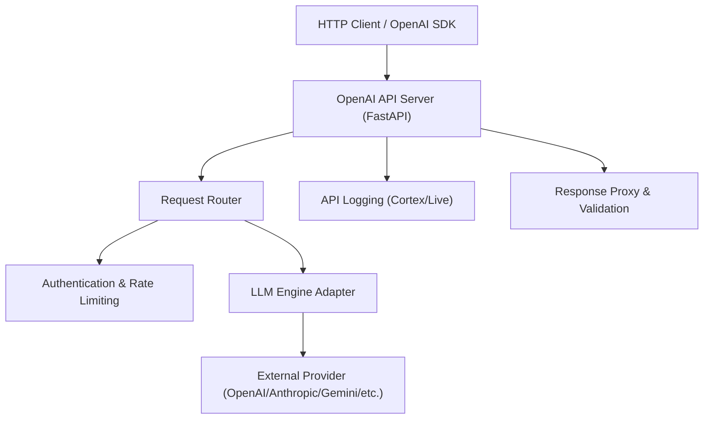
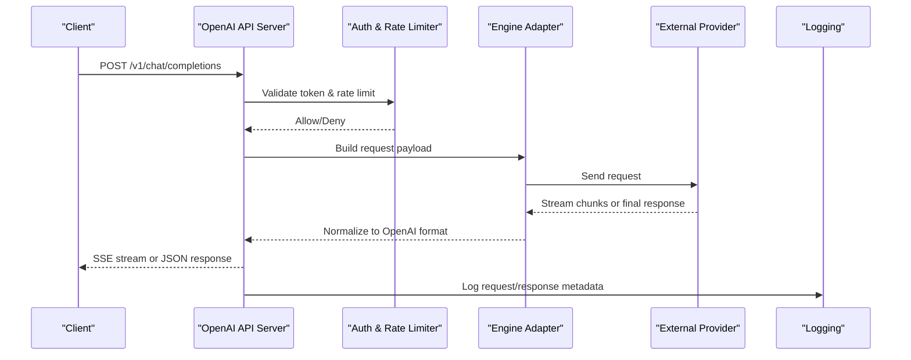
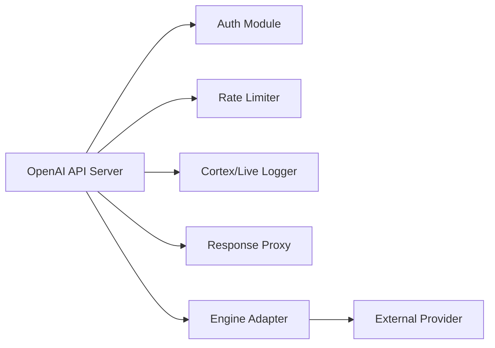

# OpenAI API Server

<cite>
**Referenced Files in This Document**
- [openai_api_server.py](file://interface/openai_api_server/openai_api_server.py)
- [guide.md](file://interface/openai_api_server/guide.md)
- [__init__.py](file://interface/openai_api_server/__init__.py)
- [main.py](file://main.py)
- [rate_limit.py](file://core/rate_limit.py)
- [config.py](file://core/config.py)
- [cortex_api_logger.py](file://core/cortex_api_logger.py)
- [live_api_logger.py](file://core/live_api_logger.py)
- [response_proxy.py](file://core/response_proxy.py)
- [genai_client_utils.py](file://core/genai_client_utils.py)
- [test_openai_api_server.py](file://tests/test_openai_api_server.py)
- [test_webui_api_token_gate.py](file://tests/test_webui_api_token_gate.py)
</cite>

## Table of Contents
1. [Introduction](#introduction)
2. [Project Structure](#project-structure)
3. [Core Components](#core-components)
4. [Architecture Overview](#architecture-overview)
5. [Detailed Component Analysis](#detailed-component-analysis)
6. [Dependency Analysis](#dependency-analysis)
7. [Performance Considerations](#performance-considerations)
8. [Troubleshooting Guide](#troubleshooting-guide)
9. [Conclusion](#conclusion)
10. [Appendices](#appendices)

## Introduction
This document provides comprehensive documentation for the OpenAI-compatible API server included in the project. It explains the REST endpoint structure, request and response formats, authentication methods, streaming support, rate limiting, error codes, and validation behavior. It also includes guidance for client integration using popular OpenAI SDKs and HTTP clients, security considerations, CORS configuration, deployment best practices, performance optimization, caching strategies, and monitoring endpoints.

## Project Structure
The OpenAI-compatible API is implemented as an interface module that exposes a FastAPI application with routes compatible with OpenAI’s chat completions and embeddings endpoints. The module integrates with the core engine to route requests to configured LLM providers and returns responses in OpenAI-compatible JSON or streaming formats.

**Diagram sources**
- [openai_api_server.py](file://interface/openai_api_server/openai_api_server.py)
- [cortex_api_logger.py](file://core/cortex_api_logger.py)
- [live_api_logger.py](file://core/live_api_logger.py)
- [response_proxy.py](file://core/response_proxy.py)

**Section sources**
- [openai_api_server.py](file://interface/openai_api_server/openai_api_server.py)
- [guide.md](file://interface/openai_api_server/guide.md)

## Core Components
- OpenAI API Server: FastAPI application exposing OpenAI-compatible endpoints for chat completions and embeddings.
- Authentication: API token gate and optional bearer token handling.
- Rate Limiting: Configurable per-client throttling.
- Request Validation: Input schema validation for OpenAI-compatible payloads.
- Streaming Responses: Server-Sent Events (SSE) for incremental tokens.
- Logging: Structured logging via Cortex and Live APIs for observability.
- Response Proxy: Normalization and validation of provider responses into OpenAI format.

Key responsibilities:
- Parse and validate incoming requests.
- Authenticate and authorize clients.
- Enforce rate limits.
- Forward requests to appropriate LLM engines.
- Stream or return complete responses.
- Log interactions and errors.

**Section sources**
- [openai_api_server.py](file://interface/openai_api_server/openai_api_server.py)
- [rate_limit.py](file://core/rate_limit.py)
- [cortex_api_logger.py](file://core/cortex_api_logger.py)
- [live_api_logger.py](file://core/live_api_logger.py)
- [response_proxy.py](file://core/response_proxy.py)

## Architecture Overview
The OpenAI API server acts as a thin compatibility layer over the internal LLM engine abstraction. Requests are validated, authenticated, and rate-limited before being routed to the engine adapter, which communicates with external providers. Responses are normalized to OpenAI-compatible structures and optionally streamed.

**Diagram sources**
- [openai_api_server.py](file://interface/openai_api_server/openai_api_server.py)
- [cortex_api_logger.py](file://core/cortex_api_logger.py)
- [live_api_logger.py](file://core/live_api_logger.py)

## Detailed Component Analysis

### OpenAI-Compatible Endpoints
- Chat Completions
  - Endpoint: POST /v1/chat/completions
  - Purpose: Generate text completions based on a conversation history.
  - Request fields: model, messages, temperature, max_tokens, stream, tools, tool_choice, etc.
  - Response fields: id, object, created, model, choices[], usage, system_fingerprint.
  - Streaming: When stream=true, returns SSE events with delta content.
- Embeddings
  - Endpoint: POST /v1/embeddings
  - Purpose: Generate vector embeddings for input text.
  - Request fields: model, input, encoding_format, user.
  - Response fields: object, data[], model, usage.

Notes:
- The server normalizes provider-specific responses into OpenAI-compatible structures.
- Streaming uses SSE; clients should handle event streams accordingly.

**Section sources**
- [openai_api_server.py](file://interface/openai_api_server/openai_api_server.py)
- [guide.md](file://interface/openai_api_server/guide.md)

### Authentication Methods
- API Token Gate: Bearer token required in Authorization header.
- Optional per-route token validation.
- Integration with web UI token gating for consistent access control.

Security recommendations:
- Use HTTPS in production.
- Rotate tokens regularly.
- Restrict token scopes if supported by your deployment.

**Section sources**
- [openai_api_server.py](file://interface/openai_api_server/openai_api_server.py)
- [test_webui_api_token_gate.py](file://tests/test_webui_api_token_gate.py)

### Rate Limiting
- Per-client throttling based on IP or token identity.
- Configurable limits via core configuration.
- Returns standard HTTP 429 when exceeded.

Best practices:
- Set sensible defaults for burst and sustained rates.
- Monitor usage and adjust limits based on capacity.

**Section sources**
- [rate_limit.py](file://core/rate_limit.py)
- [config.py](file://core/config.py)

### Request Validation and Error Handling
- Input validation ensures OpenAI-compatible payloads.
- Errors return structured JSON with code, message, and type fields.
- Common status codes:
  - 400 Bad Request: Invalid payload or missing fields.
  - 401 Unauthorized: Missing or invalid token.
  - 429 Too Many Requests: Rate limit exceeded.
  - 500 Internal Server Error: Unexpected failures.

Validation tips:
- Always include required fields like model and messages.
- Handle partial streaming responses gracefully.

**Section sources**
- [openai_api_server.py](file://interface/openai_api_server/openai_api_server.py)
- [response_proxy.py](file://core/response_proxy.py)

### Streaming Responses
- SSE-based streaming for chat completions.
- Each event contains a delta with partial content.
- Clients should accumulate deltas until completion.

Implementation notes:
- Ensure timeouts and retries are handled at the client level.
- Use backoff strategies for network issues.

**Section sources**
- [openai_api_server.py](file://interface/openai_api_server/openai_api_server.py)

### Logging and Observability
- Cortex API logger captures request/response metadata.
- Live API logger tracks real-time interactions.
- Logs include timestamps, client identifiers, and error details.

Monitoring recommendations:
- Aggregate logs in a centralized system.
- Alert on error spikes and latency thresholds.

**Section sources**
- [cortex_api_logger.py](file://core/cortex_api_logger.py)
- [live_api_logger.py](file://core/live_api_logger.py)

### Client Integration Examples
- Python OpenAI SDK:
  - Configure base_url to point to the server.
  - Set api_key to your token.
  - Use chat.completions.create() with stream=True for SSE.
- JavaScript OpenAI SDK:
  - Initialize with baseURL and apiKey.
  - Call chat.completions.create() and handle stream events.
- HTTP Clients (curl):
  - POST /v1/chat/completions with JSON body.
  - Include Authorization: Bearer <token>.

Integration tips:
- Implement retry logic with exponential backoff.
- Handle partial responses and connection drops.

**Section sources**
- [openai_api_server.py](file://interface/openai_api_server/openai_api_server.py)
- [genai_client_utils.py](file://core/genai_client_utils.py)

## Dependency Analysis
The OpenAI API server depends on core modules for configuration, rate limiting, logging, and response normalization. It integrates with engine adapters to communicate with external providers.

**Diagram sources**
- [openai_api_server.py](file://interface/openai_api_server/openai_api_server.py)
- [rate_limit.py](file://core/rate_limit.py)
- [cortex_api_logger.py](file://core/cortex_api_logger.py)
- [live_api_logger.py](file://core/live_api_logger.py)
- [response_proxy.py](file://core/response_proxy.py)

**Section sources**
- [openai_api_server.py](file://interface/openai_api_server/openai_api_server.py)
- [config.py](file://core/config.py)

## Performance Considerations
- Caching:
  - Cache frequent prompts and embeddings where possible.
  - Use short-lived caches for dynamic content.
- Connection Pooling:
  - Reuse connections to external providers.
- Concurrency:
  - Adjust worker processes and threads based on CPU and I/O patterns.
- Monitoring:
  - Track latency percentiles and error rates.
- Backpressure:
  - Implement queue limits to prevent overload.

[No sources needed since this section provides general guidance]

## Troubleshooting Guide
Common issues and resolutions:
- Authentication failures:
  - Verify token validity and expiration.
  - Check Authorization header format.
- Rate limit errors:
  - Reduce request frequency or increase limits.
  - Implement client-side throttling.
- Streaming interruptions:
  - Handle network errors and reconnect.
  - Validate partial responses.
- Validation errors:
  - Ensure required fields are present.
  - Check field types and constraints.

Debugging steps:
- Enable verbose logging.
- Inspect request payloads and responses.
- Review error logs for stack traces.

**Section sources**
- [openai_api_server.py](file://interface/openai_api_server/openai_api_server.py)
- [cortex_api_logger.py](file://core/cortex_api_logger.py)

## Conclusion
The OpenAI-compatible API server provides a robust, secure, and scalable interface for integrating with various LLM providers. By adhering to OpenAI standards, it enables seamless client integration while offering advanced features like streaming, rate limiting, and comprehensive logging. Proper configuration and monitoring ensure optimal performance and reliability in production environments.

[No sources needed since this section summarizes without analyzing specific files]

## Appendices

### CORS Configuration
- Allow origins from trusted domains.
- Permit necessary headers and methods.
- Restrict credentials if not required.

### Deployment Best Practices
- Use containerized deployments with resource limits.
- Configure environment variables securely.
- Enable health checks and readiness probes.
- Monitor disk space and memory usage.

### Security Considerations
- Enforce HTTPS everywhere.
- Rotate secrets regularly.
- Validate all inputs strictly.
- Audit access logs periodically.

[No sources needed since this section provides general guidance]