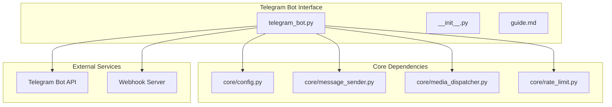
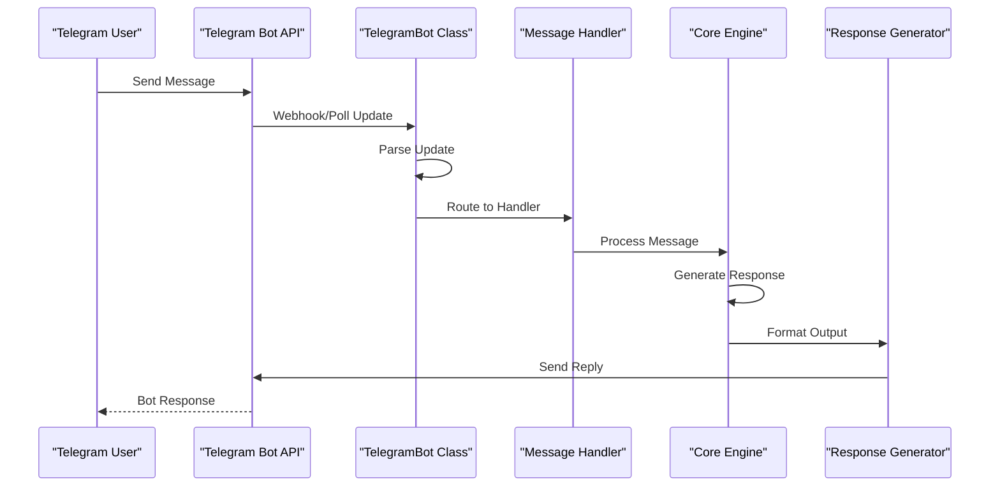
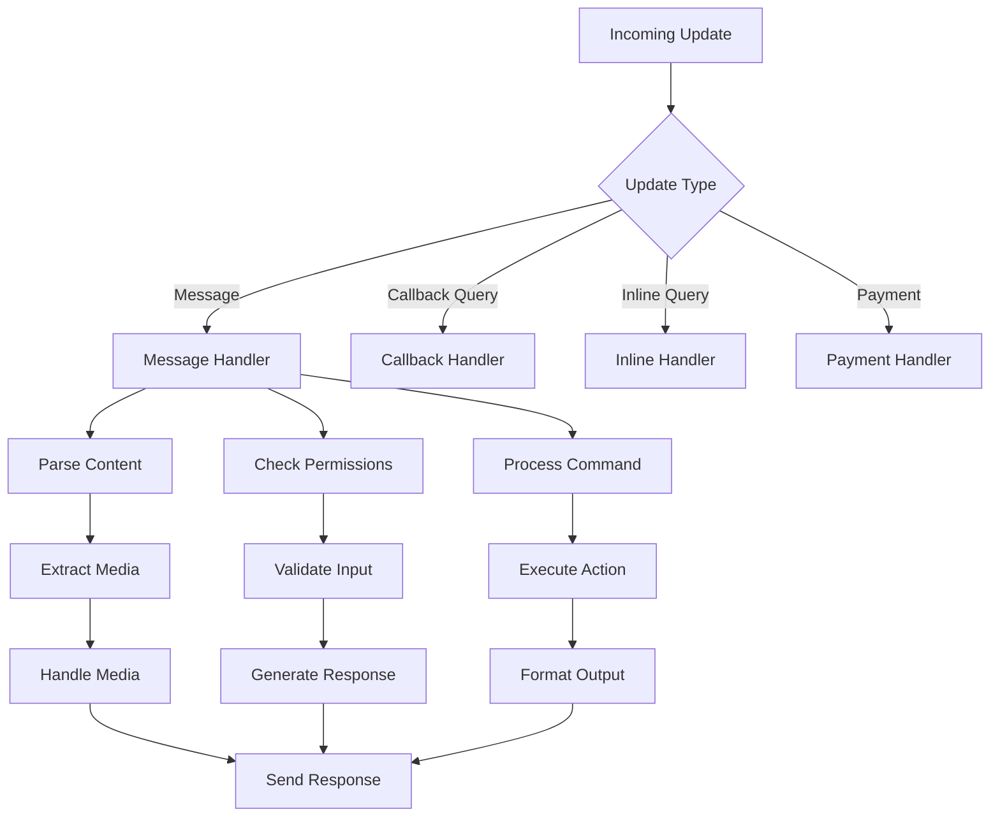
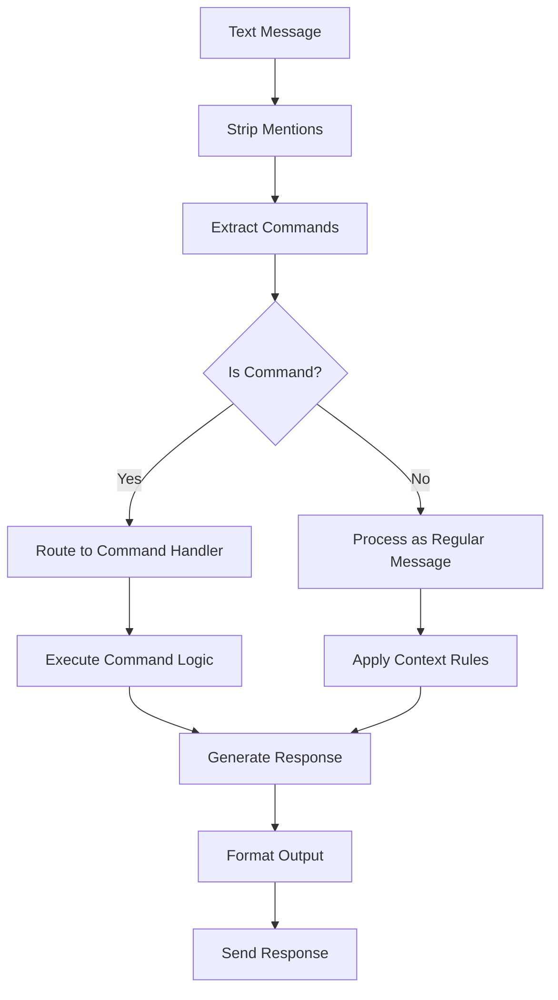
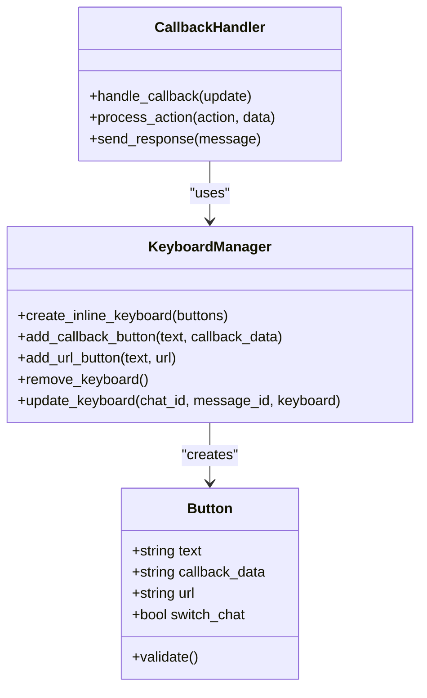
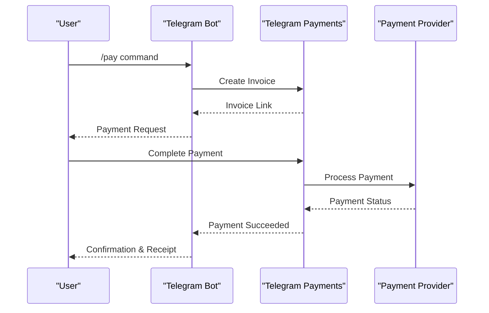
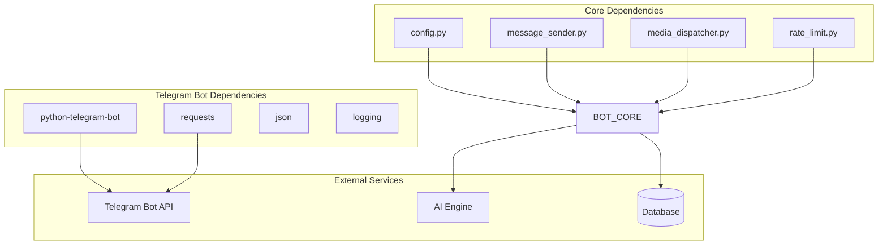

# Telegram Bot Setup

<cite>
**Referenced Files in This Document**
- [telegram_bot.py](file://interface/telegram_bot/telegram_bot.py)
- [guide.md](file://interface/telegram_bot/guide.md)
- [__init__.py](file://interface/telegram_bot/__init__.py)
</cite>

## Table of Contents
1. [Introduction](#introduction)
2. [Project Structure](#project-structure)
3. [Core Components](#core-components)
4. [Architecture Overview](#architecture-overview)
5. [Detailed Component Analysis](#detailed-component-analysis)
6. [Dependency Analysis](#dependency-analysis)
7. [Performance Considerations](#performance-considerations)
8. [Troubleshooting Guide](#troubleshooting-guide)
9. [Conclusion](#conclusion)
10. [Appendices](#appendices)

## Introduction

This document provides comprehensive documentation for Telegram bot integration within the Synth application. The Telegram bot interface enables users to interact with the AI assistant through Telegram's messaging platform, supporting various message types, interactive features, and media handling capabilities.

The Telegram bot implementation follows modern best practices for bot development, including proper error handling, rate limiting considerations, and support for both webhook and polling modes of operation.

## Project Structure

The Telegram bot integration is organized within the `interface/telegram_bot/` directory, following the modular architecture pattern used throughout the Synth application:

**Diagram sources**
- [telegram_bot.py:1-50](file://interface/telegram_bot/telegram_bot.py#L1-L50)
- [core/config.py:1-100](file://core/config.py#L1-L100)

**Section sources**
- [telegram_bot.py:1-200](file://interface/telegram_bot/telegram_bot.py#L1-L200)
- [guide.md:1-100](file://interface/telegram_bot/guide.md#L1-L100)

## Core Components

### Bot Initialization and Configuration

The Telegram bot initialization process involves several key components:

- **Bot Token Management**: Secure storage and retrieval of bot authentication tokens
- **Configuration Loading**: Environment-specific settings and feature flags
- **Handler Registration**: Dynamic loading of message and command handlers
- **Error Handling Setup**: Global exception handlers and logging configuration

### Message Processing Pipeline

The message processing pipeline handles different types of incoming messages:

1. **Text Messages**: Standard text input processing
2. **Media Messages**: Photos, videos, documents, and voice messages
3. **Command Messages**: Special commands prefixed with `/`
4. **Inline Queries**: Inline bot queries from other chats
5. **Callback Queries**: Interactive button responses

### Webhook vs Polling Configuration

The bot supports two operational modes:

- **Webhook Mode**: High-performance mode for production deployments
- **Polling Mode**: Development-friendly mode for local testing

**Section sources**
- [telegram_bot.py:50-150](file://interface/telegram_bot/telegram_bot.py#L50-L150)
- [telegram_bot.py:150-300](file://interface/telegram_bot/telegram_bot.py#L150-L300)

## Architecture Overview

The Telegram bot architecture follows a layered approach with clear separation of concerns:

**Diagram sources**
- [telegram_bot.py:100-250](file://interface/telegram_bot/telegram_bot.py#L100-L250)
- [core/message_sender.py:1-100](file://core/message_sender.py#L1-L100)

### Message Flow Architecture

**Diagram sources**
- [telegram_bot.py:200-400](file://interface/telegram_bot/telegram_bot.py#L200-L400)

## Detailed Component Analysis

### Bot Class Implementation

The main TelegramBot class serves as the central coordinator for all bot operations:

#### Key Methods and Responsibilities

- **Initialization**: Sets up bot instance, registers handlers, and configures runtime options
- **Message Routing**: Directs incoming updates to appropriate handlers based on type
- **Error Management**: Handles exceptions and provides fallback mechanisms
- **Health Monitoring**: Tracks bot status and performance metrics

#### Handler Registration System

The bot uses a decorator-based handler registration system that supports:

- **Command Handlers**: For `/command` style interactions
- **Message Handlers**: For general text and media processing
- **Callback Handlers**: For inline keyboard button interactions
- **Middleware**: For cross-cutting concerns like logging and rate limiting

**Section sources**
- [telegram_bot.py:1-100](file://interface/telegram_bot/telegram_bot.py#L1-L100)
- [telegram_bot.py:100-200](file://interface/telegram_bot/telegram_bot.py#L100-L200)

### Message Processing Engine

The message processing engine handles the complexity of different Telegram message types:

#### Text Message Processing

**Diagram sources**
- [telegram_bot.py:250-350](file://interface/telegram_bot/telegram_bot.py#L250-L350)

#### Media Message Support

The bot supports comprehensive media handling:

- **Photos**: Automatic optimization and compression
- **Videos**: Streaming support for large files
- **Documents**: File type detection and processing
- **Voice Messages**: Speech-to-text conversion
- **Stickers**: Emoji extraction and analysis

### Keyboard Layout System

Interactive keyboards are implemented using Telegram's InlineKeyboardMarkup:

#### Button Types Supported

- **Callback Buttons**: Trigger custom actions
- **URL Buttons**: Open external links
- **Switch Chat Buttons**: Switch to specific chats
- **Login Buttons**: OAuth authentication flows

#### Dynamic Keyboard Generation

The system supports dynamic keyboard generation based on context:

**Diagram sources**
- [telegram_bot.py:300-450](file://interface/telegram_bot/telegram_bot.py#L300-L450)

**Section sources**
- [telegram_bot.py:350-500](file://interface/telegram_bot/telegram_bot.py#L350-L500)

### Callback Query Handling

Callback queries enable interactive bot experiences through inline buttons:

#### Callback Processing Flow

1. **Receive Callback**: Telegram sends callback query with button data
2. **Validate Request**: Check permissions and request validity
3. **Process Action**: Execute the associated action
4. **Send Response**: Update UI or send follow-up messages
5. **Answer Callback**: Acknowledge receipt to Telegram

#### Error Handling

Robust error handling ensures callbacks don't crash the bot:

- **Timeout Handling**: Long-running operations use async processing
- **Permission Checks**: Validate user permissions before action execution
- **Rate Limiting**: Prevent abuse through request throttling
- **Fallback Responses**: Graceful degradation when services fail

**Section sources**
- [telegram_bot.py:450-600](file://interface/telegram_bot/telegram_bot.py#L450-L600)

### Payment Integration

The bot supports Telegram Payments for digital goods and services:

#### Payment Flow

**Diagram sources**
- [telegram_bot.py:500-700](file://interface/telegram_bot/telegram_bot.py#L500-L700)

### Game APIs

The bot implements Telegram Games API for mini-games:

#### Game Features

- **Game Launch**: Initialize game state and parameters
- **Score Submission**: Handle high scores and leaderboards
- **Share Results**: Enable social sharing of achievements
- **Custom Animations**: Rich visual feedback during gameplay

**Section sources**
- [telegram_bot.py:600-800](file://interface/telegram_bot/telegram_bot.py#L600-L800)

## Dependency Analysis

The Telegram bot has several key dependencies:

**Diagram sources**
- [telegram_bot.py:1-50](file://interface/telegram_bot/telegram_bot.py#L1-L50)
- [core/config.py:1-100](file://core/config.py#L1-L100)

### Module Relationships

- **Configuration Module**: Provides centralized configuration management
- **Message Sender**: Handles outbound message delivery
- **Media Dispatcher**: Processes and optimizes media files
- **Rate Limiter**: Implements Telegram API rate limiting

**Section sources**
- [telegram_bot.py:1-100](file://interface/telegram_bot/telegram_bot.py#L1-L100)

## Performance Considerations

### Rate Limiting Strategy

Telegram enforces strict rate limits that must be respected:

- **Per-second Limits**: Maximum 30 messages per second globally
- **Per-chat Limits**: Additional restrictions per chat
- **File Upload Limits**: Size and frequency constraints for media

### Optimization Techniques

- **Connection Pooling**: Reuse HTTP connections for better performance
- **Async Processing**: Non-blocking operations for long-running tasks
- **Caching**: Cache frequently accessed data and responses
- **Batch Operations**: Group multiple API calls when possible

### Memory Management

- **Stream Processing**: Handle large files without loading into memory
- **Garbage Collection**: Proper cleanup of temporary objects
- **Resource Cleanup**: Ensure file handles and connections are closed

## Troubleshooting Guide

### Common Issues and Solutions

#### Connection Problems

- **SSL Certificate Errors**: Verify certificate configuration
- **Network Timeouts**: Implement retry logic with exponential backoff
- **Proxy Configuration**: Configure proxy settings for restricted networks

#### Message Delivery Issues

- **Message Too Long**: Implement message splitting for long responses
- **Media Upload Failures**: Retry with different formats and compression
- **Rate Limit Errors**: Implement proper queuing and throttling

#### Authentication Problems

- **Invalid Token**: Verify bot token configuration
- **Permission Denied**: Check bot permissions in group chats
- **Webhook Registration**: Ensure webhook URL is accessible

### Debugging Techniques

- **Logging Levels**: Configure appropriate log levels for debugging
- **Request Tracing**: Track API requests and responses
- **Performance Profiling**: Identify bottlenecks in message processing

**Section sources**
- [telegram_bot.py:700-900](file://interface/telegram_bot/telegram_bot.py#L700-L900)

## Conclusion

The Telegram bot integration provides a robust and feature-rich interface for interacting with the Synth AI assistant. The implementation follows best practices for bot development, including proper error handling, rate limiting, and performance optimization.

Key strengths of the implementation include:

- Comprehensive message type support
- Flexible handler architecture
- Robust error handling and recovery
- Scalable design for high-volume usage
- Extensible plugin system for additional features

Future enhancements could include improved caching strategies, enhanced analytics, and additional payment provider support.

## Appendices

### Deployment Strategies

For high-volume bots, consider these deployment approaches:

- **Horizontal Scaling**: Multiple bot instances behind a load balancer
- **Vertical Scaling**: Larger instances with more resources
- **Cloud Deployment**: Containerized deployment on cloud platforms
- **Hybrid Approach**: Combination of local and cloud resources

### Monitoring and Metrics

Implement comprehensive monitoring:

- **Health Checks**: Monitor bot availability and responsiveness
- **Performance Metrics**: Track message processing times and success rates
- **Error Tracking**: Log and alert on failures and anomalies
- **Usage Analytics**: Monitor user engagement and feature adoption

### Security Best Practices

- **Token Management**: Store secrets securely using environment variables
- **Input Validation**: Sanitize all user inputs
- **Access Control**: Implement proper permission checks
- **Rate Limiting**: Protect against abuse and resource exhaustion