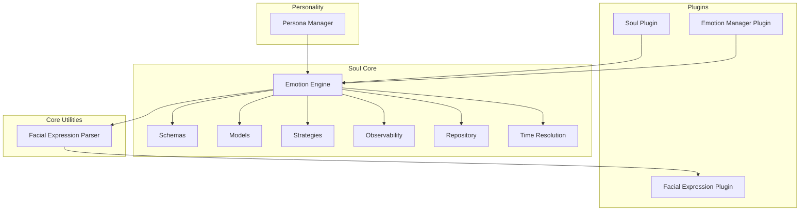
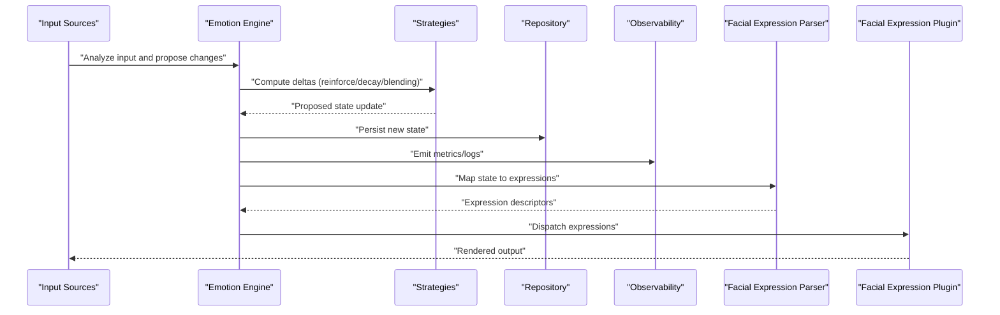
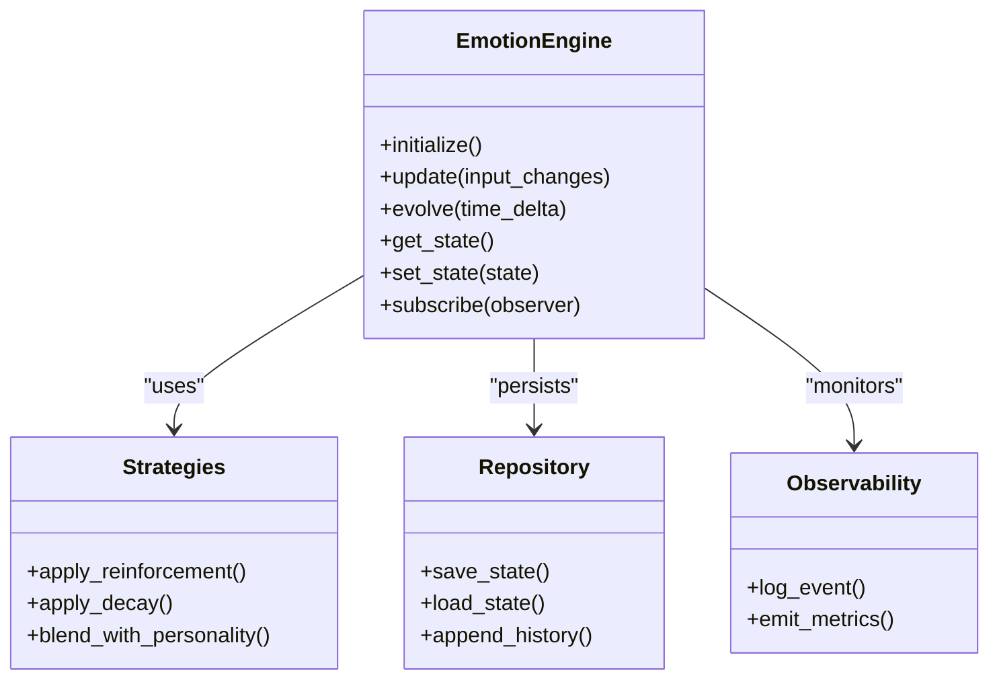
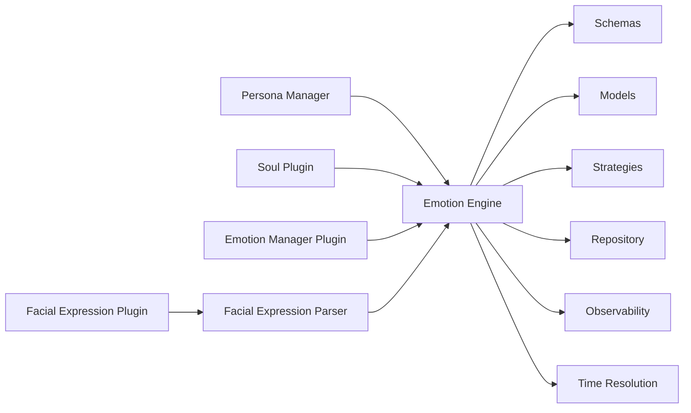

# Emotion Engine & Personality

<cite>
**Referenced Files in This Document**
- [emotion_engine.py](file://core/soul/emotion_engine.py)
- [schemas.py](file://core/soul/schemas.py)
- [models.py](file://core/soul/models.py)
- [strategies.py](file://core/soul/strategies.py)
- [compiler.py](file://core/soul/compiler.py)
- [observability.py](file://core/soul/observability.py)
- [repository.py](file://core/soul/repository.py)
- [time_resolution.py](file://core/soul/time_resolution.py)
- [soul_plugin.py](file://plugins/soul_plugin/soul_plugin.py)
- [emotion_manager.py](file://plugins/emotion_manager/emotion_manager.py)
- [facial_expression_parser.py](file://core/facial_expression_parser.py)
- [facial_expression_plugin.py](file://plugins/facial_expression_plugin/facial_expression_plugin.py)
- [persona_manager.py](file://core/persona_manager.py)
- [test_emotion_engine.py](file://tests/soul/test_emotion_engine.py)
- [test_emotion_manager.py](file://tests/test_emotion_manager.py)
- [test_facial_expression_parser.py](file://tests/test_facial_expression_parser.py)
- [test_persona_emotions.py](file://tests/test_persona_emotions.py)
- [emotion_engine.rst](file://docs/emotion_engine.rst)
</cite>

## Table of Contents
1. [Introduction](#introduction)
2. [Project Structure](#project-structure)
3. [Core Components](#core-components)
4. [Architecture Overview](#architecture-overview)
5. [Detailed Component Analysis](#detailed-component-analysis)
6. [Dependency Analysis](#dependency-analysis)
7. [Performance Considerations](#performance-considerations)
8. [Troubleshooting Guide](#troubleshooting-guide)
9. [Conclusion](#conclusion)
10. [Appendices](#appendices)

## Introduction
This document explains the Emotion Engine and Personality system, focusing on emotional state management algorithms, personality trait calculations, dynamic emotion evolution, external emotion control via a plugin, and facial expression parsing for visual representation. It also covers configuration options, real-time updates, performance strategies, and concrete examples of emotion transitions, personality blending, and expression mapping.

## Project Structure
The Emotion Engine is implemented under core/soul with supporting schemas, models, strategies, and observability utilities. The persona manager provides personality profiles and blending. External control is exposed through an emotion manager plugin, while facial expressions are parsed and mapped to visual outputs via a dedicated parser and plugin. Tests validate behavior across components.

**Diagram sources**
- [emotion_engine.py:1-200](file://core/soul/emotion_engine.py#L1-L200)
- [schemas.py:1-200](file://core/soul/schemas.py#L1-L200)
- [models.py:1-200](file://core/soul/models.py#L1-L200)
- [strategies.py:1-200](file://core/soul/strategies.py#L1-L200)
- [observability.py:1-200](file://core/soul/observability.py#L1-L200)
- [repository.py:1-200](file://core/soul/repository.py#L1-L200)
- [time_resolution.py:1-200](file://core/soul/time_resolution.py#L1-L200)
- [persona_manager.py:1-200](file://core/persona_manager.py#L1-L200)
- [soul_plugin.py:1-200](file://plugins/soul_plugin/soul_plugin.py#L1-L200)
- [emotion_manager.py:1-200](file://plugins/emotion_manager/emotion_manager.py#L1-L200)
- [facial_expression_parser.py:1-200](file://core/facial_expression_parser.py#L1-L200)
- [facial_expression_plugin.py:1-200](file://plugins/facial_expression_plugin/facial_expression_plugin.py#L1-L200)

**Section sources**
- [emotion_engine.rst:1-200](file://docs/emotion_engine.rst#L1-L200)

## Core Components
- Emotion Engine: Central orchestrator for computing, updating, and persisting emotional states; integrates strategies for evolution and decay; exposes APIs for external plugins.
- Schemas and Models: Define data contracts for emotions, traits, and state snapshots; ensure validation and serialization.
- Strategies: Implement algorithms for emotion dynamics (e.g., reinforcement, decay, blending).
- Observability: Emit metrics and logs for debugging and monitoring.
- Repository: Persists emotion states and history.
- Time Resolution: Aligns emotion updates with temporal context.
- Persona Manager: Provides personality profiles and blending logic that influence emotion sensitivity and thresholds.
- Soul Plugin: Integrates the Emotion Engine into the broader agent lifecycle.
- Emotion Manager Plugin: Allows external systems to read/write emotion states and trigger evolutions.
- Facial Expression Parser: Converts internal emotion states to facial expression descriptors for visualization.
- Facial Expression Plugin: Bridges parsed expressions to rendering or transport layers.

**Section sources**
- [emotion_engine.py:1-200](file://core/soul/emotion_engine.py#L1-L200)
- [schemas.py:1-200](file://core/soul/schemas.py#L1-L200)
- [models.py:1-200](file://core/soul/models.py#L1-L200)
- [strategies.py:1-200](file://core/soul/strategies.py#L1-L200)
- [observability.py:1-200](file://core/soul/observability.py#L1-L200)
- [repository.py:1-200](file://core/soul/repository.py#L1-L200)
- [time_resolution.py:1-200](file://core/soul/time_resolution.py#L1-L200)
- [persona_manager.py:1-200](file://core/persona_manager.py#L1-L200)
- [soul_plugin.py:1-200](file://plugins/soul_plugin/soul_plugin.py#L1-L200)
- [emotion_manager.py:1-200](file://plugins/emotion_manager/emotion_manager.py#L1-L200)
- [facial_expression_parser.py:1-200](file://core/facial_expression_parser.py#L1-L200)
- [facial_expression_plugin.py:1-200](file://plugins/facial_expression_plugin/facial_expression_plugin.py#L1-L200)

## Architecture Overview
The Emotion Engine sits at the center of the affective loop. Inputs from conversation analysis, events, and external controllers feed into strategy-driven updates. Personality traits modulate sensitivity and thresholds. Updated states are persisted and observed, then mapped to facial expressions for visualization.

**Diagram sources**
- [emotion_engine.py:1-200](file://core/soul/emotion_engine.py#L1-L200)
- [strategies.py:1-200](file://core/soul/strategies.py#L1-L200)
- [repository.py:1-200](file://core/soul/repository.py#L1-L200)
- [observability.py:1-200](file://core/soul/observability.py#L1-L200)
- [facial_expression_parser.py:1-200](file://core/facial_expression_parser.py#L1-L200)
- [facial_expression_plugin.py:1-200](file://plugins/facial_expression_plugin/facial_expression_plugin.py#L1-L200)

## Detailed Component Analysis

### Emotion Engine
Responsibilities:
- Maintain current emotional state per dimension or category.
- Apply strategy-based updates based on inputs and time.
- Expose APIs for reading/writing states and triggering evolutions.
- Integrate with repository for persistence and observability for diagnostics.

Key behaviors:
- State initialization from schema/model defaults.
- Incremental updates using strategies (e.g., reinforcement, decay, thresholding).
- Blending with personality traits to adjust sensitivity and response magnitude.
- Real-time updates with throttling and batching where applicable.

**Diagram sources**
- [emotion_engine.py:1-200](file://core/soul/emotion_engine.py#L1-L200)
- [strategies.py:1-200](file://core/soul/strategies.py#L1-L200)
- [repository.py:1-200](file://core/soul/repository.py#L1-L200)
- [observability.py:1-200](file://core/soul/observability.py#L1-L200)

**Section sources**
- [emotion_engine.py:1-200](file://core/soul/emotion_engine.py#L1-L200)
- [test_emotion_engine.py:1-200](file://tests/soul/test_emotion_engine.py#L1-L200)

### Schemas and Models
Purpose:
- Define validated structures for emotion dimensions, traits, and snapshots.
- Provide serialization/deserialization for persistence and API payloads.
- Enforce constraints such as ranges, required fields, and consistency rules.

Highlights:
- Emotion dimension definitions with min/max bounds.
- Trait profiles including weights and modifiers.
- State snapshots capturing timestamps and versioning.

**Section sources**
- [schemas.py:1-200](file://core/soul/schemas.py#L1-L200)
- [models.py:1-200](file://core/soul/models.py#L1-L200)

### Strategies
Algorithms:
- Reinforcement: Increase emotion intensity when triggered by relevant inputs.
- Decay: Gradually reduce intensity over time unless reinforced.
- Thresholding: Trigger behavioral adaptations when crossing defined thresholds.
- Blending: Combine multiple emotion signals and personality traits to compute final values.

Complexity considerations:
- Typically O(n) per update where n is number of emotion dimensions.
- Batch updates to minimize overhead during high-frequency inputs.

**Section sources**
- [strategies.py:1-200](file://core/soul/strategies.py#L1-L200)

### Observability and Repository
Observability:
- Logs key events (state changes, errors).
- Emits metrics for latency, frequency, and magnitude of updates.

Repository:
- Persists current state and historical snapshots.
- Supports queries for debugging and analytics.

**Section sources**
- [observability.py:1-200](file://core/soul/observability.py#L1-L200)
- [repository.py:1-200](file://core/soul/repository.py#L1-L200)

### Time Resolution
Aligns emotion updates with temporal context:
- Determines appropriate decay rates based on elapsed time.
- Supports event-driven vs. periodic updates.

**Section sources**
- [time_resolution.py:1-200](file://core/soul/time_resolution.py#L1-L200)

### Persona Manager and Personality Blending
Personality profiles define trait weights that influence:
- Sensitivity to triggers (e.g., higher extraversion amplifies positive emotions).
- Thresholds for behavioral adaptation.
- Blending ratios between competing emotions.

Blending process:
- Normalize trait contributions.
- Apply weighted combinations to emotion intensities.
- Ensure bounded results within schema-defined ranges.

**Section sources**
- [persona_manager.py:1-200](file://core/persona_manager.py#L1-L200)
- [test_persona_emotions.py:1-200](file://tests/test_persona_emotions.py#L1-L200)

### Soul Plugin
Integration points:
- Initializes Emotion Engine during agent startup.
- Subscribes to agent events to drive emotion updates.
- Exposes hooks for other subsystems to observe state changes.

**Section sources**
- [soul_plugin.py:1-200](file://plugins/soul_plugin/soul_plugin.py#L1-L200)

### Emotion Manager Plugin
External control capabilities:
- Read current emotion state.
- Write targeted updates or overrides.
- Trigger evolutions or resets.
- Subscribe to state change events.

Security and validation:
- Validates incoming payloads against schemas.
- Enforces scope and permissions where applicable.

**Section sources**
- [emotion_manager.py:1-200](file://plugins/emotion_manager/emotion_manager.py#L1-L200)
- [test_emotion_manager.py:1-200](file://tests/test_emotion_manager.py#L1-L200)

### Facial Expression Parser and Plugin
Parsing:
- Maps emotion states to expression descriptors (e.g., smile intensity, brow raise).
- Handles normalization and clamping to valid ranges.

Plugin:
- Receives descriptors and forwards to rendering or transport layers.
- Supports fallback mappings and variant selection.

**Section sources**
- [facial_expression_parser.py:1-200](file://core/facial_expression_parser.py#L1-L200)
- [facial_expression_plugin.py:1-200](file://plugins/facial_expression_plugin/facial_expression_plugin.py#L1-L200)
- [test_facial_expression_parser.py:1-200](file://tests/test_facial_expression_parser.py#L1-L200)

## Dependency Analysis
The Emotion Engine depends on schemas, models, strategies, repository, observability, and time resolution. Persona manager influences strategy blending. Plugins integrate externally and consume engine APIs.

**Diagram sources**
- [emotion_engine.py:1-200](file://core/soul/emotion_engine.py#L1-L200)
- [schemas.py:1-200](file://core/soul/schemas.py#L1-L200)
- [models.py:1-200](file://core/soul/models.py#L1-L200)
- [strategies.py:1-200](file://core/soul/strategies.py#L1-L200)
- [repository.py:1-200](file://core/soul/repository.py#L1-L200)
- [observability.py:1-200](file://core/soul/observability.py#L1-L200)
- [time_resolution.py:1-200](file://core/soul/time_resolution.py#L1-L200)
- [persona_manager.py:1-200](file://core/persona_manager.py#L1-L200)
- [soul_plugin.py:1-200](file://plugins/soul_plugin/soul_plugin.py#L1-L200)
- [emotion_manager.py:1-200](file://plugins/emotion_manager/emotion_manager.py#L1-L200)
- [facial_expression_parser.py:1-200](file://core/facial_expression_parser.py#L1-L200)
- [facial_expression_plugin.py:1-200](file://plugins/facial_expression_plugin/facial_expression_plugin.py#L1-L200)

**Section sources**
- [emotion_engine.rst:1-200](file://docs/emotion_engine.rst#L1-L200)

## Performance Considerations
- Batch updates: Group multiple input changes to reduce strategy computations and persistence calls.
- Throttle emissions: Limit observability and plugin dispatch frequency to avoid overload.
- Lazy evaluation: Defer expensive operations until needed (e.g., complex blending).
- Efficient storage: Use compact snapshots and incremental diffs where possible.
- Caching: Cache frequently accessed personality traits and expression mappings.

[No sources needed since this section provides general guidance]

## Troubleshooting Guide
Common issues and resolutions:
- Invalid state updates: Validate payloads against schemas; check range constraints.
- Unexpected emotion drift: Review decay rates and time resolution settings.
- Missing expression output: Verify parser mappings and plugin connectivity.
- Persistence failures: Inspect repository logs and storage availability.
- Performance bottlenecks: Profile update frequency and batch sizes.

**Section sources**
- [observability.py:1-200](file://core/soul/observability.py#L1-L200)
- [repository.py:1-200](file://core/soul/repository.py#L1-L200)
- [facial_expression_parser.py:1-200](file://core/facial_expression_parser.py#L1-L200)
- [facial_expression_plugin.py:1-200](file://plugins/facial_expression_plugin/facial_expression_plugin.py#L1-L200)

## Conclusion
The Emotion Engine and Personality system provide a robust foundation for dynamic emotional modeling and expressive visualization. By combining strategy-driven updates, personality-aware blending, and extensible plugins, it supports real-time emotion evolution and responsive behavior. Proper configuration and performance tuning ensure reliable operation in production environments.

[No sources needed since this section summarizes without analyzing specific files]

## Appendices

### Configuration Options
- Emotion algorithms:
  - Reinforcement strength per dimension.
  - Decay rate constants.
  - Thresholds for behavioral adaptation.
- Personality profiles:
  - Trait weights and modifiers.
  - Blending ratios and normalization parameters.
- Expression mappings:
  - Descriptor-to-animation mappings.
  - Fallback expressions and variants.

[No sources needed since this section provides general guidance]

### Examples
- Emotion state transitions:
  - Positive input increases joy; subsequent neutral input decays joy over time.
  - High stress triggers caution; reinforcement maintains caution until safety cues appear.
- Personality blending:
  - High openness amplifies curiosity responses; low agreeableness reduces empathy peaks.
- Expression mapping:
  - Joy maps to smile intensity and eye crinkle; anger maps to brow furrow and lip tension.

[No sources needed since this section provides general guidance]