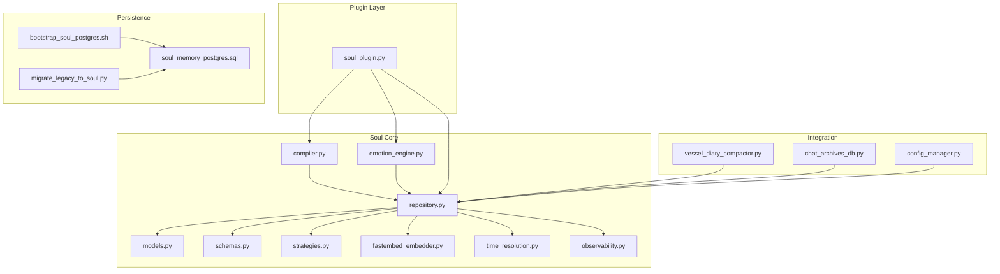
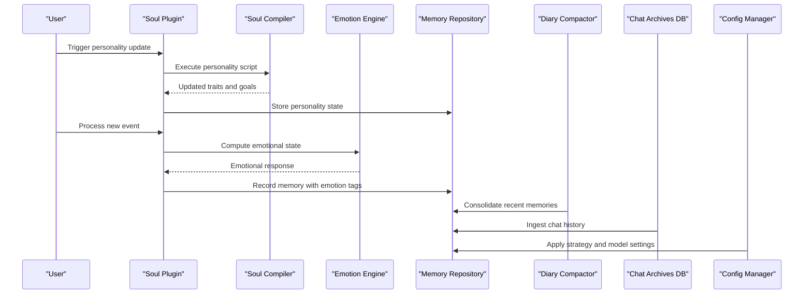
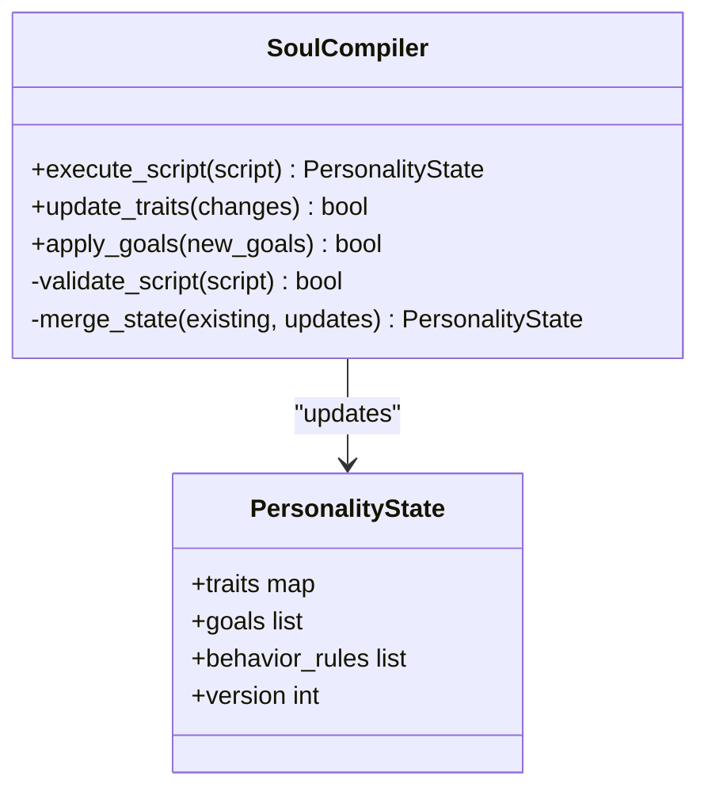
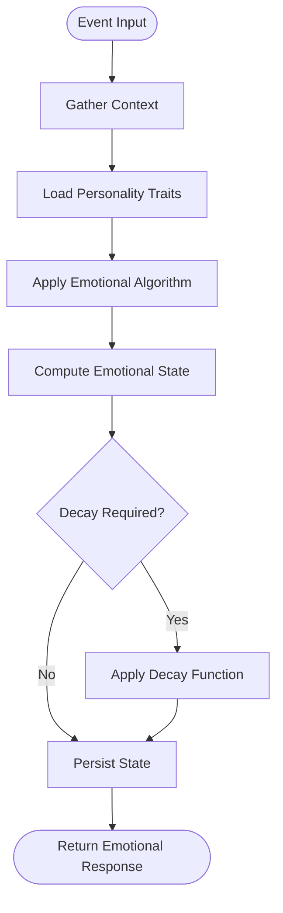
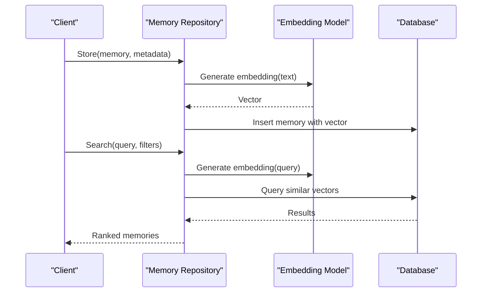
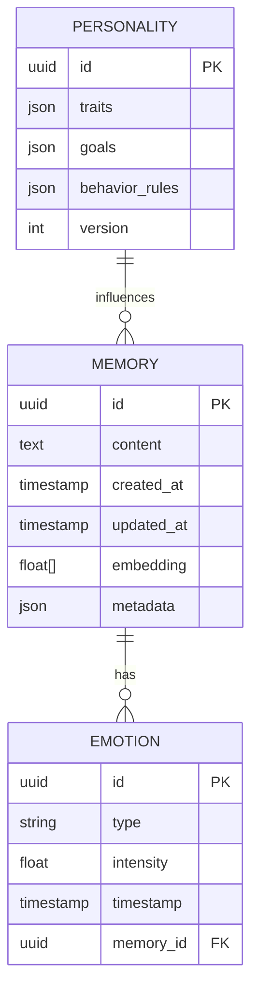
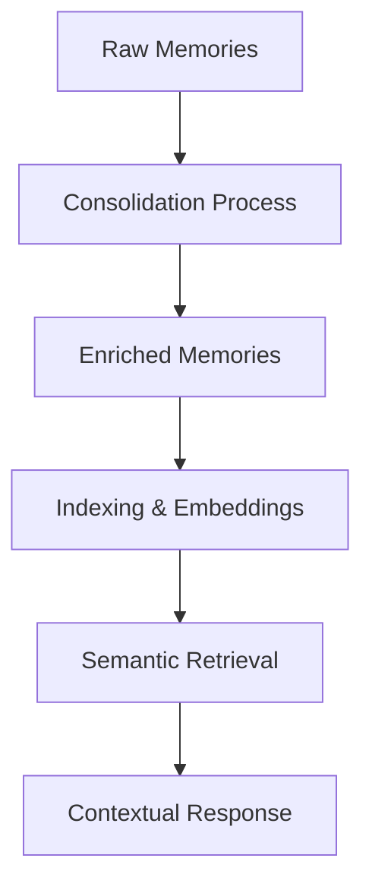
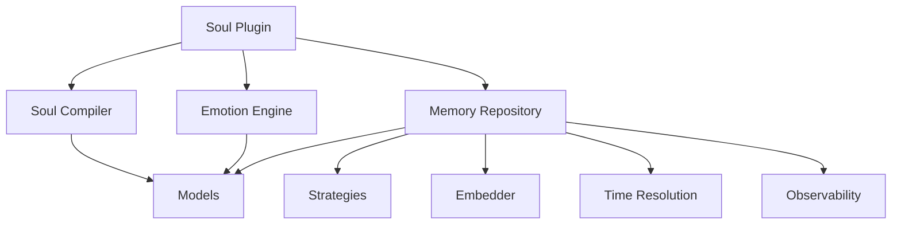

# Memory & Soul System

<cite>
**Referenced Files in This Document**
- [core/soul/compiler.py](file://core/soul/compiler.py)
- [core/soul/emotion_engine.py](file://core/soul/emotion_engine.py)
- [core/soul/repository.py](file://core/soul/repository.py)
- [core/soul/models.py](file://core/soul/models.py)
- [core/soul/schemas.py](file://core/soul/schemas.py)
- [core/soul/strategies.py](file://core/soul/strategies.py)
- [core/soul/fastembed_embedder.py](file://core/soul/fastembed_embedder.py)
- [core/soul/time_resolution.py](file://core/soul/time_resolution.py)
- [core/soul/observability.py](file://core/soul/observability.py)
- [plugins/soul_plugin/soul_plugin.py](file://plugins/soul_plugin/soul_plugin.py)
- [scripts/migrate_legacy_to_soul.py](file://scripts/migrate_legacy_to_soul.py)
- [scripts/bootstrap_soul_postgres.sh](file://scripts/bootstrap_soul_postgres.sh)
- [scripts/sql/soul_memory_postgres.sql](file://scripts/sql/soul_memory_postgres.sql)
- [core/vessel_diary_compactor.py](file://core/vessel_diary_compactor.py)
- [core/chat_archives_db.py](file://core/chat_archives_db.py)
- [core/db_backends.py](file://core/db_backends.py)
- [core/config_manager.py](file://core/config_manager.py)
- [docs/memory_search.rst](file://docs/memory_search.rst)
- [docs/emotion_engine.rst](file://docs/emotion_engine.rst)
</cite>

## Table of Contents
1. [Introduction](#introduction)
2. [Project Structure](#project-structure)
3. [Core Components](#core-components)
4. [Architecture Overview](#architecture-overview)
5. [Detailed Component Analysis](#detailed-component-analysis)
6. [Dependency Analysis](#dependency-analysis)
7. [Performance Considerations](#performance-considerations)
8. [Troubleshooting Guide](#troubleshooting-guide)
9. [Conclusion](#conclusion)
10. [Appendices](#appendices)

## Introduction
The Memory & Soul System provides a cohesive framework for persistent memory storage and emotional intelligence within the application. It comprises:
- A soul compiler that executes personality scripts to evolve traits and behaviors over time.
- An emotion engine that computes dynamic emotional states from events, context, and personality.
- A memory repository enabling semantic search and retrieval of memories using embeddings and indexing strategies.

This system integrates with diary compilation and consolidation processes to support long-term retention, while offering configuration options for memory strategies, embedding models, and emotional algorithms.

## Project Structure
The Memory & Soul System is primarily implemented under core/soul, with supporting plugins and scripts for initialization and migration. Key directories include:
- core/soul: Core modules for compiler, emotion engine, repository, models, schemas, strategies, embedders, time resolution, and observability.
- plugins/soul_plugin: Plugin interface integrating the soul system into the broader agent runtime.
- scripts: Bootstrap and migration utilities for database setup and legacy data migration.
- docs: Documentation covering memory search and emotion engine usage.

**Diagram sources**
- [core/soul/compiler.py](file://core/soul/compiler.py)
- [core/soul/emotion_engine.py](file://core/soul/emotion_engine.py)
- [core/soul/repository.py](file://core/soul/repository.py)
- [core/soul/models.py](file://core/soul/models.py)
- [core/soul/schemas.py](file://core/soul/schemas.py)
- [core/soul/strategies.py](file://core/soul/strategies.py)
- [core/soul/fastembed_embedder.py](file://core/soul/fastembed_embedder.py)
- [core/soul/time_resolution.py](file://core/soul/time_resolution.py)
- [core/soul/observability.py](file://core/soul/observability.py)
- [plugins/soul_plugin/soul_plugin.py](file://plugins/soul_plugin/soul_plugin.py)
- [scripts/bootstrap_soul_postgres.sh](file://scripts/bootstrap_soul_postgres.sh)
- [scripts/migrate_legacy_to_soul.py](file://scripts/migrate_legacy_to_soul.py)
- [scripts/sql/soul_memory_postgres.sql](file://scripts/sql/soul_memory_postgres.sql)
- [core/vessel_diary_compactor.py](file://core/vessel_diary_compactor.py)
- [core/chat_archives_db.py](file://core/chat_archives_db.py)
- [core/config_manager.py](file://core/config_manager.py)

**Section sources**
- [core/soul/compiler.py](file://core/soul/compiler.py)
- [core/soul/emotion_engine.py](file://core/soul/emotion_engine.py)
- [core/soul/repository.py](file://core/soul/repository.py)
- [plugins/soul_plugin/soul_plugin.py](file://plugins/soul_plugin/soul_plugin.py)
- [scripts/bootstrap_soul_postgres.sh](file://scripts/bootstrap_soul_postgres.sh)
- [scripts/migrate_legacy_to_soul.py](file://scripts/migrate_legacy_to_soul.py)
- [scripts/sql/soul_memory_postgres.sql](file://scripts/sql/soul_memory_postgres.sql)
- [core/vessel_diary_compactor.py](file://core/vessel_diary_compactor.py)
- [core/chat_archives_db.py](file://core/chat_archives_db.py)
- [core/config_manager.py](file://core/config_manager.py)

## Core Components
- Soul Compiler: Executes personality scripts to update traits, goals, and behavioral rules based on experiences and reflections.
- Emotion Engine: Computes emotional states from incoming events, contextual cues, and personality parameters; supports decay and reinforcement.
- Memory Repository: Stores memories with metadata, generates embeddings for semantic search, and manages retrieval strategies.
- Data Models: Define structures for memories, emotions, and personality traits, ensuring consistency across operations.
- Strategies: Configure memory persistence, embedding models, and emotional algorithms via pluggable strategies.
- Time Resolution: Normalizes temporal information for accurate memory indexing and recall.
- Observability: Provides logging, metrics, and tracing for debugging and performance analysis.

**Section sources**
- [core/soul/compiler.py](file://core/soul/compiler.py)
- [core/soul/emotion_engine.py](file://core/soul/emotion_engine.py)
- [core/soul/repository.py](file://core/soul/repository.py)
- [core/soul/models.py](file://core/soul/models.py)
- [core/soul/schemas.py](file://core/soul/schemas.py)
- [core/soul/strategies.py](file://core/soul/strategies.py)
- [core/soul/time_resolution.py](file://core/soul/time_resolution.py)
- [core/soul/observability.py](file://core/soul/observability.py)

## Architecture Overview
The Memory & Soul System follows a modular architecture where the soul plugin orchestrates interactions between the compiler, emotion engine, and memory repository. Diary compilation feeds consolidated insights into memory, while chat archives provide raw interaction data. Configuration management centralizes settings for strategies and models.

**Diagram sources**
- [plugins/soul_plugin/soul_plugin.py](file://plugins/soul_plugin/soul_plugin.py)
- [core/soul/compiler.py](file://core/soul/compiler.py)
- [core/soul/emotion_engine.py](file://core/soul/emotion_engine.py)
- [core/soul/repository.py](file://core/soul/repository.py)
- [core/vessel_diary_compactor.py](file://core/vessel_diary_compactor.py)
- [core/chat_archives_db.py](file://core/chat_archives_db.py)
- [core/config_manager.py](file://core/config_manager.py)

## Detailed Component Analysis

### Soul Compiler
The soul compiler interprets and executes personality scripts to evolve traits, goals, and behavioral rules. It processes reflection outputs from diary consolidation and user interactions, updating the personality state accordingly.

**Diagram sources**
- [core/soul/compiler.py](file://core/soul/compiler.py)
- [core/soul/models.py](file://core/soul/models.py)

**Section sources**
- [core/soul/compiler.py](file://core/soul/compiler.py)
- [core/soul/models.py](file://core/soul/models.py)

### Emotion Engine
The emotion engine calculates dynamic emotional states based on incoming events, contextual factors, and personality parameters. It supports decay over time and reinforcement from repeated stimuli.

**Diagram sources**
- [core/soul/emotion_engine.py](file://core/soul/emotion_engine.py)
- [core/soul/models.py](file://core/soul/models.py)

**Section sources**
- [core/soul/emotion_engine.py](file://core/soul/emotion_engine.py)
- [core/soul/models.py](file://core/soul/models.py)

### Memory Repository
The memory repository handles storage, retrieval, and semantic search of memories. It uses embeddings generated by configured models and supports various indexing strategies for efficient querying.

**Diagram sources**
- [core/soul/repository.py](file://core/soul/repository.py)
- [core/soul/fastembed_embedder.py](file://core/soul/fastembed_embedder.py)
- [core/soul/strategies.py](file://core/soul/strategies.py)

**Section sources**
- [core/soul/repository.py](file://core/soul/repository.py)
- [core/soul/fastembed_embedder.py](file://core/soul/fastembed_embedder.py)
- [core/soul/strategies.py](file://core/soul/strategies.py)

### Data Models
Data models define the structure for memories, emotions, and personality traits, ensuring consistency across the system. They include fields for content, timestamps, embeddings, and relational links.

**Diagram sources**
- [core/soul/models.py](file://core/soul/models.py)
- [core/soul/schemas.py](file://core/soul/schemas.py)

**Section sources**
- [core/soul/models.py](file://core/soul/models.py)
- [core/soul/schemas.py](file://core/soul/schemas.py)

### Conceptual Overview
The Memory & Soul System integrates memory consolidation, diary compilation, and long-term retention through coordinated workflows. Memories are enriched with emotional tags and personality influences, enabling nuanced retrieval and response generation.

[No sources needed since this diagram shows conceptual workflow, not actual code structure]

## Dependency Analysis
The Memory & Soul System exhibits clear dependencies between components, with the repository serving as a central hub for data operations. The compiler and emotion engine depend on models and strategies, while the plugin layer orchestrates interactions.

**Diagram sources**
- [core/soul/compiler.py](file://core/soul/compiler.py)
- [core/soul/emotion_engine.py](file://core/soul/emotion_engine.py)
- [core/soul/repository.py](file://core/soul/repository.py)
- [core/soul/models.py](file://core/soul/models.py)
- [core/soul/strategies.py](file://core/soul/strategies.py)
- [core/soul/fastembed_embedder.py](file://core/soul/fastembed_embedder.py)
- [core/soul/time_resolution.py](file://core/soul/time_resolution.py)
- [core/soul/observability.py](file://core/soul/observability.py)
- [plugins/soul_plugin/soul_plugin.py](file://plugins/soul_plugin/soul_plugin.py)

**Section sources**
- [core/soul/compiler.py](file://core/soul/compiler.py)
- [core/soul/emotion_engine.py](file://core/soul/emotion_engine.py)
- [core/soul/repository.py](file://core/soul/repository.py)
- [plugins/soul_plugin/soul_plugin.py](file://plugins/soul_plugin/soul_plugin.py)

## Performance Considerations
- Embedding Generation: Use batch processing for large memory sets to reduce API calls and latency.
- Database Optimization: Implement indexing on frequently queried fields and use connection pooling for concurrent access.
- Memory Cleanup: Schedule periodic cleanup of outdated or low-value memories to maintain storage efficiency.
- Strategy Selection: Choose appropriate embedding models and retrieval strategies based on workload characteristics.

[No sources needed since this section provides general guidance]

## Troubleshooting Guide
- Initialization Issues: Ensure database schema is bootstrapped using provided scripts before starting the service.
- Migration Errors: Validate legacy data formats and run migration tools to convert to the new schema.
- Performance Degradation: Monitor embedding generation times and adjust model configurations accordingly.
- Emotional State Anomalies: Review algorithm parameters and input context for correctness.

**Section sources**
- [scripts/bootstrap_soul_postgres.sh](file://scripts/bootstrap_soul_postgres.sh)
- [scripts/migrate_legacy_to_soul.py](file://scripts/migrate_legacy_to_soul.py)
- [core/soul/observability.py](file://core/soul/observability.py)

## Conclusion
The Memory & Soul System provides a robust foundation for persistent memory and emotional intelligence, enabling dynamic personality evolution and context-aware responses. Its modular design facilitates customization and scaling, while integration with diary compilation ensures long-term retention and meaningful memory consolidation.

[No sources needed since this section summarizes without analyzing specific files]

## Appendices
- Configuration Options: Refer to documentation for memory strategies, embedding models, and emotional algorithms.
- API Usage: Consult memory search and emotion engine guides for practical examples.

**Section sources**
- [docs/memory_search.rst](file://docs/memory_search.rst)
- [docs/emotion_engine.rst](file://docs/emotion_engine.rst)