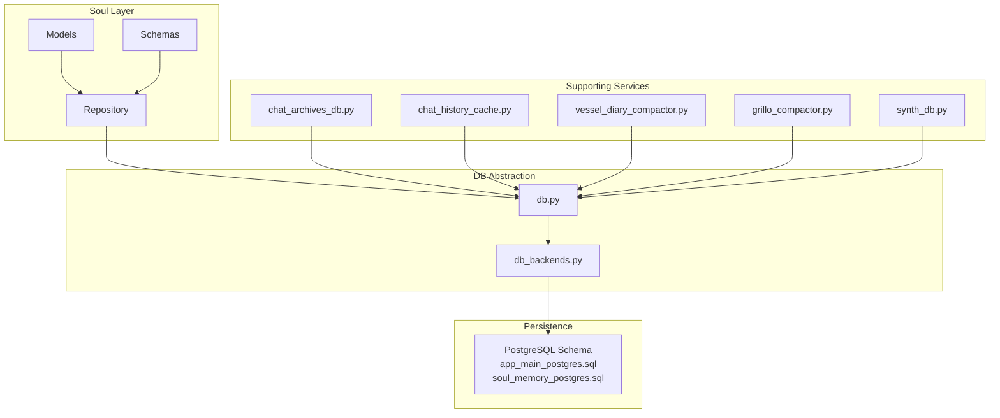
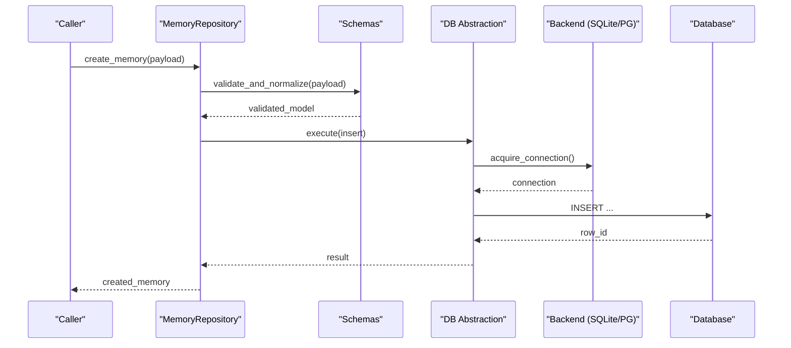
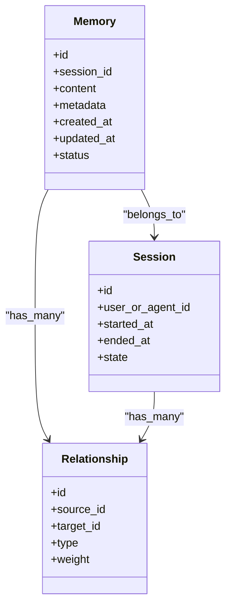
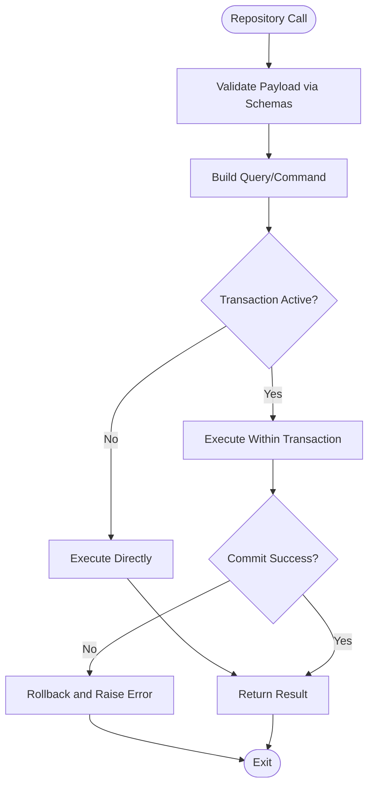
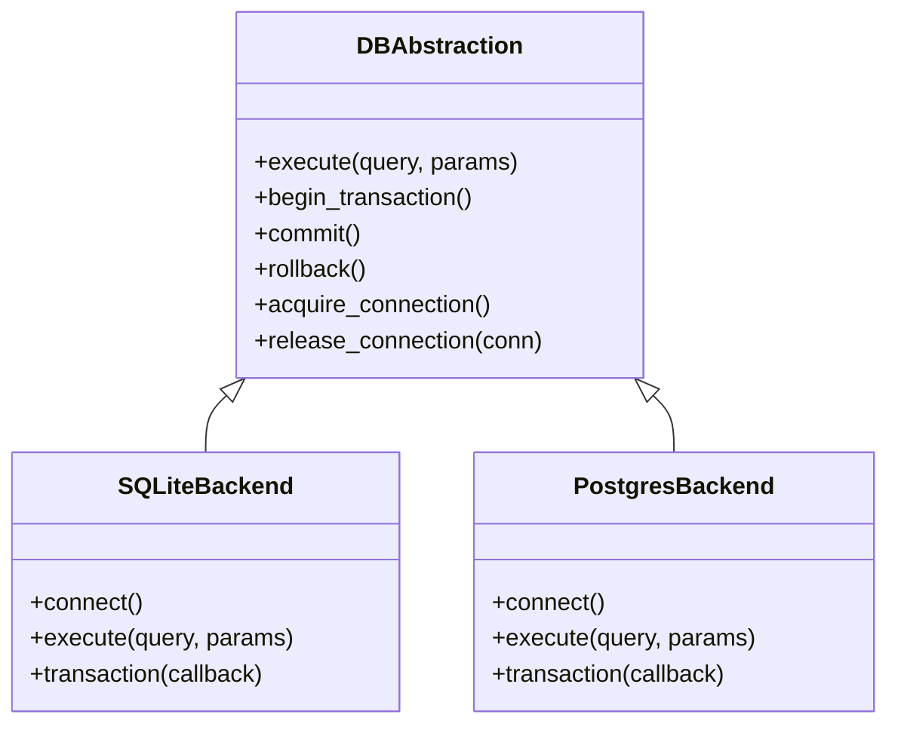
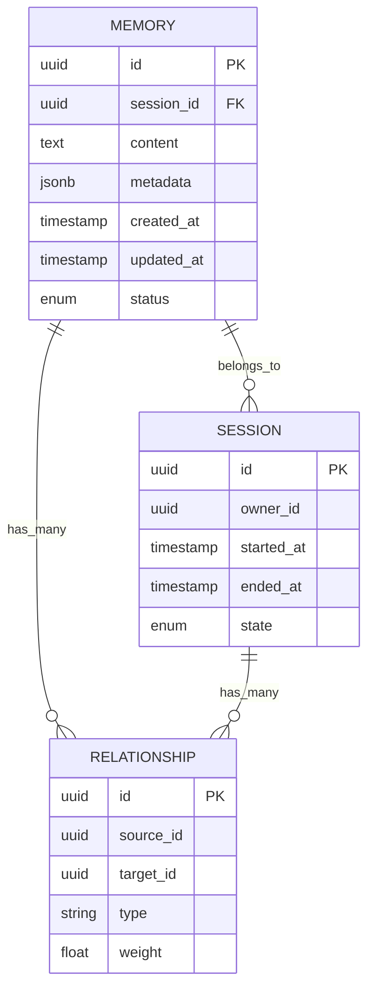
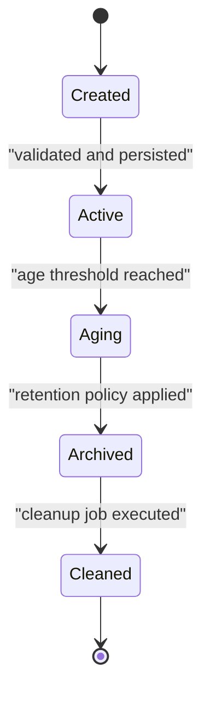
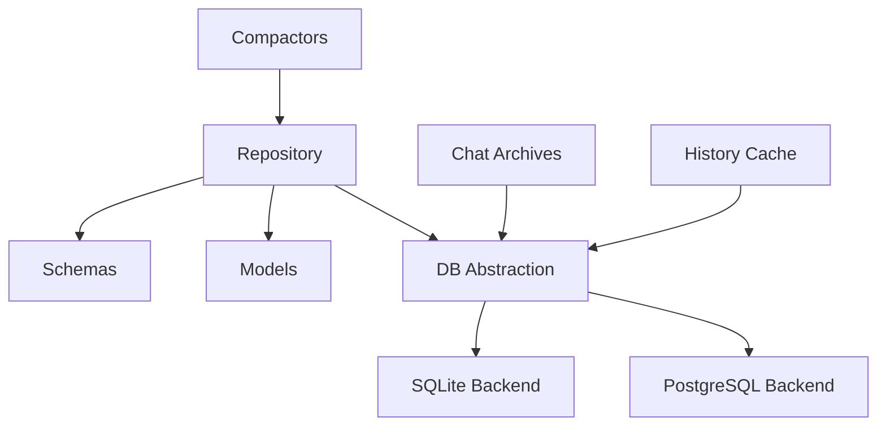
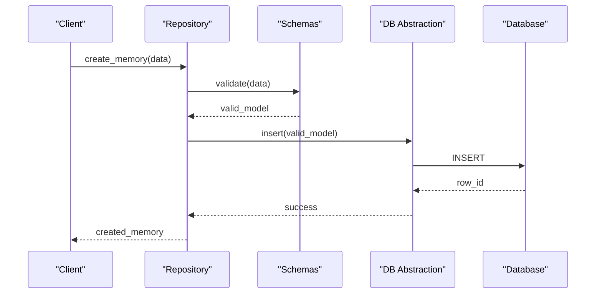
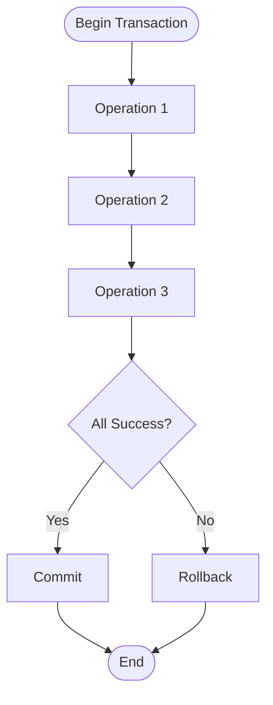

# Memory Architecture & Storage

<cite>
**Referenced Files in This Document**
- [core/soul/repository.py](file://core/soul/repository.py)
- [core/soul/models.py](file://core/soul/models.py)
- [core/soul/schemas.py](file://core/soul/schemas.py)
- [core/db.py](file://core/db.py)
- [core/db_backends.py](file://core/db_backends.py)
- [scripts/sql/app_main_postgres.sql](file://scripts/sql/app_main_postgres.sql)
- [scripts/sql/soul_memory_postgres.sql](file://scripts/sql/soul_memory_postgres.sql)
- [core/chat_archives_db.py](file://core/chat_archives_db.py)
- [core/chat_history_cache.py](file://core/chat_history_cache.py)
- [core/vessel_diary_compactor.py](file://core/vessel_diary_compactor.py)
- [plugins/grillo/grillo_compactor/grillo_compactor.py](file://plugins/grillo/grillo_compactor/grillo_compactor.py)
- [mcp_servers/synth_db.py](file://mcp_servers/synth_db.py)
- [tests/test_memory_search.py](file://tests/test_memory_search.py)
</cite>

## Table of Contents
1. [Introduction](#introduction)
2. [Project Structure](#project-structure)
3. [Core Components](#core-components)
4. [Architecture Overview](#architecture-overview)
5. [Detailed Component Analysis](#detailed-component-analysis)
6. [Dependency Analysis](#dependency-analysis)
7. [Performance Considerations](#performance-considerations)
8. [Troubleshooting Guide](#troubleshooting-guide)
9. [Conclusion](#conclusion)
10. [Appendices](#appendices)

## Introduction
This document explains the Memory Architecture and Storage subsystem, focusing on how memories are modeled, persisted, queried, and maintained over time. It covers:
- Repository pattern implementation for memory operations
- Database schema design for memory and session data
- Data persistence strategies across SQLite and PostgreSQL backends
- Memory models including memories, sessions, and relationships
- Concrete examples of CRUD operations, connection pooling, and transactions
- Memory lifecycle from creation to archival with retention policies and cleanup procedures
- Performance considerations, indexing strategies, and query optimization techniques

## Project Structure
The memory subsystem is primarily implemented under core/soul (models, schemas, repository), with database abstraction in core/db and core/db_backends. SQL schemas for PostgreSQL live under scripts/sql. Supporting components include chat archives, history caching, compaction utilities, and MCP server integration.

**Diagram sources**
- [core/soul/models.py](file://core/soul/models.py)
- [core/soul/schemas.py](file://core/soul/schemas.py)
- [core/soul/repository.py](file://core/soul/repository.py)
- [core/db.py](file://core/db.py)
- [core/db_backends.py](file://core/db_backends.py)
- [scripts/sql/app_main_postgres.sql](file://scripts/sql/app_main_postgres.sql)
- [scripts/sql/soul_memory_postgres.sql](file://scripts/sql/soul_memory_postgres.sql)
- [core/chat_archives_db.py](file://core/chat_archives_db.py)
- [core/chat_history_cache.py](file://core/chat_history_cache.py)
- [core/vessel_diary_compactor.py](file://core/vessel_diary_compactor.py)
- [plugins/grillo/grillo_compactor/grillo_compactor.py](file://plugins/grillo/grillo_compactor/grillo_compactor.py)
- [mcp_servers/synth_db.py](file://mcp_servers/synth_db.py)

**Section sources**
- [core/soul/models.py](file://core/soul/models.py)
- [core/soul/schemas.py](file://core/soul/schemas.py)
- [core/soul/repository.py](file://core/soul/repository.py)
- [core/db.py](file://core/db.py)
- [core/db_backends.py](file://core/db_backends.py)
- [scripts/sql/app_main_postgres.sql](file://scripts/sql/app_main_postgres.sql)
- [scripts/sql/soul_memory_postgres.sql](file://scripts/sql/soul_memory_postgres.sql)

## Core Components
- Models: Define in-memory representations of memories, sessions, and related entities.
- Schemas: Validate and normalize payloads for persistence and API boundaries.
- Repository: Encapsulates all persistence logic using a backend-agnostic interface.
- DB Abstraction: Provides connection management, pooling, and backend selection (SQLite/PostgreSQL).
- SQL Schemas: Provide DDL for PostgreSQL initialization and migrations.
- Compactors and Archives: Implement lifecycle transitions, retention, and cleanup.

Key responsibilities:
- Create, read, update, delete memories and sessions
- Manage relationships between memories and sessions
- Enforce schema validation before persistence
- Abstract backend differences behind a consistent interface
- Support transactions and connection pooling
- Trigger archival and cleanup based on policies

**Section sources**
- [core/soul/models.py](file://core/soul/models.py)
- [core/soul/schemas.py](file://core/soul/schemas.py)
- [core/soul/repository.py](file://core/soul/repository.py)
- [core/db.py](file://core/db.py)
- [core/db_backends.py](file://core/db_backends.py)

## Architecture Overview
The memory subsystem follows a layered architecture:
- Presentation/Service layer calls into the Repository
- Repository uses Schemas for validation and Models for domain representation
- Repository delegates to DB abstraction which selects the appropriate backend
- Backends manage connections, pooling, and execute SQL against SQLite or PostgreSQL
- Lifecycle services (compactors, archives) interact with the same repository to transition states and enforce retention

**Diagram sources**
- [core/soul/repository.py](file://core/soul/repository.py)
- [core/soul/schemas.py](file://core/soul/schemas.py)
- [core/db.py](file://core/db.py)
- [core/db_backends.py](file://core/db_backends.py)

## Detailed Component Analysis

### Memory Models and Relationships
The soul models define the primary entities used by the memory subsystem. Typical entities include:
- Memory: Represents a discrete unit of stored information with metadata such as timestamps, tags, and associations.
- Session: Represents a user or agent session context that can own multiple memories.
- Relationship: Links memories to sessions and potentially other entities to support queries and lifecycle management.

**Diagram sources**
- [core/soul/models.py](file://core/soul/models.py)

**Section sources**
- [core/soul/models.py](file://core/soul/models.py)

### Schema Validation and Normalization
Schemas ensure that incoming payloads conform to expected structures before being persisted. They also normalize values (e.g., timestamps, enums) to reduce backend-specific handling.

Responsibilities:
- Validate required fields and types
- Normalize dates/times to UTC
- Sanitize content and metadata
- Produce stable model instances for persistence

**Section sources**
- [core/soul/schemas.py](file://core/soul/schemas.py)

### Repository Pattern Implementation
The repository encapsulates all persistence operations for memories and sessions. It provides a clean interface for:
- Creating, reading, updating, deleting memories
- Querying by filters, tags, and time ranges
- Managing relationships between memories and sessions
- Executing batch operations within transactions

**Diagram sources**
- [core/soul/repository.py](file://core/soul/repository.py)

**Section sources**
- [core/soul/repository.py](file://core/soul/repository.py)

### Database Backend Abstraction (SQLite and PostgreSQL)
The DB abstraction layer provides a unified interface for executing queries and managing connections. It supports:
- Connection pooling to handle concurrent requests efficiently
- Backend selection based on configuration
- Consistent error handling and retry semantics
- Transaction management across both SQLite and PostgreSQL

**Diagram sources**
- [core/db.py](file://core/db.py)
- [core/db_backends.py](file://core/db_backends.py)

**Section sources**
- [core/db.py](file://core/db.py)
- [core/db_backends.py](file://core/db_backends.py)

### SQL Schema Design (PostgreSQL)
PostgreSQL schemas define tables and indexes for memory and session data. Key aspects include:
- Primary keys and foreign key constraints for referential integrity
- Indexes on frequently queried columns (e.g., session_id, timestamps, tags)
- Partitioning strategies for large datasets if applicable
- Migration scripts to evolve schema safely

**Diagram sources**
- [scripts/sql/soul_memory_postgres.sql](file://scripts/sql/soul_memory_postgres.sql)
- [scripts/sql/app_main_postgres.sql](file://scripts/sql/app_main_postgres.sql)

**Section sources**
- [scripts/sql/soul_memory_postgres.sql](file://scripts/sql/soul_memory_postgres.sql)
- [scripts/sql/app_main_postgres.sql](file://scripts/sql/app_main_postgres.sql)

### Memory CRUD Operations
Typical operations provided by the repository include:
- Create memory: Validate payload, insert into storage, return created entity
- Read memory: Fetch by ID or filter criteria
- Update memory: Apply partial updates with validation
- Delete memory: Soft-delete or hard-delete based on policy
- Batch operations: Insert/update/delete within a transaction

Example flows:
- Create memory with session association
- Query memories by session and time range
- Update metadata and re-index if needed
- Archive old memories based on retention policy

**Section sources**
- [core/soul/repository.py](file://core/soul/repository.py)

### Connection Pooling and Transactions
Connection pooling ensures efficient reuse of database connections:
- Pool size configured per backend
- Acquire/release semantics managed by the DB abstraction
- Idle timeout and max retries to prevent resource exhaustion

Transaction management guarantees atomicity:
- Begin/commit/rollback exposed by the abstraction
- Nested transaction support where applicable
- Automatic rollback on exceptions

**Section sources**
- [core/db.py](file://core/db.py)
- [core/db_backends.py](file://core/db_backends.py)

### Memory Lifecycle: Creation to Archival
Lifecycle stages:
- Creation: New memories are validated and inserted with initial status
- Active: Memories are accessible for queries and updates
- Aging: Over time, memories may be marked for archival based on age or usage
- Archival: Archived memories are moved or flagged for reduced access
- Cleanup: Retention policies trigger deletion or compression of archived data

**Diagram sources**
- [core/vessel_diary_compactor.py](file://core/vessel_diary_compactor.py)
- [plugins/grillo/grillo_compactor/grillo_compactor.py](file://plugins/grillo/grillo_compactor/grillo_compactor.py)

**Section sources**
- [core/vessel_diary_compactor.py](file://core/vessel_diary_compactor.py)
- [plugins/grillo/grillo_compactor/grillo_compactor.py](file://plugins/grillo/grillo_compactor/grillo_compactor.py)

### Chat Archives and History Caching
Chat archives provide persistent storage for conversation histories:
- Append-only writes for performance
- Efficient retrieval by session and time range
- Integration with memory repository for cross-referencing

History caching improves read performance:
- In-memory cache for recent entries
- Cache invalidation on updates or deletions
- Fallback to direct DB queries when cache misses occur

**Section sources**
- [core/chat_archives_db.py](file://core/chat_archives_db.py)
- [core/chat_history_cache.py](file://core/chat_history_cache.py)

### MCP Server Integration
The MCP server exposes database operations for external tools:
- Query memories and sessions via standardized interfaces
- Perform administrative tasks like backups and migrations
- Integrate with observability and logging systems

**Section sources**
- [mcp_servers/synth_db.py](file://mcp_servers/synth_db.py)

## Dependency Analysis
The memory subsystem has clear dependencies:
- Repository depends on schemas and models for validation and representation
- Repository depends on DB abstraction for persistence
- DB abstraction depends on backend implementations
- Lifecycle services depend on repository for state transitions
- Supporting services (archives, caches) depend on DB abstraction directly or via repository

**Diagram sources**
- [core/soul/repository.py](file://core/soul/repository.py)
- [core/soul/schemas.py](file://core/soul/schemas.py)
- [core/soul/models.py](file://core/soul/models.py)
- [core/db.py](file://core/db.py)
- [core/db_backends.py](file://core/db_backends.py)
- [core/chat_archives_db.py](file://core/chat_archives_db.py)
- [core/chat_history_cache.py](file://core/chat_history_cache.py)
- [core/vessel_diary_compactor.py](file://core/vessel_diary_compactor.py)

**Section sources**
- [core/soul/repository.py](file://core/soul/repository.py)
- [core/db.py](file://core/db.py)
- [core/db_backends.py](file://core/db_backends.py)

## Performance Considerations
- Indexing strategies:
  - Index session_id for fast session-scoped queries
  - Index timestamps for time-range filtering
  - Use composite indexes for common query patterns
- Query optimization:
  - Prefer selective filters to avoid full table scans
  - Use pagination for large result sets
  - Leverage database-specific features (e.g., JSONB operators for metadata)
- Connection pooling:
  - Tune pool size based on workload and database capacity
  - Monitor connection utilization and adjust timeouts
- Caching:
  - Use in-memory caches for hot paths
  - Implement cache invalidation strategies
- Compaction and archival:
  - Schedule compaction jobs during low-traffic periods
  - Compress archived data to save storage

[No sources needed since this section provides general guidance]

## Troubleshooting Guide
Common issues and resolutions:
- Connection failures:
  - Verify database credentials and network connectivity
  - Check pool limits and connection timeouts
- Query performance:
  - Analyze slow queries and add appropriate indexes
  - Review query plans for inefficient operations
- Data consistency:
  - Ensure transactions are properly committed or rolled back
  - Validate schema migrations are applied correctly
- Archival failures:
  - Check retention policies and permissions
  - Monitor disk space and I/O performance

**Section sources**
- [core/db.py](file://core/db.py)
- [core/db_backends.py](file://core/db_backends.py)

## Conclusion
The Memory Architecture and Storage subsystem provides a robust, extensible foundation for managing memories and sessions across different database backends. Through the repository pattern, schema validation, and backend abstraction, it ensures data integrity, performance, and maintainability. Lifecycle management with compaction and archival enables long-term storage efficiency. Proper indexing, query optimization, and connection pooling further enhance scalability and reliability.

[No sources needed since this section summarizes without analyzing specific files]

## Appendices

### Example: Memory CRUD Flow
A typical memory creation flow involves:
- Validating input through schemas
- Persisting via repository
- Returning the created entity

**Diagram sources**
- [core/soul/repository.py](file://core/soul/repository.py)
- [core/soul/schemas.py](file://core/soul/schemas.py)
- [core/db.py](file://core/db.py)

### Example: Transaction Management
Transactions ensure atomicity for multi-step operations:
- Begin transaction
- Execute multiple statements
- Commit on success or rollback on failure

**Diagram sources**
- [core/db.py](file://core/db.py)
- [core/db_backends.py](file://core/db_backends.py)

### Testing and Validation
Tests verify memory search functionality and repository behavior:
- Unit tests for schema validation
- Integration tests for CRUD operations
- Performance tests for query optimization

**Section sources**
- [tests/test_memory_search.py](file://tests/test_memory_search.py)