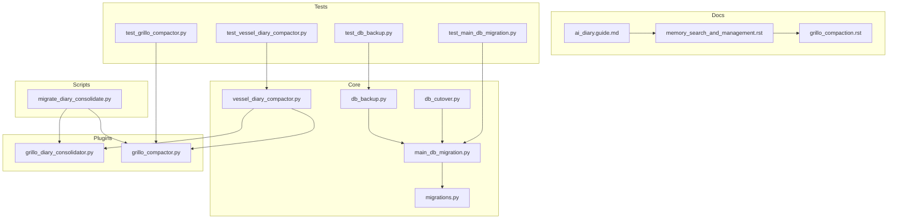
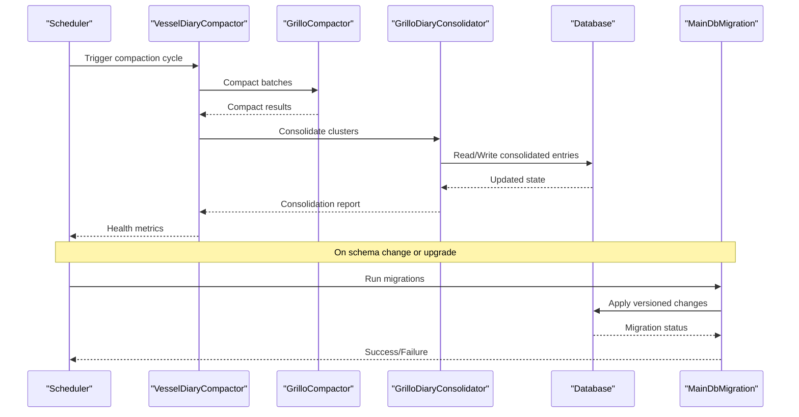
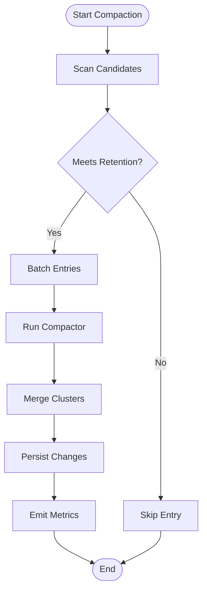
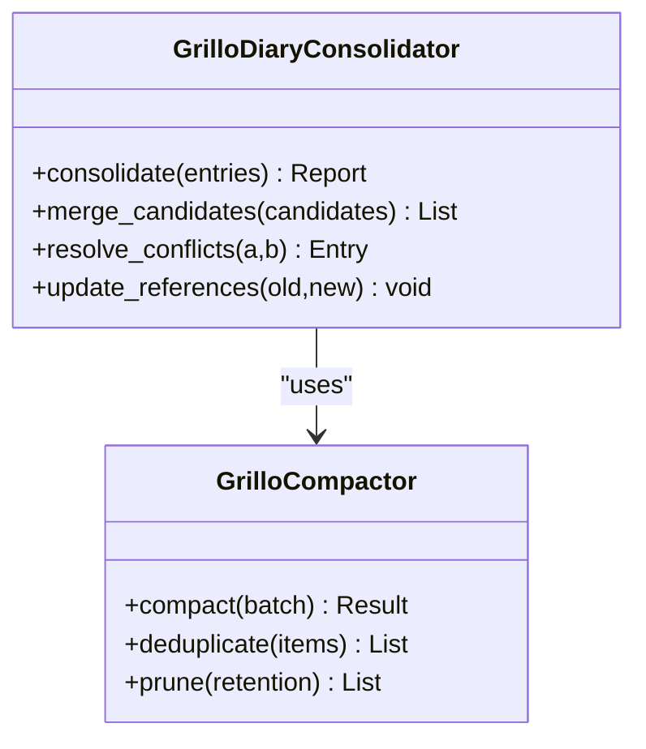
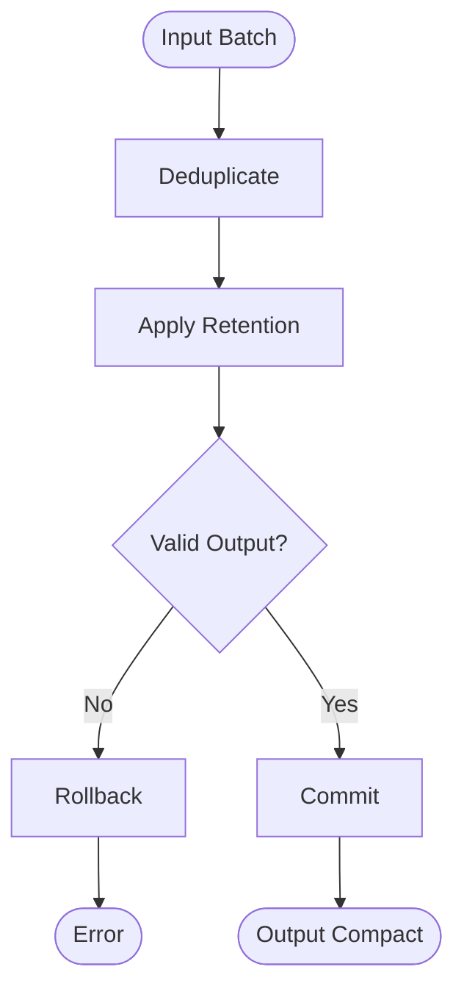
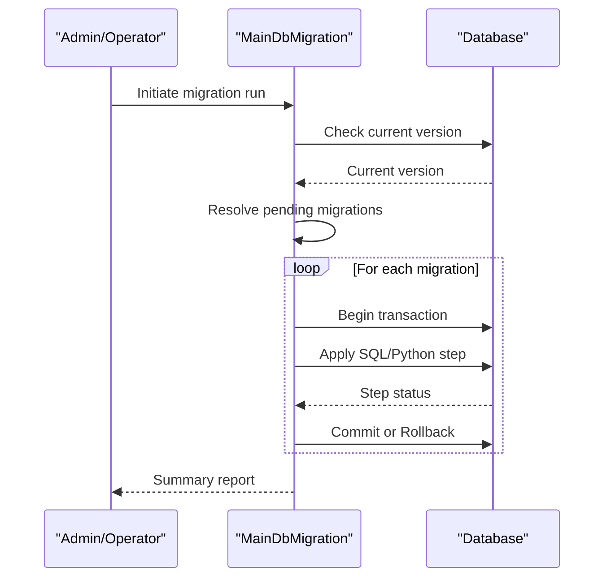
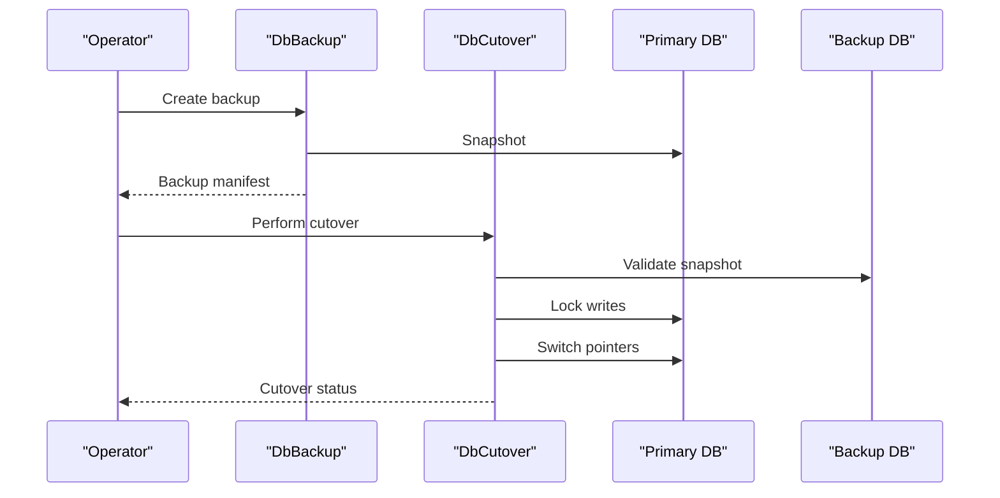
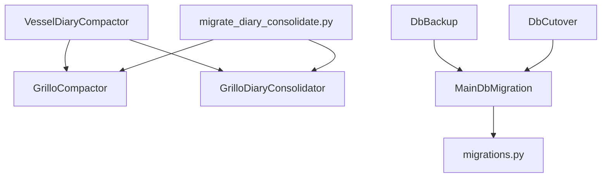

# Memory Maintenance & Migration

<cite>
**Referenced Files in This Document**
- [vessel_diary_compactor.py](file://core/vessel_diary_compactor.py)
- [grillo_diary_consolidator.py](file://plugins/grillo/grillo_diary_consolidator/grillo_diary_consolidator.py)
- [grillo_compactor.py](file://plugins/grillo/grillo_compactor/grillo_compactor.py)
- [migrate_diary_consolidate.py](file://scripts/migrate_diary_consolidate.py)
- [main_db_migration.py](file://core/main_db_migration.py)
- [migrations.py](file://core/migrations.py)
- [db_backup.py](file://core/db_backup.py)
- [db_cutover.py](file://core/db_cutover.py)
- [ai_diary.guide.md](file://plugins/ai_diary/ai_diary.guide.md)
- [memory_search_and_management.rst](file://docs/memory_search_and_management.rst)
- [grillo_compaction.rst](file://docs/grillo_compaction.rst)
- [test_vessel_diary_compactor.py](file://tests/test_vessel_diary_compactor.py)
- [test_grillo_compactor.py](file://tests/test_grillo_compactor.py)
- [test_main_db_migration.py](file://tests/test_main_db_migration.py)
- [test_db_backup.py](file://tests/test_db_backup.py)
</cite>

## Table of Contents
1. [Introduction](#introduction)
2. [Project Structure](#project-structure)
3. [Core Components](#core-components)
4. [Architecture Overview](#architecture-overview)
5. [Detailed Component Analysis](#detailed-component-analysis)
6. [Dependency Analysis](#dependency-analysis)
7. [Performance Considerations](#performance-considerations)
8. [Troubleshooting Guide](#troubleshooting-guide)
9. [Conclusion](#conclusion)
10. [Appendices](#appendices)

## Introduction
This document explains the memory maintenance and migration subsystems that keep the application’s memory (diary, history, and related stores) healthy, compacted, and consistent over time. It covers:
- Diary compaction and consolidation algorithms
- Automated cleanup procedures
- Database migration framework for schema evolution and data transformation
- Manual maintenance tasks, migration scripts, and backup/restore procedures
- The relationship between memory health monitoring, performance optimization, and data integrity
- Troubleshooting guides, recovery procedures, and data validation techniques
- Long-term storage optimization and archival strategies

The goal is to provide both a conceptual overview and concrete, code-mapped guidance for operators and developers.

## Project Structure
Memory maintenance spans several modules:
- Core compactor utilities and orchestrators
- Plugin-based consolidators and observers
- Migration and backup tooling
- Documentation and tests validating behavior

**Diagram sources**
- [vessel_diary_compactor.py](file://core/vessel_diary_compactor.py)
- [grillo_diary_consolidator.py](file://plugins/grillo/grillo_diary_consolidator/grillo_diary_consolidator.py)
- [grillo_compactor.py](file://plugins/grillo/grillo_compactor/grillo_compactor.py)
- [migrate_diary_consolidate.py](file://scripts/migrate_diary_consolidate.py)
- [main_db_migration.py](file://core/main_db_migration.py)
- [migrations.py](file://core/migrations.py)
- [db_backup.py](file://core/db_backup.py)
- [db_cutover.py](file://core/db_cutover.py)
- [ai_diary.guide.md](file://plugins/ai_diary/ai_diary.guide.md)
- [memory_search_and_management.rst](file://docs/memory_search_and_management.rst)
- [grillo_compaction.rst](file://docs/grillo_compaction.rst)
- [test_vessel_diary_compactor.py](file://tests/test_vessel_diary_compactor.py)
- [test_grillo_compactor.py](file://tests/test_grillo_compactor.py)
- [test_main_db_migration.py](file://tests/test_main_db_migration.py)
- [test_db_backup.py](file://tests/test_db_backup.py)

**Section sources**
- [vessel_diary_compactor.py](file://core/vessel_diary_compactor.py)
- [grillo_diary_consolidator.py](file://plugins/grillo/grillo_diary_consolidator/grillo_diary_consolidator.py)
- [grillo_compactor.py](file://plugins/grillo/grillo_compactor/grillo_compactor.py)
- [migrate_diary_consolidate.py](file://scripts/migrate_diary_consolidate.py)
- [main_db_migration.py](file://core/main_db_migration.py)
- [migrations.py](file://core/migrations.py)
- [db_backup.py](file://core/db_backup.py)
- [db_cutover.py](file://core/db_cutover.py)
- [ai_diary.guide.md](file://plugins/ai_diary/ai_diary.guide.md)
- [memory_search_and_management.rst](file://docs/memory_search_and_management.rst)
- [grillo_compaction.rst](file://docs/grillo_compaction.rst)
- [test_vessel_diary_compactor.py](file://tests/test_vessel_diary_compactor.py)
- [test_grillo_compactor.py](file://tests/test_grillo_compactor.py)
- [test_main_db_migration.py](file://tests/test_main_db_migration.py)
- [test_db_backup.py](file://tests/test_db_backup.py)

## Core Components
- Vessel Diary Compactor: Orchestrates periodic compaction of diary entries, applying clustering, deduplication, and retention policies.
- Grillo Diary Consolidator: Performs higher-level consolidation across sessions, merging related memories and updating references.
- Grillo Compactor: Low-level compaction engine used by consolidators and scheduled jobs to reduce memory footprint while preserving semantics.
- Main DB Migration Framework: Centralized migration runner with versioning, rollback support, and transactional safety.
- Migration Scripts: Standalone tools for one-off transformations such as diary consolidation migrations.
- Backup and Cutover Utilities: Atomic backups, integrity checks, and safe cutover between database instances.

Key responsibilities:
- Maintain memory health via compaction and consolidation
- Ensure data integrity through migrations and backups
- Provide operational hooks for manual and automated maintenance

**Section sources**
- [vessel_diary_compactor.py](file://core/vessel_diary_compactor.py)
- [grillo_diary_consolidator.py](file://plugins/grillo/grillo_diary_consolidator/grillo_diary_consolidator.py)
- [grillo_compactor.py](file://plugins/grillo/grillo_compactor/grillo_compactor.py)
- [main_db_migration.py](file://core/main_db_migration.py)
- [migrate_diary_consolidate.py](file://scripts/migrate_diary_consolidate.py)
- [db_backup.py](file://core/db_backup.py)
- [db_cutover.py](file://core/db_cutover.py)

## Architecture Overview
The memory maintenance pipeline integrates compaction, consolidation, and migration into a cohesive system.

**Diagram sources**
- [vessel_diary_compactor.py](file://core/vessel_diary_compactor.py)
- [grillo_compactor.py](file://plugins/grillo/grillo_compactor/grillo_compactor.py)
- [grillo_diary_consolidator.py](file://plugins/grillo/grillo_diary_consolidator/grillo_diary_consolidator.py)
- [main_db_migration.py](file://core/main_db_migration.py)

## Detailed Component Analysis

### Vessel Diary Compactor
Responsibilities:
- Schedules and executes compaction cycles
- Applies retention windows and pruning rules
- Coordinates with consolidators for semantic merges
- Emits health metrics and logs

Operational flow:
- Identify candidate entries based on age, size, and tags
- Batch compaction using the low-level compactor
- Merge overlapping or redundant entries
- Persist compacted state and update indices

**Diagram sources**
- [vessel_diary_compactor.py](file://core/vessel_diary_compactor.py)

**Section sources**
- [vessel_diary_compactor.py](file://core/vessel_diary_compactor.py)
- [test_vessel_diary_compactor.py](file://tests/test_vessel_diary_compactor.py)

### Grillo Diary Consolidator
Responsibilities:
- Higher-level consolidation across sessions and topics
- Semantic merging and reference updates
- Conflict resolution and audit logging

Algorithm highlights:
- Group related entries by topic/time/context
- Compute similarity and merge candidates
- Apply merge policy (retain most complete, preserve timestamps)
- Update foreign references and indexes

**Diagram sources**
- [grillo_diary_consolidator.py](file://plugins/grillo/grillo_diary_consolidator/grillo_diary_consolidator.py)
- [grillo_compactor.py](file://plugins/grillo/grillo_compactor/grillo_compactor.py)

**Section sources**
- [grillo_diary_consolidator.py](file://plugins/grillo/grillo_diary_consolidator/grillo_diary_consolidator.py)
- [grillo_compactor.py](file://plugins/grillo/grillo_compactor/grillo_compactor.py)
- [test_grillo_compactor.py](file://tests/test_grillo_compactor.py)

### Grillo Compactor
Responsibilities:
- Low-level compaction operations: batching, deduplication, pruning
- Configurable retention and thresholds
- Transactional writes and rollback on failure

Processing logic:
- Accept a batch of entries
- Apply deduplication heuristics
- Prune based on retention policy
- Persist compacted result atomically

**Diagram sources**
- [grillo_compactor.py](file://plugins/grillo/grillo_compactor/grillo_compactor.py)

**Section sources**
- [grillo_compactor.py](file://plugins/grillo/grillo_compactor/grillo_compactor.py)
- [test_grillo_compactor.py](file://tests/test_grillo_compactor.py)

### Main DB Migration Framework
Responsibilities:
- Versioned schema evolution
- Transactional execution with rollback
- Idempotent migration steps
- Pre/post hooks for data transformation

Lifecycle:
- Discover pending migrations
- Validate dependencies
- Execute within transactions
- Record applied versions and metadata

**Diagram sources**
- [main_db_migration.py](file://core/main_db_migration.py)

**Section sources**
- [main_db_migration.py](file://core/main_db_migration.py)
- [migrations.py](file://core/migrations.py)
- [test_main_db_migration.py](file://tests/test_main_db_migration.py)

### Migration Scripts
Purpose:
- One-off transformations for legacy data
- Diary consolidation migration utility
- Safe, auditable, and reversible where possible

Usage patterns:
- Dry-run mode to preview changes
- Incremental execution with checkpoints
- Logging and error reporting

**Section sources**
- [migrate_diary_consolidate.py](file://scripts/migrate_diary_consolidate.py)

### Backup and Cutover Utilities
Backup:
- Create consistent snapshots
- Verify integrity post-backup
- Support incremental and full modes

Cutover:
- Atomic switch between database instances
- Validation before and after cutover
- Rollback capability

**Diagram sources**
- [db_backup.py](file://core/db_backup.py)
- [db_cutover.py](file://core/db_cutover.py)

**Section sources**
- [db_backup.py](file://core/db_backup.py)
- [db_cutover.py](file://core/db_cutover.py)
- [test_db_backup.py](file://tests/test_db_backup.py)

## Dependency Analysis
Interactions among components:
- Vessel Diary Compactor depends on Grillo Compactor and Grillo Consolidator
- Migration framework coordinates with database backends
- Backup/cutover utilities depend on migration state for consistency
- Tests validate core behaviors and edge cases

**Diagram sources**
- [vessel_diary_compactor.py](file://core/vessel_diary_compactor.py)
- [grillo_compactor.py](file://plugins/grillo/grillo_compactor/grillo_compactor.py)
- [grillo_diary_consolidator.py](file://plugins/grillo/grillo_diary_consolidator/grillo_diary_consolidator.py)
- [migrate_diary_consolidate.py](file://scripts/migrate_diary_consolidate.py)
- [main_db_migration.py](file://core/main_db_migration.py)
- [migrations.py](file://core/migrations.py)
- [db_backup.py](file://core/db_backup.py)
- [db_cutover.py](file://core/db_cutover.py)

**Section sources**
- [vessel_diary_compactor.py](file://core/vessel_diary_compactor.py)
- [grillo_compactor.py](file://plugins/grillo/grillo_compactor/grillo_compactor.py)
- [grillo_diary_consolidator.py](file://plugins/grillo/grillo_diary_consolidator/grillo_diary_consolidator.py)
- [migrate_diary_consolidate.py](file://scripts/migrate_diary_consolidate.py)
- [main_db_migration.py](file://core/main_db_migration.py)
- [migrations.py](file://core/migrations.py)
- [db_backup.py](file://core/db_backup.py)
- [db_cutover.py](file://core/db_cutover.py)

## Performance Considerations
- Batch sizes: Tune compaction batch sizes to balance throughput and memory usage
- Retention policies: Adjust retention windows to control growth rate
- Indexing: Ensure indexes are maintained after compaction and consolidation
- Transactions: Keep migration steps small and atomic to minimize lock times
- Monitoring: Track compaction duration, consolidation success rates, and memory footprint

[No sources needed since this section provides general guidance]

## Troubleshooting Guide
Common issues and resolutions:
- Compaction stalls: Check batch sizes and retention thresholds; verify database locks
- Consolidation failures: Review conflict resolution logs; ensure referential integrity
- Migration errors: Inspect migration version state; roll back if necessary; validate schema
- Backup inconsistencies: Re-run integrity checks; compare manifests; restore from last known good
- Data drift: Use validation queries to detect anomalies; re-run targeted migrations

Recovery procedures:
- Restore from backup using cutover utilities
- Re-run failed migrations with dry-run first
- Validate data integrity post-recovery

Data validation techniques:
- Compare entry counts before/after compaction
- Spot-check merged entries for completeness
- Verify foreign key relationships and indices

**Section sources**
- [test_vessel_diary_compactor.py](file://tests/test_vessel_diary_compactor.py)
- [test_grillo_compactor.py](file://tests/test_grillo_compactor.py)
- [test_main_db_migration.py](file://tests/test_main_db_migration.py)
- [test_db_backup.py](file://tests/test_db_backup.py)

## Conclusion
The memory maintenance and migration subsystem ensures long-term health, performance, and integrity of the application’s memory stores. By combining compaction, consolidation, robust migrations, and reliable backup/cutover processes, operators can maintain optimal memory usage and data quality. Following the guidelines here will help prevent common pitfalls and streamline maintenance workflows.

[No sources needed since this section summarizes without analyzing specific files]

## Appendices

### Manual Maintenance Tasks
- Run compaction manually when growth exceeds thresholds
- Execute consolidation after major data imports
- Validate migration outcomes with spot checks

### Migration Scripts Examples
- Use the diary consolidation script for legacy data
- Preview changes with dry-run before applying
- Log all actions for auditability

### Backup/Restore Procedures
- Create full backups before schema changes
- Verify backup integrity immediately
- Use cutover utilities for zero-downtime switches

### Long-Term Storage Optimization
- Archive old entries to cold storage
- Compress archived data
- Maintain search indices for recent data only

### Relationship Between Health Monitoring, Performance, and Integrity
- Health metrics drive compaction schedules
- Performance tuning reduces latency during maintenance
- Integrity checks ensure correctness after transformations

**Section sources**
- [ai_diary.guide.md](file://plugins/ai_diary/ai_diary.guide.md)
- [memory_search_and_management.rst](file://docs/memory_search_and_management.rst)
- [grillo_compaction.rst](file://docs/grillo_compaction.rst)