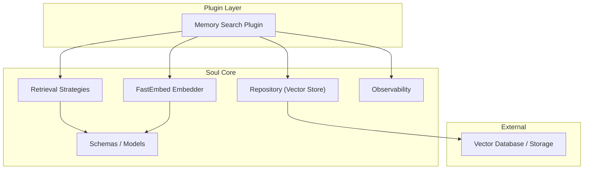
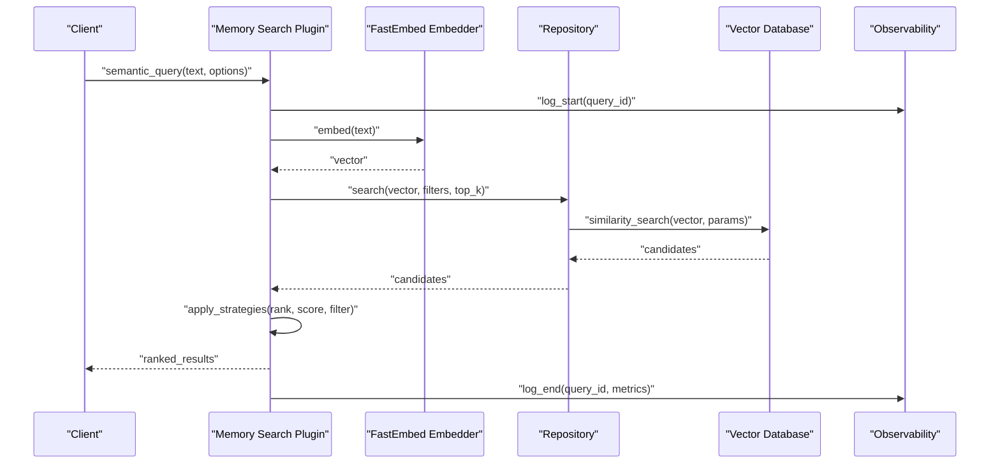
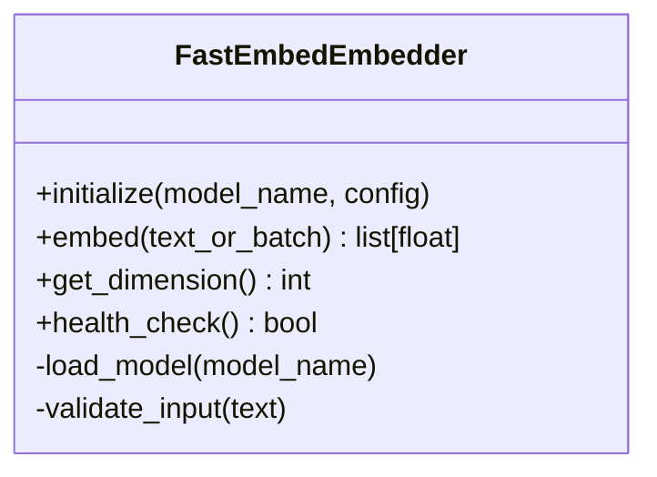
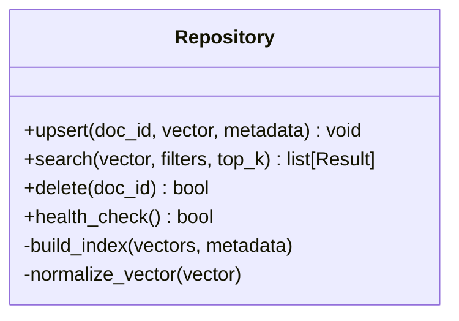
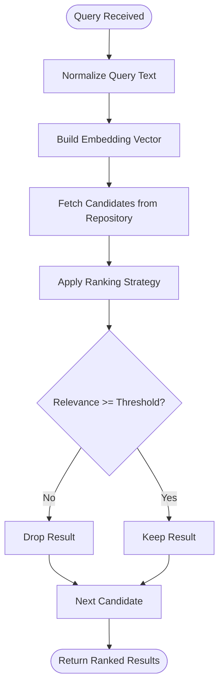
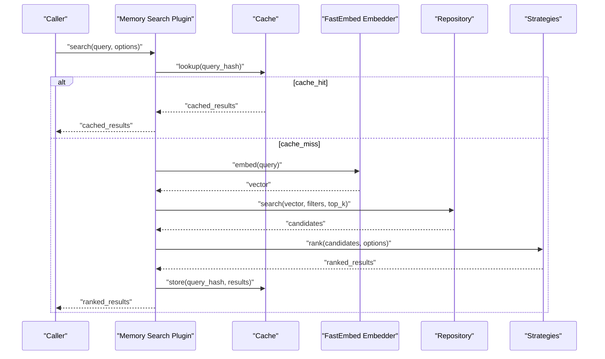
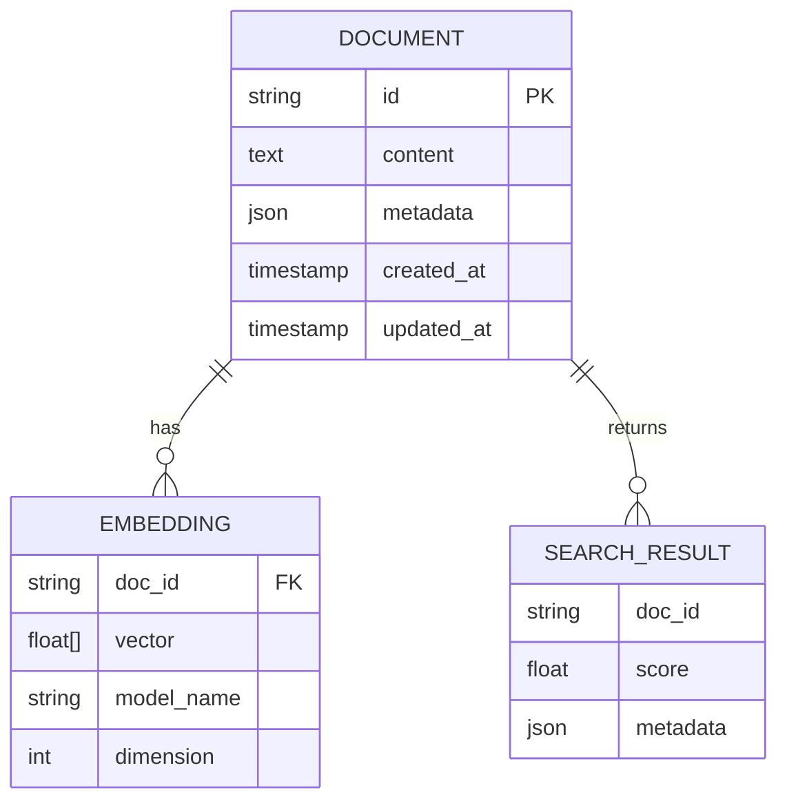
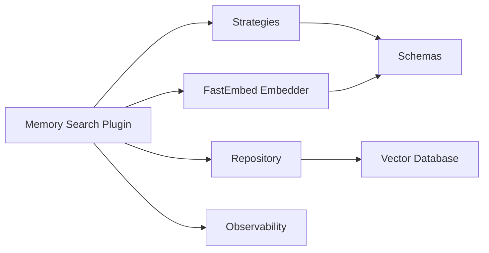

# Semantic Search & Retrieval

<cite>
**Referenced Files in This Document**
- [memory_search.py](file://plugins/memory_search/memory_search.py)
- [memory_search.guide.md](file://plugins/memory_search/memory_search.guide.md)
- [fastembed_embedder.py](file://core/soul/fastembed_embedder.py)
- [strategies.py](file://core/soul/strategies.py)
- [repository.py](file://core/soul/repository.py)
- [schemas.py](file://core/soul/schemas.py)
- [models.py](file://core/soul/models.py)
- [observability.py](file://core/soul/observability.py)
- [test_memory_search.py](file://tests/plugins/test_memory_search.py)
- [test_memory_search_execute_action.py](file://tests/plugins/test_memory_search_execute_action.py)
- [test_memory_search_live.py](file://tests/plugins/test_memory_search_live.py)
- [test_memory_search_prompt.py](file://tests/plugins/test_memory_search_prompt.py)
- [ai_diary_personal_memory.rst](file://docs/ai_diary_personal_memory.rst)
- [memory_search.rst](file://docs/memory_search.rst)
- [memory_search_and_management.rst](file://docs/memory_search_and_management.rst)
</cite>

## Table of Contents
1. [Introduction](#introduction)
2. [Project Structure](#project-structure)
3. [Core Components](#core-components)
4. [Architecture Overview](#architecture-overview)
5. [Detailed Component Analysis](#detailed-component-analysis)
6. [Dependency Analysis](#dependency-analysis)
7. [Performance Considerations](#performance-considerations)
8. [Troubleshooting Guide](#troubleshooting-guide)
9. [Conclusion](#conclusion)
10. [Appendices](#appendices)

## Introduction
This document explains the Semantic Search and Retrieval system, focusing on embedding model integration via FastEmbed, vector similarity search implementation, retrieval strategies, and the memory search plugin. It covers query processing, result ranking, relevance scoring, configuration options (algorithms, thresholds, caching), scalability considerations, and optimization techniques. The goal is to make the system understandable for both technical and non-technical readers while providing concrete examples and diagrams grounded in the codebase.

## Project Structure
The semantic search functionality spans a few key areas:
- Embedding generation using FastEmbed
- Vector storage and retrieval through a repository abstraction
- Retrieval strategies that define how queries are processed and ranked
- A memory search plugin that exposes these capabilities to the broader system
- Tests and documentation that validate behavior and usage patterns

**Diagram sources**
- [memory_search.py](file://plugins/memory_search/memory_search.py)
- [fastembed_embedder.py](file://core/soul/fastembed_embedder.py)
- [strategies.py](file://core/soul/strategies.py)
- [repository.py](file://core/soul/repository.py)
- [schemas.py](file://core/soul/schemas.py)
- [models.py](file://core/soul/models.py)
- [observability.py](file://core/soul/observability.py)

**Section sources**
- [memory_search.guide.md](file://plugins/memory_search/memory_search.guide.md)
- [memory_search.rst](file://docs/memory_search.rst)
- [memory_search_and_management.rst](file://docs/memory_search_and_management.rst)

## Core Components
- FastEmbed Embedder: Converts natural language into dense vectors suitable for similarity search.
- Repository: Abstracts vector database operations such as upserting embeddings and performing similarity searches.
- Strategies: Define retrieval logic including query preprocessing, ranking, and filtering.
- Memory Search Plugin: Orchestrates embedding, retrieval, and ranking to provide semantic search capabilities to other components.
- Schemas and Models: Define data structures used across embedding, storage, and retrieval.
- Observability: Provides metrics and logging for search performance and quality.

Key responsibilities:
- Embedding model selection and initialization
- Query normalization and transformation
- Vector similarity computation and ranking
- Caching and performance tuning
- Error handling and observability

**Section sources**
- [fastembed_embedder.py](file://core/soul/fastembed_embedder.py)
- [repository.py](file://core/soul/repository.py)
- [strategies.py](file://core/soul/strategies.py)
- [memory_search.py](file://plugins/memory_search/memory_search.py)
- [schemas.py](file://core/soul/schemas.py)
- [models.py](file://core/soul/models.py)
- [observability.py](file://core/soul/observability.py)

## Architecture Overview
The semantic search pipeline integrates embedding generation with vector similarity search and strategic ranking. The memory search plugin acts as the entry point for consumers, coordinating embedding creation, querying the repository, applying strategies, and returning ranked results.

**Diagram sources**
- [memory_search.py](file://plugins/memory_search/memory_search.py)
- [fastembed_embedder.py](file://core/soul/fastembed_embedder.py)
- [repository.py](file://core/soul/repository.py)
- [strategies.py](file://core/soul/strategies.py)
- [observability.py](file://core/soul/observability.py)

## Detailed Component Analysis

### FastEmbed Embedder Integration
Responsibilities:
- Initialize and manage embedding models
- Convert text inputs into fixed-dimensional vectors
- Handle model loading, caching, and fallbacks
- Expose consistent embedding interfaces for downstream components

Design highlights:
- Model selection based on configuration or environment
- Batch embedding support where applicable
- Error handling for model initialization failures
- Metrics collection for latency and throughput

**Diagram sources**
- [fastembed_embedder.py](file://core/soul/fastembed_embedder.py)

**Section sources**
- [fastembed_embedder.py](file://core/soul/fastembed_embedder.py)

### Repository Abstraction (Vector Store)
Responsibilities:
- Upsert embeddings with metadata
- Perform similarity searches with configurable parameters
- Manage indexes and partitions for scalability
- Provide transaction-like operations for consistency

Design highlights:
- Pluggable backends for different vector databases
- Configurable distance metrics (e.g., cosine, dot product)
- Filtering by metadata fields
- Pagination and limit controls

**Diagram sources**
- [repository.py](file://core/soul/repository.py)

**Section sources**
- [repository.py](file://core/soul/repository.py)

### Retrieval Strategies
Responsibilities:
- Preprocess queries (tokenization, normalization)
- Apply ranking algorithms (score fusion, recency bias)
- Enforce relevance thresholds and filters
- Support custom strategies for domain-specific needs

Design highlights:
- Strategy composition and chaining
- Configurable thresholds and weights
- Extensibility points for new ranking logic
- Observability hooks for strategy performance

**Diagram sources**
- [strategies.py](file://core/soul/strategies.py)

**Section sources**
- [strategies.py](file://core/soul/strategies.py)

### Memory Search Plugin
Responsibilities:
- Expose semantic search API to other plugins and services
- Coordinate embedding, retrieval, and ranking
- Manage caching and performance tuning
- Provide configuration for algorithms and thresholds

Design highlights:
- Clear separation between orchestration and core logic
- Robust error handling and fallbacks
- Observability and telemetry integration
- Test coverage for common scenarios

**Diagram sources**
- [memory_search.py](file://plugins/memory_search/memory_search.py)
- [fastembed_embedder.py](file://core/soul/fastembed_embedder.py)
- [repository.py](file://core/soul/repository.py)
- [strategies.py](file://core/soul/strategies.py)

**Section sources**
- [memory_search.py](file://plugins/memory_search/memory_search.py)
- [memory_search.guide.md](file://plugins/memory_search/memory_search.guide.md)

### Data Models and Schemas
Responsibilities:
- Define structured representations for documents, embeddings, and search results
- Ensure type safety and validation across components
- Support metadata enrichment and filtering

Design highlights:
- Clear schema definitions for embeddings and results
- Validation rules for input and output formats
- Compatibility with multiple vector backends

**Diagram sources**
- [schemas.py](file://core/soul/schemas.py)
- [models.py](file://core/soul/models.py)

**Section sources**
- [schemas.py](file://core/soul/schemas.py)
- [models.py](file://core/soul/models.py)

### Observability and Telemetry
Responsibilities:
- Log search events, errors, and performance metrics
- Track embedding latency and throughput
- Monitor repository operations and cache hits/misses
- Provide insights for tuning and debugging

Design highlights:
- Structured logging with contextual information
- Metrics collection for key performance indicators
- Health checks for embedding models and repositories
- Integration with external monitoring systems

**Section sources**
- [observability.py](file://core/soul/observability.py)

## Dependency Analysis
The semantic search system exhibits clear layering and separation of concerns:
- The plugin layer depends on core soul components
- Core components depend on schemas and models
- Repository abstracts external vector database dependencies
- Observability provides cross-cutting concerns

**Diagram sources**
- [memory_search.py](file://plugins/memory_search/memory_search.py)
- [fastembed_embedder.py](file://core/soul/fastembed_embedder.py)
- [repository.py](file://core/soul/repository.py)
- [strategies.py](file://core/soul/strategies.py)
- [schemas.py](file://core/soul/schemas.py)
- [observability.py](file://core/soul/observability.py)

**Section sources**
- [memory_search.py](file://plugins/memory_search/memory_search.py)
- [fastembed_embedder.py](file://core/soul/fastembed_embedder.py)
- [repository.py](file://core/soul/repository.py)
- [strategies.py](file://core/soul/strategies.py)
- [schemas.py](file://core/soul/schemas.py)
- [observability.py](file://core/soul/observability.py)

## Performance Considerations
- Embedding Optimization:
  - Use batch embedding when possible to reduce overhead
  - Cache frequently used embeddings for repeated queries
  - Select appropriate model size based on accuracy vs. latency trade-offs
- Vector Search Tuning:
  - Configure top_k to balance precision and recall
  - Use metadata filters to narrow search space
  - Adjust similarity thresholds to control result quality
- Caching Strategies:
  - Implement query-level caching with TTL
  - Cache embedding results for identical inputs
  - Use distributed cache for multi-instance deployments
- Scalability:
  - Partition vector indexes by tenant or domain
  - Use read replicas for high-concurrency scenarios
  - Monitor and auto-scale based on latency and throughput metrics

[No sources needed since this section provides general guidance]

## Troubleshooting Guide
Common issues and resolutions:
- Embedding Model Failures:
  - Verify model availability and network connectivity
  - Check model version compatibility
  - Implement fallback models for resilience
- Vector Search Errors:
  - Validate vector dimensions match model expectations
  - Check index health and completeness
  - Review metadata filter syntax and values
- Performance Degradation:
  - Monitor cache hit rates and adjust TTL
  - Analyze query patterns for optimization opportunities
  - Scale vector database resources as needed
- Observability Insights:
  - Review logs for error patterns and exceptions
  - Track latency percentiles and throughput metrics
  - Investigate cache miss spikes and embedding bottlenecks

**Section sources**
- [observability.py](file://core/soul/observability.py)
- [test_memory_search.py](file://tests/plugins/test_memory_search.py)
- [test_memory_search_execute_action.py](file://tests/plugins/test_memory_search_execute_action.py)
- [test_memory_search_live.py](file://tests/plugins/test_memory_search_live.py)
- [test_memory_search_prompt.py](file://tests/plugins/test_memory_search_prompt.py)

## Conclusion
The Semantic Search and Retrieval system provides a robust foundation for natural language understanding through embedding-based similarity search. By integrating FastEmbed for vector generation, implementing flexible retrieval strategies, and exposing functionality through a well-designed plugin interface, the system supports scalable and efficient semantic search capabilities. Proper configuration of algorithms, thresholds, and caching mechanisms enables optimal performance across diverse use cases.

[No sources needed since this section summarizes without analyzing specific files]

## Appendices

### Configuration Options
- Search Algorithms:
  - Similarity metric selection (cosine, dot product, euclidean)
  - Ranking strategy configuration (recency weighting, importance scoring)
  - Custom strategy registration and composition
- Similarity Thresholds:
  - Minimum relevance scores for result inclusion
  - Dynamic threshold adjustment based on query complexity
  - Domain-specific threshold calibration
- Caching Mechanisms:
  - Query hash-based caching with configurable TTL
  - Embedding cache for repeated inputs
  - Distributed cache coordination for multi-instance setups

**Section sources**
- [memory_search.guide.md](file://plugins/memory_search/memory_search.guide.md)
- [memory_search.rst](file://docs/memory_search.rst)
- [memory_search_and_management.rst](file://docs/memory_search_and_management.rst)

### Concrete Examples
- Semantic Queries:
  - Natural language questions about stored documents
  - Context-aware searches with metadata filters
  - Multi-modal queries combining text and structured data
- Custom Search Strategies:
  - Domain-specific ranking based on entity importance
  - Temporal relevance scoring for time-sensitive content
  - Cross-reference boosting for related concepts
- Performance Tuning:
  - Batch embedding for large document collections
  - Index partitioning by content type or user segment
  - Cache warming strategies for popular queries

**Section sources**
- [test_memory_search.py](file://tests/plugins/test_memory_search.py)
- [test_memory_search_execute_action.py](file://tests/plugins/test_memory_search_execute_action.py)
- [test_memory_search_live.py](file://tests/plugins/test_memory_search_live.py)
- [test_memory_search_prompt.py](file://tests/plugins/test_memory_search_prompt.py)

### Relationship Between Embeddings, Vector Databases, and NLU
- Embeddings transform natural language into numerical representations that capture semantic meaning
- Vector databases store and index these embeddings for efficient similarity search
- Natural Language Understanding leverages the semantic relationships encoded in embeddings to retrieve relevant information
- The combination enables context-aware search that goes beyond keyword matching to understand intent and meaning

[No sources needed since this section provides conceptual explanation]