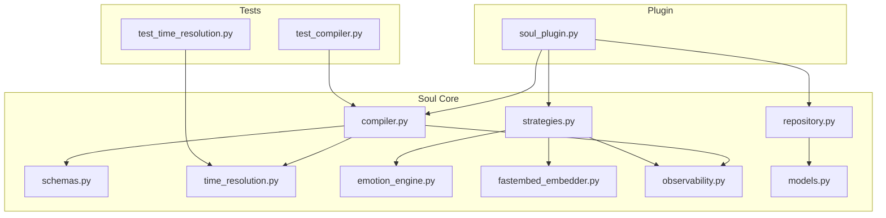
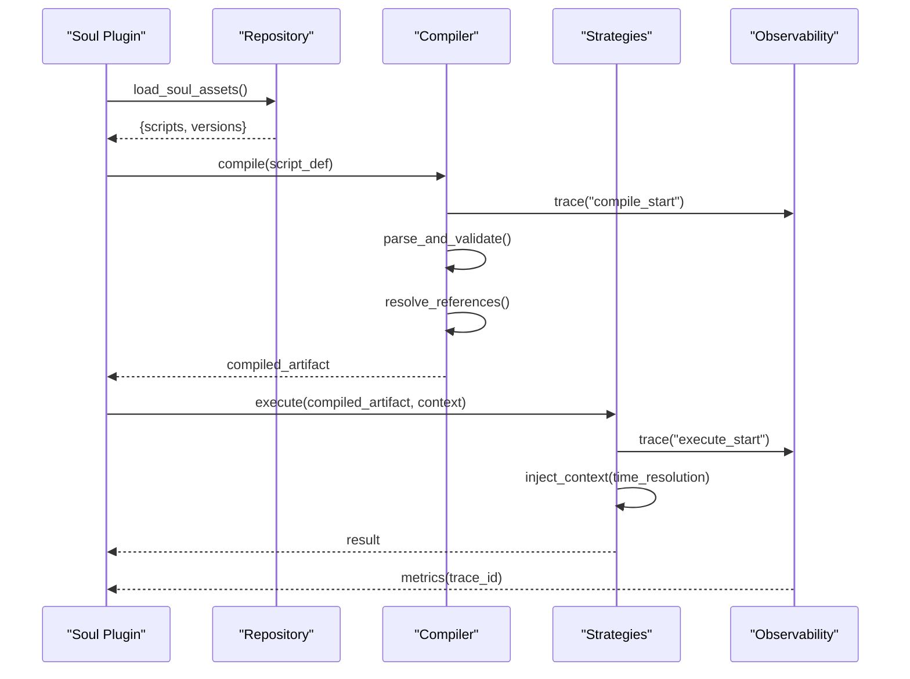
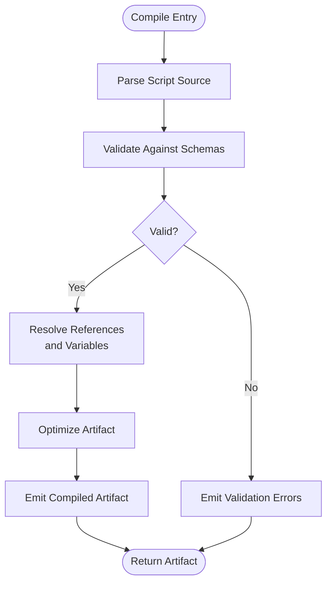
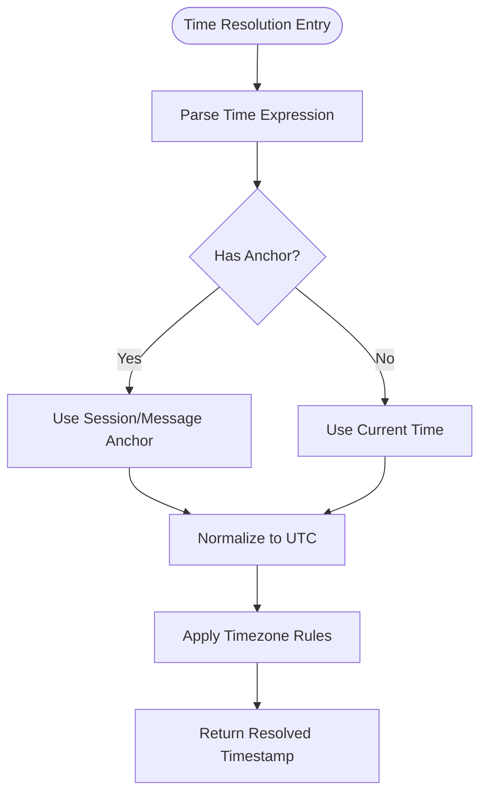
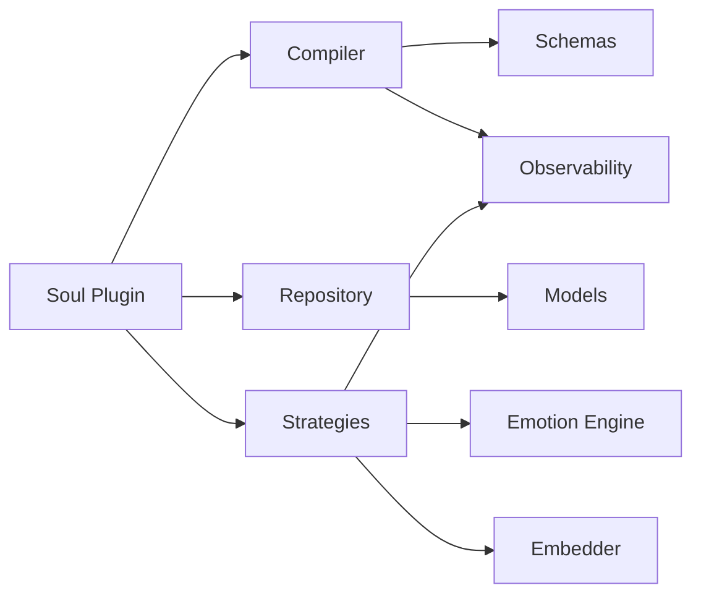

# Soul Compiler & Scripts

<cite>
**Referenced Files in This Document**
- [compiler.py](file://core/soul/compiler.py)
- [schemas.py](file://core/soul/schemas.py)
- [time_resolution.py](file://core/soul/time_resolution.py)
- [repository.py](file://core/soul/repository.py)
- [strategies.py](file://core/soul/strategies.py)
- [emotion_engine.py](file://core/soul/emotion_engine.py)
- [fastembed_embedder.py](file://core/soul/fastembed_embedder.py)
- [observability.py](file://core/soul/observability.py)
- [models.py](file://core/soul/models.py)
- [soul_plugin.py](file://plugins/soul_plugin/soul_plugin.py)
- [test_compiler.py](file://tests/soul/test_compiler.py)
- [test_time_resolution.py](file://tests/soul/test_time_resolution.py)
</cite>

## Table of Contents
1. [Introduction](#introduction)
2. [Project Structure](#project-structure)
3. [Core Components](#core-components)
4. [Architecture Overview](#architecture-overview)
5. [Detailed Component Analysis](#detailed-component-analysis)
6. [Dependency Analysis](#dependency-analysis)
7. [Performance Considerations](#performance-considerations)
8. [Troubleshooting Guide](#troubleshooting-guide)
9. [Conclusion](#conclusion)
10. [Appendices](#appendices)

## Introduction
This document explains the Soul Compiler and Scripting system: how soul scripts are defined, parsed, compiled, and executed; how time is resolved at runtime; what context is injected into scripts; and how compiled artifacts relate to personality definitions and behavioral rules. It also covers scripting language features, debugging and profiling capabilities, security and sandboxing considerations, and version compatibility.

## Project Structure
The Soul subsystem lives under core/soul and integrates with the broader system via a plugin. Key files include:
- compiler.py: parsing and compilation pipeline for soul scripts
- schemas.py: data models and validation for script definitions
- time_resolution.py: contextual time resolution utilities
- repository.py: persistence and retrieval of soul assets
- strategies.py: execution strategies and policy hooks
- emotion_engine.py: emotion-driven behavior integration
- fastembed_embedder.py: embedding support for semantic operations
- observability.py: metrics and tracing for compilation and execution
- models.py: shared domain models used across components
- soul_plugin.py: plugin entrypoint that wires Soul into the runtime

**Diagram sources**
- [compiler.py](file://core/soul/compiler.py)
- [schemas.py](file://core/soul/schemas.py)
- [time_resolution.py](file://core/soul/time_resolution.py)
- [repository.py](file://core/soul/repository.py)
- [strategies.py](file://core/soul/strategies.py)
- [emotion_engine.py](file://core/soul/emotion_engine.py)
- [fastembed_embedder.py](file://core/soul/fastembed_embedder.py)
- [observability.py](file://core/soul/observability.py)
- [models.py](file://core/soul/models.py)
- [soul_plugin.py](file://plugins/soul_plugin/soul_plugin.py)
- [test_compiler.py](file://tests/soul/test_compiler.py)
- [test_time_resolution.py](file://tests/soul/test_time_resolution.py)

**Section sources**
- [compiler.py](file://core/soul/compiler.py)
- [schemas.py](file://core/soul/schemas.py)
- [time_resolution.py](file://core/soul/time_resolution.py)
- [repository.py](file://core/soul/repository.py)
- [strategies.py](file://core/soul/strategies.py)
- [emotion_engine.py](file://core/soul/emotion_engine.py)
- [fastembed_embedder.py](file://core/soul/fastembed_embedder.py)
- [observability.py](file://core/soul/observability.py)
- [models.py](file://core/soul/models.py)
- [soul_plugin.py](file://plugins/soul_plugin/soul_plugin.py)
- [test_compiler.py](file://tests/soul/test_compiler.py)
- [test_time_resolution.py](file://tests/soul/test_time_resolution.py)

## Core Components
- Soul Compiler: transforms textual or structured soul scripts into executable representations, validates against schemas, and produces optimized artifacts for runtime.
- Schema Layer: defines the canonical structure for soul scripts, including variables, functions, triggers, and behaviors.
- Time Resolution: resolves relative and absolute timestamps within script contexts (e.g., “next Friday”, “in 10 minutes”).
- Repository: loads, caches, and persists soul assets, handling versioning and migration paths.
- Strategies: encapsulate execution policies, including evaluation order, fallbacks, and safety checks.
- Emotion Engine Integration: allows scripts to influence or respond to emotional state transitions.
- Embedder: provides semantic search and matching for script content when needed by strategies.
- Observability: instruments compilation and execution with metrics and traces.

**Section sources**
- [compiler.py](file://core/soul/compiler.py)
- [schemas.py](file://core/soul/schemas.py)
- [time_resolution.py](file://core/soul/time_resolution.py)
- [repository.py](file://core/soul/repository.py)
- [strategies.py](file://core/soul/strategies.py)
- [emotion_engine.py](file://core/soul/emotion_engine.py)
- [fastembed_embedder.py](file://core/soul/fastembed_embedder.py)
- [observability.py](file://core/soul/observability.py)

## Architecture Overview
At runtime, the Soul plugin initializes the compiler and repository, registers strategies, and exposes APIs for loading and executing soul scripts. Compilation pipelines validate inputs, parse syntax, resolve references, and emit optimized bytecode-like structures. Execution strategies apply policies, inject context (including time), and interact with emotion and embedding services as needed.

**Diagram sources**
- [soul_plugin.py](file://plugins/soul_plugin/soul_plugin.py)
- [repository.py](file://core/soul/repository.py)
- [compiler.py](file://core/soul/compiler.py)
- [strategies.py](file://core/soul/strategies.py)
- [observability.py](file://core/soul/observability.py)

## Detailed Component Analysis

### Soul Compiler Pipeline
The compiler orchestrates parsing, validation, reference resolution, and artifact generation. It enforces schema constraints, normalizes syntax, and prepares execution-ready structures.

**Diagram sources**
- [compiler.py](file://core/soul/compiler.py)
- [schemas.py](file://core/soul/schemas.py)

**Section sources**
- [compiler.py](file://core/soul/compiler.py)
- [schemas.py](file://core/soul/schemas.py)

### Script Schemas and Data Models
Schemas define the canonical structure for soul scripts, including:
- Variable declarations and scopes
- Function definitions and signatures
- Trigger conditions and actions
- Behavioral rules and priorities
- Version metadata and compatibility flags

Models provide shared types used across compilation and execution phases.

**Section sources**
- [schemas.py](file://core/soul/schemas.py)
- [models.py](file://core/soul/models.py)

### Time Resolution Mechanisms
Time resolution converts natural language or relative expressions into concrete timestamps within the current session context. It supports:
- Relative offsets (“in 5 minutes”)
- Calendar-based targets (“next Monday”)
- Timezone-aware conversions
- Contextual anchors (session start, message timestamp)

**Diagram sources**
- [time_resolution.py](file://core/soul/time_resolution.py)

**Section sources**
- [time_resolution.py](file://core/soul/time_resolution.py)
- [test_time_resolution.py](file://tests/soul/test_time_resolution.py)

### Context Injection and Runtime Variables
During execution, the strategies layer injects runtime context into scripts:
- System variables (user identity, session metadata)
- Emotional state signals
- Tool availability and capabilities
- Environment configuration flags

Context injection ensures scripts can adapt behavior based on live conditions without hardcoding values.

**Section sources**
- [strategies.py](file://core/soul/strategies.py)
- [emotion_engine.py](file://core/soul/emotion_engine.py)

### Emotion Engine Integration
Scripts can read and influence emotional states through the emotion engine. This enables dynamic responses aligned with persona traits and user interactions.

**Section sources**
- [emotion_engine.py](file://core/soul/emotion_engine.py)
- [strategies.py](file://core/soul/strategies.py)

### Embedding Support
The embedder component provides semantic indexing and similarity matching for script content, enabling advanced search and rule selection strategies.

**Section sources**
- [fastembed_embedder.py](file://core/soul/fastembed_embedder.py)
- [strategies.py](file://core/soul/strategies.py)

### Observability and Tracing
Compilation and execution are instrumented with observability hooks:
- Trace IDs for request correlation
- Metrics for latency and error rates
- Structured logs for diagnostics

**Section sources**
- [observability.py](file://core/soul/observability.py)
- [compiler.py](file://core/soul/compiler.py)
- [strategies.py](file://core/soul/strategies.py)

### Repository and Persistence
The repository manages loading, caching, and persisting soul assets. It handles versioning, migrations, and asset discovery.

**Section sources**
- [repository.py](file://core/soul/repository.py)
- [models.py](file://core/soul/models.py)

### Plugin Integration
The soul plugin wires the compiler, repository, and strategies into the main runtime, exposing APIs for external components to load and execute soul scripts.

**Section sources**
- [soul_plugin.py](file://plugins/soul_plugin/soul_plugin.py)

## Dependency Analysis
The Soul subsystem exhibits clear separation of concerns:
- Compiler depends on schemas and observability
- Strategies depend on emotion engine, embedder, and observability
- Repository depends on models and persistence backends
- Plugin orchestrates all components

**Diagram sources**
- [compiler.py](file://core/soul/compiler.py)
- [schemas.py](file://core/soul/schemas.py)
- [strategies.py](file://core/soul/strategies.py)
- [emotion_engine.py](file://core/soul/emotion_engine.py)
- [fastembed_embedder.py](file://core/soul/fastembed_embedder.py)
- [observability.py](file://core/soul/observability.py)
- [repository.py](file://core/soul/repository.py)
- [models.py](file://core/soul/models.py)
- [soul_plugin.py](file://plugins/soul_plugin/soul_plugin.py)

**Section sources**
- [compiler.py](file://core/soul/compiler.py)
- [strategies.py](file://core/soul/strategies.py)
- [repository.py](file://core/soul/repository.py)
- [soul_plugin.py](file://plugins/soul_plugin/soul_plugin.py)

## Performance Considerations
- Compile-time optimizations: minimize redundant parsing and normalize structures early
- Caching: cache compiled artifacts and resolved time expressions per session
- Lazy loading: defer heavy operations (embedding, emotion queries) until needed
- Batch processing: group multiple script executions where possible
- Observability: use sampling for high-frequency metrics to reduce overhead

[No sources needed since this section provides general guidance]

## Troubleshooting Guide
Common issues and resolutions:
- Schema validation failures: ensure script definitions match expected structure and required fields
- Time resolution errors: verify timezone settings and anchor availability
- Execution timeouts: review strategy policies and resource limits
- Emotion engine errors: check service availability and state consistency
- Embedding failures: validate model initialization and input formats

Debugging tips:
- Enable detailed logging in observability layer
- Inspect compiled artifacts for intermediate states
- Use test suites to reproduce issues locally

**Section sources**
- [test_compiler.py](file://tests/soul/test_compiler.py)
- [test_time_resolution.py](file://tests/soul/test_time_resolution.py)
- [observability.py](file://core/soul/observability.py)

## Conclusion
The Soul Compiler and Scripting system provides a robust foundation for defining, compiling, and executing behavioral scripts. With strong schema validation, flexible time resolution, rich context injection, and comprehensive observability, it supports complex personality-driven behaviors while maintaining performance and security. The modular architecture enables easy extension and integration with emotion and embedding services.

[No sources needed since this section summarizes without analyzing specific files]

## Appendices

### Scripting Language Features
- Variable scoping and lifecycle management
- Function definitions with typed parameters
- Conditional logic and loops
- Trigger-action patterns for event-driven behavior
- Integration points for custom tools and services

### Debugging Capabilities
- Structured logging with trace correlation
- Step-through compilation diagnostics
- Runtime variable inspection
- Strategy execution traces

### Performance Profiling
- Latency histograms for compile and execute phases
- Memory usage tracking for large scripts
- Cache hit rate monitoring
- Resource contention analysis

### Security and Sandboxing
- Input validation and sanitization
- Restricted execution environments
- Policy enforcement for sensitive operations
- Audit trails for all script executions

### Version Compatibility
- Semantic versioning for script schemas
- Migration helpers for legacy formats
- Backward compatibility guards
- Deprecation warnings and upgrade paths

[No sources needed since this section provides general guidance]