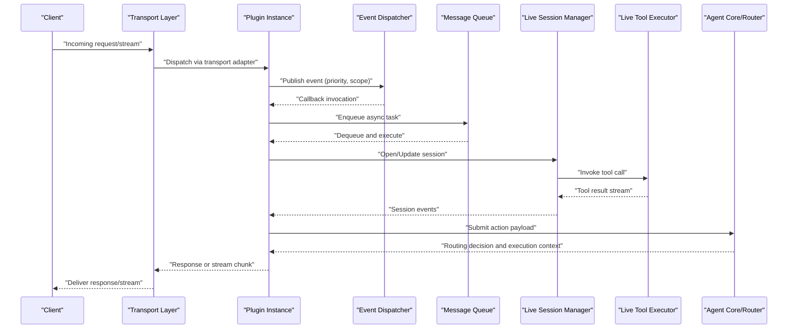
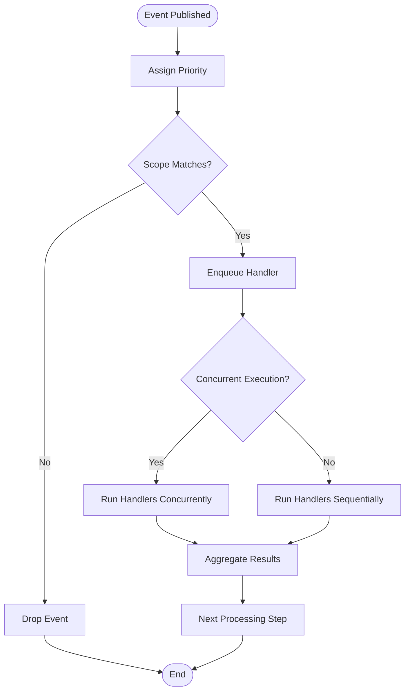
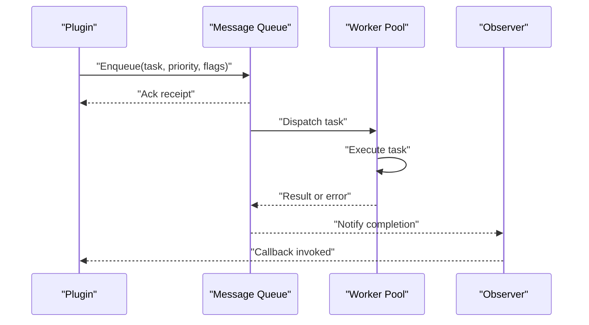
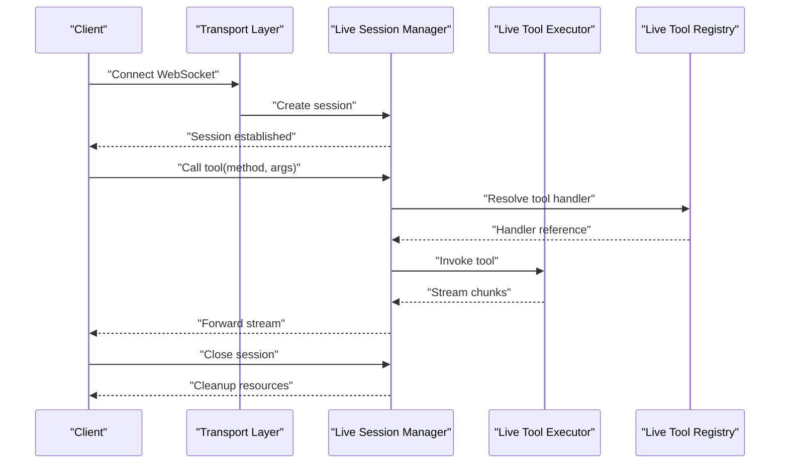
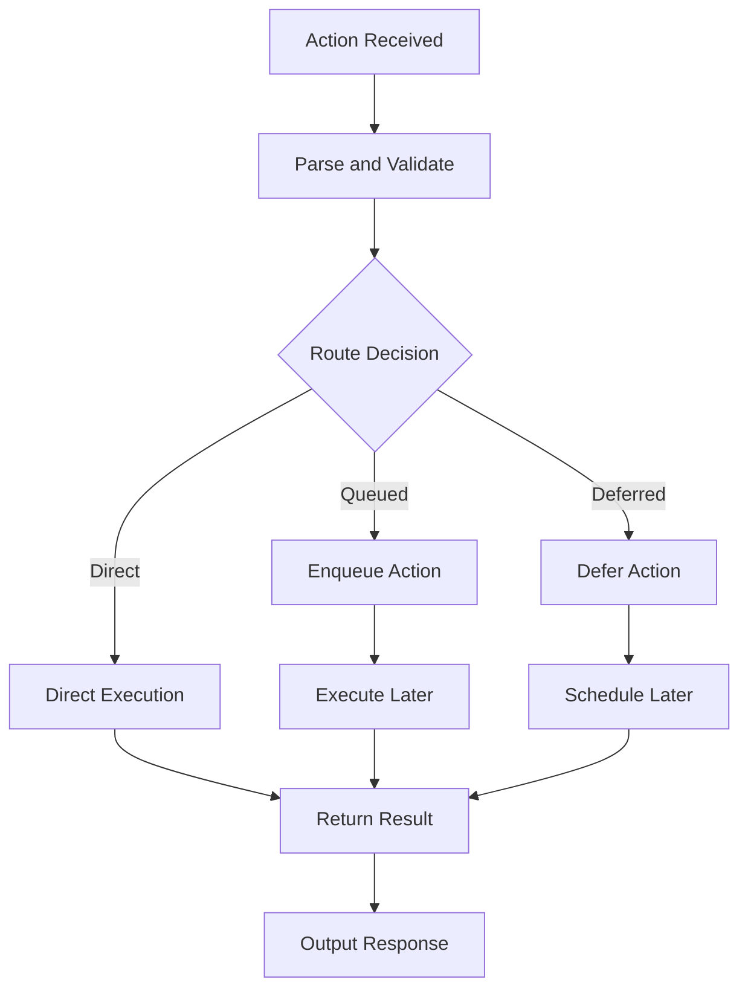
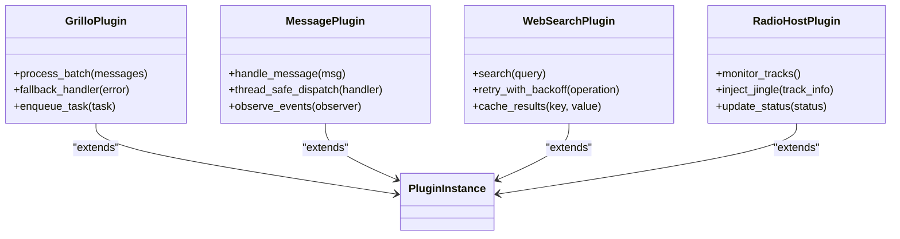
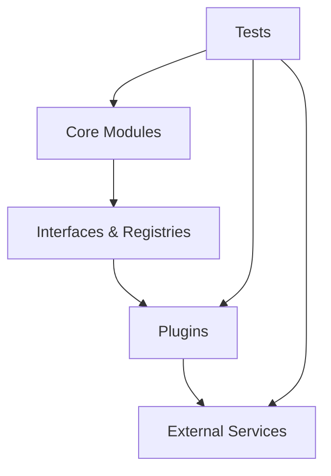

# Advanced Plugin Development

<cite>
**Referenced Files in This Document**
- [core/plugin_base.py](file://core/plugin_base.py)
- [core/plugin_instance.py](file://core/plugin_instance.py)
- [core/event_dispatcher.py](file://core/event_dispatcher.py)
- [core/message_queue.py](file://core/message_queue.py)
- [core/transport_layer.py](file://core/transport_layer.py)
- [core/live_session_manager.py](file://core/live_session_manager.py)
- [core/live_tool_executor.py](file://core/live_tool_executor.py)
- [core/live_tool_registry.py](file://core/live_tool_registry.py)
- [core/agent_core.py](file://core/agent_core.py)
- [core/agent_router.py](file://core/agent_router.py)
- [core/ai_plugin_base.py](file://core/ai_plugin_base.py)
- [core/config_manager.py](file://core/config_manager.py)
- [core/logging_utils.py](file://core/logging_utils.py)
- [core/validation_registry.py](file://core/validation_registry.py)
- [plugins/grillo/grillo_plugin.py](file://plugins/grillo/grillo_plugin.py)
- [plugins/grillo/grillo_impl.py](file://plugins/grillo/grillo_impl.py)
- [plugins/message_plugin/message_plugin.py](file://plugins/message_plugin/message_plugin.py)
- [plugins/web_search_plugin/web_search_plugin.py](file://plugins/web_search_plugin/web_search_plugin.py)
- [plugins/radio_host/radio_host_plugin.py](file://plugins/radio_host/radio_host_plugin.py)
- [tests/test_message_queue.py](file://tests/test_message_queue.py)
- [tests/test_message_queue_attention.py](file://tests/test_message_queue_attention.py)
- [tests/test_message_queue_low_priority_non_blocking.py](file://tests/test_message_queue_low_priority_non_blocking.py)
- [tests/test_message_plugin_thread_handling.py](file://tests/test_message_plugin_thread_handling.py)
- [tests/test_grillo_enqueue.py](file://tests/test_grillo_enqueue.py)
- [tests/test_grillo_fallback.py](file://tests/test_grillo_fallback.py)
- [tests/test_live_session_manager.py](file://tests/test_live_session_manager.py)
- [tests/test_live_registry.py](file://tests/test_live_registry.py)
- [tests/test_llm_plugin_hotswap.py](file://tests/test_llm_plugin_hotswap.py)
- [tests/test_webui_smoke.py](file://tests/test_webui_smoke.py)
- [tests/stress_test_engines.py](file://tests/stress_test_engines.py)
</cite>

## Table of Contents
1. [Introduction](#introduction)
2. [Project Structure](#project-structure)
3. [Core Components](#core-components)
4. [Architecture Overview](#architecture-overview)
5. [Detailed Component Analysis](#detailed-component-analysis)
6. [Dependency Analysis](#dependency-analysis)
7. [Performance Considerations](#performance-considerations)
8. [Troubleshooting Guide](#troubleshooting-guide)
9. [Conclusion](#conclusion)
10. [Appendices](#appendices)

## Introduction
This document provides advanced guidance for building high-performance, secure, and maintainable plugins in Synthetic Heart. It focuses on complex plugin architectures including multi-threaded execution, asynchronous operations, robust resource management, sophisticated event handling, message queue integration, real-time communication, testing strategies, security best practices, packaging and distribution, versioning, profiling, debugging, and production optimization techniques. The content is grounded in the core plugin framework and representative plugins within the repository.

## Project Structure
Synthetic Heart organizes plugin-related code across a clear separation of concerns:
- Core plugin runtime and lifecycle management
- Event dispatching and messaging infrastructure
- Live session and tool execution for real-time features
- Representative plugins demonstrating advanced patterns
- Comprehensive tests covering concurrency, performance, and reliability

```mermaid
graph TB
subgraph "Core Runtime"
PB["plugin_base.py"]
PI["plugin_instance.py"]
ED["event_dispatcher.py"]
MQ["message_queue.py"]
TL["transport_layer.py"]
LSM["live_session_manager.py"]
LTE["live_tool_executor.py"]
LTR["live_tool_registry.py"]
AC["agent_core.py"]
AR["agent_router.py"]
APB["ai_plugin_base.py"]
CM["config_manager.py"]
LU["logging_utils.py"]
VR["validation_registry.py"]
end
subgraph "Plugins"
GP["grillo_plugin.py"]
GI["grillo_impl.py"]
MP["message_plugin.py"]
WSP["web_search_plugin.py"]
RHP["radio_host_plugin.py"]
end
subgraph "Tests"
TMQ["test_message_queue.py"]
TMA["test_message_queue_attention.py"]
TMLP["test_message_queue_low_priority_non_blocking.py"]
TMP["test_message_plugin_thread_handling.py"]
TGE["test_grillo_enqueue.py"]
TGF["test_grillo_fallback.py"]
TLSM["test_live_session_manager.py"]
TLR["test_live_registry.py"]
TLH["test_llm_plugin_hotswap.py"]
TWS["test_webui_smoke.py"]
TSE["stress_test_engines.py"]
end
PB --> PI
PI --> ED
PI --> MQ
PI --> TL
PI --> LSM
PI --> AC
PI --> AR
PI --> APB
PI --> CM
PI --> LU
PI --> VR
GP --> PI
GI --> GP
MP --> PI
WSP --> PI
RHP --> PI
TMQ --> MQ
TMA --> MQ
TMLP --> MQ
TMP --> MP
TGE --> GP
TGF --> GP
TLSM --> LSM
TLR --> LTR
TLH --> APB
TWS --> TL
TSE --> AC
```

**Diagram sources**
- [core/plugin_base.py](file://core/plugin_base.py)
- [core/plugin_instance.py](file://core/plugin_instance.py)
- [core/event_dispatcher.py](file://core/event_dispatcher.py)
- [core/message_queue.py](file://core/message_queue.py)
- [core/transport_layer.py](file://core/transport_layer.py)
- [core/live_session_manager.py](file://core/live_session_manager.py)
- [core/live_tool_executor.py](file://core/live_tool_executor.py)
- [core/live_tool_registry.py](file://core/live_tool_registry.py)
- [core/agent_core.py](file://core/agent_core.py)
- [core/agent_router.py](file://core/agent_router.py)
- [core/ai_plugin_base.py](file://core/ai_plugin_base.py)
- [core/config_manager.py](file://core/config_manager.py)
- [core/logging_utils.py](file://core/logging_utils.py)
- [core/validation_registry.py](file://core/validation_registry.py)
- [plugins/grillo/grillo_plugin.py](file://plugins/grillo/grillo_plugin.py)
- [plugins/grillo/grillo_impl.py](file://plugins/grillo/grillo_impl.py)
- [plugins/message_plugin/message_plugin.py](file://plugins/message_plugin/message_plugin.py)
- [plugins/web_search_plugin/web_search_plugin.py](file://plugins/web_search_plugin/web_search_plugin.py)
- [plugins/radio_host/radio_host_plugin.py](file://plugins/radio_host/radio_host_plugin.py)
- [tests/test_message_queue.py](file://tests/test_message_queue.py)
- [tests/test_message_queue_attention.py](file://tests/test_message_queue_attention.py)
- [tests/test_message_queue_low_priority_non_blocking.py](file://tests/test_message_queue_low_priority_non_blocking.py)
- [tests/test_message_plugin_thread_handling.py](file://tests/test_message_plugin_thread_handling.py)
- [tests/test_grillo_enqueue.py](file://tests/test_grillo_enqueue.py)
- [tests/test_grillo_fallback.py](file://tests/test_grillo_fallback.py)
- [tests/test_live_session_manager.py](file://tests/test_live_session_manager.py)
- [tests/test_live_registry.py](file://tests/test_live_registry.py)
- [tests/test_llm_plugin_hotswap.py](file://tests/test_llm_plugin_hotswap.py)
- [tests/test_webui_smoke.py](file://tests/test_webui_smoke.py)
- [tests/stress_test_engines.py](file://tests/stress_test_engines.py)

**Section sources**
- [core/plugin_base.py](file://core/plugin_base.py)
- [core/plugin_instance.py](file://core/plugin_instance.py)
- [core/event_dispatcher.py](file://core/event_dispatcher.py)
- [core/message_queue.py](file://core/message_queue.py)
- [core/transport_layer.py](file://core/transport_layer.py)
- [core/live_session_manager.py](file://core/live_session_manager.py)
- [core/live_tool_executor.py](file://core/live_tool_executor.py)
- [core/live_tool_registry.py](file://core/live_tool_registry.py)
- [core/agent_core.py](file://core/agent_core.py)
- [core/agent_router.py](file://core/agent_router.py)
- [core/ai_plugin_base.py](file://core/ai_plugin_base.py)
- [core/config_manager.py](file://core/config_manager.py)
- [core/logging_utils.py](file://core/logging_utils.py)
- [core/validation_registry.py](file://core/validation_registry.py)
- [plugins/grillo/grillo_plugin.py](file://plugins/grillo/grillo_plugin.py)
- [plugins/grillo/grillo_impl.py](file://plugins/grillo/grillo_impl.py)
- [plugins/message_plugin/message_plugin.py](file://plugins/message_plugin/message_plugin.py)
- [plugins/web_search_plugin/web_search_plugin.py](file://plugins/web_search_plugin/web_search_plugin.py)
- [plugins/radio_host/radio_host_plugin.py](file://plugins/radio_host/radio_host_plugin.py)

## Core Components
The plugin system centers around a base class and instance lifecycle manager that provide initialization, configuration, event hooks, and resource cleanup. Event dispatching and message queues enable decoupled, asynchronous processing. Live session management and tool execution support real-time interactions. Agent core and router orchestrate actions and routing across plugins. AI plugin base offers specialized capabilities for AI-driven plugins. Configuration, logging, and validation utilities ensure robustness and observability.

Key responsibilities:
- Lifecycle management: startup, readiness, shutdown, hot-swapping
- Event handling: subscribe, publish, priority, and filtering
- Messaging: enqueue, dequeue, backpressure, attention signals
- Real-time: sessions, streaming, tool calls, registry
- Agent integration: action parsing, routing, execution context
- Security: input validation, sanitization, policy enforcement
- Observability: structured logging, metrics, tracing
- Testing: unit, integration, stress, and mock strategies

**Section sources**
- [core/plugin_base.py](file://core/plugin_base.py)
- [core/plugin_instance.py](file://core/plugin_instance.py)
- [core/event_dispatcher.py](file://core/event_dispatcher.py)
- [core/message_queue.py](file://core/message_queue.py)
- [core/transport_layer.py](file://core/transport_layer.py)
- [core/live_session_manager.py](file://core/live_session_manager.py)
- [core/live_tool_executor.py](file://core/live_tool_executor.py)
- [core/live_tool_registry.py](file://core/live_tool_registry.py)
- [core/agent_core.py](file://core/agent_core.py)
- [core/agent_router.py](file://core/agent_router.py)
- [core/ai_plugin_base.py](file://core/ai_plugin_base.py)
- [core/config_manager.py](file://core/config_manager.py)
- [core/logging_utils.py](file://core/logging_utils.py)
- [core/validation_registry.py](file://core/validation_registry.py)

## Architecture Overview
At a high level, plugins extend the base plugin interface and interact with the core through well-defined channels: events, messages, live sessions, and agent actions. The architecture emphasizes loose coupling, strong typing, and clear boundaries to facilitate testing, scaling, and maintenance.

**Diagram sources**
- [core/transport_layer.py](file://core/transport_layer.py)
- [core/plugin_instance.py](file://core/plugin_instance.py)
- [core/event_dispatcher.py](file://core/event_dispatcher.py)
- [core/message_queue.py](file://core/message_queue.py)
- [core/live_session_manager.py](file://core/live_session_manager.py)
- [core/live_tool_executor.py](file://core/live_tool_executor.py)
- [core/agent_core.py](file://core/agent_core.py)
- [core/agent_router.py](file://core/agent_router.py)

## Detailed Component Analysis

### Plugin Base and Instance Lifecycle
The plugin base defines the contract for lifecycle hooks, configuration access, and integration points. The plugin instance manages state, dependencies, and thread safety during startup, runtime, and shutdown. Hot-swapping enables dynamic updates without service interruption.

```mermaid
classDiagram
class PluginBase {
+initialize(config)
+on_event(event)
+on_message(message)
+on_action(action)
+shutdown()
+get_config(key)
+publish_event(event)
+enqueue_task(task)
}
class PluginInstance {
-state
-dependencies
+start()
+ready()
+stop()
+hot_swap(new_instance)
+validate_input(data)
+sanitize_input(data)
}
class ConfigManager {
+load_config(path)
+get_section(section)
+watch_changes(callback)
}
class LoggingUtils {
+setup_logger(name)
+log(level, message, context)
+trace_call(func)
}
class ValidationRegistry {
+register_validator(schema)
+validate(data, schema)
+sanitize(data, rules)
}
PluginBase <|-- PluginInstance : "extends"
PluginInstance --> ConfigManager : "uses"
PluginInstance --> LoggingUtils : "uses"
PluginInstance --> ValidationRegistry : "uses"
```

**Diagram sources**
- [core/plugin_base.py](file://core/plugin_base.py)
- [core/plugin_instance.py](file://core/plugin_instance.py)
- [core/config_manager.py](file://core/config_manager.py)
- [core/logging_utils.py](file://core/logging_utils.py)
- [core/validation_registry.py](file://core/validation_registry.py)

**Section sources**
- [core/plugin_base.py](file://core/plugin_base.py)
- [core/plugin_instance.py](file://core/plugin_instance.py)
- [core/config_manager.py](file://core/config_manager.py)
- [core/logging_utils.py](file://core/logging_utils.py)
- [core/validation_registry.py](file://core/validation_registry.py)

### Event Dispatching Patterns
Events are published with priorities and scopes, enabling fine-grained control over processing order and visibility. Plugins can subscribe to specific event types and implement handlers that run concurrently or sequentially based on configuration.

**Diagram sources**
- [core/event_dispatcher.py](file://core/event_dispatcher.py)

**Section sources**
- [core/event_dispatcher.py](file://core/event_dispatcher.py)

### Message Queue Integration
The message queue supports high-throughput, low-latency operations with backpressure, attention signals, and non-blocking behavior. Plugins enqueue tasks and receive results asynchronously, ensuring responsiveness under load.

**Diagram sources**
- [core/message_queue.py](file://core/message_queue.py)

**Section sources**
- [core/message_queue.py](file://core/message_queue.py)
- [tests/test_message_queue.py](file://tests/test_message_queue.py)
- [tests/test_message_queue_attention.py](file://tests/test_message_queue_attention.py)
- [tests/test_message_queue_low_priority_non_blocking.py](file://tests/test_message_queue_low_priority_non_blocking.py)

### Real-Time Communication and Live Sessions
Live sessions manage long-lived connections, streaming data, and tool invocations. The session manager coordinates lifecycle, while the tool executor handles method calls and result streaming.

**Diagram sources**
- [core/live_session_manager.py](file://core/live_session_manager.py)
- [core/live_tool_executor.py](file://core/live_tool_executor.py)
- [core/live_tool_registry.py](file://core/live_tool_registry.py)
- [core/transport_layer.py](file://core/transport_layer.py)

**Section sources**
- [core/live_session_manager.py](file://core/live_session_manager.py)
- [core/live_tool_executor.py](file://core/live_tool_executor.py)
- [core/live_tool_registry.py](file://core/live_tool_registry.py)
- [tests/test_live_session_manager.py](file://tests/test_live_session_manager.py)
- [tests/test_live_registry.py](file://tests/test_live_registry.py)

### Agent Integration and Routing
Agent core and router parse actions, determine routing, and execute them within a controlled context. Plugins can submit actions and receive responses, enabling agentic behaviors and cross-plugin coordination.

**Diagram sources**
- [core/agent_core.py](file://core/agent_core.py)
- [core/agent_router.py](file://core/agent_router.py)

**Section sources**
- [core/agent_core.py](file://core/agent_core.py)
- [core/agent_router.py](file://core/agent_router.py)

### Advanced Plugin Examples
Representative plugins demonstrate complex patterns:
- Grillo plugin: multi-threaded processing, fallback mechanisms, and enqueuing strategies
- Message plugin: thread-safe message handling and observer patterns
- Web search plugin: orchestrating external tools with retries and caching
- Radio host plugin: integrating media streams and background monitoring

**Diagram sources**
- [plugins/grillo/grillo_plugin.py](file://plugins/grillo/grillo_plugin.py)
- [plugins/grillo/grillo_impl.py](file://plugins/grillo/grillo_impl.py)
- [plugins/message_plugin/message_plugin.py](file://plugins/message_plugin/message_plugin.py)
- [plugins/web_search_plugin/web_search_plugin.py](file://plugins/web_search_plugin/web_search_plugin.py)
- [plugins/radio_host/radio_host_plugin.py](file://plugins/radio_host/radio_host_plugin.py)

**Section sources**
- [plugins/grillo/grillo_plugin.py](file://plugins/grillo/grillo_plugin.py)
- [plugins/grillo/grillo_impl.py](file://plugins/grillo/grillo_impl.py)
- [plugins/message_plugin/message_plugin.py](file://plugins/message_plugin/message_plugin.py)
- [plugins/web_search_plugin/web_search_plugin.py](file://plugins/web_search_plugin/web_search_plugin.py)
- [plugins/radio_host/radio_host_plugin.py](file://plugins/radio_host/radio_host_plugin.py)
- [tests/test_grillo_enqueue.py](file://tests/test_grillo_enqueue.py)
- [tests/test_grillo_fallback.py](file://tests/test_grillo_fallback.py)
- [tests/test_message_plugin_thread_handling.py](file://tests/test_message_plugin_thread_handling.py)

## Dependency Analysis
The plugin system exhibits clear dependency boundaries:
- Core components depend on each other minimally, favoring interfaces and registries
- Plugins depend on core abstractions but avoid tight coupling
- Tests validate behavior at multiple levels: unit, integration, and stress

**Diagram sources**
- [core/plugin_base.py](file://core/plugin_base.py)
- [core/plugin_instance.py](file://core/plugin_instance.py)
- [core/event_dispatcher.py](file://core/event_dispatcher.py)
- [core/message_queue.py](file://core/message_queue.py)
- [core/transport_layer.py](file://core/transport_layer.py)
- [core/live_session_manager.py](file://core/live_session_manager.py)
- [core/live_tool_executor.py](file://core/live_tool_executor.py)
- [core/live_tool_registry.py](file://core/live_tool_registry.py)
- [core/agent_core.py](file://core/agent_core.py)
- [core/agent_router.py](file://core/agent_router.py)
- [core/ai_plugin_base.py](file://core/ai_plugin_base.py)
- [core/config_manager.py](file://core/config_manager.py)
- [core/logging_utils.py](file://core/logging_utils.py)
- [core/validation_registry.py](file://core/validation_registry.py)
- [plugins/grillo/grillo_plugin.py](file://plugins/grillo/grillo_plugin.py)
- [plugins/grillo/grillo_impl.py](file://plugins/grillo/grillo_impl.py)
- [plugins/message_plugin/message_plugin.py](file://plugins/message_plugin/message_plugin.py)
- [plugins/web_search_plugin/web_search_plugin.py](file://plugins/web_search_plugin/web_search_plugin.py)
- [plugins/radio_host/radio_host_plugin.py](file://plugins/radio_host/radio_host_plugin.py)
- [tests/test_message_queue.py](file://tests/test_message_queue.py)
- [tests/test_message_queue_attention.py](file://tests/test_message_queue_attention.py)
- [tests/test_message_queue_low_priority_non_blocking.py](file://tests/test_message_queue_low_priority_non_blocking.py)
- [tests/test_message_plugin_thread_handling.py](file://tests/test_message_plugin_thread_handling.py)
- [tests/test_grillo_enqueue.py](file://tests/test_grillo_enqueue.py)
- [tests/test_grillo_fallback.py](file://tests/test_grillo_fallback.py)
- [tests/test_live_session_manager.py](file://tests/test_live_session_manager.py)
- [tests/test_live_registry.py](file://tests/test_live_registry.py)
- [tests/test_llm_plugin_hotswap.py](file://tests/test_llm_plugin_hotswap.py)
- [tests/test_webui_smoke.py](file://tests/test_webui_smoke.py)
- [tests/stress_test_engines.py](file://tests/stress_test_engines.py)

**Section sources**
- [core/plugin_base.py](file://core/plugin_base.py)
- [core/plugin_instance.py](file://core/plugin_instance.py)
- [core/event_dispatcher.py](file://core/event_dispatcher.py)
- [core/message_queue.py](file://core/message_queue.py)
- [core/transport_layer.py](file://core/transport_layer.py)
- [core/live_session_manager.py](file://core/live_session_manager.py)
- [core/live_tool_executor.py](file://core/live_tool_executor.py)
- [core/live_tool_registry.py](file://core/live_tool_registry.py)
- [core/agent_core.py](file://core/agent_core.py)
- [core/agent_router.py](file://core/agent_router.py)
- [core/ai_plugin_base.py](file://core/ai_plugin_base.py)
- [core/config_manager.py](file://core/config_manager.py)
- [core/logging_utils.py](file://core/logging_utils.py)
- [core/validation_registry.py](file://core/validation_registry.py)
- [plugins/grillo/grillo_plugin.py](file://plugins/grillo/grillo_plugin.py)
- [plugins/grillo/grillo_impl.py](file://plugins/grillo/grillo_impl.py)
- [plugins/message_plugin/message_plugin.py](file://plugins/message_plugin/message_plugin.py)
- [plugins/web_search_plugin/web_search_plugin.py](file://plugins/web_search_plugin/web_search_plugin.py)
- [plugins/radio_host/radio_host_plugin.py](file://plugins/radio_host/radio_host_plugin.py)
- [tests/test_message_queue.py](file://tests/test_message_queue.py)
- [tests/test_message_queue_attention.py](file://tests/test_message_queue_attention.py)
- [tests/test_message_queue_low_priority_non_blocking.py](file://tests/test_message_queue_low_priority_non_blocking.py)
- [tests/test_message_plugin_thread_handling.py](file://tests/test_message_plugin_thread_handling.py)
- [tests/test_grillo_enqueue.py](file://tests/test_grillo_enqueue.py)
- [tests/test_grillo_fallback.py](file://tests/test_grillo_fallback.py)
- [tests/test_live_session_manager.py](file://tests/test_live_session_manager.py)
- [tests/test_live_registry.py](file://tests/test_live_registry.py)
- [tests/test_llm_plugin_hotswap.py](file://tests/test_llm_plugin_hotswap.py)
- [tests/test_webui_smoke.py](file://tests/test_webui_smoke.py)
- [tests/stress_test_engines.py](file://tests/stress_test_engines.py)

## Performance Considerations
- Use non-blocking message queues for high-throughput scenarios
- Implement backpressure to prevent memory exhaustion
- Leverage concurrent execution where safe, with proper synchronization
- Profile CPU and memory usage using built-in logging and metrics
- Optimize I/O operations with connection pooling and caching
- Monitor garbage collection pressure and tune object lifecycles
- Conduct stress testing to identify bottlenecks under load

[No sources needed since this section provides general guidance]

## Troubleshooting Guide
Common issues and resolutions:
- Event handler deadlocks: ensure non-blocking callbacks and timeouts
- Message queue saturation: adjust worker pool size and queue limits
- Live session leaks: verify cleanup on disconnect and errors
- Plugin hot-swap failures: validate compatibility and rollback strategies
- Input validation errors: use strict schemas and sanitize inputs
- Logging noise: filter logs by level and context

**Section sources**
- [core/logging_utils.py](file://core/logging_utils.py)
- [core/validation_registry.py](file://core/validation_registry.py)
- [tests/test_llm_plugin_hotswap.py](file://tests/test_llm_plugin_hotswap.py)
- [tests/test_webui_smoke.py](file://tests/test_webui_smoke.py)

## Conclusion
Advanced plugin development in Synthetic Heart requires careful attention to architecture, concurrency, security, and performance. By leveraging the core abstractions, event-driven design, and robust testing strategies, developers can build scalable, reliable, and maintainable plugins that integrate seamlessly with the platform.

[No sources needed since this section summarizes without analyzing specific files]

## Appendices

### Testing Strategies
- Unit tests: isolate plugin logic with mocks and fixtures
- Integration tests: validate interactions with core services and external APIs
- Stress tests: simulate high load to measure resilience and throughput
- Mock implementations: stub external dependencies for deterministic tests

**Section sources**
- [tests/test_message_queue.py](file://tests/test_message_queue.py)
- [tests/test_message_queue_attention.py](file://tests/test_message_queue_attention.py)
- [tests/test_message_queue_low_priority_non_blocking.py](file://tests/test_message_queue_low_priority_non_blocking.py)
- [tests/test_message_plugin_thread_handling.py](file://tests/test_message_plugin_thread_handling.py)
- [tests/test_grillo_enqueue.py](file://tests/test_grillo_enqueue.py)
- [tests/test_grillo_fallback.py](file://tests/test_grillo_fallback.py)
- [tests/test_live_session_manager.py](file://tests/test_live_session_manager.py)
- [tests/test_live_registry.py](file://tests/test_live_registry.py)
- [tests/test_llm_plugin_hotswap.py](file://tests/test_llm_plugin_hotswap.py)
- [tests/test_webui_smoke.py](file://tests/test_webui_smoke.py)
- [tests/stress_test_engines.py](file://tests/stress_test_engines.py)

### Security Best Practices
- Validate all inputs against strict schemas
- Sanitize outputs to prevent injection attacks
- Enforce least privilege for plugin permissions
- Audit sensitive operations and log security events
- Use secure defaults and rotate secrets regularly

**Section sources**
- [core/validation_registry.py](file://core/validation_registry.py)
- [core/config_manager.py](file://core/config_manager.py)
- [core/logging_utils.py](file://core/logging_utils.py)

### Packaging, Distribution, and Versioning
- Package plugins as modular units with clear dependencies
- Use semantic versioning for compatibility tracking
- Provide metadata for discovery and installation
- Include documentation and examples for each plugin
- Test across environments before release

[No sources needed since this section provides general guidance]

### Profiling and Debugging
- Enable detailed logging for critical paths
- Use profiling tools to identify CPU and memory hotspots
- Implement health checks and metrics endpoints
- Capture traces for distributed operations
- Set up alerts for anomalies and failures

**Section sources**
- [core/logging_utils.py](file://core/logging_utils.py)
- [tests/stress_test_engines.py](file://tests/stress_test_engines.py)