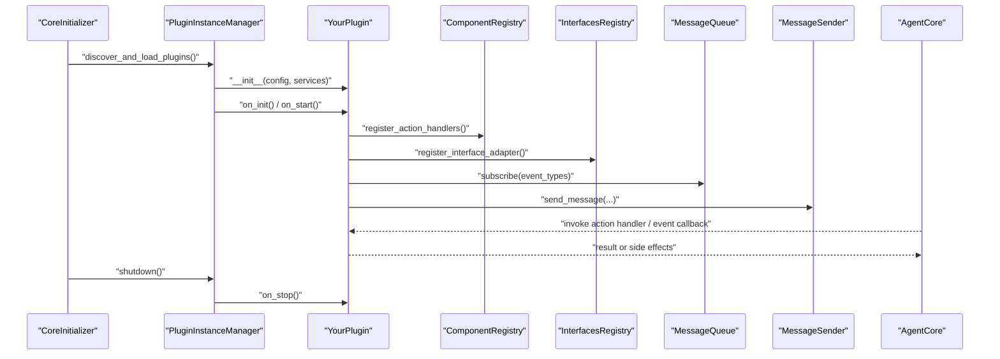
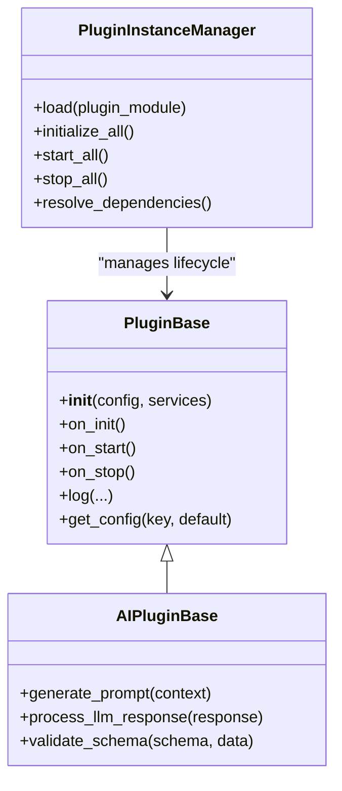
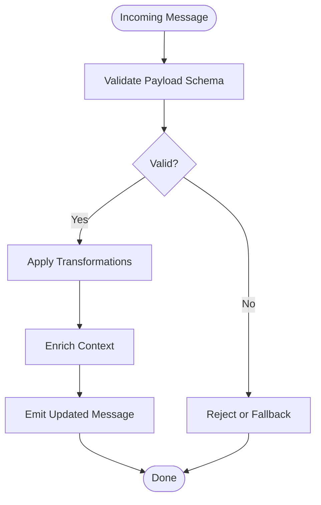
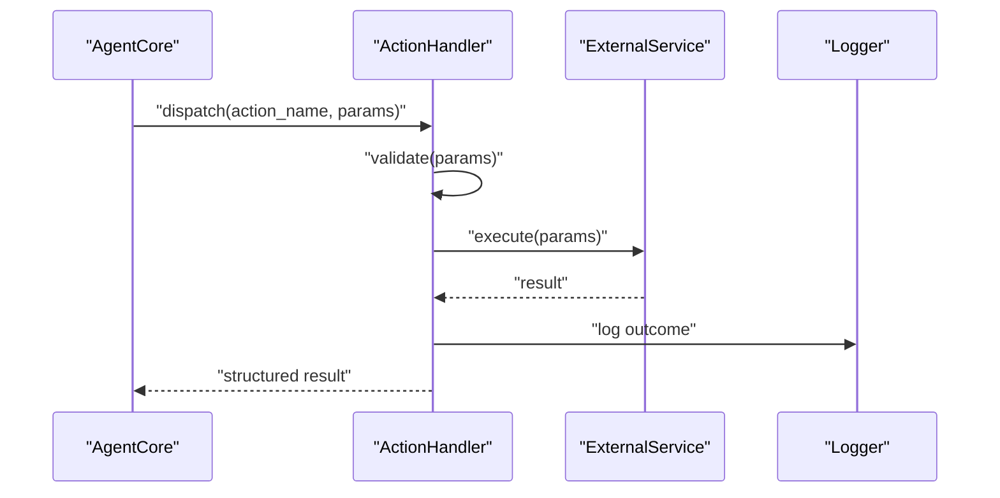
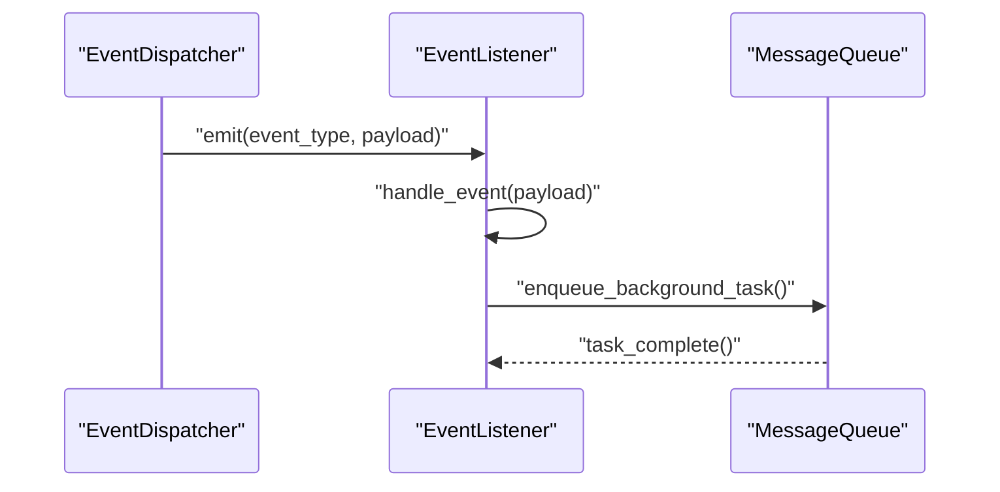
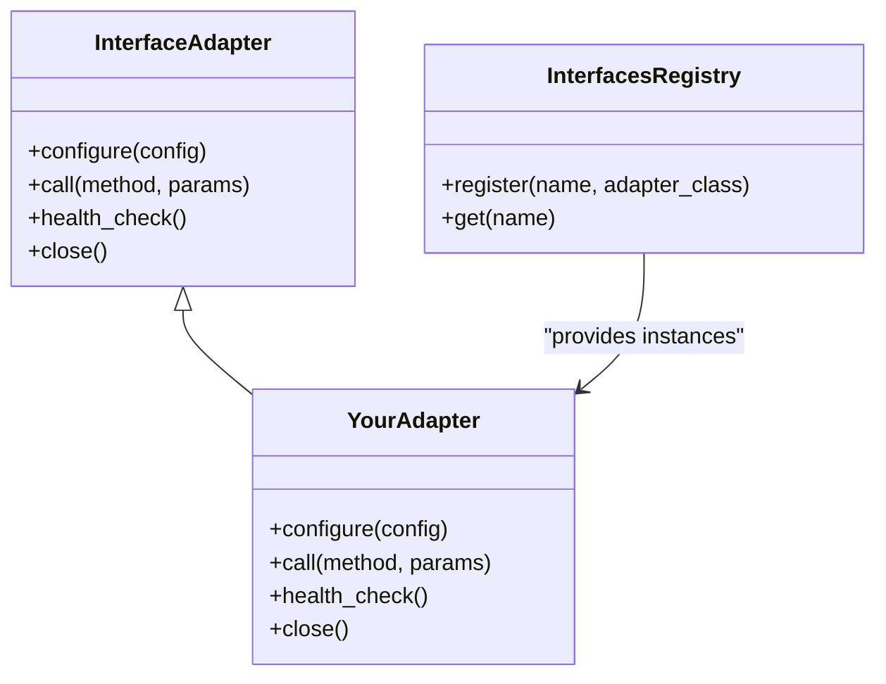
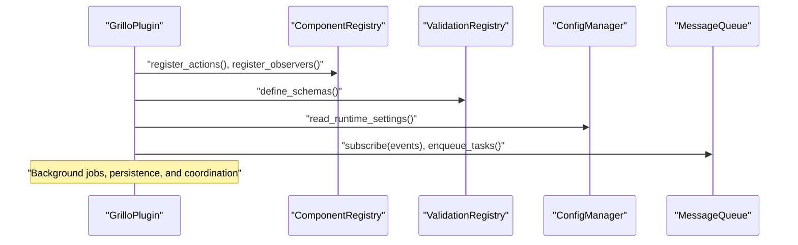
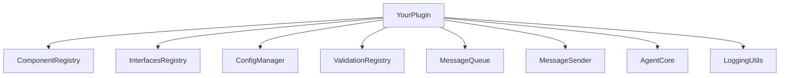

# Creating Custom Plugins

<cite>
**Referenced Files in This Document**
- [plugin_base.py](file://core/plugin_base.py)
- [plugin_instance.py](file://core/plugin_instance.py)
- [ai_plugin_base.py](file://core/ai_plugin_base.py)
- [message_plugin.py](file://plugins/message_plugin/message_plugin.py)
- [event_plugin.py](file://plugins/event_plugin/event_plugin.py)
- [grillo_plugin.py](file://plugins/grillo_plugin.py)
- [interface_adapters.py](file://core/interface_adapters.py)
- [interfaces_registry.py](file://core/interfaces_registry.py)
- [component_registry.py](file://core/component_registry.py)
- [config_manager.py](file://core/config_manager.py)
- [logging_utils.py](file://core/logging_utils.py)
- [message_queue.py](file://core/message_queue.py)
- [message_sender.py](file://core/message_sender.py)
- [agent_core.py](file://core/agent_core.py)
- [core_initializer.py](file://core/core_initializer.py)
- [validation_registry.py](file://core/validation_registry.py)
- [message_plugin.guide.md](file://plugins/message_plugin/message_plugin.guide.md)
- [event_plugin.guide.md](file://plugins/event_plugin/event_plugin.guide.md)
- [grillo_plugin.guide.md](file://plugins/grillo/guide.md)
</cite>

## Table of Contents
1. [Introduction](#introduction)
2. [Project Structure](#project-structure)
3. [Core Components](#core-components)
4. [Architecture Overview](#architecture-overview)
5. [Detailed Component Analysis](#detailed-component-analysis)
6. [Dependency Analysis](#dependency-analysis)
7. [Performance Considerations](#performance-considerations)
8. [Troubleshooting Guide](#troubleshooting-guide)
9. [Conclusion](#conclusion)
10. [Appendices](#appendices)

## Introduction
This document explains how to create custom plugins for Synthetic Heart. It covers the plugin base classes, required methods, optional hooks, configuration schemas, dependency injection, core service access, inter-plugin communication, and testing strategies. You will find step-by-step guides for implementing:
- Message processors
- Action handlers
- Event listeners
- External service integrations

The guidance is grounded in the repository’s plugin infrastructure and existing implementations.

## Project Structure
Synthetic Heart organizes plugin-related code under core and plugins directories:
- Core plugin framework and lifecycle management live under core/.
- Concrete plugin implementations and their guides live under plugins/.
- Interfaces and registries provide discovery and integration points.

```mermaid
graph TB
subgraph "Core Framework"
PB["plugin_base.py"]
PI["plugin_instance.py"]
APB["ai_plugin_base.py"]
IR["interfaces_registry.py"]
CR["component_registry.py"]
CM["config_manager.py"]
LU["logging_utils.py"]
MQ["message_queue.py"]
MS["message_sender.py"]
AC["agent_core.py"]
CI["core_initializer.py"]
VR["validation_registry.py"]
end
subgraph "Plugins"
MP["message_plugin.py"]
EP["event_plugin.py"]
GP["grillo_plugin.py"]
end
PB --> PI
APB --> PI
IR --> MP
CR --> MP
CM --> MP
LU --> MP
MQ --> MP
MS --> MP
AC --> MP
CI --> MP
VR --> MP
IR --> EP
CR --> EP
CM --> EP
LU --> EP
MQ --> EP
MS --> EP
AC --> EP
CI --> EP
VR --> EP
IR --> GP
CR --> GP
CM --> GP
LU --> GP
MQ --> GP
MS --> GP
AC --> GP
CI --> GP
VR --> GP
```

**Diagram sources**
- [plugin_base.py](file://core/plugin_base.py)
- [plugin_instance.py](file://core/plugin_instance.py)
- [ai_plugin_base.py](file://core/ai_plugin_base.py)
- [interfaces_registry.py](file://core/interfaces_registry.py)
- [component_registry.py](file://core/component_registry.py)
- [config_manager.py](file://core/config_manager.py)
- [logging_utils.py](file://core/logging_utils.py)
- [message_queue.py](file://core/message_queue.py)
- [message_sender.py](file://core/message_sender.py)
- [agent_core.py](file://core/agent_core.py)
- [core_initializer.py](file://core/core_initializer.py)
- [validation_registry.py](file://core/validation_registry.py)
- [message_plugin.py](file://plugins/message_plugin/message_plugin.py)
- [event_plugin.py](file://plugins/event_plugin/event_plugin.py)
- [grillo_plugin.py](file://plugins/grillo_plugin.py)

**Section sources**
- [plugin_base.py](file://core/plugin_base.py)
- [plugin_instance.py](file://core/plugin_instance.py)
- [ai_plugin_base.py](file://core/ai_plugin_base.py)
- [interfaces_registry.py](file://core/interfaces_registry.py)
- [component_registry.py](file://core/component_registry.py)
- [config_manager.py](file://core/config_manager.py)
- [logging_utils.py](file://core/logging_utils.py)
- [message_queue.py](file://core/message_queue.py)
- [message_sender.py](file://core/message_sender.py)
- [agent_core.py](file://core/agent_core.py)
- [core_initializer.py](file://core/core_initializer.py)
- [validation_registry.py](file://core/validation_registry.py)
- [message_plugin.py](file://plugins/message_plugin/message_plugin.py)
- [event_plugin.py](file://plugins/event_plugin/event_plugin.py)
- [grillo_plugin.py](file://plugins/grillo_plugin.py)

## Core Components
Synthetic Heart provides a small set of base classes and utilities that all plugins build upon:
- Plugin base class: defines lifecycle hooks (init, start, stop), configuration handling, logging, and common helpers.
- AI plugin base: extends the base with LLM-specific capabilities such as prompt generation and response processing.
- Plugin instance manager: handles registration, discovery, initialization order, and runtime state.
- Registries: component and interface registries expose services and adapters to plugins.
- Configuration manager: loads, validates, and exposes plugin settings at runtime.
- Logging utilities: standardized logging across plugins.
- Messaging primitives: message queue and sender for asynchronous communication.
- Agent core: orchestrates agent workflows and exposes high-level APIs.
- Validation registry: schema-based validation for plugin configurations and payloads.

Key responsibilities:
- Lifecycle: initialize dependencies, start background tasks, graceful shutdown.
- Configuration: declare schemas, validate inputs, read runtime settings.
- Integration: register actions, event listeners, message processors, and external adapters.
- Observability: structured logs, metrics hooks, error reporting.

**Section sources**
- [plugin_base.py](file://core/plugin_base.py)
- [ai_plugin_base.py](file://core/ai_plugin_base.py)
- [plugin_instance.py](file://core/plugin_instance.py)
- [interfaces_registry.py](file://core/interfaces_registry.py)
- [component_registry.py](file://core/component_registry.py)
- [config_manager.py](file://core/config_manager.py)
- [logging_utils.py](file://core/logging_utils.py)
- [message_queue.py](file://core/message_queue.py)
- [message_sender.py](file://core/message_sender.py)
- [agent_core.py](file://core/agent_core.py)
- [validation_registry.py](file://core/validation_registry.py)

## Architecture Overview
At runtime, the core initializes plugins via the plugin instance manager. Plugins register themselves into registries and subscribe to events or message flows. The agent core coordinates execution paths, while messaging primitives decouple components.

**Diagram sources**
- [core_initializer.py](file://core/core_initializer.py)
- [plugin_instance.py](file://core/plugin_instance.py)
- [component_registry.py](file://core/component_registry.py)
- [interfaces_registry.py](file://core/interfaces_registry.py)
- [message_queue.py](file://core/message_queue.py)
- [message_sender.py](file://core/message_sender.py)
- [agent_core.py](file://core/agent_core.py)

## Detailed Component Analysis

### Plugin Base Classes and Lifecycle
- Base plugin class defines standard lifecycle hooks: initialization, startup, and shutdown.
- AI plugin base adds LLM-centric hooks and helpers for prompts and responses.
- Plugin instance manager ensures consistent ordering and dependency resolution.

**Diagram sources**
- [plugin_base.py](file://core/plugin_base.py)
- [ai_plugin_base.py](file://core/ai_plugin_base.py)
- [plugin_instance.py](file://core/plugin_instance.py)

**Section sources**
- [plugin_base.py](file://core/plugin_base.py)
- [ai_plugin_base.py](file://core/ai_plugin_base.py)
- [plugin_instance.py](file://core/plugin_instance.py)

### Message Processors
Message processors intercept incoming messages, transform them, and route them through the pipeline. A typical processor:
- Subscribes to message events.
- Validates payload against a schema.
- Applies transformations or enrichment.
- Emits updated messages or triggers downstream actions.

**Diagram sources**
- [message_queue.py](file://core/message_queue.py)
- [message_sender.py](file://core/message_sender.py)
- [validation_registry.py](file://core/validation_registry.py)

Implementation references:
- Example processor patterns are demonstrated in the message plugin implementation and guide.

**Section sources**
- [message_plugin.py](file://plugins/message_plugin/message_plugin.py)
- [message_plugin.guide.md](file://plugins/message_plugin/message_plugin.guide.md)
- [message_queue.py](file://core/message_queue.py)
- [message_sender.py](file://core/message_sender.py)
- [validation_registry.py](file://core/validation_registry.py)

### Action Handlers
Action handlers respond to specific action types defined by the agent core. They should:
- Register handlers for action names.
- Parse and validate parameters.
- Execute business logic safely.
- Return structured results or trigger side effects.

**Diagram sources**
- [agent_core.py](file://core/agent_core.py)
- [component_registry.py](file://core/component_registry.py)
- [validation_registry.py](file://core/validation_registry.py)

**Section sources**
- [component_registry.py](file://core/component_registry.py)
- [agent_core.py](file://core/agent_core.py)
- [validation_registry.py](file://core/validation_registry.py)

### Event Listeners
Event listeners react to system-wide events. Typical steps:
- Subscribe to event types during initialization.
- Handle events asynchronously where appropriate.
- Avoid blocking long-running operations; enqueue work if needed.

**Diagram sources**
- [message_queue.py](file://core/message_queue.py)

**Section sources**
- [event_plugin.py](file://plugins/event_plugin/event_plugin.py)
- [event_plugin.guide.md](file://plugins/event_plugin/event_plugin.guide.md)
- [message_queue.py](file://core/message_queue.py)

### External Service Integrations
Integrations typically implement an adapter registered via the interfaces registry. Key practices:
- Define a clear adapter interface.
- Use retry and timeout policies.
- Log errors and surface diagnostics.
- Provide configuration schemas for endpoints and credentials.

**Diagram sources**
- [interface_adapters.py](file://core/interface_adapters.py)
- [interfaces_registry.py](file://core/interfaces_registry.py)

**Section sources**
- [interface_adapters.py](file://core/interface_adapters.py)
- [interfaces_registry.py](file://core/interfaces_registry.py)

### Complex Plugin Example: Grillo
Grillo demonstrates a comprehensive plugin combining multiple patterns:
- Registers actions and observers.
- Manages persistent state and scheduling.
- Uses validation schemas and structured logging.
- Integrates with core services and other plugins.

**Diagram sources**
- [grillo_plugin.py](file://plugins/grillo_plugin.py)
- [component_registry.py](file://core/component_registry.py)
- [validation_registry.py](file://core/validation_registry.py)
- [config_manager.py](file://core/config_manager.py)
- [message_queue.py](file://core/message_queue.py)

**Section sources**
- [grillo_plugin.py](file://plugins/grillo_plugin.py)
- [grillo_plugin.guide.md](file://plugins/grillo/guide.md)
- [component_registry.py](file://core/component_registry.py)
- [validation_registry.py](file://core/validation_registry.py)
- [config_manager.py](file://core/config_manager.py)
- [message_queue.py](file://core/message_queue.py)

## Dependency Analysis
Plugins rely on core registries and managers to discover and interact with services. Proper separation of concerns ensures low coupling and high cohesion.

**Diagram sources**
- [component_registry.py](file://core/component_registry.py)
- [interfaces_registry.py](file://core/interfaces_registry.py)
- [config_manager.py](file://core/config_manager.py)
- [validation_registry.py](file://core/validation_registry.py)
- [message_queue.py](file://core/message_queue.py)
- [message_sender.py](file://core/message_sender.py)
- [agent_core.py](file://core/agent_core.py)
- [logging_utils.py](file://core/logging_utils.py)

**Section sources**
- [component_registry.py](file://core/component_registry.py)
- [interfaces_registry.py](file://core/interfaces_registry.py)
- [config_manager.py](file://core/config_manager.py)
- [validation_registry.py](file://core/validation_registry.py)
- [message_queue.py](file://core/message_queue.py)
- [message_sender.py](file://core/message_sender.py)
- [agent_core.py](file://core/agent_core.py)
- [logging_utils.py](file://core/logging_utils.py)

## Performance Considerations
- Prefer asynchronous processing for I/O-bound tasks using the message queue.
- Cache expensive computations within plugin scope when safe.
- Avoid blocking calls in event handlers; offload to background workers.
- Use structured logging to reduce overhead and improve observability.
- Tune retry/backoff policies for external integrations to prevent cascading failures.

[No sources needed since this section provides general guidance]

## Troubleshooting Guide
Common issues and remedies:
- Initialization failures: verify configuration schemas and environment variables; check logs for missing dependencies.
- Event not firing: ensure subscriptions occur during on_start and event types match dispatcher expectations.
- Action not invoked: confirm registration with the component registry and correct action name mapping.
- External API errors: implement health checks and circuit breakers; log request/response metadata.
- Memory leaks: ensure background tasks are cancelled on shutdown; release resources in on_stop.

Use the logging utilities to emit contextual information and correlate traces across components.

**Section sources**
- [logging_utils.py](file://core/logging_utils.py)
- [config_manager.py](file://core/config_manager.py)
- [interfaces_registry.py](file://core/interfaces_registry.py)
- [component_registry.py](file://core/component_registry.py)

## Conclusion
By following the plugin base classes, leveraging registries, and adhering to the lifecycle and validation patterns, you can build robust, maintainable plugins for Synthetic Heart. Use the provided examples as templates and apply best practices for performance, reliability, and observability.

[No sources needed since this section summarizes without analyzing specific files]

## Appendices

### Step-by-Step Guides

#### Implementing a Message Processor
- Create a plugin class extending the base plugin.
- In on_init, define validation schemas for incoming messages.
- In on_start, subscribe to relevant message events.
- Implement transformation logic and emit updated messages.
- Add structured logging and error handling.

References:
- [message_plugin.py](file://plugins/message_plugin/message_plugin.py)
- [message_plugin.guide.md](file://plugins/message_plugin/message_plugin.guide.md)
- [validation_registry.py](file://core/validation_registry.py)
- [message_queue.py](file://core/message_queue.py)

#### Implementing an Action Handler
- Extend the base plugin and register action handlers in on_init.
- Validate parameters using the validation registry.
- Execute business logic and return structured results.
- Integrate with external services via interface adapters.

References:
- [component_registry.py](file://core/component_registry.py)
- [agent_core.py](file://core/agent_core.py)
- [validation_registry.py](file://core/validation_registry.py)
- [interface_adapters.py](file://core/interface_adapters.py)

#### Implementing an Event Listener
- Subscribe to system events during on_start.
- Handle events asynchronously; enqueue long-running tasks.
- Ensure cleanup in on_stop.

References:
- [event_plugin.py](file://plugins/event_plugin/event_plugin.py)
- [event_plugin.guide.md](file://plugins/event_plugin/event_plugin.guide.md)
- [message_queue.py](file://core/message_queue.py)

#### Implementing an External Service Integration
- Define an adapter class implementing the interface contract.
- Register the adapter via the interfaces registry.
- Configure endpoints, credentials, and retry policies.
- Implement health checks and graceful shutdown.

References:
- [interface_adapters.py](file://core/interface_adapters.py)
- [interfaces_registry.py](file://core/interfaces_registry.py)
- [config_manager.py](file://core/config_manager.py)

### Configuration Schemas and Validation
- Declare schemas for plugin configuration and payloads.
- Use the validation registry to enforce constraints.
- Provide defaults and environment variable overrides.

References:
- [validation_registry.py](file://core/validation_registry.py)
- [config_manager.py](file://core/config_manager.py)

### Dependency Injection and Core Services
- Access core services through registries and managers passed during initialization.
- Avoid global state; prefer explicit dependencies.

References:
- [plugin_instance.py](file://core/plugin_instance.py)
- [component_registry.py](file://core/component_registry.py)
- [interfaces_registry.py](file://core/interfaces_registry.py)

### Testing Strategies
- Unit test plugin logic in isolation using mocked registries and services.
- Integration tests should exercise event flows and message pipelines.
- Use fixtures to simulate external service responses.

References:
- [message_queue.py](file://core/message_queue.py)
- [interfaces_registry.py](file://core/interfaces_registry.py)
- [component_registry.py](file://core/component_registry.py)

### Debugging Techniques
- Enable verbose logging for plugin modules.
- Trace event dispatches and message flows.
- Inspect configuration values and runtime settings.

References:
- [logging_utils.py](file://core/logging_utils.py)
- [config_manager.py](file://core/config_manager.py)

### Development Best Practices
- Keep plugins focused and cohesive.
- Use schemas and validators consistently.
- Implement robust error handling and retries.
- Document public APIs and configuration options.

[No sources needed since this section provides general guidance]