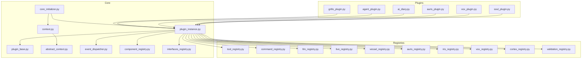
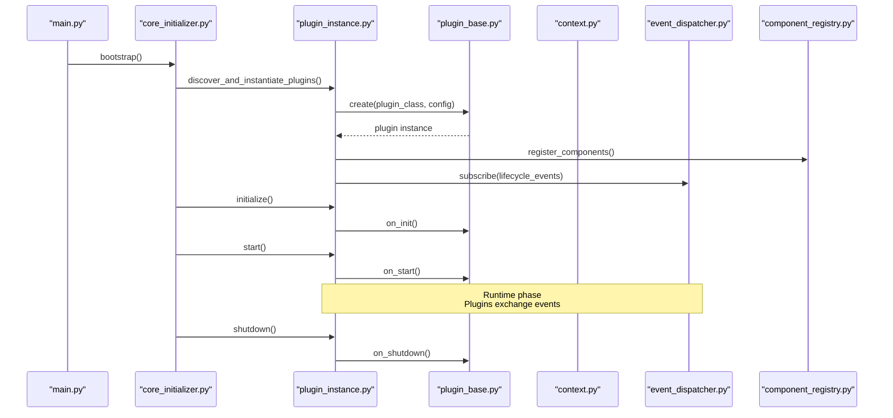
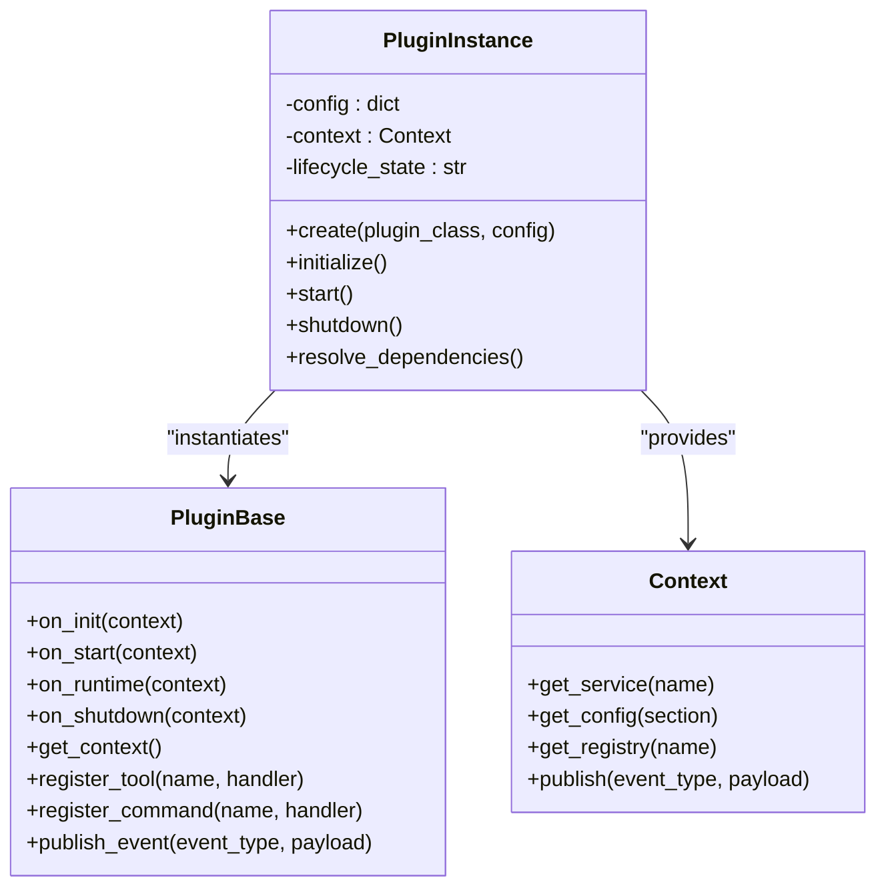
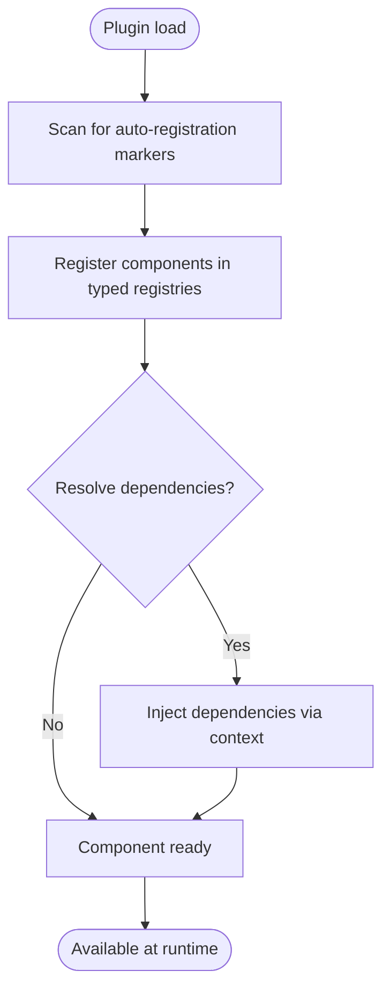
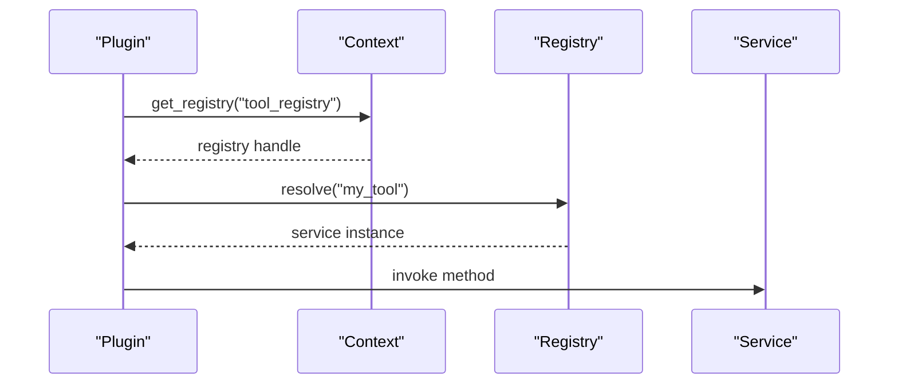
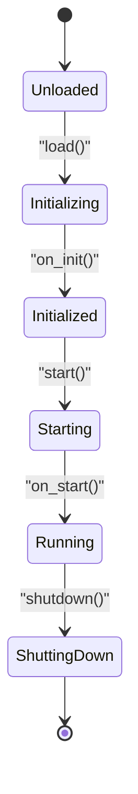
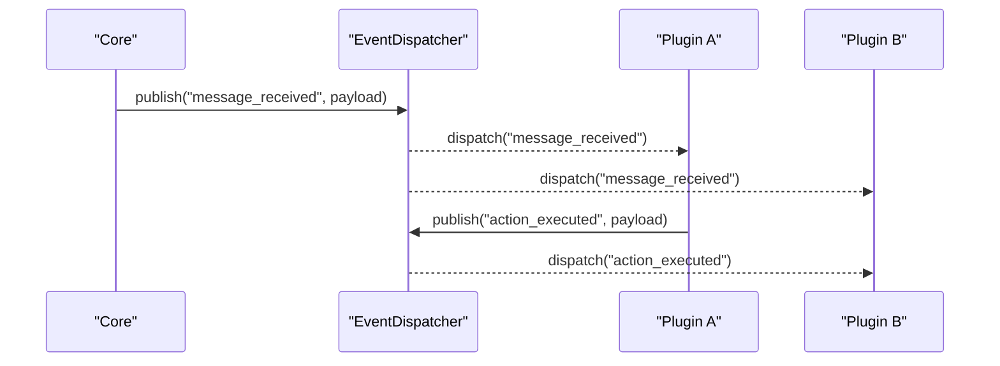
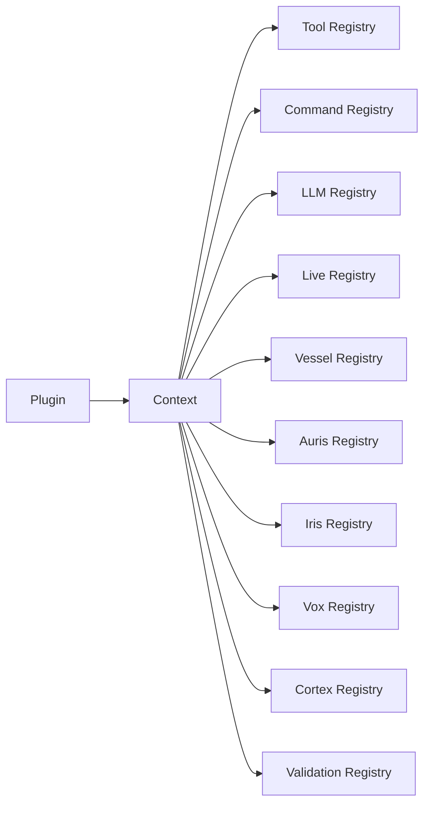
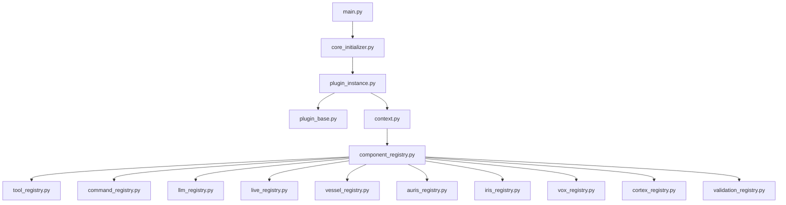

# Plugin Architecture & Design

<cite>
**Referenced Files in This Document**
- [core/plugin_base.py](file://core/plugin_base.py)
- [core/plugin_instance.py](file://core/plugin_instance.py)
- [core/component_registry.py](file://core/component_registry.py)
- [core/component_auto_registration.py](file://core/component_auto_registration.py)
- [core/event_dispatcher.py](file://core/event_dispatcher.py)
- [core/core_initializer.py](file://core/core_initializer.py)
- [core/context.py](file://core/context.py)
- [core/abstract_context.py](file://core/abstract_context.py)
- [core/interfaces.py](file://core/interfaces.py)
- [core/interfaces_registry.py](file://core/interfaces_registry.py)
- [core/tool_registry.py](file://core/tool_registry.py)
- [core/command_registry.py](file://core/command_registry.py)
- [core/llm_registry.py](file://core/llm_registry.py)
- [core/live_registry.py](file://core/live_registry.py)
- [core/vessel_registry.py](file://core/vessel_registry.py)
- [core/auris_registry.py](file://core/auris_registry.py)
- [core/iris_registry.py](file://core/iris_registry.py)
- [core/vox_registry.py](file://core/vox_registry.py)
- [core/cortex_registry.py](file://core/cortex_registry.py)
- [core/validation_registry.py](file://core/validation_registry.py)
- [plugins/grillo_plugin.py](file://plugins/grillo_plugin.py)
- [plugins/agent_plugin/agent_plugin.py](file://plugins/agent_plugin/agent_plugin.py)
- [plugins/ai_diary/ai_diary.py](file://plugins/ai_diary/ai_diary.py)
- [plugins/auris_plugin/auris_plugin.py](file://plugins/auris_plugin/auris_plugin.py)
- [plugins/vox_plugin/vox_plugin.py](file://plugins/vox_plugin/vox_plugin.py)
- [plugins/soul_plugin/soul_plugin.py](file://plugins/soul_plugin/soul_plugin.py)
- [main.py](file://main.py)
</cite>

## Table of Contents
1. [Introduction](#introduction)
2. [Project Structure](#project-structure)
3. [Core Components](#core-components)
4. [Architecture Overview](#architecture-overview)
5. [Detailed Component Analysis](#detailed-component-analysis)
6. [Dependency Analysis](#dependency-analysis)
7. [Performance Considerations](#performance-considerations)
8. [Troubleshooting Guide](#troubleshooting-guide)
9. [Conclusion](#conclusion)

## Introduction
This document explains Synthetic Heart’s plugin architecture and design patterns. It covers the core plugin interface, base classes, registry system, auto-registration, dependency injection, lifecycle management, event-driven communication, component discovery, isolation and security boundaries, and performance considerations. The goal is to help both new and experienced developers understand how plugins integrate with the core system and each other.

## Project Structure
At a high level, the plugin system is implemented in the core package and consumed by plugins under the plugins directory. Key areas:
- Core plugin runtime and lifecycle: plugin_base.py, plugin_instance.py, core_initializer.py, context.py, abstract_context.py
- Registries for components and services: component_registry.py, tool_registry.py, command_registry.py, llm_registry.py, live_registry.py, vessel_registry.py, auris_registry.py, iris_registry.py, vox_registry.py, cortex_registry.py, validation_registry.py
- Eventing: event_dispatcher.py
- Interfaces and their registry: interfaces.py, interfaces_registry.py
- Example plugins: grillo_plugin.py, agent_plugin.py, ai_diary.py, auris_plugin.py, vox_plugin.py, soul_plugin.py

**Diagram sources**
- [core/plugin_instance.py](file://core/plugin_instance.py)
- [core/plugin_base.py](file://core/plugin_base.py)
- [core/core_initializer.py](file://core/core_initializer.py)
- [core/context.py](file://core/context.py)
- [core/abstract_context.py](file://core/abstract_context.py)
- [core/event_dispatcher.py](file://core/event_dispatcher.py)
- [core/component_registry.py](file://core/component_registry.py)
- [core/interfaces_registry.py](file://core/interfaces_registry.py)
- [core/tool_registry.py](file://core/tool_registry.py)
- [core/command_registry.py](file://core/command_registry.py)
- [core/llm_registry.py](file://core/llm_registry.py)
- [core/live_registry.py](file://core/live_registry.py)
- [core/vessel_registry.py](file://core/vessel_registry.py)
- [core/auris_registry.py](file://core/auris_registry.py)
- [core/iris_registry.py](file://core/iris_registry.py)
- [core/vox_registry.py](file://core/vox_registry.py)
- [core/cortex_registry.py](file://core/cortex_registry.py)
- [core/validation_registry.py](file://core/validation_registry.py)
- [plugins/grillo_plugin.py](file://plugins/grillo_plugin.py)
- [plugins/agent_plugin/agent_plugin.py](file://plugins/plugins/agent_plugin/agent_plugin.py)
- [plugins/ai_diary/ai_diary.py](file://plugins/ai_diary/ai_diary.py)
- [plugins/auris_plugin/auris_plugin.py](file://plugins/auris_plugin/auris_plugin.py)
- [plugins/vox_plugin/vox_plugin.py](file://plugins/vox_plugin/vox_plugin.py)
- [plugins/soul_plugin/soul_plugin.py](file://plugins/soul_plugin/soul_plugin.py)

**Section sources**
- [core/plugin_base.py](file://core/plugin_base.py)
- [core/plugin_instance.py](file://core/plugin_instance.py)
- [core/core_initializer.py](file://core/core_initializer.py)
- [core/context.py](file://core/context.py)
- [core/abstract_context.py](file://core/abstract_context.py)
- [core/event_dispatcher.py](file://core/event_dispatcher.py)
- [core/component_registry.py](file://core/component_registry.py)
- [core/interfaces_registry.py](file://core/interfaces_registry.py)
- [core/tool_registry.py](file://core/tool_registry.py)
- [core/command_registry.py](file://core/command_registry.py)
- [core/llm_registry.py](file://core/llm_registry.py)
- [core/live_registry.py](file://core/live_registry.py)
- [core/vessel_registry.py](file://core/vessel_registry.py)
- [core/auris_registry.py](file://core/auris_registry.py)
- [core/iris_registry.py](file://core/iris_registry.py)
- [core/vox_registry.py](file://core/vox_registry.py)
- [core/cortex_registry.py](file://core/cortex_registry.py)
- [core/validation_registry.py](file://core/validation_registry.py)
- [plugins/grillo_plugin.py](file://plugins/grillo_plugin.py)
- [plugins/agent_plugin/agent_plugin.py](file://plugins/agent_plugin/agent_plugin.py)
- [plugins/ai_diary/ai_diary.py](file://plugins/ai_diary/ai_diary.py)
- [plugins/auris_plugin/auris_plugin.py](file://plugins/auris_plugin/auris_plugin.py)
- [plugins/vox_plugin/vox_plugin.py](file://plugins/vox_plugin/vox_plugin.py)
- [plugins/soul_plugin/soul_plugin.py](file://plugins/soul_plugin/soul_plugin.py)

## Core Components
The plugin system revolves around a small set of core abstractions and registries:
- Base plugin class: defines the contract for lifecycle hooks and accessors.
- Plugin instance: manages instantiation, configuration, dependencies, and lifecycle transitions.
- Context: provides a safe, read-only view of runtime services and configuration.
- Event dispatcher: implements publish/subscribe messaging between plugins and core.
- Registries: typed registries for tools, commands, LLM engines, live sessions, vessels, auris engines, iris engines, vox engines, cortex integrations, and validators.

Key responsibilities:
- Lifecycle: initialization, startup, runtime operations, shutdown.
- Dependency injection: explicit registration and resolution via registries.
- Discovery: auto-registration mechanisms for components that declare themselves.
- Isolation: plugins interact through well-defined interfaces and events.

**Section sources**
- [core/plugin_base.py](file://core/plugin_base.py)
- [core/plugin_instance.py](file://core/plugin_instance.py)
- [core/context.py](file://core/context.py)
- [core/abstract_context.py](file://core/abstract_context.py)
- [core/event_dispatcher.py](file://core/event_dispatcher.py)
- [core/component_registry.py](file://core/component_registry.py)
- [core/interfaces.py](file://core/interfaces.py)
- [core/interfaces_registry.py](file://core/interfaces_registry.py)
- [core/tool_registry.py](file://core/tool_registry.py)
- [core/command_registry.py](file://core/command_registry.py)
- [core/llm_registry.py](file://core/llm_registry.py)
- [core/live_registry.py](file://core/live_registry.py)
- [core/vessel_registry.py](file://core/vessel_registry.py)
- [core/auris_registry.py](file://core/auris_registry.py)
- [core/iris_registry.py](file://core/iris_registry.py)
- [core/vox_registry.py](file://core/vox_registry.py)
- [core/cortex_registry.py](file://core/cortex_registry.py)
- [core/validation_registry.py](file://core/validation_registry.py)

## Architecture Overview
The plugin architecture follows an event-driven, registry-based model with clear separation of concerns:
- Plugins implement lifecycle hooks and register capabilities (tools, commands, engines).
- The core initializes plugins, wires dependencies, and coordinates lifecycle phases.
- Communication occurs via events published on the dispatcher; plugins subscribe to relevant topics.
- Access to shared services is mediated through typed registries and a controlled context.

**Diagram sources**
- [main.py](file://main.py)
- [core/core_initializer.py](file://core/core_initializer.py)
- [core/plugin_instance.py](file://core/plugin_instance.py)
- [core/plugin_base.py](file://core/plugin_base.py)
- [core/context.py](file://core/context.py)
- [core/event_dispatcher.py](file://core/event_dispatcher.py)
- [core/component_registry.py](file://core/component_registry.py)

## Detailed Component Analysis

### Plugin Base and Instance
- Base plugin class defines lifecycle methods and common utilities for accessing the context and registries.
- Plugin instance orchestrates creation, configuration, dependency wiring, and lifecycle transitions. It ensures ordered execution of initialization and startup phases and handles graceful shutdown.

**Diagram sources**
- [core/plugin_base.py](file://core/plugin_base.py)
- [core/plugin_instance.py](file://core/plugin_instance.py)
- [core/context.py](file://core/context.py)

**Section sources**
- [core/plugin_base.py](file://core/plugin_base.py)
- [core/plugin_instance.py](file://core/plugin_instance.py)
- [core/context.py](file://core/context.py)

### Registry System and Auto-Registration
- Component registry centralizes registration and lookup of components.
- Auto-registration scans modules or decorators to automatically populate registries without manual wiring.
- Typed registries exist for tools, commands, LLM engines, live session managers, vessels, auris engines, iris engines, vox engines, cortex integrations, and validators.

**Diagram sources**
- [core/component_registry.py](file://core/component_registry.py)
- [core/component_auto_registration.py](file://core/component_auto_registration.py)
- [core/tool_registry.py](file://core/tool_registry.py)
- [core/command_registry.py](file://core/command_registry.py)
- [core/llm_registry.py](file://core/llm_registry.py)
- [core/live_registry.py](file://core/live_registry.py)
- [core/vessel_registry.py](file://core/vessel_registry.py)
- [core/auris_registry.py](file://core/auris_registry.py)
- [core/iris_registry.py](file://core/iris_registry.py)
- [core/vox_registry.py](file://core/vox_registry.py)
- [core/cortex_registry.py](file://core/cortex_registry.py)
- [core/validation_registry.py](file://core/validation_registry.py)

**Section sources**
- [core/component_registry.py](file://core/component_registry.py)
- [core/component_auto_registration.py](file://core/component_auto_registration.py)
- [core/tool_registry.py](file://core/tool_registry.py)
- [core/command_registry.py](file://core/command_registry.py)
- [core/llm_registry.py](file://core/llm_registry.py)
- [core/live_registry.py](file://core/live_registry.py)
- [core/vessel_registry.py](file://core/vessel_registry.py)
- [core/auris_registry.py](file://core/auris_registry.py)
- [core/iris_registry.py](file://core/iris_registry.py)
- [core/vox_registry.py](file://core/vox_registry.py)
- [core/cortex_registry.py](file://core/cortex_registry.py)
- [core/validation_registry.py](file://core/validation_registry.py)

### Dependency Injection Patterns
- Dependencies are resolved through the context and typed registries.
- Plugins request services by name or type, ensuring loose coupling and testability.
- Configuration is injected via context.get_config, enabling per-plugin settings.

**Diagram sources**
- [core/context.py](file://core/context.py)
- [core/component_registry.py](file://core/component_registry.py)
- [core/tool_registry.py](file://core/tool_registry.py)

**Section sources**
- [core/context.py](file://core/context.py)
- [core/component_registry.py](file://core/component_registry.py)
- [core/tool_registry.py](file://core/tool_registry.py)

### Lifecycle Management
Lifecycle phases:
- Initialization: plugin setup, resource allocation, schema preparation.
- Startup: background tasks, listeners, and long-running processes.
- Runtime: event handling, processing, and interactions.
- Shutdown: cleanup, persistence, and graceful termination.

**Diagram sources**
- [core/plugin_instance.py](file://core/plugin_instance.py)
- [core/plugin_base.py](file://core/plugin_base.py)

**Section sources**
- [core/plugin_instance.py](file://core/plugin_instance.py)
- [core/plugin_base.py](file://core/plugin_base.py)

### Event-Driven Communication Model
- The event dispatcher provides publish/subscribe semantics.
- Plugins subscribe to events during initialization/startup and publish events during runtime.
- Events carry payloads and can be filtered by type or scope.

**Diagram sources**
- [core/event_dispatcher.py](file://core/event_dispatcher.py)

**Section sources**
- [core/event_dispatcher.py](file://core/event_dispatcher.py)

### Component Discovery and Interaction Through Registries
- Plugins discover services via typed registries exposed by the context.
- Auto-registration reduces boilerplate and ensures consistent naming.
- Registries enforce contracts defined by interfaces.

**Diagram sources**
- [core/context.py](file://core/context.py)
- [core/tool_registry.py](file://core/tool_registry.py)
- [core/command_registry.py](file://core/command_registry.py)
- [core/llm_registry.py](file://core/llm_registry.py)
- [core/live_registry.py](file://core/live_registry.py)
- [core/vessel_registry.py](file://core/vessel_registry.py)
- [core/auris_registry.py](file://core/auris_registry.py)
- [core/iris_registry.py](file://core/iris_registry.py)
- [core/vox_registry.py](file://core/vox_registry.py)
- [core/cortex_registry.py](file://core/cortex_registry.py)
- [core/validation_registry.py](file://core/validation_registry.py)

**Section sources**
- [core/context.py](file://core/context.py)
- [core/tool_registry.py](file://core/tool_registry.py)
- [core/command_registry.py](file://core/command_registry.py)
- [core/llm_registry.py](file://core/llm_registry.py)
- [core/live_registry.py](file://core/live_registry.py)
- [core/vessel_registry.py](file://core/vessel_registry.py)
- [core/auris_registry.py](file://core/auris_registry.py)
- [core/iris_registry.py](file://core/iris_registry.py)
- [core/vox_registry.py](file://core/vox_registry.py)
- [core/cortex_registry.py](file://core/cortex_registry.py)
- [core/validation_registry.py](file://core/validation_registry.py)

### Example Plugins
- Grillo plugin: demonstrates complex behavior integration using registries and events.
- Agent plugin: integrates agent capabilities into the core workflow.
- AI diary plugin: persists and queries memory-related data via registries.
- Auris plugin: integrates speech-to-text engines through the auris registry.
- Vox plugin: integrates text-to-speech engines through the vox registry.
- Soul plugin: integrates emotion and memory systems via the soul subsystem.

These plugins illustrate best practices for lifecycle hooks, dependency injection, event publishing/subscribing, and registry usage.

**Section sources**
- [plugins/grillo_plugin.py](file://plugins/grillo_plugin.py)
- [plugins/agent_plugin/agent_plugin.py](file://plugins/agent_plugin/agent_plugin.py)
- [plugins/ai_diary/ai_diary.py](file://plugins/ai_diary/ai_diary.py)
- [plugins/auris_plugin/auris_plugin.py](file://plugins/auris_plugin/auris_plugin.py)
- [plugins/vox_plugin/vox_plugin.py](file://plugins/vox_plugin/vox_plugin.py)
- [plugins/soul_plugin/soul_plugin.py](file://plugins/soul_plugin/soul_plugin.py)

## Dependency Analysis
The core initializer bootstraps the system, instantiates plugins, and wires dependencies through the context and registries. Plugins depend on typed registries rather than concrete implementations, promoting modularity and testability.

**Diagram sources**
- [main.py](file://main.py)
- [core/core_initializer.py](file://core/core_initializer.py)
- [core/plugin_instance.py](file://core/plugin_instance.py)
- [core/plugin_base.py](file://core/plugin_base.py)
- [core/context.py](file://core/context.py)
- [core/component_registry.py](file://core/component_registry.py)
- [core/tool_registry.py](file://core/tool_registry.py)
- [core/command_registry.py](file://core/command_registry.py)
- [core/llm_registry.py](file://core/llm_registry.py)
- [core/live_registry.py](file://core/live_registry.py)
- [core/vessel_registry.py](file://core/vessel_registry.py)
- [core/auris_registry.py](file://core/auris_registry.py)
- [core/iris_registry.py](file://core/iris_registry.py)
- [core/vox_registry.py](file://core/vox_registry.py)
- [core/cortex_registry.py](file://core/cortex_registry.py)
- [core/validation_registry.py](file://core/validation_registry.py)

**Section sources**
- [main.py](file://main.py)
- [core/core_initializer.py](file://core/core_initializer.py)
- [core/plugin_instance.py](file://core/plugin_instance.py)
- [core/plugin_base.py](file://core/plugin_base.py)
- [core/context.py](file://core/context.py)
- [core/component_registry.py](file://core/component_registry.py)
- [core/tool_registry.py](file://core/tool_registry.py)
- [core/command_registry.py](file://core/command_registry.py)
- [core/llm_registry.py](file://core/llm_registry.py)
- [core/live_registry.py](file://core/live_registry.py)
- [core/vessel_registry.py](file://core/vessel_registry.py)
- [core/auris_registry.py](file://core/auris_registry.py)
- [core/iris_registry.py](file://core/iris_registry.py)
- [core/vox_registry.py](file://core/vox_registry.py)
- [core/cortex_registry.py](file://core/cortex_registry.py)
- [core/validation_registry.py](file://core/validation_registry.py)

## Performance Considerations
- Avoid heavy work in initialization; defer expensive tasks to startup or lazy initialization.
- Use event-driven updates to minimize polling and synchronous calls.
- Cache frequently accessed services and configurations within plugin instances where appropriate.
- Ensure thread safety when sharing state across asynchronous event handlers.
- Monitor event fan-out to prevent bottlenecks; consider batching or throttling where necessary.

[No sources needed since this section provides general guidance]

## Troubleshooting Guide
Common issues and resolutions:
- Missing dependencies: ensure components are registered before plugins attempt to resolve them.
- Lifecycle ordering: verify that initialization completes before startup-dependent operations.
- Event not received: confirm subscriptions occur early enough and event types match exactly.
- Configuration errors: validate config sections and keys via context.get_config.
- Registry conflicts: check for duplicate names and ensure unique identifiers.

**Section sources**
- [core/plugin_instance.py](file://core/plugin_instance.py)
- [core/event_dispatcher.py](file://core/event_dispatcher.py)
- [core/component_registry.py](file://core/component_registry.py)
- [core/context.py](file://core/context.py)

## Conclusion
Synthetic Heart’s plugin architecture emphasizes modularity, clear lifecycle management, and decoupled communication through events and typed registries. By adhering to the base plugin contract, leveraging auto-registration, and using dependency injection via the context, developers can build robust, maintainable plugins that integrate seamlessly with the core system.

[No sources needed since this section summarizes without analyzing specific files]