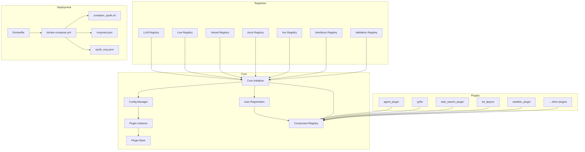
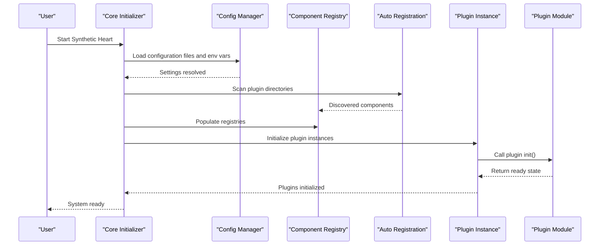
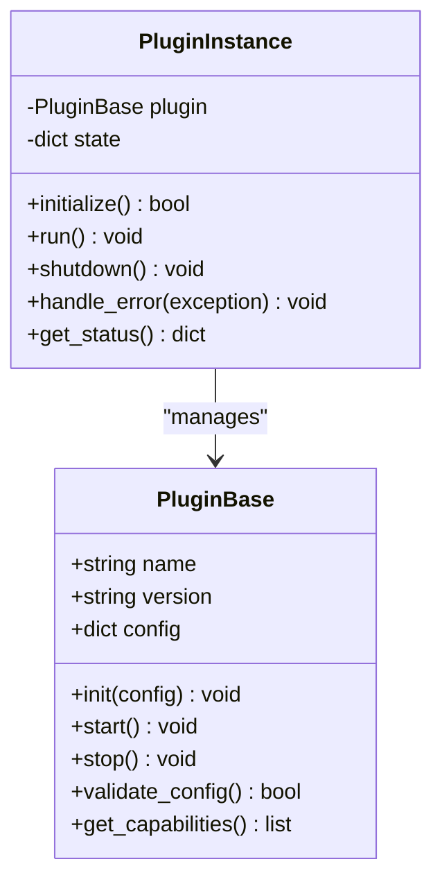
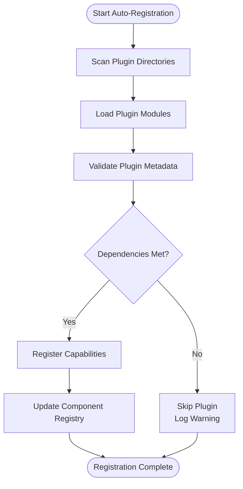
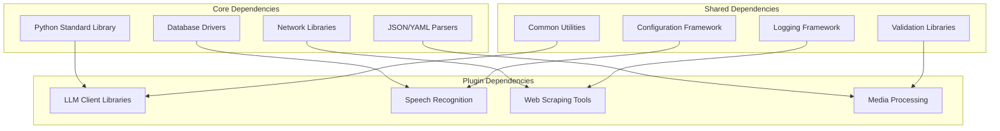
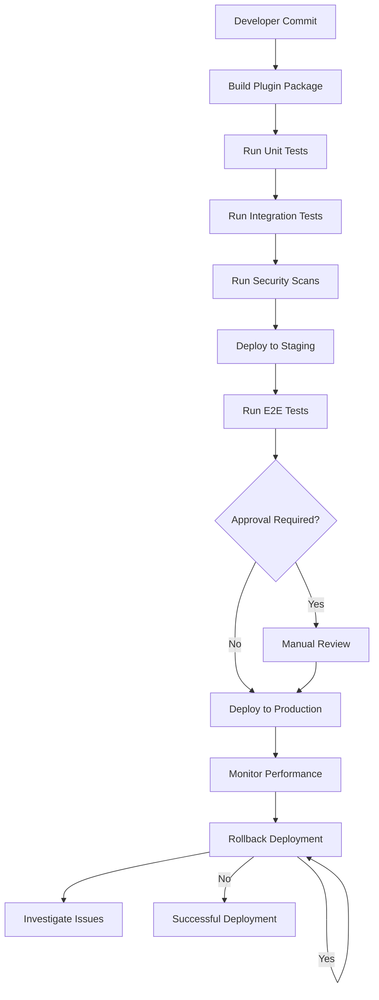

# Plugin Configuration & Deployment

<cite>
**Referenced Files in This Document**
- [README.md](file://README.md)
- [main.py](file://main.py)
- [core/config_manager.py](file://core/config_manager.py)
- [core/plugin_base.py](file://core/plugin_base.py)
- [core/plugin_instance.py](file://core/plugin_instance.py)
- [core/component_auto_registration.py](file://core/component_auto_registration.py)
- [core/component_registry.py](file://core/component_registry.py)
- [core/core_initializer.py](file://core/core_initializer.py)
- [scripts/module_installer.py](file://scripts/module_installer.py)
- [Dockerfile](file://Dockerfile)
- [docker-compose.yml](file://docker-compose.yml)
- [automation_tools/container_synth.sh](file://automation_tools/container_synth.sh)
- [config/mcporter.json](file://config/mcporter.json)
- [config/synth_mcp.json](file://config/synth_mcp.json)
- [docs/installation.rst](file://docs/installation.rst)
- [docs/docker_builds.rst](file://docs/docker_builds.rst)
- [docs/plugins.rst](file://docs/plugins.rst)
- [docs/compose_env_vars.rst](file://docs/compose_env_vars.rst)
- [docs/monitoring_and_scheduling.rst](file://docs/monitoring_and_scheduling.rst)
- [docs/grillo_plugin.rst](file://docs/grillo_plugin.rst)
- [docs/external_endpoints.rst](file://docs/external_endpoints.rst)
- [core/llm_registry.py](file://core/llm_registry.py)
- [core/live_registry.py](file://core/live_registry.py)
- [core/vessel_registry.py](file://core/vessel_registry.py)
- [core/auris_registry.py](file://core/auris_registry.py)
- [core/vox_registry.py](file://core/vox_registry.py)
- [core/interface_paths.py](file://core/interface_paths.py)
- [core/interfaces_registry.py](file://core/interfaces_registry.py)
- [core/validation_registry.py](file://core/validation_registry.py)
- [core/prompt_engine.py](file://core/prompt_engine.py)
- [core/logging_utils.py](file://core/logging_utils.py)
- [core/rate_limit.py](file://core/rate_limit.py)
- [core/action_safety.py](file://core/action_safety.py)
- [core/peer_policy.py](file://core/peer_policy.py)
- [core/message_queue.py](file://core/message_queue.py)
- [core/event_dispatcher.py](file://core/event_dispatcher.py)
- [core/chat_archives_db.py](file://core/chat_archives_db.py)
- [core/db_backends.py](file://core/db_backends.py)
- [core/model_manager.py](file://core/model_manager.py)
- [core/agent_core.py](file://core/agent_core.py)
</cite>

## Table of Contents
1. [Introduction](#introduction)
2. [Project Structure](#project-structure)
3. [Core Components](#core-components)
4. [Architecture Overview](#architecture-overview)
5. [Detailed Component Analysis](#detailed-component-analysis)
6. [Dependency Analysis](#dependency-analysis)
7. [Performance Considerations](#performance-considerations)
8. [Troubleshooting Guide](#troubleshooting-guide)
9. [Conclusion](#conclusion)
10. [Appendices](#appendices)

## Introduction
This document explains how to configure, install, and deploy plugins in Synthetic Heart. It covers the plugin configuration system, environment variables, dynamic loading mechanisms, package manager usage, manual installation, Docker containerization, dependency and version management, conflict resolution, production deployment strategies, scaling considerations, monitoring setup, security configurations, access controls, isolation policies, troubleshooting, performance optimization, maintenance procedures, and CI/CD examples for plugin development and automated testing.

## Project Structure
Synthetic Heart organizes plugins under a dedicated directory and provides core infrastructure for discovery, registration, lifecycle management, and runtime integration. Key areas include:
- Plugins directory with feature-specific modules
- Core plugin base classes and instance management
- Registries for LLM engines, live tools, vessels, auris, vox, interfaces, and validation schemas
- Configuration management utilities and environment variable handling
- Containerization assets and automation scripts
- Documentation references for installation, Docker builds, and compose variables

**Diagram sources**
- [core/config_manager.py](file://core/config_manager.py)
- [core/plugin_instance.py](file://core/plugin_instance.py)
- [core/plugin_base.py](file://core/plugin_base.py)
- [core/component_auto_registration.py](file://core/component_auto_registration.py)
- [core/component_registry.py](file://core/component_registry.py)
- [core/core_initializer.py](file://core/core_initializer.py)
- [core/llm_registry.py](file://core/llm_registry.py)
- [core/live_registry.py](file://core/live_registry.py)
- [core/vessel_registry.py](file://core/vessel_registry.py)
- [core/auris_registry.py](file://core/auris_registry.py)
- [core/vox_registry.py](file://core/vox_registry.py)
- [core/interfaces_registry.py](file://core/interfaces_registry.py)
- [core/validation_registry.py](file://core/validation_registry.py)
- [Dockerfile](file://Dockerfile)
- [docker-compose.yml](file://docker-compose.yml)
- [automation_tools/container_synth.sh](file://automation_tools/container_synth.sh)
- [config/mcporter.json](file://config/mcporter.json)
- [config/synth_mcp.json](file://config/synth_mcp.json)

**Section sources**
- [README.md](file://README.md)
- [docs/installation.rst](file://docs/installation.rst)
- [docs/docker_builds.rst](file://docs/docker_builds.rst)
- [docs/compose_env_vars.rst](file://docs/compose_env_vars.rst)

## Core Components
Synthetic Heart’s plugin system is built around a small set of core components that provide discovery, registration, lifecycle control, and configuration binding:
- Plugin base class defines the interface and lifecycle hooks for plugins
- Plugin instance manages per-plugin state and initialization
- Auto-registration scans and registers components automatically
- Component registry centralizes available features and their metadata
- Core initializer orchestrates startup, configuration loading, and registry population
- Config manager handles configuration files and environment variables

Key responsibilities:
- Discover plugins from the plugins directory and optional paths
- Validate plugin metadata and dependencies
- Initialize plugin instances with configuration context
- Register capabilities (engines, tools, actions) into registries
- Provide safe execution boundaries and error isolation

**Section sources**
- [core/plugin_base.py](file://core/plugin_base.py)
- [core/plugin_instance.py](file://core/plugin_instance.py)
- [core/component_auto_registration.py](file://core/component_auto_registration.py)
- [core/component_registry.py](file://core/component_registry.py)
- [core/core_initializer.py](file://core/core_initializer.py)
- [core/config_manager.py](file://core/config_manager.py)

## Architecture Overview
The plugin architecture follows a layered approach:
- Configuration layer loads settings from JSON files and environment variables
- Discovery layer scans plugin directories and reads metadata
- Registration layer populates registries for engines, tools, and interfaces
- Runtime layer initializes plugin instances and binds them to core services
- Deployment layer uses Docker and automation scripts for consistent environments

**Diagram sources**
- [core/core_initializer.py](file://core/core_initializer.py)
- [core/config_manager.py](file://core/config_manager.py)
- [core/component_auto_registration.py](file://core/component_auto_registration.py)
- [core/component_registry.py](file://core/component_registry.py)
- [core/plugin_instance.py](file://core/plugin_instance.py)

## Detailed Component Analysis

### Plugin Base and Instance Lifecycle
Plugins implement a base interface that defines initialization, configuration, and lifecycle methods. The plugin instance manages per-plugin state, error handling, and resource cleanup.

**Diagram sources**
- [core/plugin_base.py](file://core/plugin_base.py)
- [core/plugin_instance.py](file://core/plugin_instance.py)

**Section sources**
- [core/plugin_base.py](file://core/plugin_base.py)
- [core/plugin_instance.py](file://core/plugin_instance.py)

### Dynamic Loading and Auto-Registration
Dynamic loading scans configured directories for plugin modules and automatically registers their capabilities. The auto-registration process validates plugin metadata and ensures compatibility with the core system.

**Diagram sources**
- [core/component_auto_registration.py](file://core/component_auto_registration.py)
- [core/component_registry.py](file://core/component_registry.py)

**Section sources**
- [core/component_auto_registration.py](file://core/component_auto_registration.py)
- [core/component_registry.py](file://core/component_registry.py)

### Configuration Management and Environment Variables
Configuration is managed through JSON files and environment variables. The config manager provides a unified interface for accessing settings and supports hierarchical overrides.

Key configuration sources:
- Default configuration files in the config directory
- Environment variables for sensitive settings and runtime options
- Command-line arguments for temporary overrides
- Plugin-specific configuration files

Environment variable categories:
- Database connection settings
- API keys and authentication tokens
- Feature flags and toggles
- Logging and debugging options
- Plugin-specific settings

**Section sources**
- [core/config_manager.py](file://core/config_manager.py)
- [docs/compose_env_vars.rst](file://docs/compose_env_vars.rst)

### Registries and Plugin Integration
Synthetic Heart uses specialized registries for different types of plugins:
- LLM engine registry for language model providers
- Live tool registry for real-time interactions
- Vessel registry for embodiment and avatar systems
- Auris registry for speech recognition engines
- Vox registry for text-to-speech engines
- Interfaces registry for communication channels
- Validation registry for schema definitions

Each registry provides methods for registration, lookup, and lifecycle management of plugin components.

**Section sources**
- [core/llm_registry.py](file://core/llm_registry.py)
- [core/live_registry.py](file://core/live_registry.py)
- [core/vessel_registry.py](file://core/vessel_registry.py)
- [core/auris_registry.py](file://core/auris_registry.py)
- [core/vox_registry.py](file://core/vox_registry.py)
- [core/interfaces_registry.py](file://core/interfaces_registry.py)
- [core/validation_registry.py](file://core/validation_registry.py)

### Package Manager Installation
Plugins can be installed using the module installer script which handles dependency resolution and version management. The installer supports both local and remote plugin sources.

Installation workflow:
1. Specify plugin name and version requirements
2. Resolve dependencies and check compatibility
3. Download and validate plugin packages
4. Install dependencies and update registries
5. Restart services to load new plugins

Manual installation procedure:
1. Place plugin directory in the plugins folder
2. Ensure proper Python package structure
3. Install required dependencies
4. Configure plugin settings
5. Restart Synthetic Heart

**Section sources**
- [scripts/module_installer.py](file://scripts/module_installer.py)
- [docs/installation.rst](file://docs/installation.rst)

### Docker Containerization
Synthetic Heart provides comprehensive Docker support for consistent deployment across environments. The Dockerfile creates optimized images with all dependencies pre-installed.

Container architecture:
- Multi-stage builds for smaller image sizes
- Volume mounts for configuration and data persistence
- Environment variable injection for runtime configuration
- Health checks and monitoring endpoints
- Service orchestration with docker-compose

Production deployment considerations:
- Resource limits and requests
- Network isolation and security policies
- Backup and restore procedures
- Scaling strategies for high availability

**Section sources**
- [Dockerfile](file://Dockerfile)
- [docker-compose.yml](file://docker-compose.yml)
- [automation_tools/container_synth.sh](file://automation_tools/container_synth.sh)
- [docs/docker_builds.rst](file://docs/docker_builds.rst)

### Security Configuration and Access Controls
Plugin security is enforced through multiple layers:
- Plugin sandboxing and isolation policies
- Permission-based access controls
- Input validation and sanitization
- Secure configuration management
- Audit logging and monitoring

Security best practices:
- Use least privilege principle for plugin permissions
- Validate all external inputs
- Implement rate limiting and resource quotas
- Enable audit logging for security events
- Regular security updates and vulnerability scanning

**Section sources**
- [core/action_safety.py](file://core/action_safety.py)
- [core/peer_policy.py](file://core/peer_policy.py)
- [core/rate_limit.py](file://core/rate_limit.py)

### Monitoring and Observability
Monitoring setup includes:
- Structured logging with log levels and categories
- Metrics collection for performance monitoring
- Health check endpoints for service status
- Distributed tracing for request flows
- Alerting for critical errors and performance issues

Key monitoring components:
- Centralized logging aggregation
- Performance metrics dashboards
- Error tracking and alerting
- Resource utilization monitoring

**Section sources**
- [core/logging_utils.py](file://core/logging_utils.py)
- [docs/monitoring_and_scheduling.rst](file://docs/monitoring_and_scheduling.rst)

## Dependency Analysis
Plugin dependencies are managed through a structured dependency graph that ensures compatibility and resolves conflicts. The dependency system supports:
- Version constraints and compatibility matrices
- Circular dependency detection
- Optional and conditional dependencies
- Dependency isolation per plugin

**Diagram sources**
- [core/config_manager.py](file://core/config_manager.py)
- [core/db_backends.py](file://core/db_backends.py)
- [core/model_manager.py](file://core/model_manager.py)

**Section sources**
- [core/db_backends.py](file://core/db_backends.py)
- [core/model_manager.py](file://core/model_manager.py)

## Performance Considerations
Optimization strategies for plugin performance:
- Connection pooling for database and API calls
- Caching mechanisms for frequently accessed data
- Asynchronous processing for I/O operations
- Memory management and garbage collection tuning
- Load balancing and horizontal scaling

Resource management:
- CPU and memory limits per plugin
- Thread pool configuration
- Queue size and backpressure handling
- Timeout and retry policies

**Section sources**
- [core/message_queue.py](file://core/message_queue.py)
- [core/event_dispatcher.py](file://core/event_dispatcher.py)
- [core/chat_archives_db.py](file://core/chat_archives_db.py)

## Troubleshooting Guide
Common deployment issues and solutions:

### Plugin Loading Failures
- Verify plugin directory structure and Python package format
- Check dependency installation and version compatibility
- Review plugin initialization logs for errors
- Validate configuration file syntax and required fields

### Configuration Issues
- Ensure environment variables are properly set
- Check configuration file permissions and accessibility
- Verify configuration hierarchy and override precedence
- Validate configuration against schema definitions

### Performance Problems
- Monitor resource utilization and identify bottlenecks
- Check for memory leaks and excessive logging
- Review database query performance and indexing
- Analyze network latency and API response times

### Security Concerns
- Audit plugin permissions and access controls
- Review input validation and sanitization
- Check for hardcoded credentials or secrets
- Verify network security policies and firewall rules

**Section sources**
- [core/logging_utils.py](file://core/logging_utils.py)
- [core/config_manager.py](file://core/config_manager.py)
- [core/action_safety.py](file://core/action_safety.py)

## Conclusion
Synthetic Heart provides a robust and flexible plugin system that supports dynamic loading, comprehensive configuration management, and secure deployment patterns. The modular architecture enables easy extension while maintaining system stability and performance. Proper planning and adherence to best practices ensure reliable plugin operation in production environments.

## Appendices

### CI/CD Pipeline Examples
Automated testing and deployment pipelines for plugin development:

### Maintenance Procedures
Regular maintenance tasks for plugin systems:
- Update dependencies and security patches
- Review and optimize plugin performance
- Clean up unused plugins and configurations
- Backup plugin data and configurations
- Monitor plugin health and error rates

### Best Practices
Recommended practices for plugin development:
- Implement proper error handling and logging
- Follow security guidelines and input validation
- Use configuration files instead of hardcoded values
- Implement graceful shutdown and resource cleanup
- Provide comprehensive documentation and examples