# Plugin System

<cite>
**Referenced Files in This Document**
- [plugin_base.py](file://core/plugin_base.py)
- [plugin_instance.py](file://core/plugin_instance.py)
- [component_auto_registration.py](file://core/component_auto_registration.py)
- [component_registry.py](file://core/component_registry.py)
- [event_dispatcher.py](file://core/event_dispatcher.py)
- [message_chain.py](file://core/message_chain.py)
- [ai_plugin_base.py](file://core/ai_plugin_base.py)
- [grillo_plugin.py](file://plugins/grillo_plugin.py)
- [message_plugin.py](file://plugins/message_plugin/__init__.py)
- [event_plugin.py](file://plugins/event_plugin/__init__.py)
- [web_search_plugin.py](file://plugins/web_search_plugin/__init__.py)
- [vox_plugin.py](file://plugins/vox_plugin/__init__.py)
- [auris_plugin.py](file://plugins/auris_plugin/__init__.py)
- [iris_plugin.py](file://plugins/iris_plugin/__init__.py)
- [soul_plugin.py](file://plugins/soul_plugin/__init__.py)
- [time_plugin.py](file://plugins/time_plugin/__init__.py)
- [weather_plugin.py](file://plugins/weather_plugin/__init__.py)
- [bio_manager.py](file://plugins/bio_manager/__init__.py)
- [emotion_manager.py](file://plugins/emotion_manager/__init__.py)
- [memory_search.py](file://plugins/memory_search/__init__.py)
- [tts_lipsync.py](file://plugins/tts_lipsync/__init__.py)
- [live_base.py](file://plugins/live_base.py)
- [auris_base.py](file://plugins/auris_base.py)
- [iris_base.py](file://plugins/iris_base.py)
- [vox_base.py](file://plugins/vox_base.py)
- [main.py](file://main.py)
- [core_initializer.py](file://core/core_initializer.py)
- [config_manager.py](file://core/config_manager.py)
- [interfaces.py](file://core/interfaces.py)
- [interfaces_registry.py](file://core/interfaces_registry.py)
- [tool_registry.py](file://core/tool_registry.py)
- [llm_registry.py](file://core/llm_registry.py)
- [cortex_registry.py](file://core/cortex_registry.py)
- [vessel_registry.py](file://core/vessel_registry.py)
- [live_tool_registry.py](file://core/live_tool_registry.py)
- [validation_registry.py](file://core/validation_registry.py)
</cite>

## Table of Contents
1. [Introduction](#introduction)
2. [Project Structure](#project-structure)
3. [Core Components](#core-components)
4. [Architecture Overview](#architecture-overview)
5. [Detailed Component Analysis](#detailed-component-analysis)
6. [Dependency Analysis](#dependency-analysis)
7. [Performance Considerations](#performance-considerations)
8. [Troubleshooting Guide](#troubleshooting-guide)
9. [Conclusion](#conclusion)
10. [Appendices](#appendices)

## Introduction
This document explains Synthetic Heart’s plugin system architecture and provides a development guide for building custom plugins. It covers the plugin interface design, registration mechanism, lifecycle management, configuration, dependency injection, inter-plugin communication, auto-registration and component discovery, and practical examples for message processors, action handlers, event listeners, and external service integrations. It also includes testing strategies, deployment procedures, and guidance on security, isolation, and performance.

## Project Structure
The plugin system is implemented primarily under core/ with concrete plugin implementations under plugins/. The runtime bootstrap and initialization are coordinated by main.py and core_initializer.py, while registries and discovery live in core/component_auto_registration.py and core/component_registry.py.

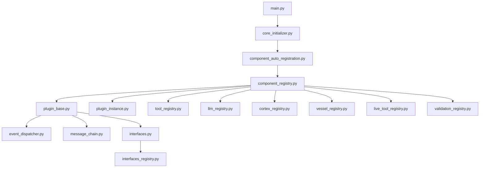

**Diagram sources**
- [main.py:1-200](file://main.py#L1-L200)
- [core_initializer.py:1-200](file://core/core_initializer.py#L1-L200)
- [component_auto_registration.py:1-200](file://core/component_auto_registration.py#L1-L200)
- [component_registry.py:1-200](file://core/component_registry.py#L1-L200)
- [plugin_base.py:1-200](file://core/plugin_base.py#L1-L200)
- [plugin_instance.py:1-200](file://core/plugin_instance.py#L1-L200)
- [event_dispatcher.py:1-200](file://core/event_dispatcher.py#L1-L200)
- [message_chain.py:1-200](file://core/message_chain.py#L1-L200)
- [interfaces.py:1-200](file://core/interfaces.py#L1-L200)
- [interfaces_registry.py:1-200](file://core/interfaces_registry.py#L1-L200)
- [tool_registry.py:1-200](file://core/tool_registry.py#L1-L200)
- [llm_registry.py:1-200](file://core/llm_registry.py#L1-L200)
- [cortex_registry.py:1-200](file://core/cortex_registry.py#L1-L200)
- [vessel_registry.py:1-200](file://core/vessel_registry.py#L1-L200)
- [live_tool_registry.py:1-200](file://core/live_tool_registry.py#L1-L200)
- [validation_registry.py:1-200](file://core/validation_registry.py#L1-L200)

**Section sources**
- [main.py:1-200](file://main.py#L1-L200)
- [core_initializer.py:1-200](file://core/core_initializer.py#L1-L200)
- [component_auto_registration.py:1-200](file://core/component_auto_registration.py#L1-L200)
- [component_registry.py:1-200](file://core/component_registry.py#L1-L200)

## Core Components
- Base plugin class and instance management define the contract for all plugins, including lifecycle hooks, configuration access, and dependency injection.
- Auto-registration scans plugin packages and registers components into centralized registries (tools, LLM engines, cortex actions, vessel behaviors, live tools, validations).
- Event dispatcher and message chain provide asynchronous communication and processing pipelines for messages and events across plugins.
- Interfaces and their registry expose capabilities to both internal subsystems and external clients.

Key responsibilities:
- Lifecycle: initialize, start, stop, and cleanup phases for each plugin.
- Configuration: typed configuration via config manager and per-plugin settings.
- Dependency Injection: services and registries injected into plugin instances at startup.
- Discovery: automatic detection of plugin modules and their metadata.

**Section sources**
- [plugin_base.py:1-200](file://core/plugin_base.py#L1-L200)
- [plugin_instance.py:1-200](file://core/plugin_instance.py#L1-L200)
- [component_auto_registration.py:1-200](file://core/component_auto_registration.py#L1-L200)
- [component_registry.py:1-200](file://core/component_registry.py#L1-L200)
- [event_dispatcher.py:1-200](file://core/event_dispatcher.py#L1-L200)
- [message_chain.py:1-200](file://core/message_chain.py#L1-L200)
- [interfaces.py:1-200](file://core/interfaces.py#L1-L200)
- [interfaces_registry.py:1-200](file://core/interfaces_registry.py#L1-L200)

## Architecture Overview
At runtime, the application bootstraps core services, discovers plugins, initializes them, and wires up event-driven flows. Plugins can register tools, LLM adapters, cortex actions, vessel behaviors, live tool executors, and validation rules. They communicate through the event dispatcher and message chain, and they consume configuration from the central config manager.

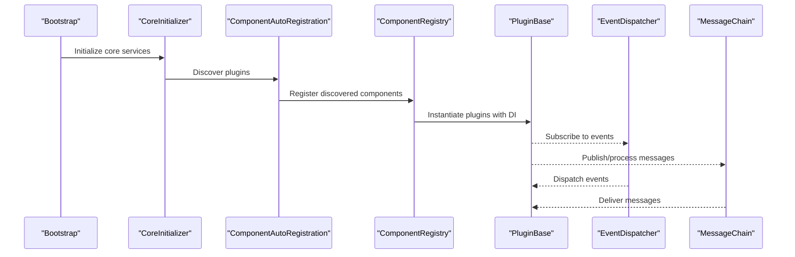

**Diagram sources**
- [core_initializer.py:1-200](file://core/core_initializer.py#L1-L200)
- [component_auto_registration.py:1-200](file://core/component_auto_registration.py#L1-L200)
- [component_registry.py:1-200](file://core/component_registry.py#L1-L200)
- [plugin_base.py:1-200](file://core/plugin_base.py#L1-L200)
- [event_dispatcher.py:1-200](file://core/event_dispatcher.py#L1-L200)
- [message_chain.py:1-200](file://core/message_chain.py#L1-L200)

## Detailed Component Analysis

### Plugin Base and Instance Management
The base plugin defines lifecycle methods and common utilities. Instances are created with dependency injection and registered into the component registry. Plugins can subscribe to events and interact with the message pipeline.

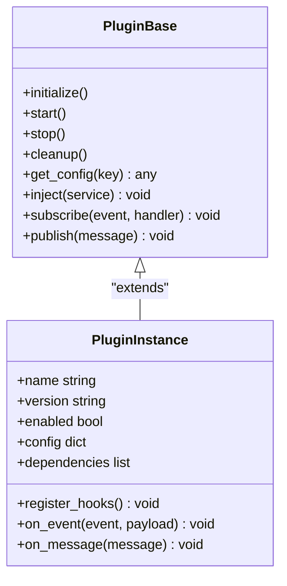

**Diagram sources**
- [plugin_base.py:1-200](file://core/plugin_base.py#L1-L200)
- [plugin_instance.py:1-200](file://core/plugin_instance.py#L1-L200)

**Section sources**
- [plugin_base.py:1-200](file://core/plugin_base.py#L1-L200)
- [plugin_instance.py:1-200](file://core/plugin_instance.py#L1-L200)

### Auto-Registration and Component Discovery
Auto-registration scans plugin directories, loads metadata, and registers components into various registries. It supports multiple component types such as tools, LLM engines, cortex actions, vessel behaviors, live tools, and validators.

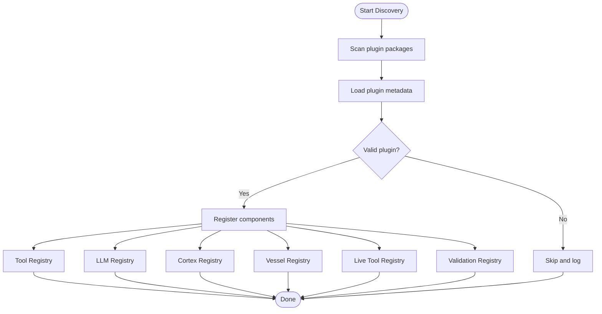

**Diagram sources**
- [component_auto_registration.py:1-200](file://core/component_auto_registration.py#L1-L200)
- [component_registry.py:1-200](file://core/component_registry.py#L1-L200)
- [tool_registry.py:1-200](file://core/tool_registry.py#L1-L200)
- [llm_registry.py:1-200](file://core/llm_registry.py#L1-L200)
- [cortex_registry.py:1-200](file://core/cortex_registry.py#L1-L200)
- [vessel_registry.py:1-200](file://core/vessel_registry.py#L1-L200)
- [live_tool_registry.py:1-200](file://core/live_tool_registry.py#L1-L200)
- [validation_registry.py:1-200](file://core/validation_registry.py#L1-L200)

**Section sources**
- [component_auto_registration.py:1-200](file://core/component_auto_registration.py#L1-L200)
- [component_registry.py:1-200](file://core/component_registry.py#L1-L200)

### Event Dispatcher and Message Chain
Plugins use the event dispatcher to subscribe to domain events and the message chain to process inbound/outbound messages asynchronously. This decouples plugins and enables scalable processing.

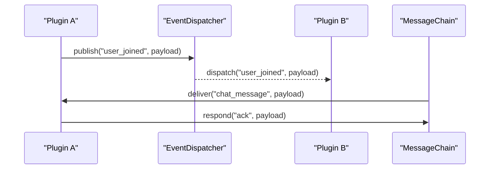

**Diagram sources**
- [event_dispatcher.py:1-200](file://core/event_dispatcher.py#L1-L200)
- [message_chain.py:1-200](file://core/message_chain.py#L1-L200)

**Section sources**
- [event_dispatcher.py:1-200](file://core/event_dispatcher.py#L1-L200)
- [message_chain.py:1-200](file://core/message_chain.py#L1-L200)

### Interfaces and Registries
Interfaces define contracts for external integrations and internal subsystems. The interfaces registry exposes these capabilities to other components and external clients.

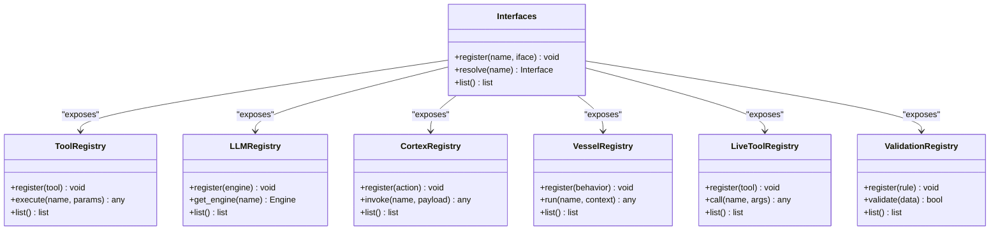

**Diagram sources**
- [interfaces.py:1-200](file://core/interfaces.py#L1-L200)
- [interfaces_registry.py:1-200](file://core/interfaces_registry.py#L1-L200)
- [tool_registry.py:1-200](file://core/tool_registry.py#L1-L200)
- [llm_registry.py:1-200](file://core/llm_registry.py#L1-L200)
- [cortex_registry.py:1-200](file://core/cortex_registry.py#L1-L200)
- [vessel_registry.py:1-200](file://core/vessel_registry.py#L1-L200)
- [live_tool_registry.py:1-200](file://core/live_tool_registry.py#L1-L200)
- [validation_registry.py:1-200](file://core/validation_registry.py#L1-L200)

**Section sources**
- [interfaces.py:1-200](file://core/interfaces.py#L1-L200)
- [interfaces_registry.py:1-200](file://core/interfaces_registry.py#L1-L200)

### Example Plugin Types

#### Message Processor Plugin
Message processor plugins handle incoming messages, transform payloads, and route responses. They typically subscribe to message events and publish processed results.

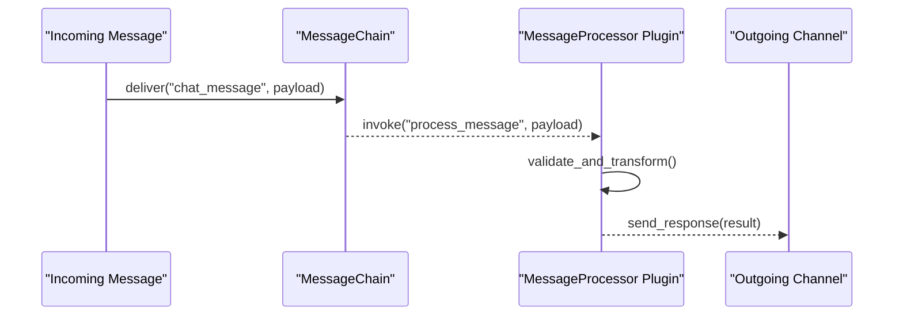

**Diagram sources**
- [message_plugin.py:1-200](file://plugins/message_plugin/__init__.py#L1-L200)
- [message_chain.py:1-200](file://core/message_chain.py#L1-L200)

**Section sources**
- [message_plugin.py:1-200](file://plugins/message_plugin/__init__.py#L1-L200)

#### Action Handler Plugin
Action handler plugins implement specific actions invoked by the agent or cortex. They register actions via the cortex registry and execute logic based on action schemas.

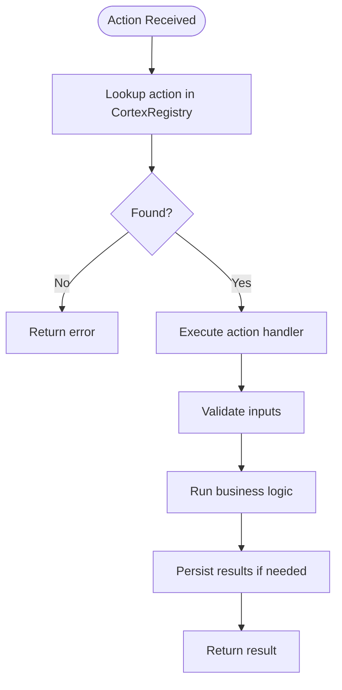

**Diagram sources**
- [grillo_plugin.py:1-200](file://plugins/grillo_plugin.py#L1-L200)
- [cortex_registry.py:1-200](file://core/cortex_registry.py#L1-L200)

**Section sources**
- [grillo_plugin.py:1-200](file://plugins/grillo_plugin.py#L1-L200)

#### Event Listener Plugin
Event listener plugins subscribe to domain events and react accordingly. They use the event dispatcher to register handlers and perform side effects.

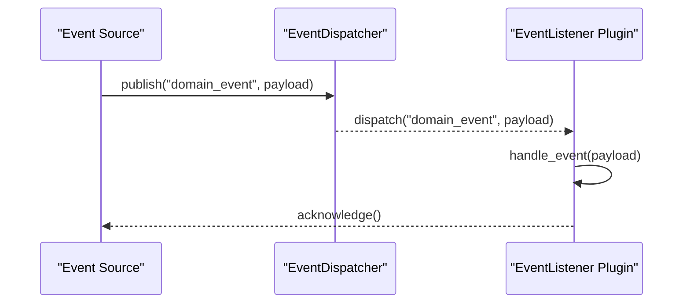

**Diagram sources**
- [event_plugin.py:1-200](file://plugins/event_plugin/__init__.py#L1-L200)
- [event_dispatcher.py:1-200](file://core/event_dispatcher.py#L1-L200)

**Section sources**
- [event_plugin.py:1-200](file://plugins/event_plugin/__init__.py#L1-L200)

#### External Service Integration Plugin
External service integration plugins connect to third-party APIs (e.g., TTS, voice recognition, weather). They manage authentication, retries, and rate limiting.

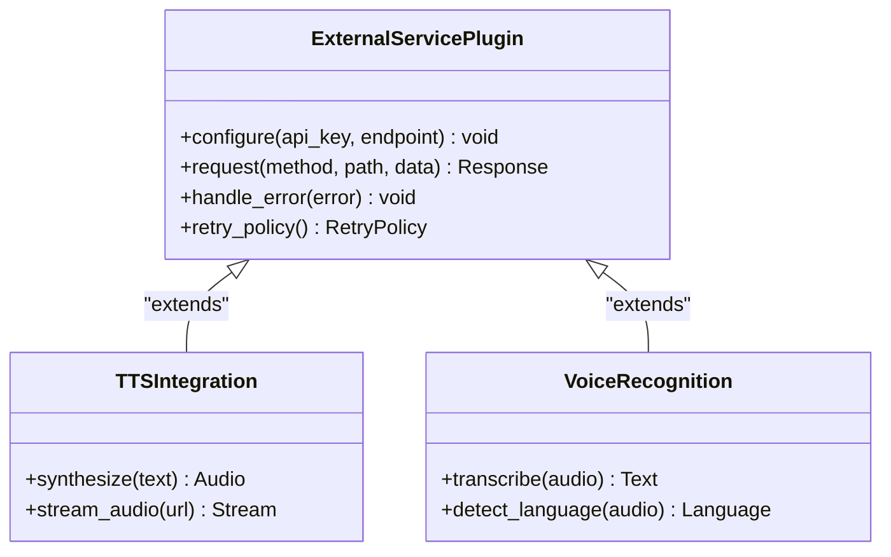

**Diagram sources**
- [tts_lipsync.py:1-200](file://plugins/tts_lipsync/__init__.py#L1-L200)
- [auris_plugin.py:1-200](file://plugins/auris_plugin/__init__.py#L1-L200)
- [weather_plugin.py:1-200](file://plugins/weather_plugin/__init__.py#L1-L200)

**Section sources**
- [tts_lipsync.py:1-200](file://plugins/tts_lipsync/__init__.py#L1-L200)
- [auris_plugin.py:1-200](file://plugins/auris_plugin/__init__.py#L1-L200)
- [weather_plugin.py:1-200](file://plugins/weather_plugin/__init__.py#L1-L200)

### Base Classes and Hooks
Synthetic Heart provides base classes for different plugin domains:
- AI plugin base for LLM interactions
- Live base for real-time sessions
- Auris base for voice recognition
- Iris base for vision tasks
- Vox base for voice synthesis

These bases encapsulate common patterns like configuration, retry policies, and lifecycle hooks.

**Section sources**
- [ai_plugin_base.py:1-200](file://core/ai_plugin_base.py#L1-L200)
- [live_base.py:1-200](file://plugins/live_base.py#L1-L200)
- [auris_base.py:1-200](file://plugins/auris_base.py#L1-L200)
- [iris_base.py:1-200](file://plugins/iris_base.py#L1-L200)
- [vox_base.py:1-200](file://plugins/vox_base.py#L1-L200)

### Concrete Plugin Examples
- Time plugin: injects time context into prompts and actions.
- Bio manager: manages biological state and health metrics.
- Emotion manager: tracks and updates emotional states.
- Memory search: queries memory stores for relevant context.
- Soul plugin: integrates soul-related functionality.
- Web search plugin: orchestrates web searches and returns results.
- Vox plugin: manages voice synthesis engines.
- Iris plugin: handles vision-related tasks.

**Section sources**
- [time_plugin.py:1-200](file://plugins/time_plugin/__init__.py#L1-L200)
- [bio_manager.py:1-200](file://plugins/bio_manager/__init__.py#L1-L200)
- [emotion_manager.py:1-200](file://plugins/emotion_manager/__init__.py#L1-L200)
- [memory_search.py:1-200](file://plugins/memory_search/__init__.py#L1-L200)
- [soul_plugin.py:1-200](file://plugins/soul_plugin/__init__.py#L1-L200)
- [web_search_plugin.py:1-200](file://plugins/web_search_plugin/__init__.py#L1-L200)
- [vox_plugin.py:1-200](file://plugins/vox_plugin/__init__.py#L1-L200)
- [iris_plugin.py:1-200](file://plugins/iris_plugin/__init__.py#L1-L200)

## Dependency Analysis
Plugins depend on core registries and services. Auto-registration ensures that dependencies are resolved before plugin initialization. Inter-plugin communication occurs through events and messages, minimizing direct coupling.

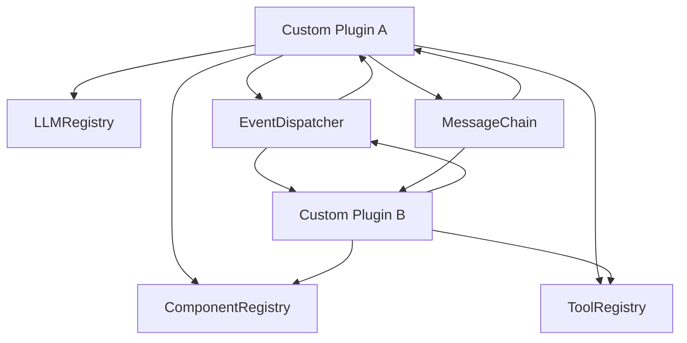

**Diagram sources**
- [component_registry.py:1-200](file://core/component_registry.py#L1-L200)
- [tool_registry.py:1-200](file://core/tool_registry.py#L1-L200)
- [llm_registry.py:1-200](file://core/llm_registry.py#L1-L200)
- [event_dispatcher.py:1-200](file://core/event_dispatcher.py#L1-L200)
- [message_chain.py:1-200](file://core/message_chain.py#L1-L200)

**Section sources**
- [component_registry.py:1-200](file://core/component_registry.py#L1-L200)
- [tool_registry.py:1-200](file://core/tool_registry.py#L1-L200)
- [llm_registry.py:1-200](file://core/llm_registry.py#L1-L200)
- [event_dispatcher.py:1-200](file://core/event_dispatcher.py#L1-L200)
- [message_chain.py:1-200](file://core/message_chain.py#L1-L200)

## Performance Considerations
- Use async operations for I/O-bound tasks to avoid blocking the event loop.
- Implement caching for expensive computations and API calls.
- Apply rate limiting and backoff strategies for external service calls.
- Minimize memory usage by streaming large payloads and avoiding unnecessary object creation.
- Profile plugin execution paths and optimize hot loops.

[No sources needed since this section provides general guidance]

## Troubleshooting Guide
Common issues and resolutions:
- Plugin not loading: Check auto-registration logs and ensure plugin metadata is valid.
- Event not dispatched: Verify event names and subscription handlers.
- Message processing errors: Inspect message chain logs and payload validation.
- External API failures: Configure retries and inspect error handling in plugins.
- Configuration errors: Validate config schema and environment variables.

**Section sources**
- [component_auto_registration.py:1-200](file://core/component_auto_registration.py#L1-L200)
- [event_dispatcher.py:1-200](file://core/event_dispatcher.py#L1-L200)
- [message_chain.py:1-200](file://core/message_chain.py#L1-L200)
- [config_manager.py:1-200](file://core/config_manager.py#L1-L200)

## Conclusion
Synthetic Heart’s plugin system provides a robust foundation for extensibility through well-defined interfaces, automatic discovery, and event-driven communication. By leveraging base classes and registries, developers can create powerful plugins that integrate seamlessly with the core system. Following the guidelines in this document ensures secure, isolated, and high-performance plugin development.

[No sources needed since this section summarizes without analyzing specific files]

## Appendices

### Step-by-Step Development Guides

#### Creating a Message Processor Plugin
1. Extend the appropriate base class for message handling.
2. Implement message validation and transformation logic.
3. Subscribe to message events using the event dispatcher.
4. Publish processed results to the message chain.
5. Register the plugin via auto-registration or manual registration.

**Section sources**
- [message_plugin.py:1-200](file://plugins/message_plugin/__init__.py#L1-L200)
- [event_dispatcher.py:1-200](file://core/event_dispatcher.py#L1-L200)
- [message_chain.py:1-200](file://core/message_chain.py#L1-L200)

#### Creating an Action Handler Plugin
1. Define action schemas and handlers.
2. Register actions with the cortex registry.
3. Implement input validation and business logic.
4. Handle errors and return structured responses.
5. Test action execution with sample payloads.

**Section sources**
- [grillo_plugin.py:1-200](file://plugins/grillo_plugin.py#L1-L200)
- [cortex_registry.py:1-200](file://core/cortex_registry.py#L1-L200)

#### Creating an Event Listener Plugin
1. Identify domain events to listen for.
2. Subscribe to events using the event dispatcher.
3. Implement event handlers with proper error handling.
4. Perform side effects like logging or state updates.
5. Unsubscribe during plugin cleanup.

**Section sources**
- [event_plugin.py:1-200](file://plugins/event_plugin/__init__.py#L1-L200)
- [event_dispatcher.py:1-200](file://core/event_dispatcher.py#L1-L200)

#### Creating an External Service Integration Plugin
1. Choose the appropriate base class for the service type.
2. Configure authentication and endpoints.
3. Implement request/response handling with retries.
4. Add rate limiting and error recovery.
5. Test with mock services and real endpoints.

**Section sources**
- [tts_lipsync.py:1-200](file://plugins/tts_lipsync/__init__.py#L1-L200)
- [auris_plugin.py:1-200](file://plugins/auris_plugin/__init__.py#L1-L200)
- [weather_plugin.py:1-200](file://plugins/weather_plugin/__init__.py#L1-L200)

### Testing Strategies
- Unit tests for individual plugin methods.
- Integration tests for event flows and message processing.
- Mock external services for reliable testing.
- Performance tests for high-throughput scenarios.
- Security tests for input validation and authorization.

**Section sources**
- [test_component_loading.py:1-200](file://tests/test_component_loading.py#L1-L200)
- [test_message_queue.py:1-200](file://tests/test_message_queue.py#L1-L200)
- [test_event_static_injection.py:1-200](file://tests/test_event_static_injection.py#L1-L200)

### Deployment Procedures
- Package plugins as separate modules or packages.
- Include plugin metadata for auto-discovery.
- Configure environment variables and secrets securely.
- Deploy using containerization or package managers.
- Monitor plugin health and performance metrics.

**Section sources**
- [component_auto_registration.py:1-200](file://core/component_auto_registration.py#L1-L200)
- [config_manager.py:1-200](file://core/config_manager.py#L1-L200)

### Security and Isolation
- Validate all inputs and sanitize outputs.
- Use least privilege principles for plugin permissions.
- Isolate plugin execution environments where possible.
- Audit plugin behavior and log security events.
- Regularly update dependencies and patch vulnerabilities.

**Section sources**
- [validation_registry.py:1-200](file://core/validation_registry.py#L1-L200)
- [config_manager.py:1-200](file://core/config_manager.py#L1-L200)