# Plugin Types & Examples

<cite>
**Referenced Files in This Document**
- [core/plugin_base.py](file://core/plugin_base.py)
- [core/plugin_instance.py](file://core/plugin_instance.py)
- [plugins/grillo_plugin.py](file://plugins/grillo_plugin.py)
- [plugins/grillo/grillo_impl.py](file://plugins/grillo/grillo_impl.py)
- [plugins/auris_plugin/auris_plugin.py](file://plugins/auris_plugin/auris_plugin.py)
- [plugins/auris_engines/vosk_engine.py](file://plugins/auris_engines/vosk_engine.py)
- [plugins/vox_plugin/vox_plugin.py](file://plugins/vox_plugin/vox_plugin.py)
- [plugins/vox_engines/http.py](file://plugins/vox_engines/http.py)
- [plugins/web_search_plugin/web_search_plugin.py](file://plugins/web_search_plugin/web_search_plugin.py)
- [plugins/web_search/search_orchestrator.py](file://plugins/web_search/search_orchestrator.py)
- [plugins/weather_plugin/weather_plugin.py](file://plugins/weather_plugin/weather_plugin.py)
- [core/interfaces.py](file://core/interfaces.py)
- [core/component_registry.py](file://core/component_registry.py)
- [core/config_manager.py](file://core/config_manager.py)
- [tests/test_grillo_observer.py](file://tests/test_grillo_observer.py)
- [tests/test_auris_plugin.py](file://tests/test_auris_plugin.py)
- [tests/test_vox_plugin.py](file://tests/test_vox_plugin.py)
- [tests/test_web_search_orchestrator.py](file://tests/test_web_search_orchestrator.py)
- [tests/test_weather_plugin.py](file://tests/test_weather_plugin.py)
</cite>

## Table of Contents
1. [Introduction](#introduction)
2. [Project Structure](#project-structure)
3. [Core Components](#core-components)
4. [Architecture Overview](#architecture-overview)
5. [Detailed Component Analysis](#detailed-component-analysis)
6. [Dependency Analysis](#dependency-analysis)
7. [Performance Considerations](#performance-considerations)
8. [Troubleshooting Guide](#troubleshooting-guide)
9. [Conclusion](#conclusion)
10. [Appendices](#appendices)

## Introduction
This document explains the plugin ecosystem in Synthetic Heart with a focus on:
- Message processing plugins (e.g., Grillo for memory management and lifecycle control)
- Voice recognition plugins (e.g., Auris)
- Text-to-speech plugins (e.g., Vox)
- External service integrations (e.g., web search and weather)

For each plugin type, we describe the interfaces used, key methods to implement, integration patterns, configuration options, performance considerations, error handling, testing approaches, and how to extend or create hybrid plugins. Concrete code examples are referenced via file paths and line ranges so you can explore real-world implementations directly.

## Project Structure
Synthetic Heart organizes plugins under the plugins directory, with shared base classes and registries in core. Each plugin typically includes:
- A plugin entry module that registers itself
- One or more engine modules implementing specific backends
- Documentation guides describing configuration and usage
- Tests validating behavior

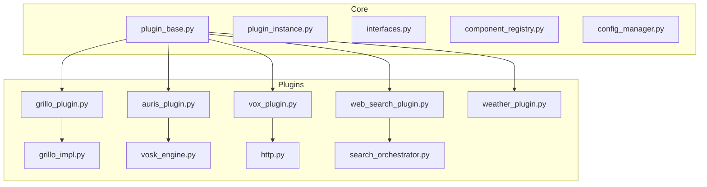

**Diagram sources**
- [core/plugin_base.py](file://core/plugin_base.py)
- [core/plugin_instance.py](file://core/plugin_instance.py)
- [core/interfaces.py](file://core/interfaces.py)
- [core/component_registry.py](file://core/component_registry.py)
- [core/config_manager.py](file://core/config_manager.py)
- [plugins/grillo_plugin.py](file://plugins/grillo_plugin.py)
- [plugins/grillo/grillo_impl.py](file://plugins/grillo/grillo_impl.py)
- [plugins/auris_plugin/auris_plugin.py](file://plugins/auris_plugin/auris_plugin.py)
- [plugins/auris_engines/vosk_engine.py](file://plugins/auris_engines/vosk_engine.py)
- [plugins/vox_plugin/vox_plugin.py](file://plugins/vox_plugin/vox_plugin.py)
- [plugins/vox_engines/http.py](file://plugins/vox_engines/http.py)
- [plugins/web_search_plugin/web_search_plugin.py](file://plugins/web_search_plugin/web_search_plugin.py)
- [plugins/web_search/search_orchestrator.py](file://plugins/web_search/search_orchestrator.py)
- [plugins/weather_plugin/weather_plugin.py](file://plugins/weather_plugin/weather_plugin.py)

**Section sources**
- [core/plugin_base.py](file://core/plugin_base.py)
- [core/plugin_instance.py](file://core/plugin_instance.py)
- [core/component_registry.py](file://core/component_registry.py)
- [core/config_manager.py](file://core/config_manager.py)

## Core Components
Synthetic Heart’s plugin system is built around a small set of core abstractions:
- Base plugin class defining lifecycle hooks and configuration handling
- Plugin instance manager for loading, initializing, and disposing plugins
- Interface contracts for message processing, voice recognition, TTS, and external services
- Registry mechanisms for auto-discovery and runtime selection
- Configuration manager for per-plugin settings

Key responsibilities:
- Lifecycle: init, start, stop, dispose
- Configuration: validate, merge defaults, expose typed parameters
- Integration: register engines, adapters, and endpoints
- Observability: logging, metrics, and error propagation

**Section sources**
- [core/plugin_base.py](file://core/plugin_base.py)
- [core/plugin_instance.py](file://core/plugin_instance.py)
- [core/interfaces.py](file://core/interfaces.py)
- [core/component_registry.py](file://core/component_registry.py)
- [core/config_manager.py](file://core/config_manager.py)

## Architecture Overview
The plugin architecture separates concerns between orchestration (core) and implementation (plugins). Plugins register themselves and their engines/adapters through registries. The core initializes them according to configuration and exposes stable interfaces to the rest of the system.

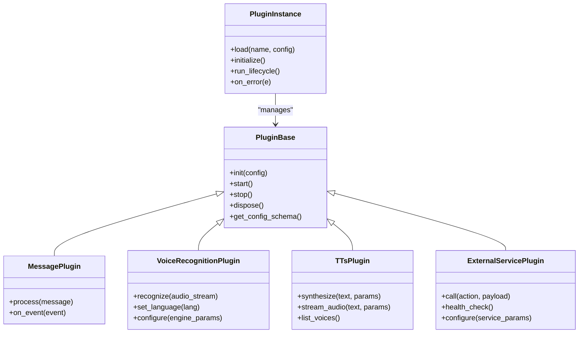

**Diagram sources**
- [core/plugin_base.py](file://core/plugin_base.py)
- [core/plugin_instance.py](file://core/plugin_instance.py)
- [core/interfaces.py](file://core/interfaces.py)

## Detailed Component Analysis

### Message Processing Plugins: Grillo
Grillo provides memory management, observation, compaction, and lifecycle automation for chat history and agent state. It implements a message processing plugin pattern by observing messages, applying rules, and triggering background tasks.

Key aspects:
- Interfaces: message observer, action executor, event emitter
- Core methods: observe_message, evaluate_action, schedule_compaction, handle_dreams
- Configuration: retention policies, tagging rules, compaction thresholds, LLM failure recovery toggles
- Integration: registers with the message pipeline and heartbeat scheduler

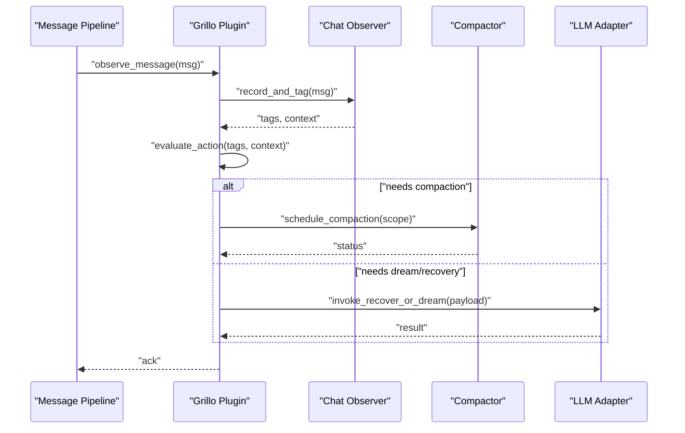

Configuration highlights:
- Retention windows and pruning thresholds
- Tagging and clustering strategies
- LLM failure retry/backoff and fallback behaviors
- Scheduler intervals for compaction and reflection tasks

Performance considerations:
- Batch operations for compaction
- Lazy evaluation of expensive actions
- Asynchronous scheduling to avoid blocking message flow

Error handling:
- Graceful degradation when LLM calls fail
- Retry with exponential backoff
- Fallback to rule-based decisions

Testing approach:
- Mock message streams and LLM responses
- Assert compaction triggers and tag propagation
- Validate scheduler invocations and timing

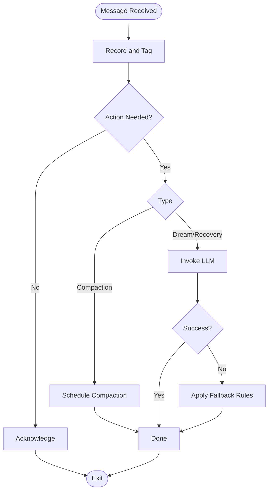

**Diagram sources**
- [plugins/grillo_plugin.py](file://plugins/grillo_plugin.py)
- [plugins/grillo/grillo_impl.py](file://plugins/grillo/grillo_impl.py)

**Section sources**
- [plugins/grillo_plugin.py](file://plugins/grillo_plugin.py)
- [plugins/grillo/grillo_impl.py](file://plugins/grillo/grillo_impl.py)
- [tests/test_grillo_observer.py](file://tests/test_grillo_observer.py)

### Voice Recognition Plugins: Auris
Auris implements speech-to-text recognition with pluggable engines. The plugin manages audio capture, language detection, and engine selection. Engines like Vosk provide local transcription capabilities.

Key aspects:
- Interfaces: recognize(audio), configure(engine_params), set_language(lang)
- Core methods: stream_to_text, detect_language, manage_session
- Configuration: engine selection, model paths, language codes, buffer sizes
- Integration: integrates with live sessions and media pipelines

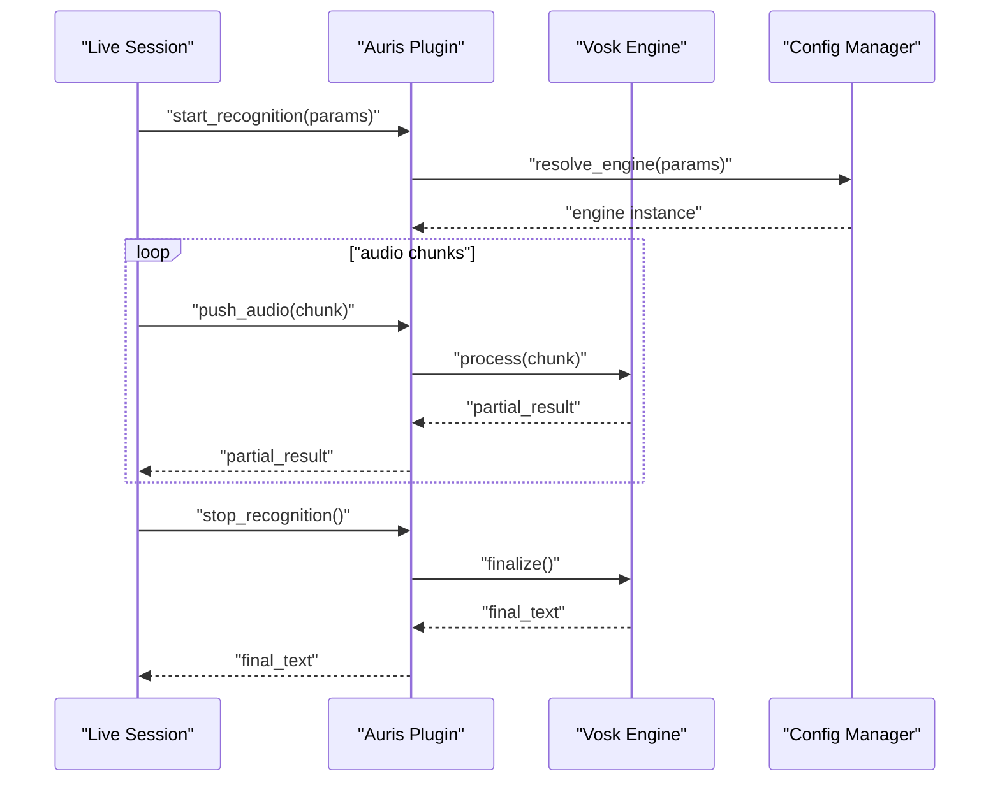

Configuration highlights:
- Engine-specific model paths and thresholds
- Language preference and auto-detection flags
- Buffer size and latency tuning

Performance considerations:
- Streaming recognition to reduce latency
- Efficient audio buffering and chunking
- Engine initialization caching

Error handling:
- Engine startup failures with fallback engines
- Timeout and partial result handling
- Resource cleanup on errors

Testing approach:
- Inject mock audio streams and engine responses
- Validate partial and final results
- Test engine switching and configuration validation

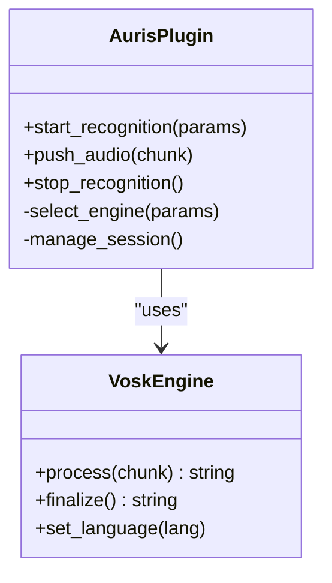

**Diagram sources**
- [plugins/auris_plugin/auris_plugin.py](file://plugins/auris_plugin/auris_plugin.py)
- [plugins/auris_engines/vosk_engine.py](file://plugins/auris_engines/vosk_engine.py)

**Section sources**
- [plugins/auris_plugin/auris_plugin.py](file://plugins/auris_plugin/auris_plugin.py)
- [plugins/auris_engines/vosk_engine.py](file://plugins/auris_engines/vosk_engine.py)
- [tests/test_auris_plugin.py](file://tests/test_auris_plugin.py)

### Text-to-Speech Plugins: Vox
Vox provides text-to-speech synthesis with multiple engines. The plugin abstracts synthesis and streaming, allowing different backends such as HTTP-based TTS services.

Key aspects:
- Interfaces: synthesize(text, params), stream_audio(text, params), list_voices()
- Core methods: select_engine, build_payload, parse_response, stream_chunks
- Configuration: engine selection, voice IDs, speed/pitch controls, endpoint URLs
- Integration: integrates with live sessions and media playback

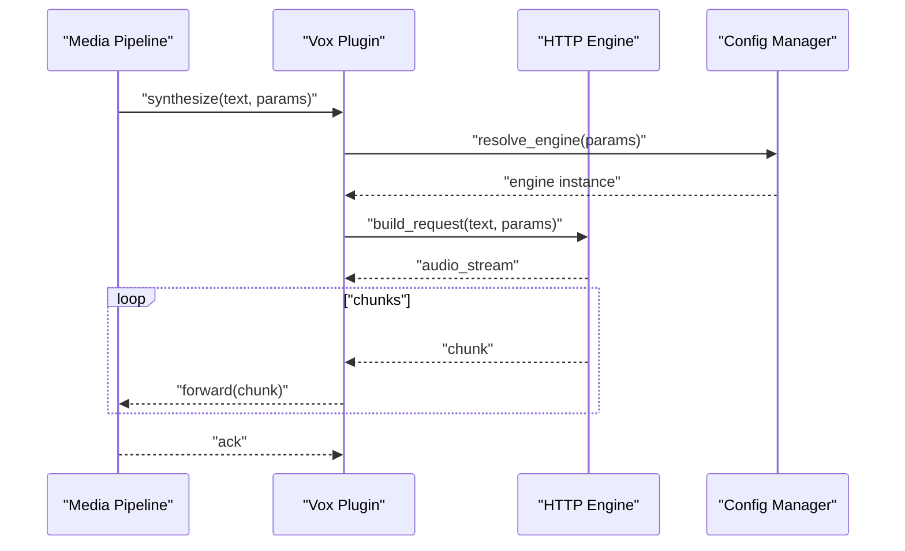

Configuration highlights:
- Endpoint URLs and authentication tokens
- Voice selection and customization parameters
- Chunk size and streaming behavior

Performance considerations:
- Streaming audio to minimize latency
- Connection pooling and retries
- Caching of voices and metadata

Error handling:
- Network timeouts and retries
- Invalid response parsing with fallback
- Graceful degradation to default voices

Testing approach:
- Mock HTTP endpoints and audio streams
- Validate payload construction and response parsing
- Test streaming behavior and error paths

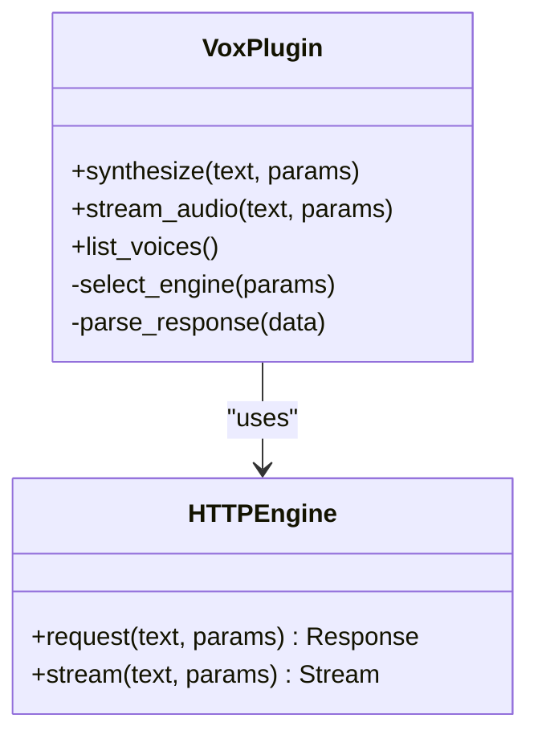

**Diagram sources**
- [plugins/vox_plugin/vox_plugin.py](file://plugins/vox_plugin/vox_plugin.py)
- [plugins/vox_engines/http.py](file://plugins/vox_engines/http.py)

**Section sources**
- [plugins/vox_plugin/vox_plugin.py](file://plugins/vox_plugin/vox_plugin.py)
- [plugins/vox_engines/http.py](file://plugins/vox_engines/http.py)
- [tests/test_vox_plugin.py](file://tests/test_vox_plugin.py)

### External Service Integrations: Web Search and Weather
These plugins integrate with external APIs to enrich agent capabilities. They follow a common pattern: define an action schema, construct requests, parse responses, and return structured data.

Web Search:
- Orchestrates multiple search engines and caches results
- Supports query expansion, deduplication, and result ranking
- Configuration includes engine priorities, API keys, and rate limits

Weather:
- Fetches current conditions and forecasts
- Handles geocoding and unit conversions
- Configuration includes provider credentials and location preferences

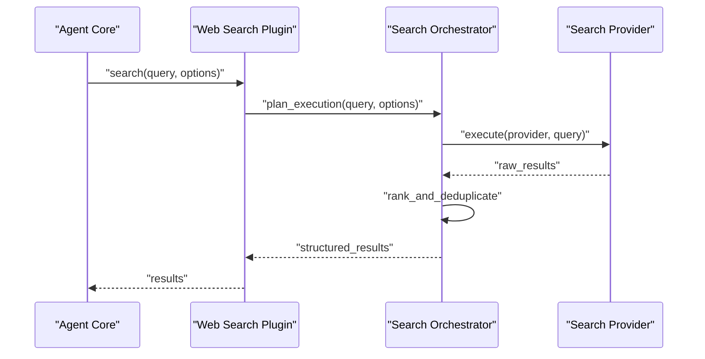

Configuration highlights:
- Provider endpoints and authentication
- Rate limiting and retry policies
- Caching strategies and TTL

Performance considerations:
- Parallel execution across providers
- Result caching and memoization
- Streaming large payloads where possible

Error handling:
- Provider failures with fallback providers
- Partial results aggregation
- Timeout and circuit breaker patterns

Testing approach:
- Mock provider responses and network errors
- Validate orchestration logic and ranking
- Assert caching behavior and TTL expiration

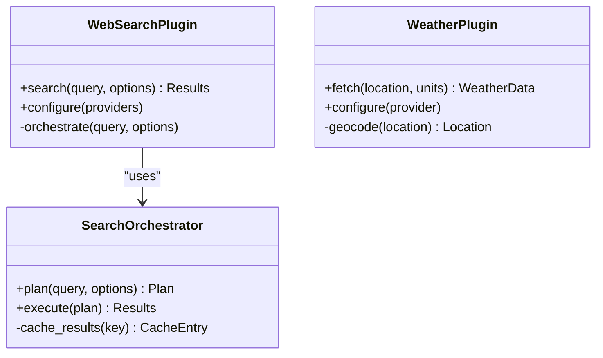

**Diagram sources**
- [plugins/web_search_plugin/web_search_plugin.py](file://plugins/web_search_plugin/web_search_plugin.py)
- [plugins/web_search/search_orchestrator.py](file://plugins/web_search/search_orchestrator.py)
- [plugins/weather_plugin/weather_plugin.py](file://plugins/weather_plugin/weather_plugin.py)

**Section sources**
- [plugins/web_search_plugin/web_search_plugin.py](file://plugins/web_search_plugin/web_search_plugin.py)
- [plugins/web_search/search_orchestrator.py](file://plugins/web_search/search_orchestrator.py)
- [plugins/weather_plugin/weather_plugin.py](file://plugins/weather_plugin/weather_plugin.py)
- [tests/test_web_search_orchestrator.py](file://tests/test_web_search_orchestrator.py)
- [tests/test_weather_plugin.py](file://tests/test_weather_plugin.py)

## Dependency Analysis
Plugins depend on core abstractions and registries for lifecycle and configuration. Engines and adapters are selected at runtime based on configuration.

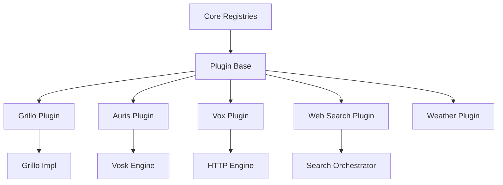

**Diagram sources**
- [core/component_registry.py](file://core/component_registry.py)
- [core/plugin_base.py](file://core/plugin_base.py)
- [plugins/grillo_plugin.py](file://plugins/grillo_plugin.py)
- [plugins/auris_plugin/auris_plugin.py]
- [plugins/vox_plugin/vox_plugin.py]
- [plugins/web_search_plugin/web_search_plugin.py]
- [plugins/weather_plugin/weather_plugin.py]

**Section sources**
- [core/component_registry.py](file://core/component_registry.py)
- [core/config_manager.py](file://core/config_manager.py)

## Performance Considerations
- Use streaming for audio and large payloads to reduce memory pressure
- Implement connection pooling and reuse resources across requests
- Apply caching for repeated queries and static configurations
- Offload heavy computations to background tasks and schedulers
- Profile critical paths and add metrics for observability

[No sources needed since this section provides general guidance]

## Troubleshooting Guide
Common issues and resolutions:
- Plugin initialization failures: check configuration schema and required fields
- Engine selection errors: verify provider credentials and endpoints
- Memory leaks: ensure proper disposal and cleanup in stop/dispose hooks
- Timeouts: adjust retry policies and timeouts for external services
- Testing gaps: use mocks and fixtures to simulate external dependencies

**Section sources**
- [core/config_manager.py](file://core/config_manager.py)
- [core/plugin_instance.py](file://core/plugin_instance.py)

## Conclusion
Synthetic Heart’s plugin system enables flexible, modular extensions for message processing, voice recognition, text-to-speech, and external integrations. By following the established interfaces and patterns, developers can create robust, configurable, and testable plugins that integrate seamlessly with the core.

[No sources needed since this section summarizes without analyzing specific files]

## Appendices

### How to Extend Existing Plugin Types
- Inherit from the appropriate base class in core/plugin_base.py
- Implement required interface methods defined in core/interfaces.py
- Register your plugin using the component registry
- Provide configuration schema and validation

### Creating Hybrid Plugins
- Combine multiple engines or adapters within a single plugin
- Use conditional logic to switch between backends based on context
- Aggregate results from multiple sources and apply ranking or filtering

[No sources needed since this section provides general guidance]