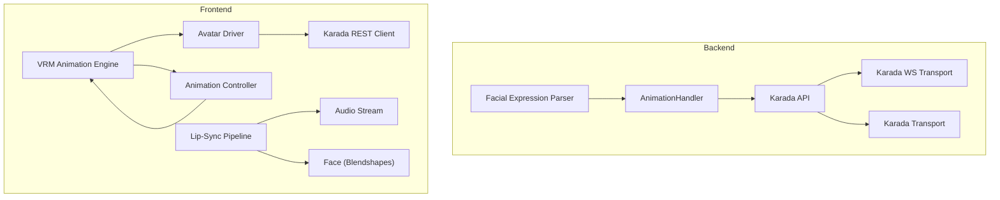
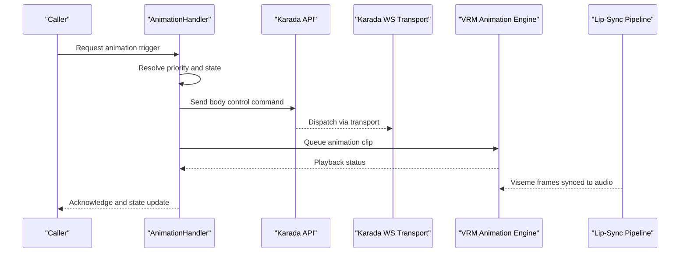
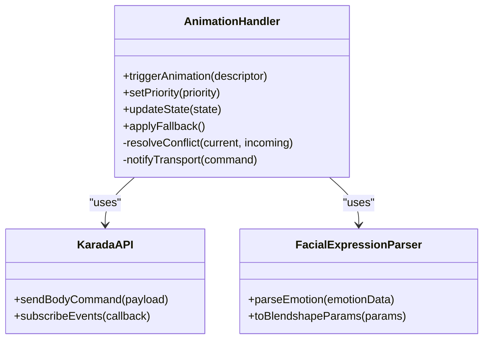
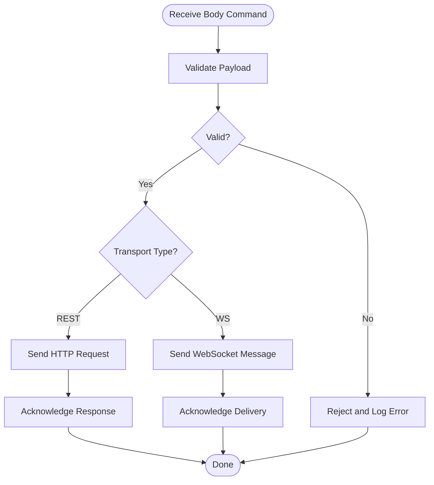
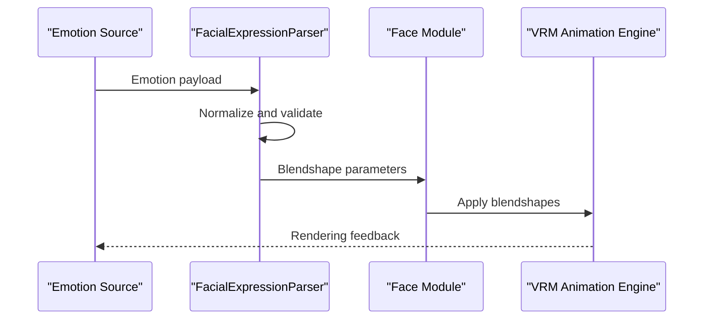
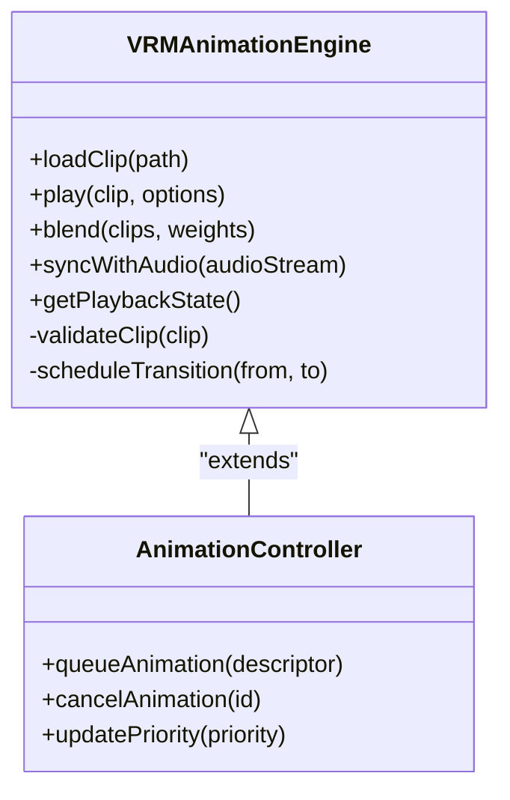
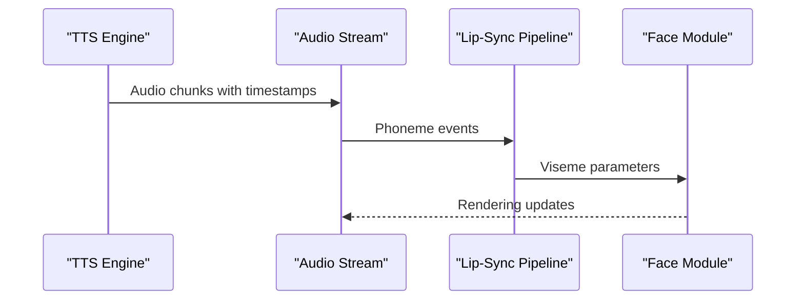
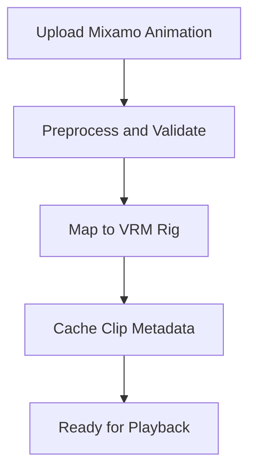
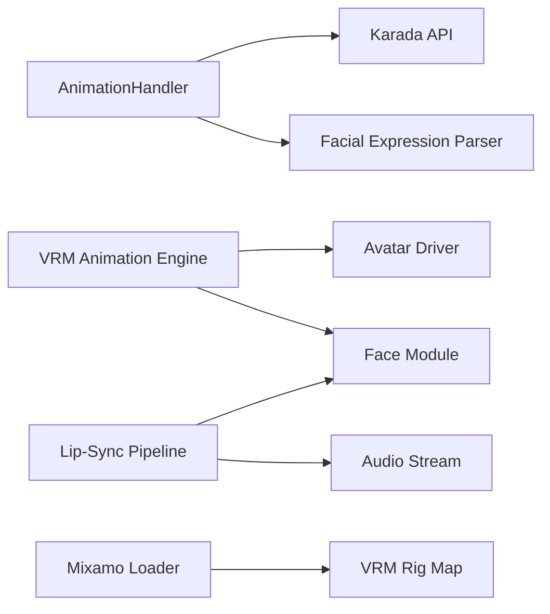

# Animation & Avatar Control

<cite>
**Referenced Files in This Document**
- [animation_handler.py](file://core/animation_handler.py)
- [karada_api.py](file://core/karada_api.py)
- [karada_ws_transport.py](file://core/karada_ws_transport.py)
- [karada_transport.py](file://core/karada_transport.py)
- [facial_expression_parser.py](file://core/facial_expression_parser.py)
- [animation_uploads.py](file://core/animation_uploads.py)
- [vrm-animation-engine.mjs](file://res/synth_webui/js/vrm-animation-engine.mjs)
- [loadMixamoAnimation.js](file://res/synth_webui/js/loadMixamoAnimation.js)
- [mixamoVRMRigMap.js](file://res/synth_webui/js/mixamoVRMRigMap.js)
- [avatar-driver.ts](file://frontend/src/composables/vrm/avatar-driver.ts)
- [face.ts](file://frontend/src/composables/vrm/face.ts)
- [animation.ts](file://frontend/src/composables/vrm/animation.ts)
- [tts_lipsync.py](file://plugins/tts_lipsync/tts_lipsync.py)
- [lip-sync/index.ts](file://frontend/src/lib/lipsync/index.ts)
- [audio-stream.ts](file://frontend/src/services/audio-stream.ts)
- [karada-rest.ts](file://frontend/src/services/karada-rest.ts)
- [animation_system.rst](file://docs/animation_system.rst)
- [vrm_animations.rst](file://docs/vrm_animations.rst)
- [animation_priority_system.md](file://docs/animation_priority_system.md)
- [animation_flow_flexible.rst](file://docs/animation_flow_flexible.rst)
</cite>

## Table of Contents
1. [Introduction](#introduction)
2. [Project Structure](#project-structure)
3. [Core Components](#core-components)
4. [Architecture Overview](#architecture-overview)
5. [Detailed Component Analysis](#detailed-component-analysis)
6. [Dependency Analysis](#dependency-analysis)
7. [Performance Considerations](#performance-considerations)
8. [Troubleshooting Guide](#troubleshooting-guide)
9. [Conclusion](#conclusion)
10. [Appendices](#appendices)

## Introduction
This document explains the animation and avatar control system used to drive VRM avatars, manage animations, and synthesize facial expressions. It covers the backend AnimationHandler architecture, Karada API for body control, the VRM animation engine on the frontend, lip-sync integration, Mixamo import workflows, and best practices for blending, timing, and performance optimization.

## Project Structure
The animation system spans backend Python modules and frontend TypeScript/JavaScript components:
- Backend: AnimationHandler orchestrates animation state, priorities, and Karada transport; facial expression parsing bridges emotion data to avatar expressions.
- Frontend: VRM animation engine drives playback, blending, and timing; face module controls blendshapes; Karada REST client sends body commands; audio stream feeds lip-sync.

**Diagram sources**
- [animation_handler.py](file://core/animation_handler.py)
- [karada_api.py](file://core/karada_api.py)
- [karada_ws_transport.py](file://core/karada_ws_transport.py)
- [karada_transport.py](file://core/karada_transport.py)
- [facial_expression_parser.py](file://core/facial_expression_parser.py)
- [vrm-animation-engine.mjs](file://res/synth_webui/js/vrm-animation-engine.mjs)
- [avatar-driver.ts](file://frontend/src/composables/vrm/avatar-driver.ts)
- [face.ts](file://frontend/src/composables/vrm/face.ts)
- [animation.ts](file://frontend/src/composables/vrm/animation.ts)
- [tts_lipsync.py](file://plugins/tts_lipsync/tts_lipsync.py)
- [lip-sync/index.ts](file://frontend/src/lib/lipsync/index.ts)
- [audio-stream.ts](file://frontend/src/services/audio-stream.ts)
- [karada-rest.ts](file://frontend/src/services/karada-rest.ts)

**Section sources**
- [animation_system.rst](file://docs/animation_system.rst)
- [vrm_animations.rst](file://docs/vrm_animations.rst)
- [animation_priority_system.md](file://docs/animation_priority_system.md)
- [animation_flow_flexible.rst](file://docs/animation_flow_flexible.rst)

## Core Components
- AnimationHandler: Central coordinator for animation lifecycle, priority resolution, transitions, and fallbacks. Integrates with Karada for body control and facial expression parser for emotion-driven expressions.
- Karada API: Unified interface to send body pose and gesture commands via REST or WebSocket transports.
- Facial Expression Parser: Converts structured emotion/expression payloads into avatar-friendly parameters (e.g., blendshapes).
- VRM Animation Engine: Manages animation clips, blending, timing, and synchronization on the VRM model.
- Lip-Sync Pipeline: Synchronizes mouth movements with TTS audio streams using phoneme-to-viseme mapping.

Key responsibilities:
- Priority-based animation scheduling and conflict resolution
- Smooth blending between overlapping animations
- Robust error handling and fallback states
- Real-time updates from Karada for body control
- Face expression synthesis driven by emotions or explicit commands

**Section sources**
- [animation_handler.py](file://core/animation_handler.py)
- [karada_api.py](file://core/karada_api.py)
- [karada_ws_transport.py](file://core/karada_ws_transport.py)
- [karada_transport.py](file://core/karada_transport.py)
- [facial_expression_parser.py](file://core/facial_expression_parser.py)
- [vrm-animation-engine.mjs](file://res/synth_webui/js/vrm-animation-engine.mjs)
- [tts_lipsync.py](file://plugins/tts_lipsync/tts_lipsync.py)

## Architecture Overview
The system follows a layered design:
- Backend layer: AnimationHandler composes services (Karada API, facial expression parser) and exposes APIs for triggering animations and setting states.
- Transport layer: Karada supports both REST and WebSocket transports for flexible communication.
- Frontend layer: VRM animation engine drives playback and blending; avatar driver manages model lifecycle and sends Karada commands; face module applies blendshapes; lip-sync pipeline synchronizes mouth motion with audio.

**Diagram sources**
- [animation_handler.py](file://core/animation_handler.py)
- [karada_api.py](file://core/karada_api.py)
- [karada_ws_transport.py](file://core/karada_ws_transport.py)
- [vrm-animation-engine.mjs](file://res/synth_webui/js/vrm-animation-engine.mjs)
- [tts_lipsync.py](file://plugins/tts_lipsync/tts_lipsync.py)

## Detailed Component Analysis

### AnimationHandler Architecture
AnimationHandler coordinates:
- Animation queueing and priority resolution
- State management and transitions
- Integration with Karada for body control
- Facial expression synthesis via parser
- Error handling and fallback behaviors

**Diagram sources**
- [animation_handler.py](file://core/animation_handler.py)
- [karada_api.py](file://core/karada_api.py)
- [facial_expression_parser.py](file://core/facial_expression_parser.py)

**Section sources**
- [animation_handler.py](file://core/animation_handler.py)
- [animation_priority_system.md](file://docs/animation_priority_system.md)

### Karada API for Body Control
The Karada API abstracts body control across transports:
- REST transport: HTTP requests for immediate commands
- WebSocket transport: Persistent connection for real-time updates
- Command payload structure includes joint targets, gestures, and timing hints

**Diagram sources**
- [karada_api.py](file://core/karada_api.py)
- [karada_transport.py](file://core/karada_transport.py)
- [karada_ws_transport.py](file://core/karada_ws_transport.py)

**Section sources**
- [karada_api.py](file://core/karada_api.py)
- [karada_transport.py](file://core/karada_transport.py)
- [karada_ws_transport.py](file://core/karada_ws_transport.py)

### Facial Expression Synthesis
Facial expression synthesis converts emotion or explicit expression inputs into avatar blendshape parameters:
- Input formats include emotion tags and structured parameter sets
- Mapping rules translate semantic expressions to numeric blendshape weights
- Output is applied to the face module for real-time rendering

**Diagram sources**
- [facial_expression_parser.py](file://core/facial_expression_parser.py)
- [face.ts](file://frontend/src/composables/vrm/face.ts)
- [vrm-animation-engine.mjs](file://res/synth_webui/js/vrm-animation-engine.mjs)

**Section sources**
- [facial_expression_parser.py](file://core/facial_expression_parser.py)
- [face.ts](file://frontend/src/composables/vrm/face.ts)

### VRM Animation Engine
The VRM animation engine manages:
- Loading and caching animation clips
- Blending multiple animations with smooth transitions
- Timing synchronization with audio and events
- Fallback mechanisms for missing or invalid clips

**Diagram sources**
- [vrm-animation-engine.mjs](file://res/synth_webui/js/vrm-animation-engine.mjs)
- [animation.ts](file://frontend/src/composables/vrm/animation.ts)

**Section sources**
- [vrm-animation-engine.mjs](file://res/synth_webui/js/vrm-animation-engine.mjs)
- [animation.ts](file://frontend/src/composables/vrm/animation.ts)

### Lip-Sync Technology
Lip-sync integrates TTS audio streams with avatar mouth movements:
- Audio stream provides phoneme timing and intensity
- Lip-sync pipeline maps phonemes to visemes
- Face module applies corresponding blendshapes in real-time

**Diagram sources**
- [tts_lipsync.py](file://plugins/tts_lipsync/tts_lipsync.py)
- [lip-sync/index.ts](file://frontend/src/lib/lipsync/index.ts)
- [audio-stream.ts](file://frontend/src/services/audio-stream.ts)
- [face.ts](file://frontend/src/composables/vrm/face.ts)

**Section sources**
- [tts_lipsync.py](file://plugins/tts_lipsync/tts_lipsync.py)
- [lip-sync/index.ts](file://frontend/src/lib/lipsync/index.ts)
- [audio-stream.ts](file://frontend/src/services/audio-stream.ts)

### Mixamo Animation Import
Mixamo animations are supported through dedicated loaders and rig mapping:
- loadMixamoAnimation.js handles importing and preprocessing
- mixamoVRMRigMap.js maps Mixamo skeleton to VRM rig
- Ensures compatibility and correct bone transformations

**Diagram sources**
- [loadMixamoAnimation.js](file://res/synth_webui/js/loadMixamoAnimation.js)
- [mixamoVRMRigMap.js](file://res/synth_webui/js/mixamoVRMRigMap.js)

**Section sources**
- [loadMixamoAnimation.js](file://res/synth_webui/js/loadMixamoAnimation.js)
- [mixamoVRMRigMap.js](file://res/synth_webui/js/mixamoVRMRigMap.js)

### Custom Animation Creation
Custom animations can be created and integrated:
- Define animation descriptors with timing and priority
- Use animation uploads module to manage custom assets
- Ensure proper naming conventions and metadata for seamless integration

**Section sources**
- [animation_uploads.py](file://core/animation_uploads.py)

## Dependency Analysis
The animation system has clear dependency boundaries:
- AnimationHandler depends on Karada API and facial expression parser
- VRM animation engine depends on avatar driver and face module
- Lip-sync pipeline depends on audio stream and face module
- Mixamo import depends on rig mapping utilities

**Diagram sources**
- [animation_handler.py](file://core/animation_handler.py)
- [karada_api.py](file://core/karada_api.py)
- [facial_expression_parser.py](file://core/facial_expression_parser.py)
- [vrm-animation-engine.mjs](file://res/synth_webui/js/vrm-animation-engine.mjs)
- [avatar-driver.ts](file://frontend/src/composables/vrm/avatar-driver.ts)
- [face.ts](file://frontend/src/composables/vrm/face.ts)
- [tts_lipsync.py](file://plugins/tts_lipsync/tts_lipsync.py)
- [audio-stream.ts](file://frontend/src/services/audio-stream.ts)
- [loadMixamoAnimation.js](file://res/synth_webui/js/loadMixamoAnimation.js)
- [mixamoVRMRigMap.js](file://res/synth_webui/js/mixamoVRMRigMap.js)

**Section sources**
- [animation_handler.py](file://core/animation_handler.py)
- [karada_api.py](file://core/karada_api.py)
- [facial_expression_parser.py](file://core/facial_expression_parser.py)
- [vrm-animation-engine.mjs](file://res/synth_webui/js/vrm-animation-engine.mjs)
- [avatar-driver.ts](file://frontend/src/composables/vrm/avatar-driver.ts)
- [face.ts](file://frontend/src/composables/vrm/face.ts)
- [tts_lipsync.py](file://plugins/tts_lipsync/tts_lipsync.py)
- [audio-stream.ts](file://frontend/src/services/audio-stream.ts)
- [loadMixamoAnimation.js](file://res/synth_webui/js/loadMixamoAnimation.js)
- [mixamoVRMRigMap.js](file://res/synth_webui/js/mixamoVRMRigMap.js)

## Performance Considerations
- Animation blending: Use smooth interpolation curves to avoid jarring transitions
- Timing synchronization: Align animation frames with audio timestamps for natural lip-sync
- Memory management: Cache frequently used animations and dispose unused clips
- Transport efficiency: Prefer WebSocket for real-time updates to reduce latency
- Fallback strategies: Implement graceful degradation when animations fail to load

[No sources needed since this section provides general guidance]

## Troubleshooting Guide
Common issues and resolutions:
- Animation not playing: Verify clip paths and metadata validity
- Lip-sync desynchronization: Check audio stream timing and phoneme mapping
- Karada command failures: Inspect transport connectivity and payload validation
- Expression not applying: Validate blendshape parameter ranges and mappings

**Section sources**
- [animation_handler.py](file://core/animation_handler.py)
- [karada_api.py](file://core/karada_api.py)
- [facial_expression_parser.py](file://core/facial_expression_parser.py)
- [vrm-animation-engine.mjs](file://res/synth_webui/js/vrm-animation-engine.mjs)
- [tts_lipsync.py](file://plugins/tts_lipsync/tts_lipsync.py)

## Conclusion
The animation and avatar control system provides a robust foundation for VRM avatar interactions. With AnimationHandler coordinating priorities and states, Karada API enabling precise body control, and the VRM animation engine managing playback and blending, the system supports complex animations and real-time facial expressions. Lip-sync integration ensures natural speech synchronization, while Mixamo support simplifies animation import workflows. Following the recommended practices for blending, timing, and performance optimization will ensure smooth and responsive avatar interactions.

[No sources needed since this section summarizes without analyzing specific files]

## Appendices
- Animation priority system documentation for detailed scheduling rules
- VRM animations guide for best practices in animation creation and management
- Flexible animation flow patterns for advanced use cases

**Section sources**
- [animation_priority_system.md](file://docs/animation_priority_system.md)
- [vrm_animations.rst](file://docs/vrm_animations.rst)
- [animation_flow_flexible.rst](file://docs/animation_flow_flexible.rst)