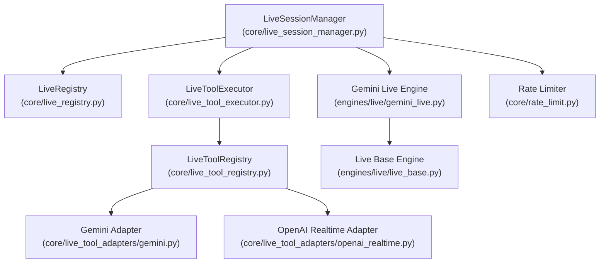
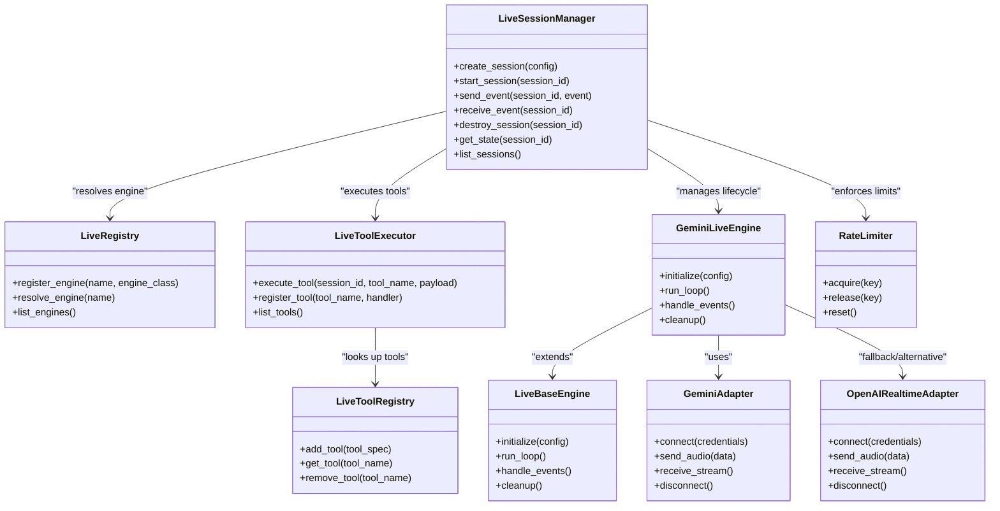
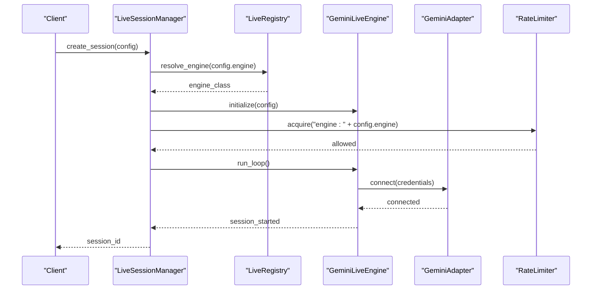
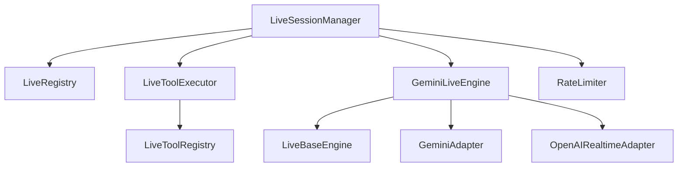

# Live Session Management

<cite>
**Referenced Files in This Document**
- [live_session_manager.py](file://core/live_session_manager.py)
- [live_registry.py](file://core/live_registry.py)
- [live_tool_executor.py](file://core/live_tool_executor.py)
- [live_tool_registry.py](file://core/live_tool_registry.py)
- [gemini.py](file://core/live_tool_adapters/gemini.py)
- [openai_realtime.py](file://core/live_tool_adapters/openai_realtime.py)
- [gemini_live.py](file://engines/live/gemini_live.py)
- [live_base.py](file://engines/live/live_base.py)
- [rate_limit.py](file://core/rate_limit.py)
- [test_live_session_manager.py](file://tests/test_live_session_manager.py)
- [test_api_components_live.py](file://tests/test_api_components_live.py)
- [live.md](file://docs/gemini/live.md)
- [live-session-management.md](file://docs/gemini/live-session-management.md)
</cite>

## Table of Contents
1. [Introduction](#introduction)
2. [Project Structure](#project-structure)
3. [Core Components](#core-components)
4. [Architecture Overview](#architecture-overview)
5. [Detailed Component Analysis](#detailed-component-analysis)
6. [Dependency Analysis](#dependency-analysis)
7. [Performance Considerations](#performance-considerations)
8. [Troubleshooting Guide](#troubleshooting-guide)
9. [Conclusion](#conclusion)
10. [Appendices](#appendices)

## Introduction
This document explains Synthetic Heart’s live session management system with a focus on the lifecycle, creation and destruction of sessions, state management, resource allocation, and integration with live engines such as Gemini Live and OpenAI Realtime. It also covers configuration options, connection handling patterns, event-driven workflows, persistence considerations, error recovery, security, authentication, and rate limiting. The goal is to provide both high-level understanding and code-level details for developers integrating or extending live capabilities.

## Project Structure
The live session management system spans several modules:
- Core session orchestration and registry
- Tool adapters for specific live engines
- Engine implementations for Gemini Live and OpenAI Realtime
- Rate limiting utilities
- Tests validating behavior and API components
- Documentation describing usage and constraints

**Diagram sources**
- [live_session_manager.py](file://core/live_session_manager.py)
- [live_registry.py](file://core/live_registry.py)
- [live_tool_executor.py](file://core/live_tool_executor.py)
- [live_tool_registry.py](file://core/live_tool_registry.py)
- [gemini.py](file://core/live_tool_adapters/gemini.py)
- [openai_realtime.py](file://core/live_tool_adapters/openai_realtime.py)
- [gemini_live.py](file://engines/live/gemini_live.py)
- [live_base.py](file://engines/live/live_base.py)
- [rate_limit.py](file://core/rate_limit.py)

**Section sources**
- [live_session_manager.py](file://core/live_session_manager.py)
- [live_registry.py](file://core/live_registry.py)
- [live_tool_executor.py](file://core/live_tool_executor.py)
- [live_tool_registry.py](file://core/live_tool_registry.py)
- [gemini.py](file://core/live_tool_adapters/gemini.py)
- [openai_realtime.py](file://core/live_tool_adapters/openai_realtime.py)
- [gemini_live.py](file://engines/live/gemini_live.py)
- [live_base.py](file://engines/live/live_base.py)
- [rate_limit.py](file://core/rate_limit.py)

## Core Components
- LiveSessionManager: Central orchestrator for creating, managing, and destroying live sessions; coordinates engine selection, tool execution, and resource lifecycle.
- LiveRegistry: Maintains available live engines and their configurations; supports dynamic registration and lookup.
- LiveToolExecutor: Executes tool calls within live sessions, routing to appropriate adapters based on engine type.
- LiveToolRegistry: Manages tool definitions and mappings for live tools used by adapters.
- Adapters: Engine-specific implementations (e.g., Gemini, OpenAI Realtime) that translate core operations into provider protocols.
- Engines: Higher-level abstractions for live engines (e.g., Gemini Live), built on a common base class.
- Rate Limiter: Enforces request throttling and backoff strategies to protect external APIs.

Key responsibilities:
- Lifecycle control: start, pause, resume, teardown
- State synchronization across engine and adapter layers
- Event emission for session transitions and errors
- Resource cleanup and memory management
- Integration hooks for persistence and observability

**Section sources**
- [live_session_manager.py](file://core/live_session_manager.py)
- [live_registry.py](file://core/live_registry.py)
- [live_tool_executor.py](file://core/live_tool_executor.py)
- [live_tool_registry.py](file://core/live_tool_registry.py)
- [gemini.py](file://core/live_tool_adapters/gemini.py)
- [openai_realtime.py](file://core/live_tool_adapters/openai_realtime.py)
- [gemini_live.py](file://engines/live/gemini_live.py)
- [live_base.py](file://engines/live/live_base.py)
- [rate_limit.py](file://core/rate_limit.py)

## Architecture Overview
The architecture separates concerns between session orchestration, engine abstraction, and provider-specific adapters. This design enables pluggable live engines while keeping session management consistent.

**Diagram sources**
- [live_session_manager.py](file://core/live_session_manager.py)
- [live_registry.py](file://core/live_registry.py)
- [live_tool_executor.py](file://core/live_tool_executor.py)
- [live_tool_registry.py](file://core/live_tool_registry.py)
- [gemini.py](file://core/live_tool_adapters/gemini.py)
- [openai_realtime.py](file://core/live_tool_adapters/openai_realtime.py)
- [gemini_live.py](file://engines/live/gemini_live.py)
- [live_base.py](file://engines/live/live_base.py)
- [rate_limit.py](file://core/rate_limit.py)

## Detailed Component Analysis

### LiveSessionManager
Responsibilities:
- Create sessions with engine-specific configurations
- Start, pause, resume, and destroy sessions
- Manage concurrent sessions safely
- Emit lifecycle events and handle errors
- Coordinate resource allocation and cleanup

Lifecycle flow:
- Creation: validate config, resolve engine, allocate resources
- Start: initialize engine, establish connections, begin event loop
- Run: process incoming events, dispatch tool calls, update state
- Destroy: stop event loop, release connections, persist state if configured

**Diagram sources**
- [live_session_manager.py](file://core/live_session_manager.py)
- [live_registry.py](file://core/live_registry.py)
- [gemini_live.py](file://engines/live/gemini_live.py)
- [gemini.py](file://core/live_tool_adapters/gemini.py)
- [rate_limit.py](file://core/rate_limit.py)

**Section sources**
- [live_session_manager.py](file://core/live_session_manager.py)
- [test_live_session_manager.py](file://tests/test_live_session_manager.py)

### LiveRegistry
Responsibilities:
- Register and discover live engines
- Provide engine resolution by name
- Maintain engine metadata and capabilities

Usage patterns:
- Static registration at startup
- Dynamic registration via plugins
- Capability introspection for feature detection

**Section sources**
- [live_registry.py](file://core/live_registry.py)

### LiveToolExecutor and LiveToolRegistry
Responsibilities:
- Execute tool calls within live sessions
- Map tool names to handlers
- Support parameter validation and result serialization

Integration points:
- Called by session managers during event processing
- Used by adapters to invoke provider-specific functions

**Section sources**
- [live_tool_executor.py](file://core/live_tool_executor.py)
- [live_tool_registry.py](file://core/live_tool_registry.py)

### Adapters: Gemini and OpenAI Realtime
Responsibilities:
- Implement provider-specific connection protocols
- Handle audio streaming and event parsing
- Manage credentials and authentication

Connection patterns:
- WebSocket-based streaming for real-time audio
- Retry logic for transient failures
- Backpressure handling for high-throughput scenarios

**Section sources**
- [gemini.py](file://core/live_tool_adapters/gemini.py)
- [openai_realtime.py](file://core/live_tool_adapters/openai_realtime.py)

### Engines: Gemini Live and Live Base
Responsibilities:
- Abstract common engine behaviors
- Implement engine-specific initialization and cleanup
- Provide event loop and state management

Inheritance model:
- GeminiLiveEngine extends LiveBaseEngine
- Shared lifecycle methods overridden per engine

**Section sources**
- [gemini_live.py](file://engines/live/gemini_live.py)
- [live_base.py](file://engines/live/live_base.py)

### Rate Limiting
Responsibilities:
- Enforce API quotas and prevent overuse
- Implement exponential backoff on failures
- Track per-engine and per-session limits

Configuration:
- Global and per-engine limits
- Burst allowances and cooldown periods

**Section sources**
- [rate_limit.py](file://core/rate_limit.py)

## Dependency Analysis
The system exhibits clear separation between orchestration, engine abstraction, and provider implementation. Dependencies are primarily unidirectional, reducing coupling and enabling modular testing.

**Diagram sources**
- [live_session_manager.py](file://core/live_session_manager.py)
- [live_registry.py](file://core/live_registry.py)
- [live_tool_executor.py](file://core/live_tool_executor.py)
- [live_tool_registry.py](file://core/live_tool_registry.py)
- [gemini.py](file://core/live_tool_adapters/gemini.py)
- [openai_realtime.py](file://core/live_tool_adapters/openai_realtime.py)
- [gemini_live.py](file://engines/live/gemini_live.py)
- [live_base.py](file://engines/live/live_base.py)
- [rate_limit.py](file://core/rate_limit.py)

**Section sources**
- [live_session_manager.py](file://core/live_session_manager.py)
- [live_registry.py](file://core/live_registry.py)
- [live_tool_executor.py](file://core/live_tool_executor.py)
- [live_tool_registry.py](file://core/live_tool_registry.py)
- [gemini.py](file://core/live_tool_adapters/gemini.py)
- [openai_realtime.py](file://core/live_tool_adapters/openai_realtime.py)
- [gemini_live.py](file://engines/live/gemini_live.py)
- [live_base.py](file://engines/live/live_base.py)
- [rate_limit.py](file://core/rate_limit.py)

## Performance Considerations
- Connection pooling: Reuse established connections where possible to reduce latency
- Streaming optimization: Buffer audio chunks efficiently to minimize CPU overhead
- Concurrency control: Limit concurrent sessions per engine to prevent resource exhaustion
- Memory management: Release buffers promptly after processing to avoid leaks
- Rate limiting: Implement adaptive throttling based on API responses and error rates

[No sources needed since this section provides general guidance]

## Troubleshooting Guide
Common issues and resolutions:
- Connection failures: Verify credentials and network connectivity; check retry logs
- Rate limit errors: Adjust limits and implement exponential backoff
- Memory leaks: Monitor heap usage and ensure proper cleanup in destroy_session
- Event loss: Implement acknowledgment mechanisms and reconnection logic
- Engine incompatibility: Validate configuration against engine capabilities

Debugging steps:
- Enable verbose logging for session lifecycle events
- Inspect adapter connection states and error messages
- Use test suites to reproduce issues in isolation
- Monitor rate limiter metrics and adjust thresholds

**Section sources**
- [test_live_session_manager.py](file://tests/test_live_session_manager.py)
- [test_api_components_live.py](file://tests/test_api_components_live.py)

## Conclusion
Synthetic Heart’s live session management system provides a robust, extensible framework for managing real-time audio interactions across multiple providers. The clear separation of concerns, comprehensive lifecycle management, and pluggable adapter architecture enable seamless integration with Gemini Live and OpenAI Realtime while maintaining performance and reliability.

[No sources needed since this section summarizes without analyzing specific files]

## Appendices

### Session Configuration Options
- Engine selection: Specify target provider (Gemini, OpenAI Realtime)
- Authentication: API keys, tokens, and credential storage
- Audio settings: Sample rate, format, and compression
- Rate limits: Per-engine and global throttling policies
- Persistence: Session state saving and restoration

### Examples
- Starting a live session: Configure engine, authenticate, and initialize connection
- Managing concurrent sessions: Create multiple sessions with isolated resources
- Handling session events: Process incoming audio and outgoing responses
- Error recovery: Implement retry logic and fallback mechanisms

### Security and Authentication
- Credential management: Secure storage and rotation of API keys
- Token validation: Verify authentication status before session creation
- Input sanitization: Validate all user-provided parameters
- Access control: Restrict session creation to authorized users

### Rate Limiting Strategies
- Token bucket algorithm: Smooth request distribution
- Sliding window counters: Track usage over time intervals
- Adaptive backoff: Increase delays based on error frequency
- Circuit breaker: Temporarily disable failing endpoints

**Section sources**
- [live.md](file://docs/gemini/live.md)
- [live-session-management.md](file://docs/gemini/live-session-management.md)