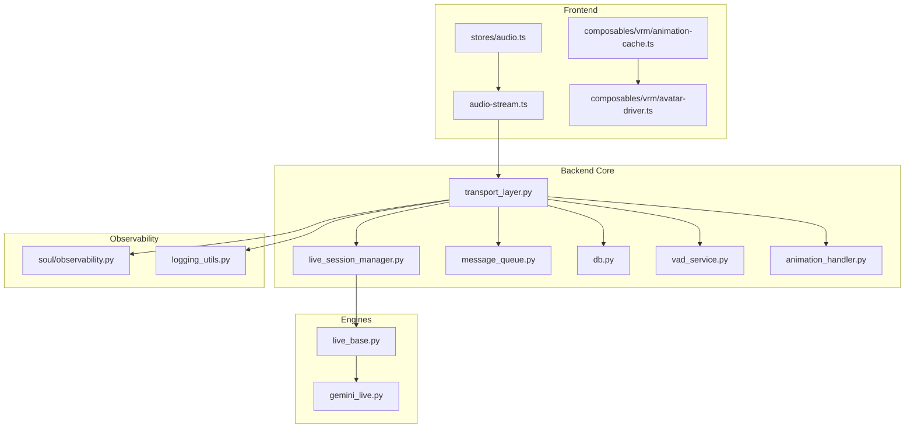
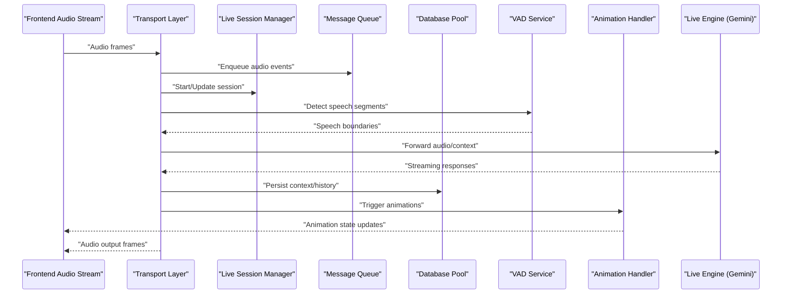
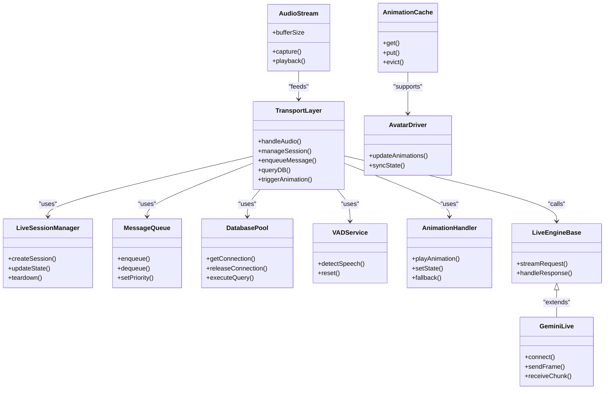

# Performance Optimization

<cite>
**Referenced Files in This Document**
- [main.py](file://main.py)
- [core/transport_layer.py](file://core/transport_layer.py)
- [core/live_session_manager.py](file://core/live_session_manager.py)
- [core/message_queue.py](file://core/message_queue.py)
- [core/chat_history_cache.py](file://core/chat_history_cache.py)
- [core/db.py](file://core/db.py)
- [core/vad_service.py](file://core/vad_service.py)
- [core/animation_handler.py](file://core/animation_handler.py)
- [frontend/src/services/audio-stream.ts](file://frontend/src/services/audio-stream.ts)
- [frontend/src/stores/audio.ts](file://frontend/src/stores/audio.ts)
- [frontend/src/composables/vrm/animation-cache.ts](file://frontend/src/composables/vrm/animation-cache.ts)
- [frontend/src/composables/vrm/avatar-driver.ts](file://frontend/src/composables/vrm/avatar-driver.ts)
- [engines/live/live_base.py](file://engines/live/live_base.py)
- [engines/live/gemini_live.py](file://engines/live/gemini_live.py)
- [core/soul/observability.py](file://core/soul/observability.py)
- [core/logging_utils.py](file://core/logging_utils.py)
- [tests/test_message_queue.py](file://tests/test_message_queue.py)
- [tests/test_db_pool_limit.py](file://tests/test_db_pool_limit.py)
- [tests/test_vessel_realtime.py](file://tests/test_vessel_realtime.py)
</cite>

## Table of Contents
1. Introduction
2. Project Structure
3. Core Components
4. Architecture Overview
5. Detailed Component Analysis
6. Dependency Analysis
7. Performance Considerations
8. Troubleshooting Guide
9. Conclusion

## Introduction
This document provides a comprehensive guide to performance optimization for real-time features in the project. It focuses on latency reduction, resource management, memory optimization, caching strategies, connection pooling, and background task processing. It also covers profiling techniques, bottleneck identification, performance monitoring, scaling considerations, load balancing, distributed deployment patterns, debugging performance issues, optimizing audio processing, and improving animation rendering performance. The guidance is grounded in the actual codebase components that implement these capabilities.

## Project Structure
The system comprises:
- A Python backend with transport, live session management, message queuing, database access, VAD service, and animation handling.
- A frontend with WebRTC-like audio streaming, audio store, VRM animation cache, and avatar driver.
- Live engines for real-time integrations (e.g., Gemini).
- Observability and logging utilities for performance monitoring.

**Diagram sources**
- [core/transport_layer.py](file://core/transport_layer.py)
- [core/live_session_manager.py](file://core/live_session_manager.py)
- [core/message_queue.py](file://core/message_queue.py)
- [core/db.py](file://core/db.py)
- [core/vad_service.py](file://core/vad_service.py)
- [core/animation_handler.py](file://core/animation_handler.py)
- [frontend/src/services/audio-stream.ts](file://frontend/src/services/audio-stream.ts)
- [frontend/src/stores/audio.ts](file://frontend/src/stores/audio.ts)
- [frontend/src/composables/vrm/animation-cache.ts](file://frontend/src/composables/vrm/animation-cache.ts)
- [frontend/src/composables/vrm/avatar-driver.ts](file://frontend/src/composables/vrm/avatar-driver.ts)
- [engines/live/live_base.py](file://engines/live/live_base.py)
- [engines/live/gemini_live.py](file://engines/live/gemini_live.py)
- [core/soul/observability.py](file://core/soul/observability.py)
- [core/logging_utils.py](file://core/logging_utils.py)

**Section sources**
- [main.py](file://main.py)
- [core/transport_layer.py](file://core/transport_layer.py)
- [core/live_session_manager.py](file://core/live_session_manager.py)
- [core/message_queue.py](file://core/message_queue.py)
- [core/chat_history_cache.py](file://core/chat_history_cache.py)
- [core/db.py](file://core/db.py)
- [core/vad_service.py](file://core/vad_service.py)
- [core/animation_handler.py](file://core/animation_handler.py)
- [frontend/src/services/audio-stream.ts](file://frontend/src/services/audio-stream.ts)
- [frontend/src/stores/audio.ts](file://frontend/src/stores/audio.ts)
- [frontend/src/composables/vrm/animation-cache.ts](file://frontend/src/composables/vrm/animation-cache.ts)
- [frontend/src/composables/vrm/avatar-driver.ts](file://frontend/src/composables/vrm/avatar-driver.ts)
- [engines/live/live_base.py](file://engines/live/live_base.py)
- [engines/live/gemini_live.py](file://engines/live/gemini_live.py)
- [core/soul/observability.py](file://core/soul/observability.py)
- [core/logging_utils.py](file://core/logging_utils.py)

## Core Components
Key components impacting real-time performance:
- Transport layer: orchestrates I/O, sessions, queues, DB, VAD, and animations.
- Live session manager: manages lifecycle and state of live interactions.
- Message queue: buffers and prioritizes messages to smooth throughput.
- Database access: connection pooling and query efficiency.
- VAD service: voice activity detection to reduce unnecessary processing.
- Animation handler: coordinates animation playback and state transitions.
- Frontend audio stream: low-latency capture and playback.
- Audio store: manages audio state and buffering.
- Animation cache: caches assets to avoid repeated loading.
- Avatar driver: drives VRM animations efficiently.
- Live engines: external real-time integrations (e.g., Gemini).
- Observability and logging: metrics, traces, and logs for performance analysis.

**Section sources**
- [core/transport_layer.py](file://core/transport_layer.py)
- [core/live_session_manager.py](file://core/live_session_manager.py)
- [core/message_queue.py](file://core/message_queue.py)
- [core/db.py](file://core/db.py)
- [core/vad_service.py](file://core/vad_service.py)
- [core/animation_handler.py](file://core/animation_handler.py)
- [frontend/src/services/audio-stream.ts](file://frontend/src/services/audio-stream.ts)
- [frontend/src/stores/audio.ts](file://frontend/src/stores/audio.ts)
- [frontend/src/composables/vrm/animation-cache.ts](file://frontend/src/composables/vrm/animation-cache.ts)
- [frontend/src/composables/vrm/avatar-driver.ts](file://frontend/src/composables/vrm/avatar-driver.ts)
- [engines/live/live_base.py](file://engines/live/live_base.py)
- [engines/live/gemini_live.py](file://engines/live/gemini_live.py)
- [core/soul/observability.py](file://core/soul/observability.py)
- [core/logging_utils.py](file://core/logging_utils.py)

## Architecture Overview
Real-time flow from frontend capture to backend processing and response:

**Diagram sources**
- [core/transport_layer.py](file://core/transport_layer.py)
- [core/live_session_manager.py](file://core/live_session_manager.py)
- [core/message_queue.py](file://core/message_queue.py)
- [core/db.py](file://core/db.py)
- [core/vad_service.py](file://core/vad_service.py)
- [core/animation_handler.py](file://core/animation_handler.py)
- [engines/live/live_base.py](file://engines/live/live_base.py)
- [engines/live/gemini_live.py](file://engines/live/gemini_live.py)

## Detailed Component Analysis

### Transport Layer
Responsibilities:
- Coordinates incoming/outgoing streams, session lifecycle, queueing, DB operations, VAD integration, and animation triggers.
- Implements backpressure and batching to reduce overhead.
- Integrates observability for tracing and metrics.

Optimization strategies:
- Use non-blocking I/O and event loops effectively.
- Batch small messages to reduce serialization/deserialization costs.
- Apply timeouts and circuit breakers for external calls.
- Maintain minimal object allocations per frame.

**Section sources**
- [core/transport_layer.py](file://core/transport_layer.py)
- [core/soul/observability.py](file://core/soul/observability.py)
- [core/logging_utils.py](file://core/logging_utils.py)

### Live Session Manager
Responsibilities:
- Manages session creation, teardown, and state synchronization across components.
- Ensures consistent configuration and resource allocation per session.

Optimization strategies:
- Reuse session resources where possible.
- Implement graceful degradation when under load.
- Track session metrics for capacity planning.

**Section sources**
- [core/live_session_manager.py](file://core/live_session_manager.py)

### Message Queue
Responsibilities:
- Buffers and prioritizes messages to smooth throughput and prevent backlogs.
- Supports low-priority tasks and non-blocking writes.

Optimization strategies:
- Tune queue sizes and worker concurrency.
- Drop or compress low-priority messages during spikes.
- Monitor queue depth and latency percentiles.

**Section sources**
- [core/message_queue.py](file://core/message_queue.py)
- [tests/test_message_queue.py](file://tests/test_message_queue.py)

### Database Access and Connection Pooling
Responsibilities:
- Provides pooled connections for efficient DB access.
- Handles retries, health checks, and cutover.

Optimization strategies:
- Configure pool size based on workload and DB capacity.
- Use read replicas for heavy queries.
- Minimize round-trips by batching writes.

**Section sources**
- [core/db.py](file://core/db.py)
- [tests/test_db_pool_limit.py](file://tests/test_db_pool_limit.py)

### VAD Service
Responsibilities:
- Detects speech segments to gate processing and reduce CPU usage.
- Integrates with audio pipeline to skip silence.

Optimization strategies:
- Adjust thresholds and window sizes for responsiveness vs. accuracy.
- Cache recent VAD states to avoid recomputation.
- Offload heavy detection to specialized threads if needed.

**Section sources**
- [core/vad_service.py](file://core/vad_service.py)

### Animation Handler
Responsibilities:
- Coordinates animation playback, state transitions, and fallbacks.
- Interfaces with frontend to synchronize visual updates.

Optimization strategies:
- Preload common animations and reuse instances.
- Throttle updates to match frame rate.
- Use delta updates instead of full state re-sends.

**Section sources**
- [core/animation_handler.py](file://core/animation_handler.py)

### Frontend Audio Streaming
Responsibilities:
- Captures microphone input and plays back audio with minimal latency.
- Manages buffer sizes and sample rates.

Optimization strategies:
- Use appropriate buffer sizes to balance latency and stability.
- Avoid blocking the main thread; offload DSP to workers.
- Implement adaptive bitrate and error recovery.

**Section sources**
- [frontend/src/services/audio-stream.ts](file://frontend/src/services/audio-stream.ts)
- [frontend/src/stores/audio.ts](file://frontend/src/stores/audio.ts)

### Animation Cache and Avatar Driver
Responsibilities:
- Caches VRM animations and textures to avoid reloads.
- Drives avatar animations efficiently with minimal GC pressure.

Optimization strategies:
- Implement LRU eviction and size limits.
- Defer heavy loads until idle.
- Batch animation updates and use requestAnimationFrame.

**Section sources**
- [frontend/src/composables/vrm/animation-cache.ts](file://frontend/src/composables/vrm/animation-cache.ts)
- [frontend/src/composables/vrm/avatar-driver.ts](file://frontend/src/composables/vrm/avatar-driver.ts)

### Live Engines (Gemini)
Responsibilities:
- Integrates with external real-time APIs for streaming responses.
- Handles authentication, retries, and rate limiting.

Optimization strategies:
- Use streaming endpoints to reduce latency.
- Implement exponential backoff and jitter.
- Cache static prompts and configurations.

**Section sources**
- [engines/live/live_base.py](file://engines/live/live_base.py)
- [engines/live/gemini_live.py](file://engines/live/gemini_live.py)

### Observability and Logging
Responsibilities:
- Collects metrics, traces, and logs for performance analysis.
- Exposes endpoints for runtime inspection.

Optimization strategies:
- Sample high-frequency logs; aggregate metrics.
- Use structured logging for faster parsing.
- Instrument hot paths with lightweight counters.

**Section sources**
- [core/soul/observability.py](file://core/soul/observability.py)
- [core/logging_utils.py](file://core/logging_utils.py)

## Dependency Analysis
Component relationships and coupling:

**Diagram sources**
- [core/transport_layer.py](file://core/transport_layer.py)
- [core/live_session_manager.py](file://core/live_session_manager.py)
- [core/message_queue.py](file://core/message_queue.py)
- [core/db.py](file://core/db.py)
- [core/vad_service.py](file://core/vad_service.py)
- [core/animation_handler.py](file://core/animation_handler.py)
- [frontend/src/services/audio-stream.ts](file://frontend/src/services/audio-stream.ts)
- [frontend/src/composables/vrm/animation-cache.ts](file://frontend/src/composables/vrm/animation-cache.ts)
- [frontend/src/composables/vrm/avatar-driver.ts](file://frontend/src/composables/vrm/avatar-driver.ts)
- [engines/live/live_base.py](file://engines/live/live_base.py)
- [engines/live/gemini_live.py](file://engines/live/gemini_live.py)

**Section sources**
- [core/transport_layer.py](file://core/transport_layer.py)
- [core/live_session_manager.py](file://core/live_session_manager.py)
- [core/message_queue.py](file://core/message_queue.py)
- [core/db.py](file://core/db.py)
- [core/vad_service.py](file://core/vad_service.py)
- [core/animation_handler.py](file://core/animation_handler.py)
- [frontend/src/services/audio-stream.ts](file://frontend/src/services/audio-stream.ts)
- [frontend/src/composables/vrm/animation-cache.ts](file://frontend/src/composables/vrm/animation-cache.ts)
- [frontend/src/composables/vrm/avatar-driver.ts](file://frontend/src/composables/vrm/avatar-driver.ts)
- [engines/live/live_base.py](file://engines/live/live_base.py)
- [engines/live/gemini_live.py](file://engines/live/gemini_live.py)

## Performance Considerations
- Latency reduction:
  - Prefer streaming over batched responses.
  - Minimize serialization overhead; use compact formats.
  - Keep critical paths free of blocking I/O.
- Resource management:
  - Limit concurrent workers to match CPU cores.
  - Reuse connections and objects where safe.
  - Implement graceful shutdown to release resources.
- Memory optimization:
  - Avoid large allocations in hot loops.
  - Use generators and iterators for large datasets.
  - Monitor heap growth and set explicit limits.
- Caching strategies:
  - Cache frequently accessed data with TTLs.
  - Use LRU caches for UI assets and prompts.
  - Invalidate caches on configuration changes.
- Connection pooling:
  - Size pools based on expected concurrency.
  - Enable keep-alive and health checks.
  - Separate read/write pools if necessary.
- Background task processing:
  - Offload long-running tasks to workers.
  - Prioritize tasks and drop low-value work under load.
  - Use durable queues for reliability.
- Profiling and monitoring:
  - Profile CPU and memory hotspots.
  - Trace end-to-end latency for key flows.
  - Set alerts for queue depth and error rates.
- Scaling and load balancing:
  - Horizontal scale stateless services.
  - Use sticky sessions for WebSocket connections.
  - Distribute DB reads via replicas.
- Distributed deployment:
  - Ensure consistent configuration across nodes.
  - Centralize logs and metrics collection.
  - Implement circuit breakers for external dependencies.
- Debugging performance issues:
  - Capture stack traces on slow paths.
  - Use sampling profilers in production.
  - Correlate logs with metrics and traces.
- Optimizing audio processing:
  - Tune buffer sizes for target latency.
  - Use hardware acceleration where available.
  - Skip processing during silence via VAD.
- Improving animation rendering:
  - Batch updates and throttle to frame rate.
  - Preload and cache assets aggressively.
  - Use delta updates to minimize payload size.

[No sources needed since this section provides general guidance]

## Troubleshooting Guide
Common issues and resolutions:
- High latency spikes:
  - Check queue depths and worker saturation.
  - Inspect external API response times and errors.
  - Review VAD thresholds and audio buffer settings.
- Memory leaks:
  - Monitor heap snapshots and identify retained objects.
  - Ensure proper cleanup of streams and connections.
  - Validate cache eviction policies.
- Database bottlenecks:
  - Analyze slow queries and add indexes.
  - Increase pool size cautiously; monitor contention.
  - Use read replicas for heavy reads.
- Animation stutter:
  - Reduce update frequency and payload size.
  - Verify asset caching and preloading.
  - Profile GPU/CPU usage on the frontend.
- Real-time drops:
  - Implement retry and fallback mechanisms.
  - Monitor network quality and adjust codecs.
  - Use adaptive streaming and error concealment.

**Section sources**
- [core/message_queue.py](file://core/message_queue.py)
- [core/db.py](file://core/db.py)
- [core/vad_service.py](file://core/vad_service.py)
- [core/animation_handler.py](file://core/animation_handler.py)
- [frontend/src/services/audio-stream.ts](file://frontend/src/services/audio-stream.ts)
- [frontend/src/composables/vrm/animation-cache.ts](file://frontend/src/composables/vrm/animation-cache.ts)
- [tests/test_vessel_realtime.py](file://tests/test_vessel_realtime.py)

## Conclusion
Performance optimization in real-time systems requires a holistic approach spanning frontend, backend, and external integrations. By applying latency reduction techniques, robust resource and memory management, effective caching and connection pooling, and diligent profiling and monitoring, teams can achieve responsive and scalable real-time experiences. Continuous measurement and iterative tuning are essential to maintain optimal performance under varying loads and conditions.

[No sources needed since this section summarizes without analyzing specific files]