# Real-Time Features

<cite>
**Referenced Files in This Document**
- [live_session_manager.py](file://core/live_session_manager.py)
- [karada_transport.py](file://core/karada_transport.py)
- [karada_ws_transport.py](file://core/karada_ws_transport.py)
- [vad_service.py](file://core/vad_service.py)
- [animation_handler.py](file://core/animation_handler.py)
- [transport_layer.py](file://core/transport_layer.py)
- [synth-ws.ts](file://frontend/src/services/synth-ws.ts)
- [audio-stream.ts](file://frontend/src/services/audio-stream.ts)
- [avatar-driver.ts](file://frontend/src/composables/vrm/avatar-driver.ts)
- [face.ts](file://frontend/src/composables/vrm/face.ts)
- [tts_lipsync.py](file://plugins/tts_lipsync/tts_lipsync.py)
- [live_bridge.py](file://core/external_endpoints/bridges/live_bridge.py)
- [gemini_live.py](file://engines/live/gemini_live.py)
- [live.md](file://docs/gemini/live.md)
- [synth-live-voice-integration.rst](file://docs/gemini/synth-live-voice-integration.rst)
- [vessel_realtime.py](file://core/vessel_realtime.py)
</cite>

## Table of Contents
1. [Introduction](#introduction)
2. [Project Structure](#project-structure)
3. [Core Components](#core-components)
4. [Architecture Overview](#architecture-overview)
5. [Detailed Component Analysis](#detailed-component-analysis)
6. [Dependency Analysis](#dependency-analysis)
7. [Performance Considerations](#performance-considerations)
8. [Troubleshooting Guide](#troubleshooting-guide)
9. [Conclusion](#conclusion)
10. [Appendices](#appendices)

## Introduction
This document explains Synthetic Heart’s real-time interaction capabilities, focusing on live voice conversations, VRM avatar animations, and WebSocket communication. It covers live session management, voice activity detection (VAD), animation synchronization, and real-time data streaming. It also documents the WebSocket protocol, message formats, connection handling, Karada transport for body control, animation priority management, lip-sync technology, performance optimization, latency reduction, and troubleshooting strategies.

## Project Structure
The real-time features span backend Python modules and frontend TypeScript services:
- Backend: Live session lifecycle, VAD, Karada transport, animation handler, and transport layer orchestration.
- Frontend: WebSocket client, audio stream capture/playback, VRM avatar driver, facial expression manager, and lipsync utilities.
- Documentation: Guides for live sessions, voice integration, and VRM animations.

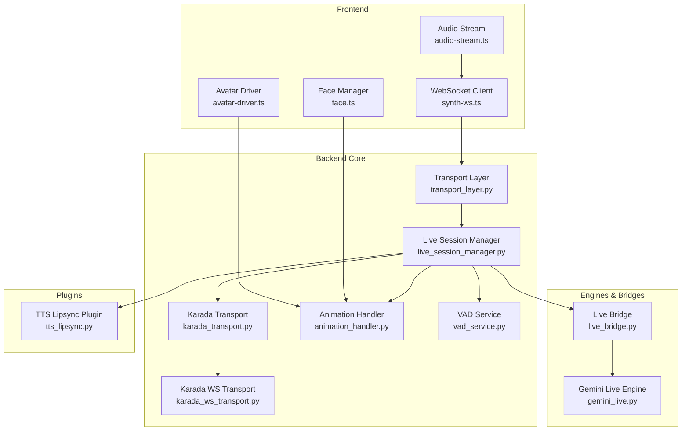

**Diagram sources**
- [synth-ws.ts](file://frontend/src/services/synth-ws.ts)
- [audio-stream.ts](file://frontend/src/services/audio-stream.ts)
- [avatar-driver.ts](file://frontend/src/composables/vrm/avatar-driver.ts)
- [face.ts](file://frontend/src/composables/vrm/face.ts)
- [transport_layer.py](file://core/transport_layer.py)
- [live_session_manager.py](file://core/live_session_manager.py)
- [karada_transport.py](file://core/karada_transport.py)
- [karada_ws_transport.py](file://core/karada_ws_transport.py)
- [animation_handler.py](file://core/animation_handler.py)
- [vad_service.py](file://core/vad_service.py)
- [live_bridge.py](file://core/external_endpoints/bridges/live_bridge.py)
- [gemini_live.py](file://engines/live/gemini_live.py)
- [tts_lipsync.py](file://plugins/tts_lipsync/tts_lipsync.py)

**Section sources**
- [live_session_manager.py](file://core/live_session_manager.py)
- [karada_transport.py](file://core/karada_transport.py)
- [karada_ws_transport.py](file://core/karada_ws_transport.py)
- [vad_service.py](file://core/vad_service.py)
- [animation_handler.py](file://core/animation_handler.py)
- [transport_layer.py](file://core/transport_layer.py)
- [synth-ws.ts](file://frontend/src/services/synth-ws.ts)
- [audio-stream.ts](file://frontend/src/services/audio-stream.ts)
- [avatar-driver.ts](file://frontend/src/composables/vrm/avatar-driver.ts)
- [face.ts](file://frontend/src/composables/vrm/face.ts)
- [tts_lipsync.py](file://plugins/tts_lipsync/tts_lipsync.py)
- [live_bridge.py](file://core/external_endpoints/bridges/live_bridge.py)
- [gemini_live.py](file://engines/live/gemini_live.py)
- [live.md](file://docs/gemini/live.md)
- [synth-live-voice-integration.rst](file://docs/gemini/synth-live-voice-integration.rst)

## Core Components
- Live Session Manager: Orchestrates session lifecycle, coordinates VAD, audio streams, animation updates, and external live engines via bridges.
- Karada Transport: Provides a unified interface to send body control commands; supports both REST and WebSocket backends.
- Karada WS Transport: Implements WebSocket-based transport for low-latency body control.
- Animation Handler: Manages animation playback, blending, and priority resolution across expressions and gestures.
- VAD Service: Detects speech activity from incoming audio frames to gate processing and reduce unnecessary work.
- Transport Layer: Centralizes WebSocket messaging between frontend and backend, routing events and payloads.
- Frontend WebSocket Client: Manages connection state, reconnection, and bidirectional event flow.
- Audio Stream: Captures microphone input and plays back remote audio with buffering and latency controls.
- Avatar Driver and Face Manager: Drive VRM model animations and facial expressions based on received signals.
- TTS Lipsync Plugin: Generates phoneme or viseme sequences aligned to TTS output for lip-sync.
- Live Bridge and Gemini Live Engine: Integrate with external live APIs for voice and multimodal interactions.

**Section sources**
- [live_session_manager.py](file://core/live_session_manager.py)
- [karada_transport.py](file://core/karada_transport.py)
- [karada_ws_transport.py](file://core/karada_ws_transport.py)
- [animation_handler.py](file://core/animation_handler.py)
- [vad_service.py](file://core/vad_service.py)
- [transport_layer.py](file://core/transport_layer.py)
- [synth-ws.ts](file://frontend/src/services/synth-ws.ts)
- [audio-stream.ts](file://frontend/src/services/audio-stream.ts)
- [avatar-driver.ts](file://frontend/src/composables/vrm/avatar-driver.ts)
- [face.ts](file://frontend/src/composables/vrm/face.ts)
- [tts_lipsync.py](file://plugins/tts_lipsync/tts_lipsync.py)
- [live_bridge.py](file://core/external_endpoints/bridges/live_bridge.py)
- [gemini_live.py](file://engines/live/gemini_live.py)

## Architecture Overview
The real-time pipeline connects frontend audio capture and VRM rendering to backend session management, VAD, animation control, and external live engines.

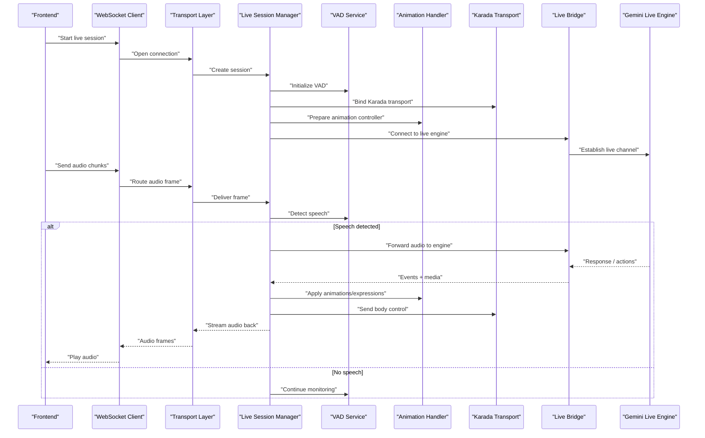

**Diagram sources**
- [synth-ws.ts](file://frontend/src/services/synth-ws.ts)
- [transport_layer.py](file://core/transport_layer.py)
- [live_session_manager.py](file://core/live_session_manager.py)
- [vad_service.py](file://core/vad_service.py)
- [animation_handler.py](file://core/animation_handler.py)
- [karada_transport.py](file://core/karada_transport.py)
- [karada_ws_transport.py](file://core/karada_ws_transport.py)
- [live_bridge.py](file://core/external_endpoints/bridges/live_bridge.py)
- [gemini_live.py](file://engines/live/gemini_live.py)

## Detailed Component Analysis

### Live Session Management
- Responsibilities:
  - Create, start, pause, and terminate live sessions.
  - Manage VAD lifecycle and thresholds.
  - Coordinate audio I/O, animation updates, and Karada body control.
  - Integrate with external live engines through bridges.
- Key behaviors:
  - Initializes transports and handlers per session.
  - Routes incoming audio to VAD and engine pipelines.
  - Publishes animation and body control events downstream.
  - Handles reconnection and error recovery.

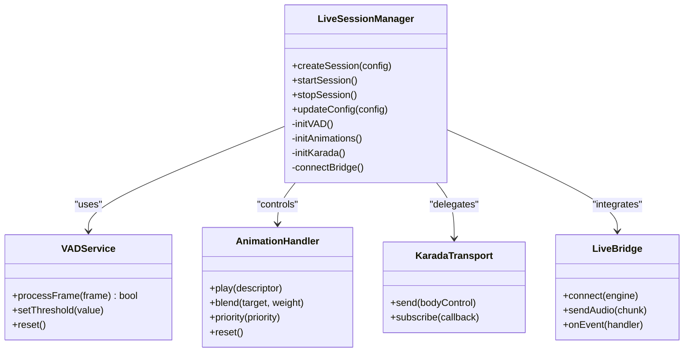

**Diagram sources**
- [live_session_manager.py](file://core/live_session_manager.py)
- [vad_service.py](file://core/vad_service.py)
- [animation_handler.py](file://core/animation_handler.py)
- [karada_transport.py](file://core/karada_transport.py)
- [live_bridge.py](file://core/external_endpoints/bridges/live_bridge.py)

**Section sources**
- [live_session_manager.py](file://core/live_session_manager.py)
- [vad_service.py](file://core/vad_service.py)
- [animation_handler.py](file://core/animation_handler.py)
- [karada_transport.py](file://core/karada_transport.py)
- [live_bridge.py](file://core/external_endpoints/bridges/live_bridge.py)

### Karada Transport System for Body Control
- Purpose: Provide a consistent API to send body control commands to the avatar or hardware.
- Implementations:
  - REST-based transport for simple requests.
  - WebSocket transport for low-latency streaming and event-driven updates.
- Key operations:
  - Send pose, joint angles, and gesture triggers.
  - Subscribe to status and feedback events.
  - Handle connection lifecycle and retries.

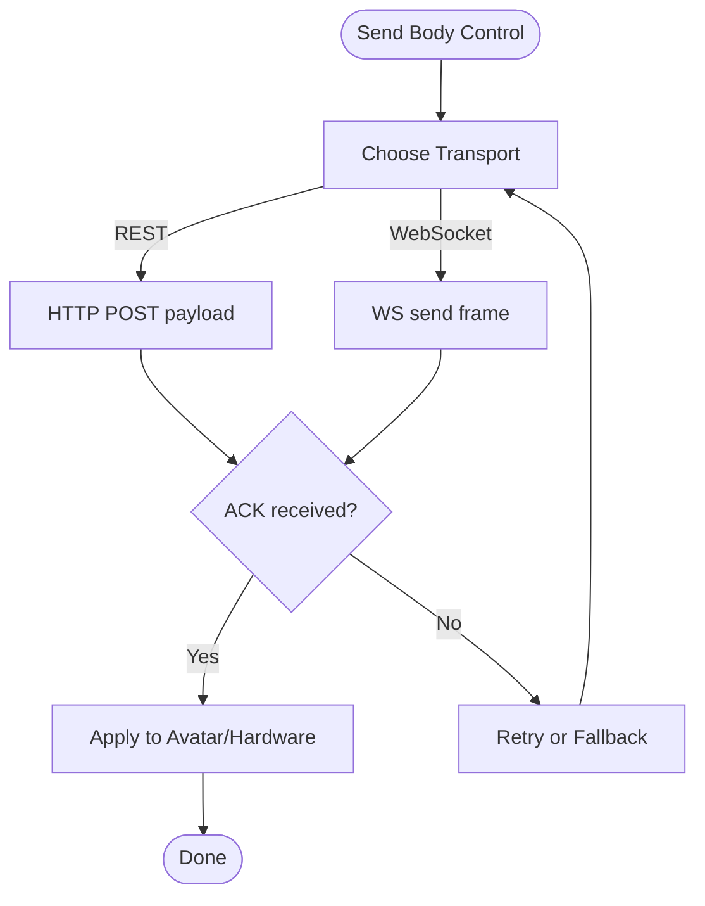

**Diagram sources**
- [karada_transport.py](file://core/karada_transport.py)
- [karada_ws_transport.py](file://core/karada_ws_transport.py)

**Section sources**
- [karada_transport.py](file://core/karada_transport.py)
- [karada_ws_transport.py](file://core/karada_ws_transport.py)

### Voice Activity Detection (VAD)
- Functionality:
  - Analyzes incoming audio frames to detect speech segments.
  - Configurable thresholds and smoothing to avoid false positives.
  - Integrates with session manager to gate processing and reduce latency.
- Processing logic:
  - Frame buffer accumulation.
  - Energy and spectral features evaluation.
  - State transitions between silence and speech.

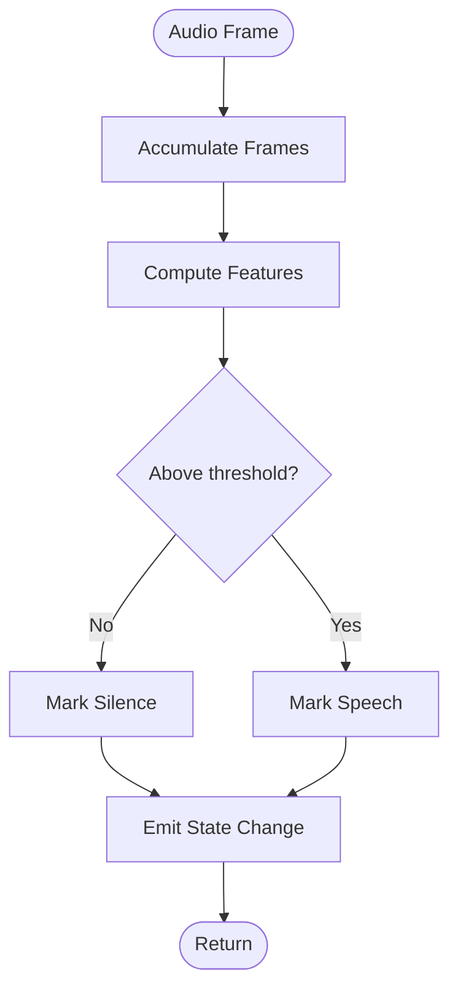

**Diagram sources**
- [vad_service.py](file://core/vad_service.py)

**Section sources**
- [vad_service.py](file://core/vad_service.py)

### Animation Synchronization and Priority Management
- Capabilities:
  - Play animations and expressions with blending and crossfades.
  - Resolve priorities to ensure dominant gestures override lower-priority states.
  - Sync facial expressions with TTS lipsync outputs.
- Priority rules:
  - Higher priority animations interrupt or blend into lower ones.
  - Expression overlays are managed separately from body animations.
- Synchronization:
  - Aligns animation timelines with audio events.
  - Uses timestamps and duration hints for smooth transitions.

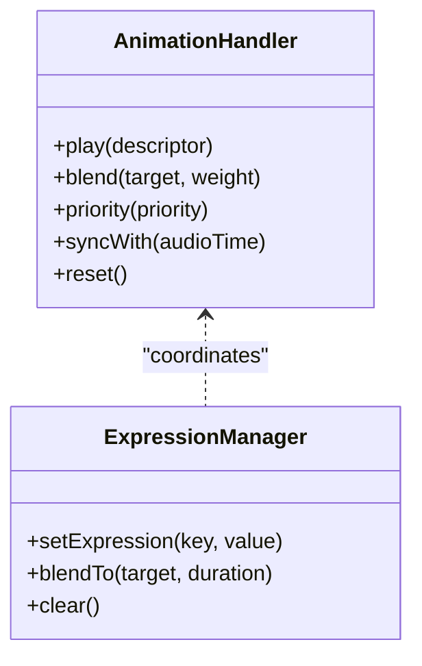

**Diagram sources**
- [animation_handler.py](file://core/animation_handler.py)
- [face.ts](file://frontend/src/composables/vrm/face.ts)

**Section sources**
- [animation_handler.py](file://core/animation_handler.py)
- [face.ts](file://frontend/src/composables/vrm/face.ts)

### WebSocket Protocol and Connection Handling
- Frontend client responsibilities:
  - Establish and maintain WebSocket connections.
  - Serialize messages and handle reconnection/backoff.
  - Route incoming events to appropriate handlers (audio, animation, status).
- Backend transport layer:
  - Accepts connections, authenticates, and routes messages to session managers.
  - Ensures ordered delivery where required and handles errors gracefully.
- Message categories:
  - Session control (start, stop, config).
  - Audio frames (binary or base64-encoded).
  - Animation/body control commands.
  - Status and telemetry.

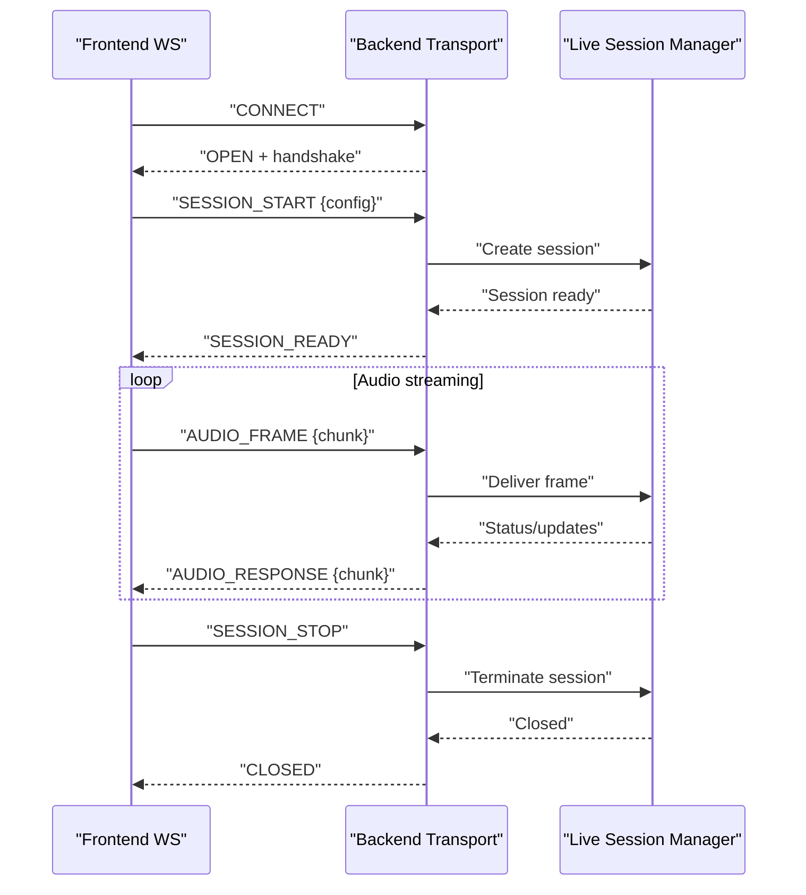

**Diagram sources**
- [synth-ws.ts](file://frontend/src/services/synth-ws.ts)
- [transport_layer.py](file://core/transport_layer.py)
- [live_session_manager.py](file://core/live_session_manager.py)

**Section sources**
- [synth-ws.ts](file://frontend/src/services/synth-ws.ts)
- [transport_layer.py](file://core/transport_layer.py)
- [live_session_manager.py](file://core/live_session_manager.py)

### Lip-Sync Technology
- Mechanism:
  - TTS plugin generates phoneme/viseme sequences aligned to audio timing.
  - Sequences drive facial expression changes on the VRM model.
- Integration:
  - Animation handler applies expression blends synchronized with TTS output.
  - Frontend face manager ensures smooth transitions and avoids flicker.

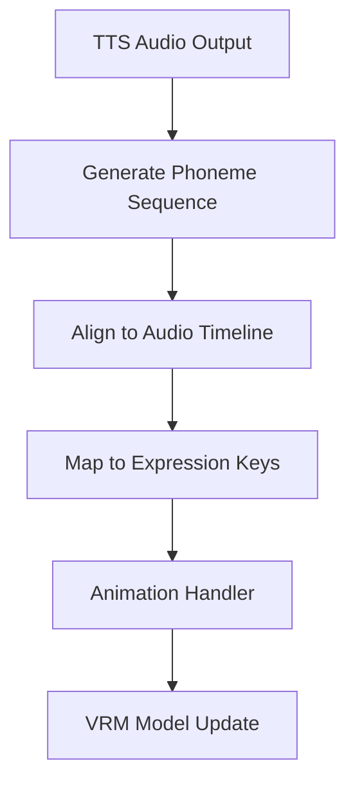

**Diagram sources**
- [tts_lipsync.py](file://plugins/tts_lipsync/tts_lipsync.py)
- [animation_handler.py](file://core/animation_handler.py)
- [face.ts](file://frontend/src/composables/vrm/face.ts)

**Section sources**
- [tts_lipsync.py](file://plugins/tts_lipsync/tts_lipsync.py)
- [animation_handler.py](file://core/animation_handler.py)
- [face.ts](file://frontend/src/composables/vrm/face.ts)

### Live Engines and External Integration
- Live bridge abstracts external live APIs (e.g., Gemini Live).
- Engine-specific implementations manage channels, audio streaming, and event callbacks.
- Session manager uses the bridge to forward audio and receive responses/actions.

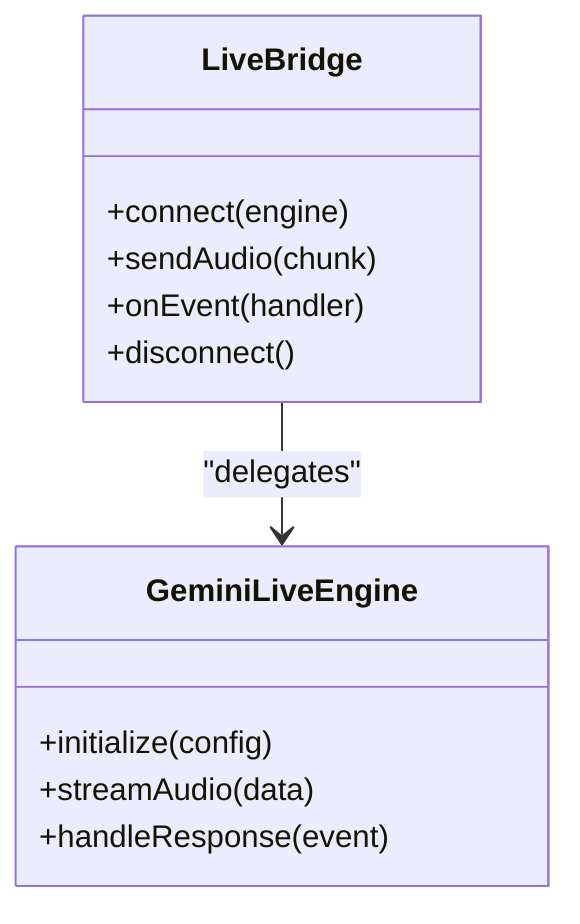

**Diagram sources**
- [live_bridge.py](file://core/external_endpoints/bridges/live_bridge.py)
- [gemini_live.py](file://engines/live/gemini_live.py)

**Section sources**
- [live_bridge.py](file://core/external_endpoints/bridges/live_bridge.py)
- [gemini_live.py](file://engines/live/gemini_live.py)

### Conceptual Overview
The real-time system composes audio capture, VAD, session orchestration, animation control, and external live engines into a cohesive pipeline. The frontend manages user interactions and renders VRM models, while the backend ensures low-latency processing and synchronization.

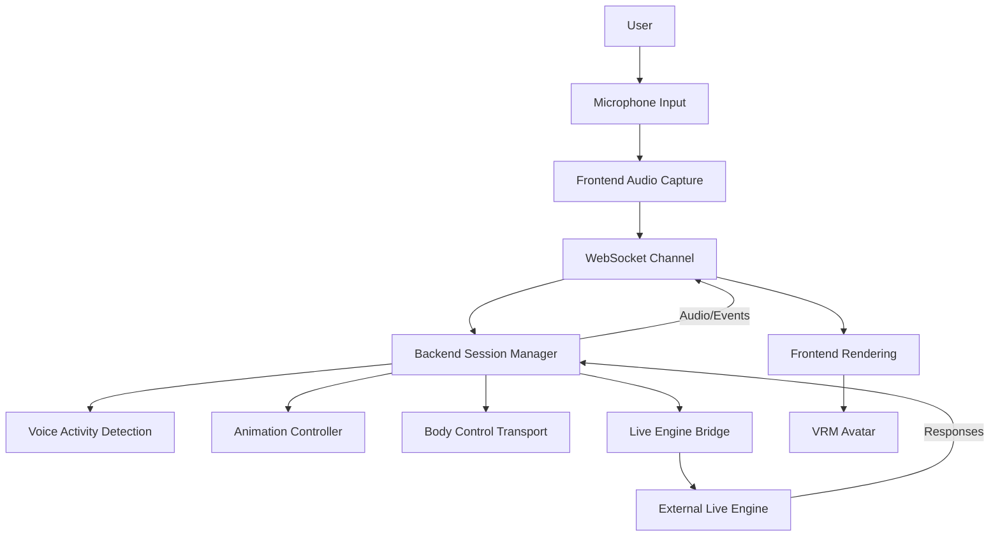

[No sources needed since this diagram shows conceptual workflow, not actual code structure]

## Dependency Analysis
Key dependencies and relationships:
- Frontend WebSocket client depends on transport layer for reliable messaging.
- Live session manager depends on VAD, animation handler, Karada transport, and live bridge.
- Karada transport can use either REST or WebSocket backends.
- TTS lipsync plugin integrates with animation handler for expression sync.
- Live bridge abstracts engine-specific details, enabling pluggable engines.

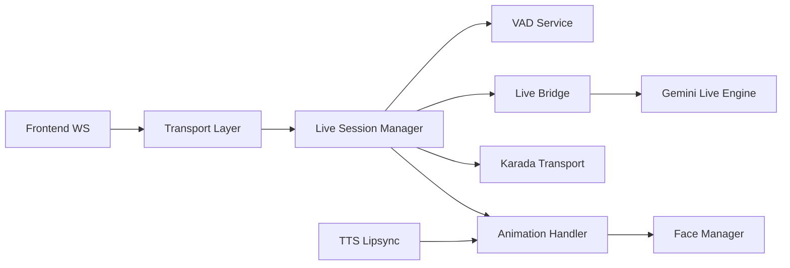

**Diagram sources**
- [synth-ws.ts](file://frontend/src/services/synth-ws.ts)
- [transport_layer.py](file://core/transport_layer.py)
- [live_session_manager.py](file://core/live_session_manager.py)
- [vad_service.py](file://core/vad_service.py)
- [animation_handler.py](file://core/animation_handler.py)
- [karada_transport.py](file://core/karada_transport.py)
- [live_bridge.py](file://core/external_endpoints/bridges/live_bridge.py)
- [gemini_live.py](file://engines/live/gemini_live.py)
- [face.ts](file://frontend/src/composables/vrm/face.ts)
- [tts_lipsync.py](file://plugins/tts_lipsync/tts_lipsync.py)

**Section sources**
- [synth-ws.ts](file://frontend/src/services/synth-ws.ts)
- [transport_layer.py](file://core/transport_layer.py)
- [live_session_manager.py](file://core/live_session_manager.py)
- [vad_service.py](file://core/vad_service.py)
- [animation_handler.py](file://core/animation_handler.py)
- [karada_transport.py](file://core/karada_transport.py)
- [live_bridge.py](file://core/external_endpoints/bridges/live_bridge.py)
- [gemini_live.py](file://engines/live/gemini_live.py)
- [face.ts](file://frontend/src/composables/vrm/face.ts)
- [tts_lipsync.py](file://plugins/tts_lipsync/tts_lipsync.py)

## Performance Considerations
- Latency reduction:
  - Use WebSocket transport for Karada commands to minimize round-trip time.
  - Tune VAD thresholds and frame sizes to balance responsiveness and accuracy.
  - Enable audio chunking and small buffers on the frontend to reduce delay.
- CPU and memory:
  - Avoid heavy computations in the hot path; offload feature extraction where possible.
  - Reuse buffers and objects to reduce GC pressure.
- Network resilience:
  - Implement exponential backoff and jitter for reconnections.
  - Queue critical messages and drop non-critical ones under congestion.
- Rendering efficiency:
  - Batch animation updates and expression changes to avoid excessive redraws.
  - Use LOD and culling for complex VRM scenes.

[No sources needed since this section provides general guidance]

## Troubleshooting Guide
Common issues and resolutions:
- WebSocket connection failures:
  - Verify server URL, ports, and firewall rules.
  - Check authentication tokens and CORS settings.
  - Inspect reconnection logs and backoff behavior.
- Audio problems:
  - Ensure microphone permissions and device selection.
  - Validate sample rate and format compatibility.
  - Monitor buffer underruns and adjust chunk size.
- VAD misbehavior:
  - Adjust thresholds and smoothing parameters.
  - Calibrate with ambient noise levels.
- Animation desynchronization:
  - Confirm timeline alignment and duration hints.
  - Check priority conflicts and blending weights.
- Karada command drops:
  - Switch to WebSocket transport if using REST.
  - Implement retry logic and acknowledge checks.

**Section sources**
- [synth-ws.ts](file://frontend/src/services/synth-ws.ts)
- [vad_service.py](file://core/vad_service.py)
- [animation_handler.py](file://core/animation_handler.py)
- [karada_ws_transport.py](file://core/karada_ws_transport.py)

## Conclusion
Synthetic Heart’s real-time features combine robust session management, efficient VAD, responsive animation control, and flexible transport mechanisms to deliver immersive live voice interactions with VRM avatars. By leveraging WebSocket communication, prioritized animations, and lip-sync technology, the system achieves low-latency, high-quality experiences. Proper configuration and tuning of VAD, audio buffers, and transport choices are essential for optimal performance.

[No sources needed since this section summarizes without analyzing specific files]

## Appendices

### Setting Up a Live Session
- Steps:
  - Initialize the frontend WebSocket client and connect to the backend.
  - Start a live session with desired configuration (engine, audio settings).
  - Begin capturing microphone audio and sending frames over WebSocket.
  - Receive and play back audio responses; apply animations and body control as needed.
- References:
  - Live session documentation and guides.

**Section sources**
- [live.md](file://docs/gemini/live.md)
- [synth-live-voice-integration.rst](file://docs/gemini/synth-live-voice-integration.rst)

### Configuring Voice Input/Output
- Microphone setup:
  - Select device, set sample rate, and configure chunk size.
- Playback:
  - Configure audio destination and latency targets.
- VAD:
  - Set sensitivity thresholds and silence detection windows.

**Section sources**
- [audio-stream.ts](file://frontend/src/services/audio-stream.ts)
- [vad_service.py](file://core/vad_service.py)

### Controlling Avatar Expressions
- Methods:
  - Use animation descriptors to trigger gestures and expressions.
  - Blend expressions smoothly with durations and weights.
  - Prioritize critical animations to override background states.

**Section sources**
- [animation_handler.py](file://core/animation_handler.py)
- [face.ts](file://frontend/src/composables/vrm/face.ts)

### Karada Transport Usage
- Commands:
  - Send pose and joint angle updates via REST or WebSocket.
  - Subscribe to feedback events for confirmation and status.
- Best practices:
  - Prefer WebSocket for continuous streaming.
  - Implement retries and fallbacks.

**Section sources**
- [karada_transport.py](file://core/karada_transport.py)
- [karada_ws_transport.py](file://core/karada_ws_transport.py)

### Animation Priority Management
- Rules:
  - Assign explicit priorities to animations.
  - Use blending to transition between states without abrupt changes.
  - Clear or reset animations when no longer needed.

**Section sources**
- [animation_handler.py](file://core/animation_handler.py)

### Lip-Sync Configuration
- Steps:
  - Enable TTS lipsync plugin and align phoneme sequences to audio.
  - Map phonemes to expression keys and apply via animation handler.
  - Tune timing offsets for natural mouth movements.

**Section sources**
- [tts_lipsync.py](file://plugins/tts_lipsync/tts_lipsync.py)
- [animation_handler.py](file://core/animation_handler.py)

### Real-Time Data Streaming Examples
- Audio streaming:
  - Frontend captures and sends chunks; backend forwards to VAD and engine.
  - Responses streamed back as audio frames.
- Event streaming:
  - Session status, animation updates, and body control events exchanged over WebSocket.

**Section sources**
- [synth-ws.ts](file://frontend/src/services/synth-ws.ts)
- [transport_layer.py](file://core/transport_layer.py)
- [live_session_manager.py](file://core/live_session_manager.py)