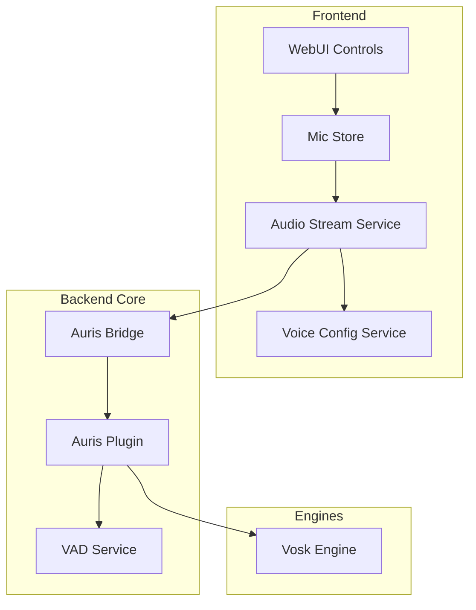
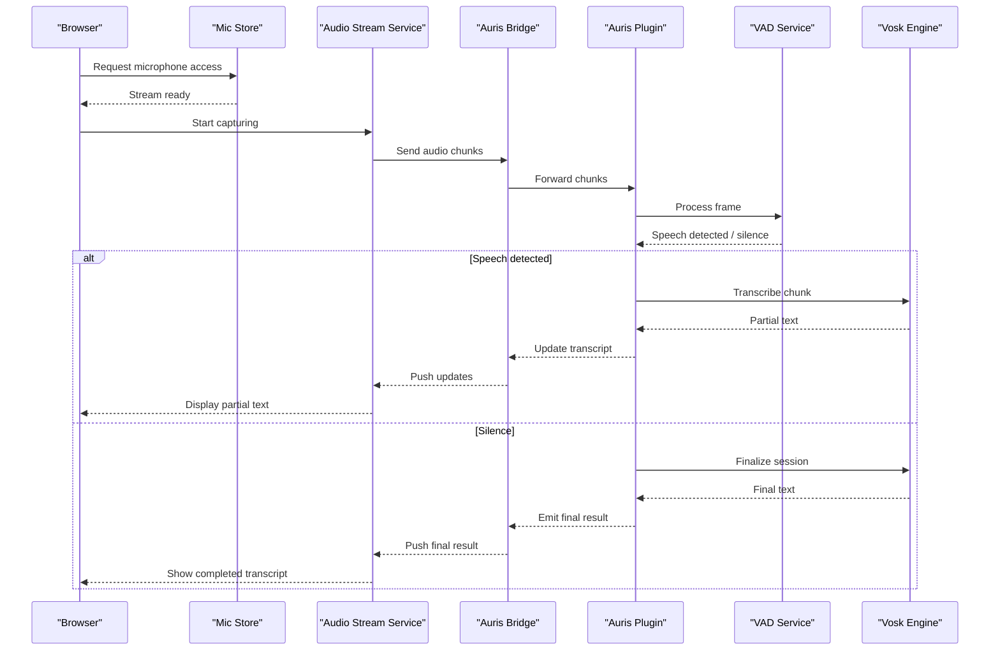
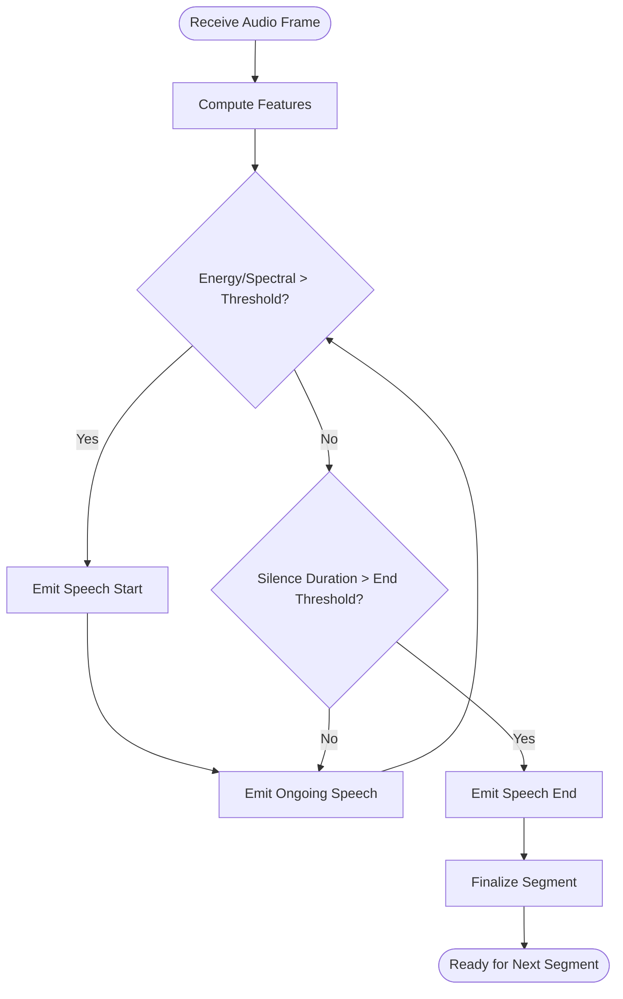
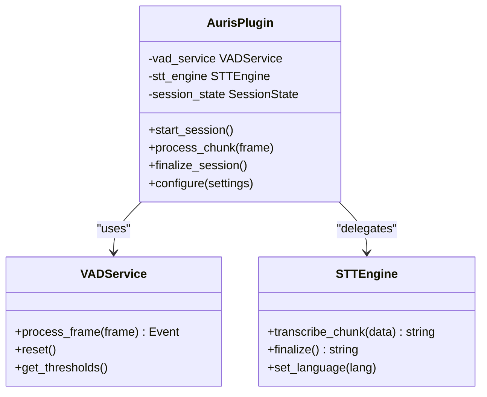
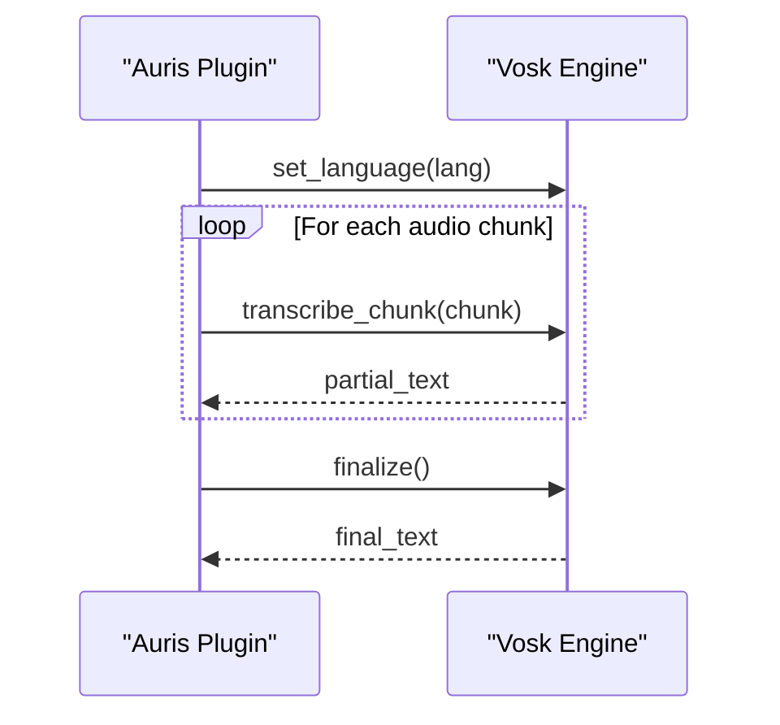
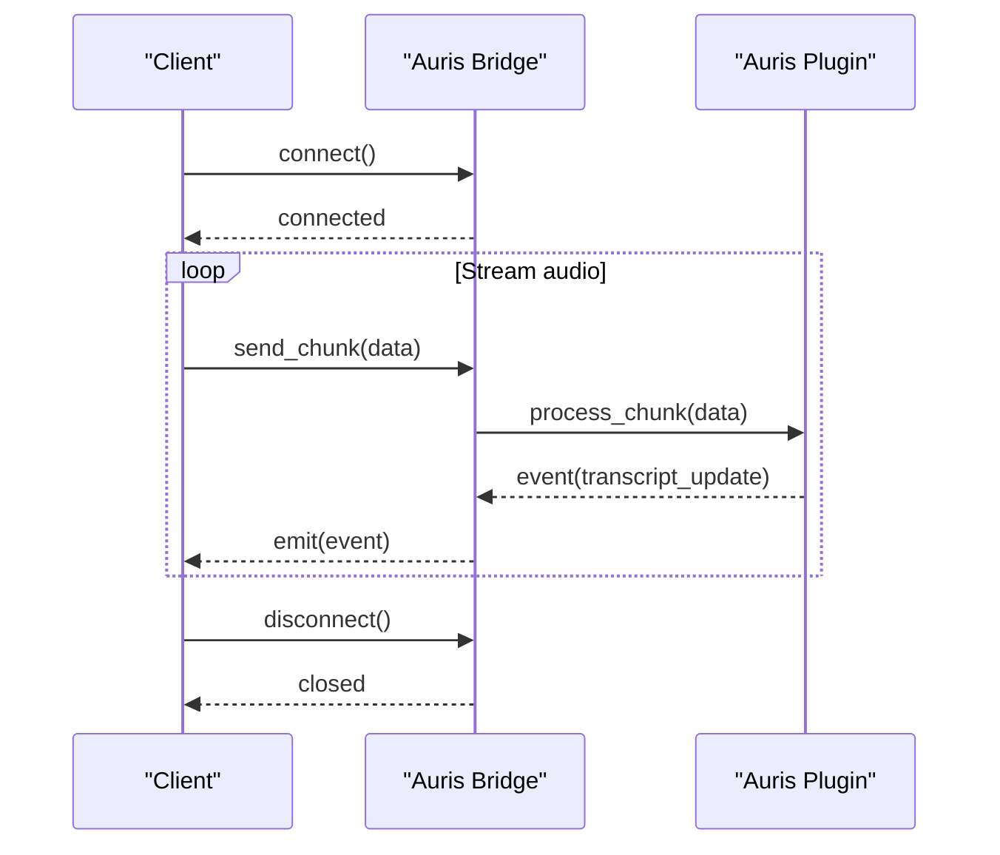
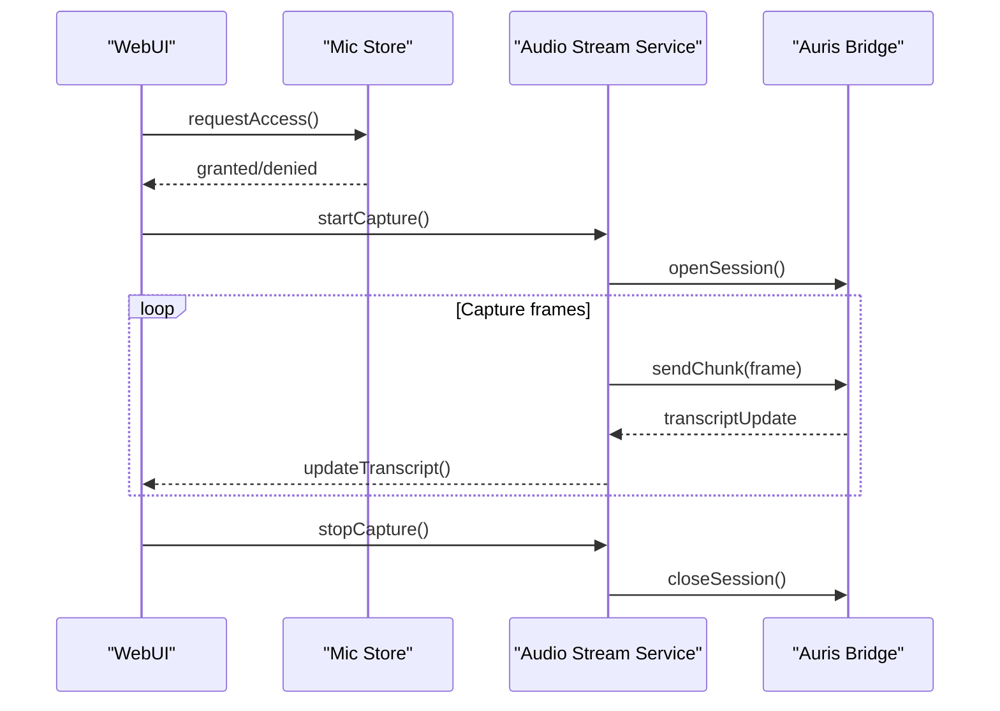
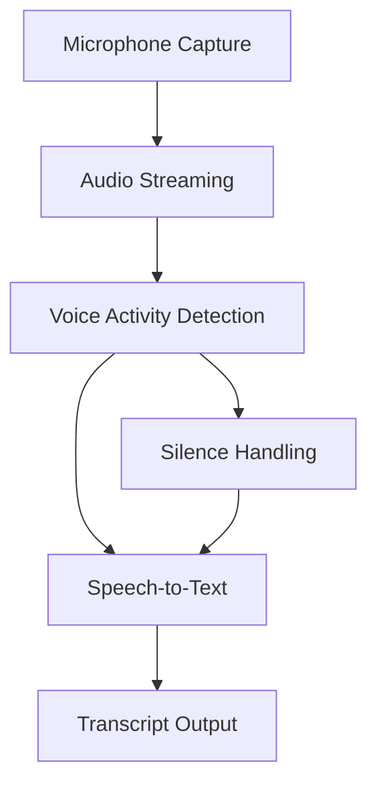
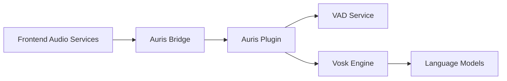

# Voice Processing & VAD

<cite>
**Referenced Files in This Document**
- [vad_service.py](file://core/vad_service.py)
- [auris_plugin.py](file://plugins/auris_plugin/auris_plugin.py)
- [vosk_engine.py](file://plugins/auris_engines/vosk_engine.py)
- [auris_bridge.py](file://core/external_endpoints/bridges/auris_bridge.py)
- [vox_plugin.py](file://plugins/vox_plugin/vox_plugin.py)
- [audio_stream.ts](file://frontend/src/services/audio-stream.ts)
- [voice-config.ts](file://frontend/src/services/voice-config.ts)
- [mic.ts](file://frontend/src/stores/mic.ts)
- [synth_live_voice_integration.rst](file://docs/synth-live-voice-integration.rst)
</cite>

## Table of Contents
1. [Introduction](#introduction)
2. [Project Structure](#project-structure)
3. [Core Components](#core-components)
4. [Architecture Overview](#architecture-overview)
5. [Detailed Component Analysis](#detailed-component-analysis)
6. [Dependency Analysis](#dependency-analysis)
7. [Performance Considerations](#performance-considerations)
8. [Troubleshooting Guide](#troubleshooting-guide)
9. [Conclusion](#conclusion)
10. [Appendices](#appendices)

## Introduction
This document explains the voice processing and voice activity detection (VAD) capabilities, focusing on the VAD service implementation, audio stream processing, and speech recognition pipeline. It covers the Auris plugin architecture, Vosk engine integration, and guidance for custom voice engines. It also includes examples for configuring voice input, setting up speech-to-text conversion, handling audio streams, real-time processing, noise considerations, multi-language support, performance optimization, memory management, and troubleshooting.

## Project Structure
The voice stack spans frontend audio capture, a backend VAD service, an Auris plugin orchestrating engines, and a Vosk-based STT engine. The WebUI provides configuration and runtime controls for microphone access and streaming.

**Diagram sources**
- [audio_stream.ts](file://frontend/src/services/audio-stream.ts)
- [voice-config.ts](file://frontend/src/services/voice-config.ts)
- [mic.ts](file://frontend/src/stores/mic.ts)
- [auris_bridge.py](file://core/external_endpoints/bridges/auris_bridge.py)
- [auris_plugin.py](file://plugins/auris_plugin/auris_plugin.py)
- [vad_service.py](file://core/vad_service.py)
- [vosk_engine.py](file://plugins/auris_engines/vosk_engine.py)

**Section sources**
- [vad_service.py](file://core/vad_service.py)
- [auris_plugin.py](file://plugins/auris_plugin/auris_plugin.py)
- [vosk_engine.py](file://plugins/auris_engines/vosk_engine.py)
- [auris_bridge.py](file://core/external_endpoints/bridges/auris_bridge.py)
- [audio_stream.ts](file://frontend/src/services/audio-stream.ts)
- [voice-config.ts](file://frontend/src/services/voice-config.ts)
- [mic.ts](file://frontend/src/stores/mic.ts)

## Core Components
- VAD Service: Detects speech segments from incoming audio frames, manages thresholds, and emits start/end events to downstream components.
- Auris Plugin: Orchestrates audio ingestion, VAD, and STT engine selection; exposes configuration and lifecycle hooks.
- Vosk Engine: Provides offline speech-to-text with language model support and chunked transcription.
- Auris Bridge: Connects external systems or internal pipelines to the Auris plugin via a standardized interface.
- Frontend Audio Services: Capture microphone audio, manage permissions, and stream chunks to the backend.

Key responsibilities:
- Real-time audio ingestion and buffering
- VAD decisioning and segment boundary detection
- STT chunking and finalization
- Language model selection and switching
- Error propagation and retry strategies

**Section sources**
- [vad_service.py](file://core/vad_service.py)
- [auris_plugin.py](file://plugins/auris_plugin/auris_plugin.py)
- [vosk_engine.py](file://plugins/auris_engines/vosk_engine.py)
- [auris_bridge.py](file://core/external_endpoints/bridges/auris_bridge.py)
- [audio_stream.ts](file://frontend/src/services/audio-stream.ts)
- [voice-config.ts](file://frontend/src/services/voice-config.ts)
- [mic.ts](file://frontend/src/stores/mic.ts)

## Architecture Overview
The voice pipeline captures audio in the browser, streams it to the backend, where the Auris plugin coordinates VAD and STT. The Vosk engine transcribes audio chunks into text, which is then forwarded to higher-level services.

**Diagram sources**
- [audio_stream.ts](file://frontend/src/services/audio-stream.ts)
- [voice-config.ts](file://frontend/src/services/voice-config.ts)
- [mic.ts](file://frontend/src/stores/mic.ts)
- [auris_bridge.py](file://core/external_endpoints/bridges/auris_bridge.py)
- [auris_plugin.py](file://plugins/auris_plugin/auris_plugin.py)
- [vad_service.py](file://core/vad_service.py)
- [vosk_engine.py](file://plugins/auris_engines/vosk_engine.py)

## Detailed Component Analysis

### VAD Service
Responsibilities:
- Accepts audio frames at a fixed sample rate and bit depth
- Computes energy or spectral features to detect speech vs. silence
- Emits events for speech start, ongoing speech, and end-of-speech
- Integrates with plugins to trigger STT chunking and finalization

Operational notes:
- Threshold tuning affects false positives and missed detections
- Buffering strategy impacts latency and memory usage
- Multi-threaded processing should avoid race conditions on state transitions

**Diagram sources**
- [vad_service.py](file://core/vad_service.py)

**Section sources**
- [vad_service.py](file://core/vad_service.py)

### Auris Plugin
Responsibilities:
- Manages lifecycle of audio sessions
- Coordinates VAD and STT engine selection
- Exposes configuration endpoints for languages, models, and thresholds
- Handles error recovery and logging

Integration points:
- Receives audio chunks from the bridge
- Calls VAD service for segmentation
- Invokes STT engine for transcription
- Publishes results back through the bridge

**Diagram sources**
- [auris_plugin.py](file://plugins/auris_plugin/auris_plugin.py)
- [vad_service.py](file://core/vad_service.py)
- [vosk_engine.py](file://plugins/auris_engines/vosk_engine.py)

**Section sources**
- [auris_plugin.py](file://plugins/auris_plugin/auris_plugin.py)

### Vosk Engine
Responsibilities:
- Performs chunked speech-to-text using Vosk models
- Supports multiple languages via model selection
- Returns partial results during streaming and finalizes upon session end

Configuration:
- Model path and language code
- Chunk size aligned with VAD output
- Memory limits and buffer sizes

**Diagram sources**
- [vosk_engine.py](file://plugins/auris_engines/vosk_engine.py)
- [auris_plugin.py](file://plugins/auris_plugin/auris_plugin.py)

**Section sources**
- [vosk_engine.py](file://plugins/auris_engines/vosk_engine.py)

### Auris Bridge
Responsibilities:
- Standardizes communication between external systems and the Auris plugin
- Serializes/deserializes audio payloads
- Manages connection lifecycle and retries

**Diagram sources**
- [auris_bridge.py](file://core/external_endpoints/bridges/auris_bridge.py)
- [auris_plugin.py](file://plugins/auris_plugin/auris_plugin.py)

**Section sources**
- [auris_bridge.py](file://core/external_endpoints/bridges/auris_bridge.py)

### Frontend Audio Services
Responsibilities:
- Access microphone and handle permissions
- Capture audio at desired sample rate and format
- Stream chunks to the backend via the bridge
- Provide UI feedback for recording state and errors

**Diagram sources**
- [audio_stream.ts](file://frontend/src/services/audio-stream.ts)
- [voice-config.ts](file://frontend/src/services/voice-config.ts)
- [mic.ts](file://frontend/src/stores/mic.ts)
- [auris_bridge.py](file://core/external_endpoints/bridges/auris_bridge.py)

**Section sources**
- [audio_stream.ts](file://frontend/src/services/audio-stream.ts)
- [voice-config.ts](file://frontend/src/services/voice-config.ts)
- [mic.ts](file://frontend/src/stores/mic.ts)

### Conceptual Overview
The voice pipeline emphasizes low-latency streaming, robust VAD segmentation, and flexible STT engine integration. Configuration options allow tuning thresholds, chunk sizes, and language models to balance accuracy and performance.

[No sources needed since this diagram shows conceptual workflow, not actual code structure]

## Dependency Analysis
The voice stack has clear layering:
- Frontend services depend on browser APIs and communicate with the backend bridge
- The bridge depends on the Auris plugin interface
- The Auris plugin depends on VAD and STT engines
- The Vosk engine depends on model files and language configurations

**Diagram sources**
- [audio_stream.ts](file://frontend/src/services/audio-stream.ts)
- [voice-config.ts](file://frontend/src/services/voice-config.ts)
- [mic.ts](file://frontend/src/stores/mic.ts)
- [auris_bridge.py](file://core/external_endpoints/bridges/auris_bridge.py)
- [auris_plugin.py](file://plugins/auris_plugin/auris_plugin.py)
- [vad_service.py](file://core/vad_service.py)
- [vosk_engine.py](file://plugins/auris_engines/vosk_engine.py)

**Section sources**
- [audio_stream.ts](file://frontend/src/services/audio-stream.ts)
- [voice-config.ts](file://frontend/src/services/voice-config.ts)
- [mic.ts](file://frontend/src/stores/mic.ts)
- [auris_bridge.py](file://core/external_endpoints/bridges/auris_bridge.py)
- [auris_plugin.py](file://plugins/auris_plugin/auris_plugin.py)
- [vad_service.py](file://core/vad_service.py)
- [vosk_engine.py](file://plugins/auris_engines/vosk_engine.py)

## Performance Considerations
- Chunk sizing: Align audio chunk size with VAD window and STT model expectations to minimize latency and memory spikes.
- VAD thresholds: Tune energy thresholds per environment to reduce false triggers and improve end-of-speech detection.
- Model loading: Preload language models to avoid startup delays; cache active models when switching languages frequently.
- Buffer management: Use circular buffers and limit queue depths to prevent memory growth under high load.
- Threading: Ensure thread-safe operations in VAD and STT stages; avoid blocking I/O in hot paths.
- Network: Compress or downsample audio if bandwidth is constrained; prefer local STT when possible.

[No sources needed since this section provides general guidance]

## Troubleshooting Guide
Common issues and resolutions:
- No audio captured: Verify microphone permissions and device selection in the frontend mic store.
- Frequent false positives: Lower VAD sensitivity or adjust threshold parameters.
- Stuttering transcripts: Increase chunk size or optimize STT engine settings; ensure adequate CPU resources.
- Language mismatch: Confirm language model matches spoken language; switch models dynamically if supported.
- High memory usage: Reduce buffer sizes, limit concurrent sessions, and monitor garbage collection behavior.
- Bridge connectivity: Check network policies and retry logic; validate payload formats.

Diagnostic steps:
- Inspect logs around VAD events and STT calls
- Validate audio format and sample rate consistency across pipeline
- Test with known audio samples to isolate environment-specific issues

**Section sources**
- [vad_service.py](file://core/vad_service.py)
- [auris_plugin.py](file://plugins/auris_plugin/auris_plugin.py)
- [vosk_engine.py](file://plugins/auris_engines/vosk_engine.py)
- [auris_bridge.py](file://core/external_endpoints/bridges/auris_bridge.py)
- [audio_stream.ts](file://frontend/src/services/audio-stream.ts)
- [voice-config.ts](file://frontend/src/services/voice-config.ts)
- [mic.ts](file://frontend/src/stores/mic.ts)

## Conclusion
The voice processing and VAD system integrates frontend audio capture, a robust VAD service, and a flexible STT engine via the Auris plugin. Proper configuration of thresholds, chunk sizes, and language models yields accurate, low-latency transcription. Performance tuning and careful memory management are essential for production deployments.

[No sources needed since this section summarizes without analyzing specific files]

## Appendices
- Example configuration references: See documentation for live voice integration details.

**Section sources**
- [synth_live_voice_integration.rst](file://docs/synth-live-voice-integration.rst)