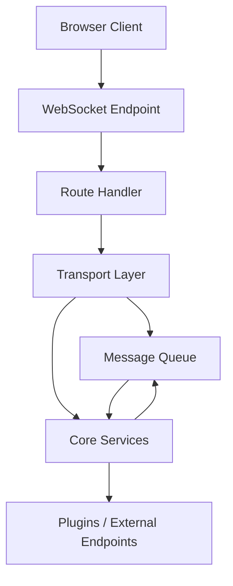
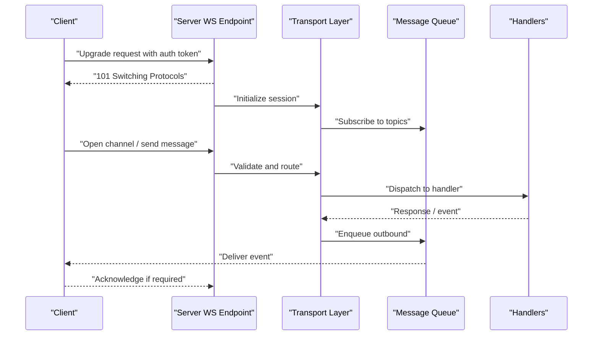
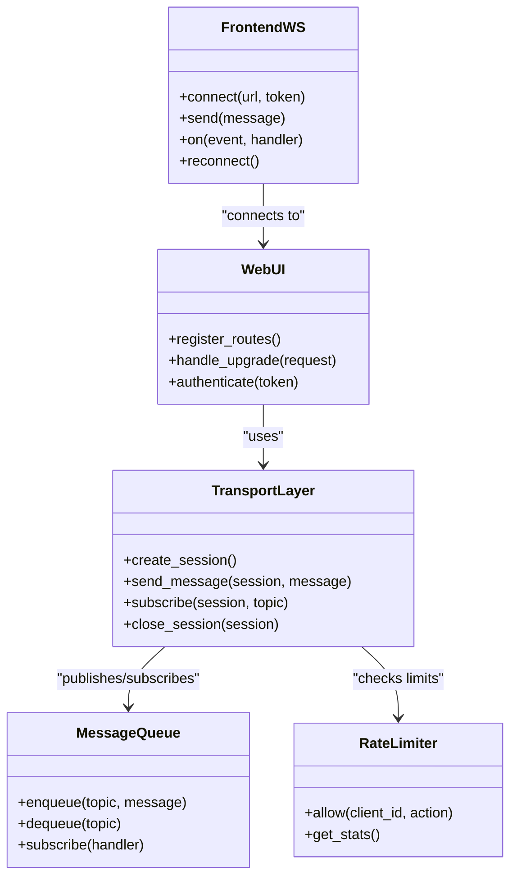

# WebSocket Protocol

<cite>
**Referenced Files in This Document**
- [main.py](file://main.py)
- [core/webui.py](file://core/webui.py)
- [core/transport_layer.py](file://core/transport_layer.py)
- [core/message_queue.py](file://core/message_queue.py)
- [core/rate_limit.py](file://core/rate_limit.py)
- [frontend/src/services/synth-ws.ts](file://frontend/src/services/synth-ws.ts)
- [frontend/src/services/protocol.ts](file://frontend/src/services/protocol.ts)
- [frontend/src/stores/connection.ts](file://frontend/src/stores/connection.ts)
- [tests/test_webui.py](file://tests/test_webui.py)
- [tests/test_transport_recovery.py](file://tests/test_transport_recovery.py)
</cite>

## Table of Contents
1. [Introduction](#introduction)
2. [Project Structure](#project-structure)
3. [Core Components](#core-components)
4. [Architecture Overview](#architecture-overview)
5. [Detailed Component Analysis](#detailed-component-analysis)
6. [Dependency Analysis](#dependency-analysis)
7. [Performance Considerations](#performance-considerations)
8. [Troubleshooting Guide](#troubleshooting-guide)
9. [Conclusion](#conclusion)
10. [Appendices](#appendices)

## Introduction
This document explains the WebSocket protocol implementation used by Synthetic Heart for real-time communication between the server and web clients. It covers the connection lifecycle, message formats, event types, server-side handlers, client-side connection management, routing, authentication, error handling, reconnection strategies, message queuing, security considerations, rate limiting, and debugging techniques. The goal is to provide both a high-level understanding and detailed guidance for developers integrating with or extending the WebSocket layer.

## Project Structure
The WebSocket subsystem spans both backend (Python) and frontend (TypeScript) components:
- Backend entry points register HTTP routes and upgrade to WebSocket connections.
- A transport layer abstracts WebSocket sessions and provides utilities for sending and receiving messages.
- A message queue decouples producers from consumers and ensures reliable delivery.
- Rate limiting protects endpoints and channels from abuse.
- Frontend services manage connection state, reconnection logic, and message routing.

[No sources needed since this diagram shows conceptual workflow, not actual code structure]

## Core Components
- WebSocket endpoint and route registration: Initializes the HTTP server and upgrades requests to WebSocket sessions.
- Transport layer: Manages session lifecycle, message serialization, and dispatching to core services.
- Message queue: Provides asynchronous, ordered, and prioritized delivery of messages across components.
- Rate limiter: Enforces per-client and per-channel limits to protect resources.
- Frontend WebSocket service: Establishes connections, handles reconnection, queues outbound messages, and routes inbound events.

Key responsibilities:
- Connection lifecycle: handshake, authentication, subscription, heartbeat, graceful close.
- Message format: consistent envelope with type, payload, and metadata.
- Event types: system, chat, media, presence, configuration, and plugin-specific events.
- Routing: topic-based or channel-based routing to appropriate handlers.
- Error handling: structured errors, retry policies, and client notifications.
- Security: token validation, origin checks, TLS enforcement, and input sanitization.

**Section sources**
- [core/webui.py](file://core/webui.py)
- [core/transport_layer.py](file://core/transport_layer.py)
- [core/message_queue.py](file://core/message_queue.py)
- [core/rate_limit.py](file://core/rate_limit.py)
- [frontend/src/services/synth-ws.ts](file://frontend/src/services/synth-ws.ts)
- [frontend/src/services/protocol.ts](file://frontend/src/services/protocol.ts)
- [frontend/src/stores/connection.ts](file://frontend/src/stores/connection.ts)

## Architecture Overview
The WebSocket architecture follows a layered approach:
- Client connects via HTTPS and upgrades to WebSocket.
- Server validates credentials and assigns a session context.
- Messages are routed through topics/channels to relevant handlers.
- Outbound events are produced by core services and queued before delivery.
- Clients acknowledge critical messages and handle reconnection transparently.

**Diagram sources**
- [core/webui.py](file://core/webui.py)
- [core/transport_layer.py](file://core/transport_layer.py)
- [core/message_queue.py](file://core/message_queue.py)
- [frontend/src/services/synth-ws.ts](file://frontend/src/services/synth-ws.ts)

**Section sources**
- [core/webui.py](file://core/webui.py)
- [core/transport_layer.py](file://core/transport_layer.py)
- [core/message_queue.py](file://core/message_queue.py)
- [frontend/src/services/synth-ws.ts](file://frontend/src/services/synth-ws.ts)

## Detailed Component Analysis

### Server-Side WebSocket Handlers
Responsibilities:
- Accept WebSocket upgrades and validate origins.
- Authenticate using tokens or session cookies.
- Create session contexts and assign permissions.
- Route incoming messages to appropriate handlers based on type/topic.
- Manage heartbeats and liveness checks.
- Gracefully handle disconnects and cleanup resources.

Implementation patterns:
- Centralized upgrade handler that delegates to a transport manager.
- Topic-based routing with priority queues.
- Structured error responses with codes and messages.

Security considerations:
- Validate Authorization headers or signed tokens.
- Enforce CORS and origin allowlists.
- Sanitize payloads and enforce schemas.

Rate limiting:
- Per-client message rate caps.
- Burst allowances with sliding windows.
- Global throttling for heavy operations.

Error handling:
- Categorize errors (auth, validation, internal).
- Emit standardized error events to clients.
- Log contextual details without leaking sensitive data.

**Section sources**
- [core/webui.py](file://core/webui.py)
- [core/transport_layer.py](file://core/transport_layer.py)
- [core/rate_limit.py](file://core/rate_limit.py)

### Client-Side Connection Management
Responsibilities:
- Establish WebSocket connections with retries and backoff.
- Maintain connection state (connecting, open, closed, error).
- Queue outbound messages until connection is ready.
- Handle reconnection after network failures or server restarts.
- Parse and route inbound events to UI stores and components.

Reconnection strategy:
- Exponential backoff with jitter.
- Max retry attempts and timeout thresholds.
- Resume subscriptions and flush queued messages upon reconnect.

Message queuing:
- In-memory queue with persistence fallback if needed.
- Priority ordering for critical messages.
- Deduplication and idempotency keys.

Authentication flow:
- Attach token to initial handshake or first message.
- Refresh tokens automatically when expired.
- Re-authenticate on reconnect.

**Section sources**
- [frontend/src/services/synth-ws.ts](file://frontend/src/services/synth-ws.ts)
- [frontend/src/stores/connection.ts](file://frontend/src/stores/connection.ts)
- [frontend/src/services/protocol.ts](file://frontend/src/services/protocol.ts)

### Message Formats and Event Types
Envelope structure:
- Type: identifies the event category (e.g., chat, system, media).
- Payload: typed object specific to the event.
- Metadata: includes IDs, timestamps, correlation keys, and routing info.

Common event types:
- System: heartbeat, status, configuration updates.
- Chat: user messages, agent responses, reactions.
- Media: audio chunks, transcription results.
- Presence: online/offline, avatar states.
- Plugin: custom events from plugins.

Routing rules:
- Topic-based routing with wildcards.
- Channel scoping for multi-user sessions.
- Priority levels for urgent vs background events.

Validation:
- Schema validation on both sides.
- Fallback handling for unknown types.

**Section sources**
- [frontend/src/services/protocol.ts](file://frontend/src/services/protocol.ts)
- [core/transport_layer.py](file://core/transport_layer.py)

### Real-Time Communication Patterns
Patterns implemented:
- Publish-subscribe for broadcasting events.
- Request-response for synchronous interactions.
- Streaming for large payloads like audio or video frames.
- Acknowledgment for reliability-critical messages.

Flow control:
- Backpressure handling to prevent overload.
- Adaptive batching for high-frequency events.
- Throttling at source and destination.

Observability:
- Metrics collection for latency and throughput.
- Structured logging with correlation IDs.
- Tracing across components.

**Section sources**
- [core/message_queue.py](file://core/message_queue.py)
- [core/transport_layer.py](file://core/transport_layer.py)

## Dependency Analysis
The WebSocket layer depends on several core modules:
- WebUI module registers routes and manages lifecycle.
- Transport layer abstracts I/O and session management.
- Message queue provides async delivery and buffering.
- Rate limiter enforces quotas and prevents abuse.
- Frontend services encapsulate client behavior and state.

**Diagram sources**
- [core/webui.py](file://core/webui.py)
- [core/transport_layer.py](file://core/transport_layer.py)
- [core/message_queue.py](file://core/message_queue.py)
- [core/rate_limit.py](file://core/rate_limit.py)
- [frontend/src/services/synth-ws.ts](file://frontend/src/services/synth-ws.ts)

**Section sources**
- [core/webui.py](file://core/webui.py)
- [core/transport_layer.py](file://core/transport_layer.py)
- [core/message_queue.py](file://core/message_queue.py)
- [core/rate_limit.py](file://core/rate_limit.py)
- [frontend/src/services/synth-ws.ts](file://frontend/src/services/synth-ws.ts)

## Performance Considerations
- Use binary protocols for large payloads to reduce overhead.
- Implement connection pooling and reuse where possible.
- Apply compression selectively to avoid CPU bottlenecks.
- Monitor memory usage and set limits for message buffers.
- Profile hot paths in message processing and optimize serialization.

[No sources needed since this section provides general guidance]

## Troubleshooting Guide
Common issues and resolutions:
- Connection failures: verify network connectivity, firewall rules, and TLS settings.
- Authentication errors: check token validity, expiration, and scope.
- Message drops: inspect queue depth, consumer health, and error logs.
- High latency: analyze network conditions, server load, and processing delays.
- Reconnection loops: adjust backoff parameters and max retry counts.

Debugging techniques:
- Enable verbose logging with correlation IDs.
- Capture WebSocket traffic using browser dev tools or proxies.
- Use health check endpoints to monitor server status.
- Simulate failures to test resilience and recovery.

**Section sources**
- [tests/test_webui.py](file://tests/test_webui.py)
- [tests/test_transport_recovery.py](file://tests/test_transport_recovery.py)

## Conclusion
The WebSocket protocol in Synthetic Heart provides a robust, scalable foundation for real-time communication. By separating concerns across layers, enforcing security and rate limits, and implementing resilient client behavior, it supports diverse use cases from chat to media streaming. Developers should follow the documented patterns for message formats, event types, and error handling to ensure compatibility and maintainability.

[No sources needed since this section summarizes without analyzing specific files]

## Appendices

### Example Workflows
- Establishing a connection:
  - Client initiates upgrade with token.
  - Server authenticates and creates session.
  - Client subscribes to topics and begins sending/receiving messages.

- Sending and receiving messages:
  - Client sends typed message with payload.
  - Server validates and routes to handler.
  - Handler processes and publishes response or event.
  - Client receives and updates UI state.

- Handling connection events:
  - On open: initialize subscriptions and resume queue.
  - On message: parse and dispatch to appropriate handlers.
  - On close: trigger reconnection logic and notify UI.

[No sources needed since this section provides conceptual examples]