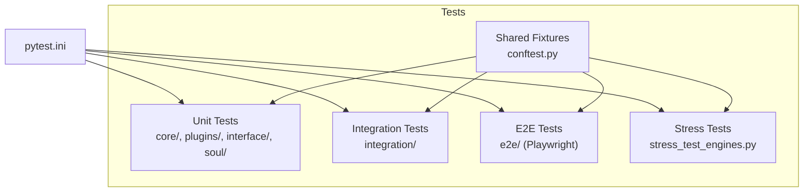
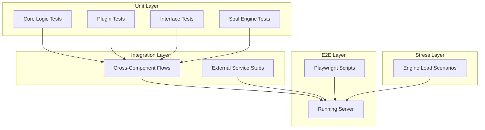
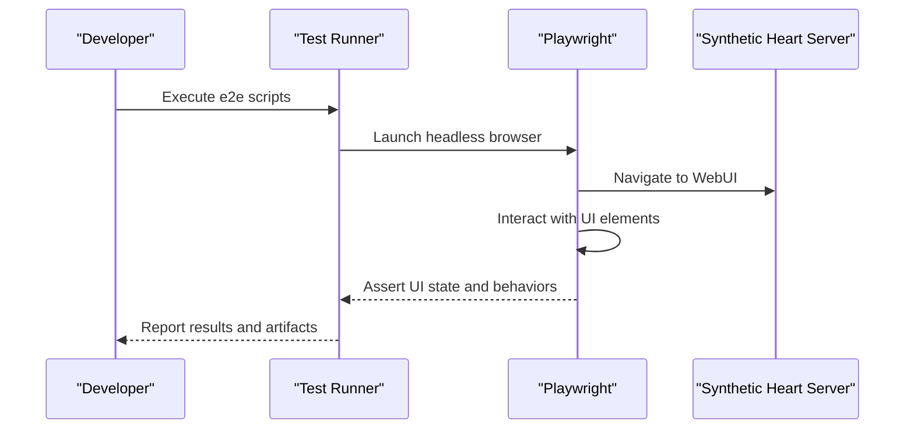
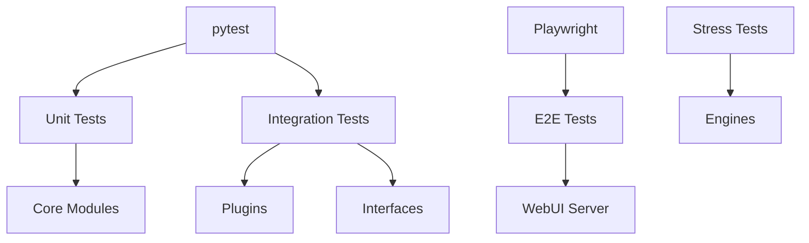
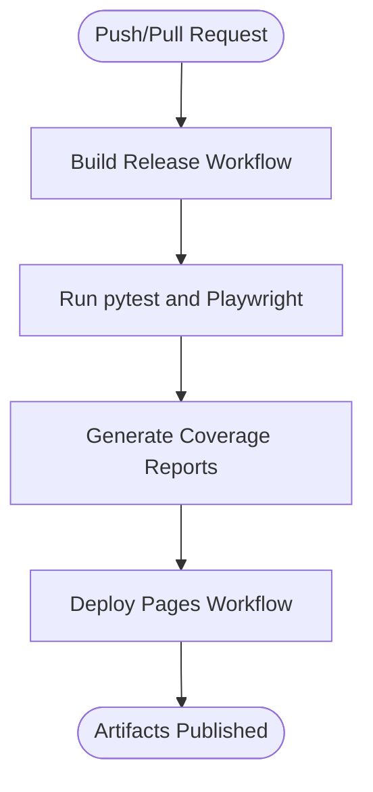

# Testing Strategy

<cite>
**Referenced Files in This Document**
- [pytest.ini](file://pytest.ini)
- [run_tests.py](file://run_tests.py)
- [run_tests.sh](file://run_tests.sh)
- [tests/conftest.py](file://tests/conftest.py)
- [tests/README.md](file://tests/README.md)
- [tests/synth_api_test.py](file://tests/synth_api_test.py)
- [tests/stress_test_engines.py](file://tests/stress_test_engines.py)
- [tests/e2e/index.spec.js](file://tests/e2e/index.spec.js)
- [tests/e2e/webui.spec.js](file://tests/e2e/webui.spec.js)
- [tests/integration/test_webui_archives_e2e.py](file://tests/integration/test_webui_archives_e2e.py)
- [tests/interface/test_fluxer_interface.py](file://tests/interface/test_fluxer_interface.py)
- [tests/interface/test_matrix_interface.py](file://tests/interface/test_matrix_interface.py)
- [tests/plugins/test_grillo_suppression.py](file://tests/plugins/test_grillo_suppression.py)
- [tests/plugins/test_memory_search.py](file://tests/plugins/test_memory_search.py)
- [tests/plugins/test_radio_host_plugin.py](file://tests/plugins/test_radio_host_plugin.py)
- [tests/plugins/test_recon_agent_intent.py](file://tests/plugins/test_recon_agent_intent.py)
- [tests/plugins/test_recon_language_evaluator.py](file://tests/plugins/test_recon_language_evaluator.py)
- [tests/plugins/test_selenium_ttsfree.py](file://tests/plugins/test_selenium_ttsfree.py)
- [tests/soul/test_compiler.py](file://tests/soul/test_compiler.py)
- [tests/soul/test_emotion_engine.py](file://tests/soul/test_emotion_engine.py)
- [tests/soul/test_soul_plugin.py](file://tests/soul/test_soul_plugin.py)
- [tests/soul/test_time_resolution.py](file://tests/soul/test_time_resolution.py)
- [.github/workflows/build-release.yml](file://.github/workflows/build-release.yml)
- [.github/workflows/deploy-pages.yml](file://.github/workflows/deploy-pages.yml)
</cite>

## Table of Contents
1. [Introduction](#introduction)
2. [Project Structure](#project-structure)
3. [Core Components](#core-components)
4. [Architecture Overview](#architecture-overview)
5. [Detailed Component Analysis](#detailed-component-analysis)
6. [Dependency Analysis](#dependency-analysis)
7. [Performance Considerations](#performance-considerations)
8. [Troubleshooting Guide](#troubleshooting-guide)
9. [Conclusion](#conclusion)
10. [Appendices](#appendices)

## Introduction
This document describes Synthetic Heart’s comprehensive testing strategy across unit, integration, and end-to-end tests. It explains the test architecture, frameworks (pytest and Playwright), organization, mocking strategies, data management, database testing patterns, async testing, CI pipelines, coverage reporting, performance and load testing, and debugging techniques. The goal is to provide both technical depth and accessible guidance for contributors and maintainers.

## Project Structure
The testing suite is organized under the tests directory with clear separation by scope:
- Unit tests: core logic, plugins, interfaces, and utilities
- Integration tests: cross-component flows and external integrations
- End-to-end tests: browser-based UI verification using Playwright
- Stress tests: engine throughput and resilience scenarios
- Shared fixtures and configuration via conftest.py and pytest.ini

**Diagram sources**
- [tests/conftest.py](file://tests/conftest.py)
- [pytest.ini](file://pytest.ini)

**Section sources**
- [tests/README.md](file://tests/README.md)
- [pytest.ini](file://pytest.ini)

## Core Components
Key components that shape the testing strategy:
- Test runner and configuration: pytest.ini defines markers, paths, and options
- Shared fixtures: tests/conftest.py provides reusable setup/teardown and mocks
- API smoke tests: tests/synth_api_test.py validates core endpoints and behavior
- Stress tests: tests/stress_test_engines.py exercises engines under load
- E2E automation: tests/e2e/*.spec.js uses Playwright for UI flows
- Integration examples: tests/integration/* and tests/interface/* validate cross-boundary interactions

**Section sources**
- [pytest.ini](file://pytest.ini)
- [tests/conftest.py](file://tests/conftest.py)
- [tests/synth_api_test.py](file://tests/synth_api_test.py)
- [tests/stress_test_engines.py](file://tests/stress_test_engines.py)
- [tests/e2e/index.spec.js](file://tests/e2e/index.spec.js)
- [tests/e2e/webui.spec.js](file://tests/e2e/webui.spec.js)
- [tests/integration/test_webui_archives_e2e.py](file://tests/integration/test_webui_archives_e2e.py)
- [tests/interface/test_fluxer_interface.py](file://tests/interface/test_fluxer_interface.py)
- [tests/interface/test_matrix_interface.py](file://tests/interface/test_matrix_interface.py)

## Architecture Overview
The testing architecture follows a layered approach:
- Unit layer: fast, isolated tests for modules and functions
- Integration layer: multi-module flows, plugin orchestration, and external service stubs
- E2E layer: real browser interactions through Playwright against a running server
- Stress layer: synthetic load to evaluate engine stability and resource usage

[No sources needed since this diagram shows conceptual workflow, not actual code structure]

## Detailed Component Analysis

### Test Runner and Configuration
- pytest.ini centralizes markers, test discovery, and runtime flags
- run_tests.py and run_tests.sh provide convenient entry points for local execution and CI-friendly invocation

Best practices:
- Use markers to categorize slow or network-dependent tests
- Configure parallel execution where safe
- Keep environment variables isolated per test scope via fixtures

**Section sources**
- [pytest.ini](file://pytest.ini)
- [run_tests.py](file://run_tests.py)
- [run_tests.sh](file://run_tests.sh)

### Shared Fixtures and Mocking Strategy
- tests/conftest.py defines shared fixtures for DB connections, mock services, and common helpers
- Mocking strategy:
  - Replace external LLM/TTS calls with deterministic stubs
  - Use in-memory databases or temporary SQLite for DB-backed tests
  - Patch network-bound dependencies to ensure deterministic outcomes

Guidelines:
- Scope fixtures appropriately (function, class, module, session)
- Provide teardown hooks to clean up resources
- Centralize assertion helpers for repeated patterns

**Section sources**
- [tests/conftest.py](file://tests/conftest.py)

### Unit Tests: Core Functionality
Examples include action parsing, prompt generation, message handling, and utility functions. These tests focus on correctness, edge cases, and input validation.

Patterns:
- Parameterized tests for multiple inputs
- Deterministic assertions on outputs and state changes
- Isolation from side effects via mocking

**Section sources**
- [tests/test_action_parser_autonomy_modes.py](file://tests/test_action_parser_autonomy_modes.py)
- [tests/test_prompt_engine.py](file://tests/test_prompt_engine.py)
- [tests/test_message_chain.py](file://tests/test_message_chain.py)

### Unit Tests: Plugins
Plugin tests cover behavior such as suppression rules, memory search, radio host operations, and recon evaluators. They validate plugin lifecycle, configuration, and interaction with core registries.

Patterns:
- Fixture-driven plugin initialization
- Controlled event injection to simulate messages/actions
- Assertions on registry updates and side effects

**Section sources**
- [tests/plugins/test_grillo_suppression.py](file://tests/plugins/test_grillo_suppression.py)
- [tests/plugins/test_memory_search.py](file://tests/plugins/test_memory_search.py)
- [tests/plugins/test_radio_host_plugin.py](file://tests/plugins/test_radio_host_plugin.py)
- [tests/plugins/test_recon_agent_intent.py](file://tests/plugins/test_recon_agent_intent.py)
- [tests/plugins/test_recon_language_evaluator.py](file://tests/plugins/test_recon_language_evaluator.py)

### Unit Tests: Interfaces
Interface tests verify communication contracts and message routing for Discord, Matrix, Fluxer, and Telegram integrations.

Patterns:
- Stubbed transports and channels
- Message payload validation
- Error path coverage for timeouts and retries

**Section sources**
- [tests/interface/test_fluxer_interface.py](file://tests/interface/test_fluxer_interface.py)
- [tests/interface/test_matrix_interface.py](file://tests/interface/test_matrix_interface.py)

### Unit Tests: Soul Engine
Soul tests cover compiler, emotion engine, time resolution, and plugin integration within the soul subsystem.

Patterns:
- Stateful scenario simulation
- Deterministic time injection
- Emotion state transitions validated via snapshots

**Section sources**
- [tests/soul/test_compiler.py](file://tests/soul/test_compiler.py)
- [tests/soul/test_emotion_engine.py](file://tests/soul/test_emotion_engine.py)
- [tests/soul/test_time_resolution.py](file://tests/soul/test_time_resolution.py)
- [tests/soul/test_soul_plugin.py](file://tests/soul/test_soul_plugin.py)

### Integration Tests
Integration tests exercise multi-component workflows such as WebUI archives and cross-service interactions.

Patterns:
- Setup of minimal runtime environments
- Seeding test data into DB
- Verifying end-to-end outcomes without full UI

**Section sources**
- [tests/integration/test_webui_archives_e2e.py](file://tests/integration/test_webui_archives_e2e.py)

### End-to-End Tests (Playwright)
E2E tests use Playwright to automate browser interactions with the running WebUI.

Patterns:
- Headless execution for CI
- Robust selectors and waits
- Assertions on UI states and user flows

**Diagram sources**
- [tests/e2e/index.spec.js](file://tests/e2e/index.spec.js)
- [tests/e2e/webui.spec.js](file://tests/e2e/webui.spec.js)

**Section sources**
- [tests/e2e/index.spec.js](file://tests/e2e/index.spec.js)
- [tests/e2e/webui.spec.js](file://tests/e2e/webui.spec.js)

### Stress Tests
Stress tests target engine throughput and resilience under load.

Patterns:
- Concurrent requests to LLM/TTS endpoints
- Resource monitoring and failure detection
- Graceful degradation checks

**Section sources**
- [tests/stress_test_engines.py](file://tests/stress_test_engines.py)

### Database Testing Patterns
- Use temporary SQLite or in-memory Postgres for isolation
- Seed deterministic fixtures before each test
- Validate schema migrations and query correctness

Best practices:
- Wrap transactions and roll back after tests
- Avoid shared global state between tests
- Use fixtures to manage DB lifecycle

**Section sources**
- [tests/conftest.py](file://tests/conftest.py)

### Async Testing Patterns
- Use pytest-asyncio-compatible fixtures for async functions
- Ensure event loops are properly managed in fixtures
- Validate non-blocking behavior and queue processing

Guidelines:
- Mark async tests explicitly
- Avoid blocking calls inside async contexts
- Use timeouts and cancellation for long-running tasks

**Section sources**
- [tests/conftest.py](file://tests/conftest.py)

### Writing Tests for Plugins, Interfaces, and Core
- Plugins: Initialize via registry, inject events, assert side effects
- Interfaces: Stub transports, send messages, verify routing and payloads
- Core: Mock external dependencies, validate internal state transitions

Example references:
- Plugin behavior: [test_grillo_suppression.py](file://tests/plugins/test_grillo_suppression.py)
- Interface contract: [test_fluxer_interface.py](file://tests/interface/test_fluxer_interface.py)
- Core functionality: [synth_api_test.py](file://tests/synth_api_test.py)

**Section sources**
- [tests/plugins/test_grillo_suppression.py](file://tests/plugins/test_grillo_suppression.py)
- [tests/interface/test_fluxer_interface.py](file://tests/interface/test_fluxer_interface.py)
- [tests/synth_api_test.py](file://tests/synth_api_test.py)

## Dependency Analysis
Testing dependencies and relationships:
- pytest orchestrates unit and integration tests
- Playwright drives E2E browser automation
- External services are mocked or stubbed to ensure determinism
- CI pipelines execute tests across layers

**Diagram sources**
- [pytest.ini](file://pytest.ini)
- [tests/e2e/index.spec.js](file://tests/e2e/index.spec.js)
- [tests/stress_test_engines.py](file://tests/stress_test_engines.py)

**Section sources**
- [pytest.ini](file://pytest.ini)
- [tests/e2e/index.spec.js](file://tests/e2e/index.spec.js)
- [tests/stress_test_engines.py](file://tests/stress_test_engines.py)

## Performance Considerations
- Parallelize independent tests to reduce runtime
- Use in-memory databases for speed
- Cache expensive setup steps in session-scoped fixtures
- Profile slow tests and optimize hot paths
- Monitor resource usage during stress tests

[No sources needed since this section provides general guidance]

## Troubleshooting Guide
Common issues and resolutions:
- Flaky E2E tests: Add explicit waits and retry logic; capture screenshots and videos
- Network failures: Stub external APIs; isolate tests with markers
- DB state leaks: Ensure proper teardown and transaction rollback
- Async deadlocks: Verify event loop usage and avoid blocking calls

Debugging tips:
- Use pytest -v and --tb=long for detailed traces
- Enable logging and export logs to files
- Run subsets of tests with markers to isolate failures

**Section sources**
- [tests/conftest.py](file://tests/conftest.py)
- [tests/e2e/index.spec.js](file://tests/e2e/index.spec.js)

## Conclusion
Synthetic Heart’s testing strategy combines pytest for unit and integration tests with Playwright for E2E automation, supported by stress tests and robust fixtures. This layered approach ensures reliability, performance, and maintainability across core functionality, plugins, interfaces, and the WebUI. Following the guidelines here will help contributors write effective, deterministic, and scalable tests.

[No sources needed since this section summarizes without analyzing specific files]

## Appendices

### Continuous Integration Setup
- GitHub Actions workflows define build and deployment pipelines
- Tests are executed as part of CI to catch regressions early

**Diagram sources**
- [.github/workflows/build-release.yml](file://.github/workflows/build-release.yml)
- [.github/workflows/deploy-pages.yml](file://.github/workflows/deploy-pages.yml)

**Section sources**
- [.github/workflows/build-release.yml](file://.github/workflows/build-release.yml)
- [.github/workflows/deploy-pages.yml](file://.github/workflows/deploy-pages.yml)

### Test Data Management
- Use fixtures to seed deterministic data
- Separate test datasets per scope
- Clean up generated artifacts post-test

**Section sources**
- [tests/conftest.py](file://tests/conftest.py)

### Coverage Reporting
- Configure pytest-cov to generate HTML reports
- Integrate coverage thresholds in CI
- Track trends over time to prevent regression

**Section sources**
- [pytest.ini](file://pytest.ini)