# Troubleshooting Guide

<cite>
**Referenced Files in This Document**
- [main.py](file://main.py)
- [core/logging_utils.py](file://core/logging_utils.py)
- [core/log_archive.py](file://core/log_archive.py)
- [core/webui.py](file://core/webui.py)
- [core/config_manager.py](file://core/config_manager.py)
- [core/llm_failure_log.py](file://core/llm_failure_log.py)
- [core/cortex_api_logger.py](file://core/cortex_api_logger.py)
- [core/live_api_logger.py](file://core/live_api_logger.py)
- [core/message_queue.py](file://core/message_queue.py)
- [core/plugin_instance.py](file://core/plugin_instance.py)
- [core/agent_core.py](file://core/agent_core.py)
- [core/core_initializer.py](file://core/core_initializer.py)
- [core/db.py](file://core/db.py)
- [core/db_backends.py](file://core/db_backends.py)
- [core/transport_layer.py](file://core/transport_layer.py)
- [core/vessel_session_manager.py](file://core/vessel_session_manager.py)
- [core/presence_manager.py](file://core/presence_manager.py)
- [core/chat_archives_db.py](file://core/chat_archives_db.py)
- [core/soul/observability.py](file://core/soul/observability.py)
- [core/mcp_bridge/server.py](file://core/mcp_bridge/server.py)
- [core/mcp_bridge/client.py](file://core/mcp_bridge/client.py)
- [core/mcp_bridge/config.py](file://core/mcp_bridge/config.py)
- [mcp_servers/synth_logs.py](file://mcp_servers/synth_logs.py)
- [mcp_servers/synth_llm_failures.py](file://mcp_servers/synth_llm_failures.py)
- [tools/synth_log_mcp.py](file://tools/synth_log_mcp.py)
- [scripts/run_webui.py](file://scripts/run_webui.py)
- [docker-compose.yml](file://docker-compose.yml)
- [config/synth_mcp.json](file://config/synth_mcp.json)
- [automation_tools/container_synth.sh](file://automation_tools/container_synth.sh)
</cite>

## Table of Contents
1. [Introduction](#introduction)
2. [Project Structure](#project-structure)
3. [Core Components](#core-components)
4. [Architecture Overview](#architecture-overview)
5. [Detailed Component Analysis](#detailed-component-analysis)
6. [Dependency Analysis](#dependency-analysis)
7. [Performance Considerations](#performance-considerations)
8. [Troubleshooting Guide](#troubleshooting-guide)
9. [Conclusion](#conclusion)
10. [Appendices](#appendices)

## Introduction
This guide provides comprehensive troubleshooting procedures for Synthetic Heart, focusing on logging mechanisms, debug modes, diagnostic commands, and resolution workflows. It covers diagnosing connection issues, plugin failures, memory problems, and performance bottlenecks. It also includes error message interpretation, log analysis techniques, monitoring tools, health check endpoints, alerting strategies, escalation procedures, and community support resources.

## Project Structure
Synthetic Heart is a modular Python application with:
- Core runtime and subsystems under core/
- Plugins under plugins/
- Interfaces (Discord, Matrix, Telegram, OpenAI API server) under interface/
- MCP bridge and servers under core/mcp_bridge/ and mcp_servers/
- Web UI templates and static assets under core/webui_templates/ and res/synth_webui/
- Configuration files under config/ and providers/
- Containerization and automation scripts under container/, automation_tools/, and docker-compose.yml

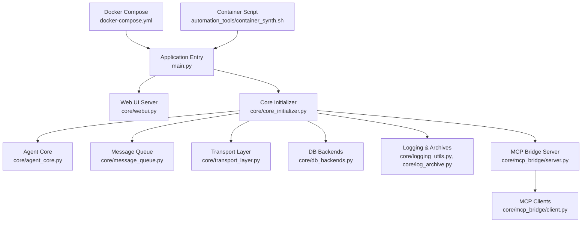

**Diagram sources**
- [main.py](file://main.py)
- [core/webui.py](file://core/webui.py)
- [core/core_initializer.py](file://core/core_initializer.py)
- [core/agent_core.py](file://core/agent_core.py)
- [core/message_queue.py](file://core/message_queue.py)
- [core/transport_layer.py](file://core/transport_layer.py)
- [core/db_backends.py](file://core/db_backends.py)
- [core/logging_utils.py](file://core/logging_utils.py)
- [core/log_archive.py](file://core/log_archive.py)
- [core/mcp_bridge/server.py](file://core/mcp_bridge/server.py)
- [core/mcp_bridge/client.py](file://core/mcp_bridge/client.py)
- [docker-compose.yml](file://docker-compose.yml)
- [automation_tools/container_synth.sh](file://automation_tools/container_synth.sh)

**Section sources**
- [main.py](file://main.py)
- [docker-compose.yml](file://docker-compose.yml)
- [automation_tools/container_synth.sh](file://automation_tools/container_synth.sh)

## Core Components
Key components relevant to troubleshooting:
- Logging and archives: centralized logging utilities and log archival
- Failure logs: dedicated LLM failure tracking
- API loggers: Cortex and Live API request/response logging
- Message queue: asynchronous message handling and backpressure
- Plugin instance lifecycle: loading, initialization, and error propagation
- Agent core: orchestration of agent behavior and tool execution
- Core initializer: startup sequence, dependency wiring, and readiness checks
- DB backends: database connectivity and pool management
- Transport layer: network transport abstraction and reconnection logic
- Presence manager: session presence and heartbeat
- Chat archives DB: persistence of chat history and diagnostics
- Soul observability: metrics and observability hooks
- MCP bridge: server and client for model context protocol integration

**Section sources**
- [core/logging_utils.py](file://core/logging_utils.py)
- [core/log_archive.py](file://core/log_archive.py)
- [core/llm_failure_log.py](file://core/llm_failure_log.py)
- [core/cortex_api_logger.py](file://core/cortex_api_logger.py)
- [core/live_api_logger.py](file://core/live_api_logger.py)
- [core/message_queue.py](file://core/message_queue.py)
- [core/plugin_instance.py](file://core/plugin_instance.py)
- [core/agent_core.py](file://core/agent_core.py)
- [core/core_initializer.py](file://core/core_initializer.py)
- [core/db_backends.py](file://core/db_backends.py)
- [core/transport_layer.py](file://core/transport_layer.py)
- [core/presence_manager.py](file://core/presence_manager.py)
- [core/chat_archives_db.py](file://core/chat_archives_db.py)
- [core/soul/observability.py](file://core/soul/observability.py)
- [core/mcp_bridge/server.py](file://core/mcp_bridge/server.py)
- [core/mcp_bridge/client.py](file://core/mcp_bridge/client.py)

## Architecture Overview
The system initializes core services, registers interfaces and plugins, starts the web UI, and exposes MCP endpoints. Logging is centralized and archived; failures are tracked; queues manage async workloads; transports handle connectivity; databases persist state; and observability emits metrics.

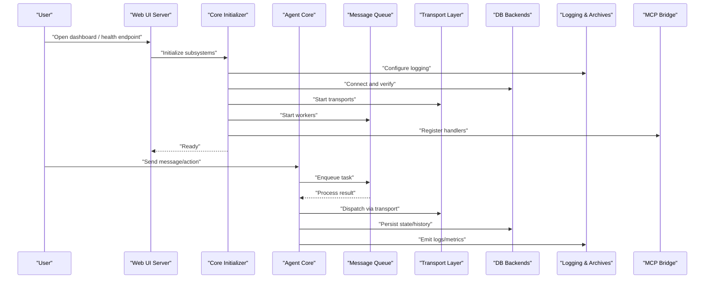

**Diagram sources**
- [core/webui.py](file://core/webui.py)
- [core/core_initializer.py](file://core/core_initializer.py)
- [core/agent_core.py](file://core/agent_core.py)
- [core/message_queue.py](file://core/message_queue.py)
- [core/transport_layer.py](file://core/transport_layer.py)
- [core/db_backends.py](file://core/db_backends.py)
- [core/logging_utils.py](file://core/logging_utils.py)
- [core/log_archive.py](file://core/log_archive.py)
- [core/mcp_bridge/server.py](file://core/mcp_bridge/server.py)

## Detailed Component Analysis

### Logging and Archives
- Centralized logging configuration and rotation
- Log archiving and compression for long-term retention
- Structured log emission across subsystems

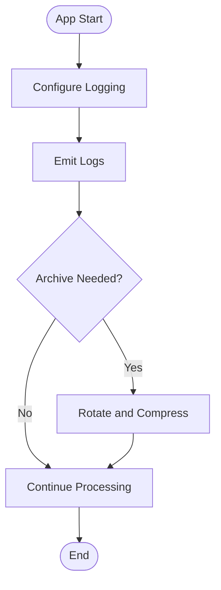

**Diagram sources**
- [core/logging_utils.py](file://core/logging_utils.py)
- [core/log_archive.py](file://core/log_archive.py)

**Section sources**
- [core/logging_utils.py](file://core/logging_utils.py)
- [core/log_archive.py](file://core/log_archive.py)

### LLM Failure Logging
- Dedicated failure capture for LLM calls
- Aggregation and querying of failure events
- Integration with MCP for external inspection

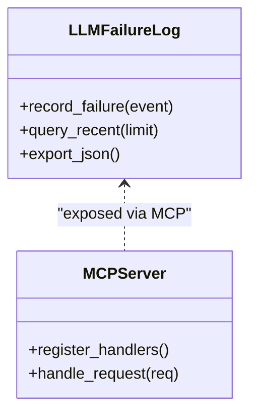

**Diagram sources**
- [core/llm_failure_log.py](file://core/llm_failure_log.py)
- [core/mcp_bridge/server.py](file://core/mcp_bridge/server.py)
- [mcp_servers/synth_llm_failures.py](file://mcp_servers/synth_llm_failures.py)

**Section sources**
- [core/llm_failure_log.py](file://core/llm_failure_log.py)
- [mcp_servers/synth_llm_failures.py](file://mcp_servers/synth_llm_failures.py)

### API Loggers (Cortex and Live)
- Request/response logging for Cortex and Live APIs
- Filtering and sampling options
- Error categorization and retry hints

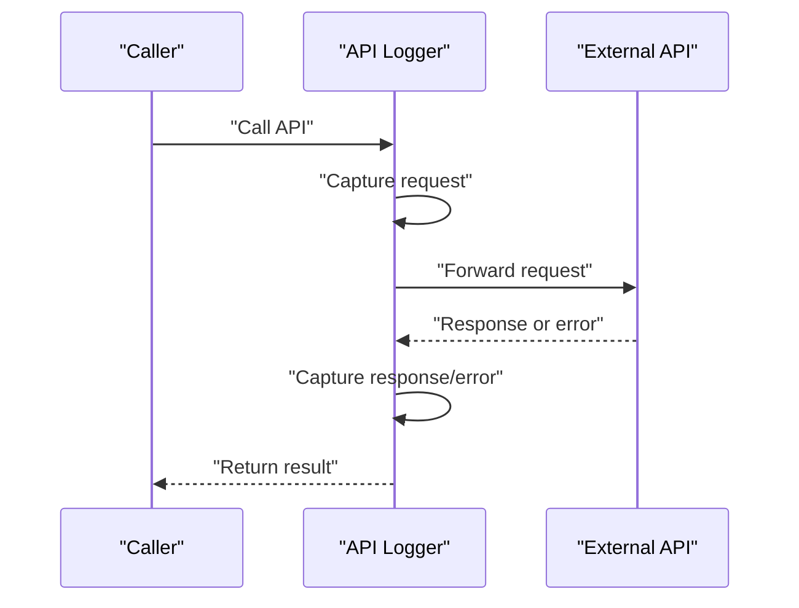

**Diagram sources**
- [core/cortex_api_logger.py](file://core/cortex_api_logger.py)
- [core/live_api_logger.py](file://core/live_api_logger.py)

**Section sources**
- [core/cortex_api_logger.py](file://core/cortex_api_logger.py)
- [core/live_api_logger.py](file://core/live_api_logger.py)

### Message Queue
- Asynchronous task processing with backpressure
- Priority handling and worker scaling
- Diagnostics for queue depth and latency

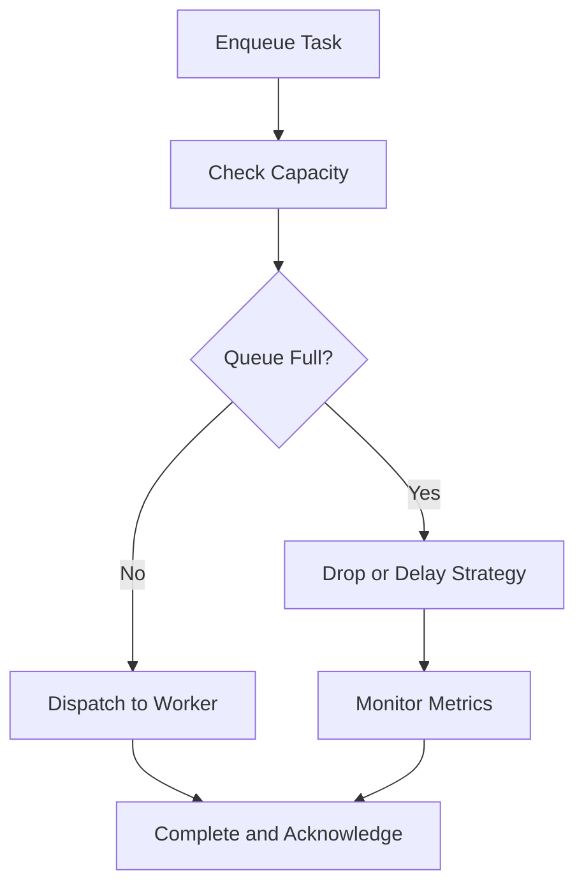

**Diagram sources**
- [core/message_queue.py](file://core/message_queue.py)

**Section sources**
- [core/message_queue.py](file://core/message_queue.py)

### Plugin Instance Lifecycle
- Loading, validation, initialization, and shutdown
- Error isolation and graceful degradation
- Hot-reload and dynamic registration

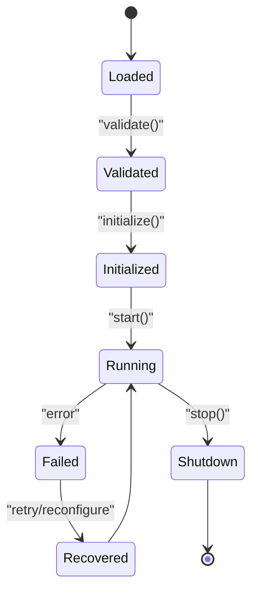

**Diagram sources**
- [core/plugin_instance.py](file://core/plugin_instance.py)

**Section sources**
- [core/plugin_instance.py](file://core/plugin_instance.py)

### Agent Core
- Orchestration of actions, tools, and responses
- Context management and safety checks
- Integration with logging and failure tracking

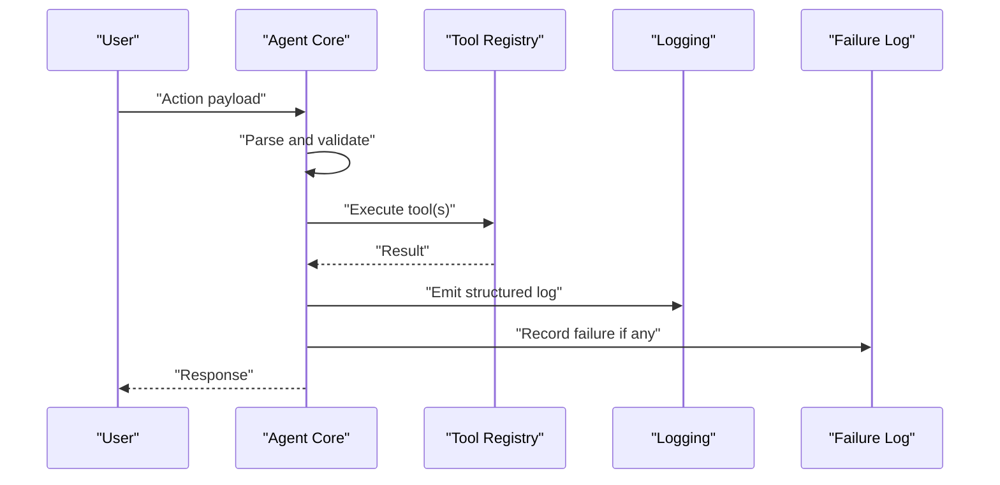

**Diagram sources**
- [core/agent_core.py](file://core/agent_core.py)
- [core/logging_utils.py](file://core/logging_utils.py)
- [core/llm_failure_log.py](file://core/llm_failure_log.py)

**Section sources**
- [core/agent_core.py](file://core/agent_core.py)

### Core Initializer
- Startup sequence and dependency wiring
- Health checks and readiness signals
- Configuration validation and migration

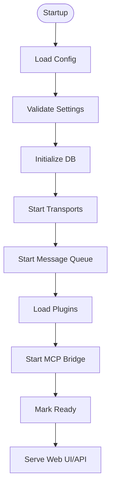

**Diagram sources**
- [core/core_initializer.py](file://core/core_initializer.py)

**Section sources**
- [core/core_initializer.py](file://core/core_initializer.py)

### Database Backends
- Connection pooling and retries
- Migration and schema checks
- Diagnostics for slow queries and errors

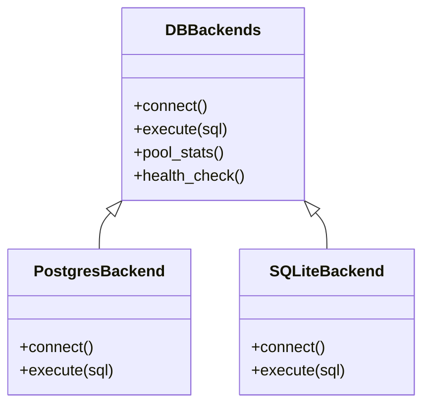

**Diagram sources**
- [core/db_backends.py](file://core/db_backends.py)
- [core/db.py](file://core/db.py)

**Section sources**
- [core/db_backends.py](file://core/db_backends.py)
- [core/db.py](file://core/db.py)

### Transport Layer
- Network transport abstraction
- Reconnection logic and backoff
- Diagnostics for connectivity and timeouts

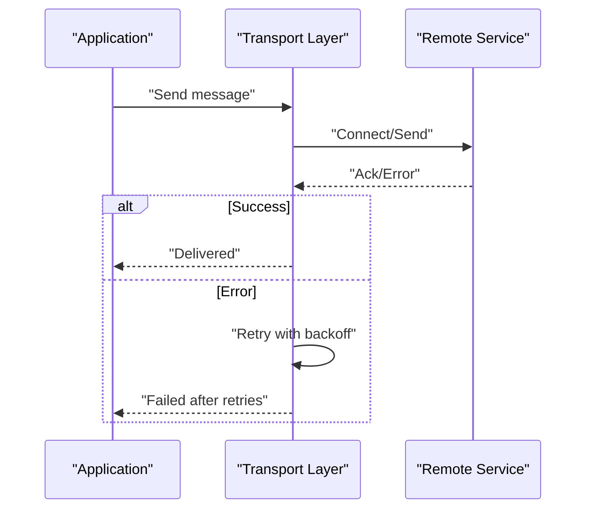

**Diagram sources**
- [core/transport_layer.py](file://core/transport_layer.py)

**Section sources**
- [core/transport_layer.py](file://core/transport_layer.py)

### Presence Manager
- Session presence and heartbeat
- Timeout and cleanup of stale sessions
- Metrics for active sessions

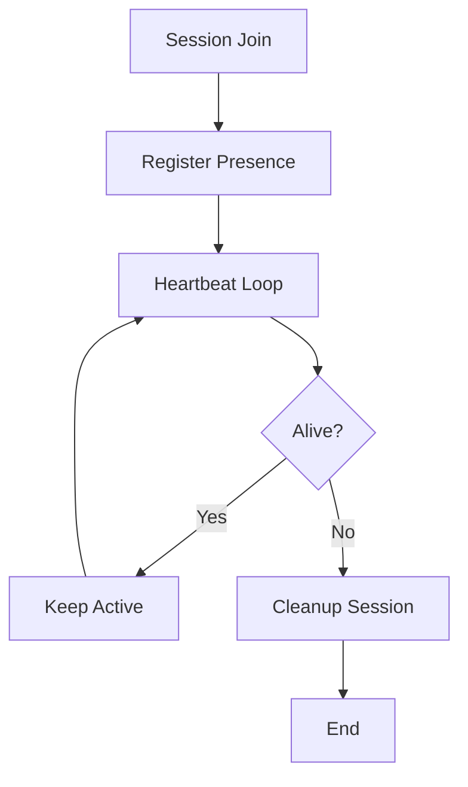

**Diagram sources**
- [core/presence_manager.py](file://core/presence_manager.py)

**Section sources**
- [core/presence_manager.py](file://core/presence_manager.py)

### Chat Archives DB
- Persistence of chat history and metadata
- Archival and compaction routines
- Query performance tuning

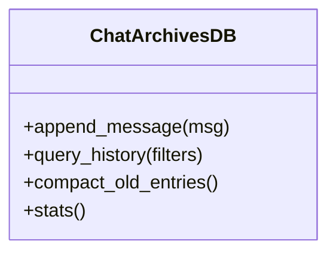

**Diagram sources**
- [core/chat_archives_db.py](file://core/chat_archives_db.py)

**Section sources**
- [core/chat_archives_db.py](file://core/chat_archives_db.py)

### Soul Observability
- Metrics emission and tracing hooks
- Performance counters and event timestamps
- Integration with external observability systems

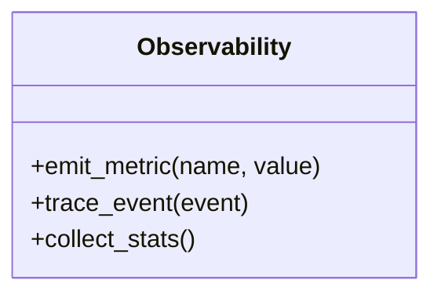

**Diagram sources**
- [core/soul/observability.py](file://core/soul/observability.py)

**Section sources**
- [core/soul/observability.py](file://core/soul/observability.py)

### MCP Bridge
- Server registration and request handling
- Client connections and tool invocation
- Configuration-driven endpoints

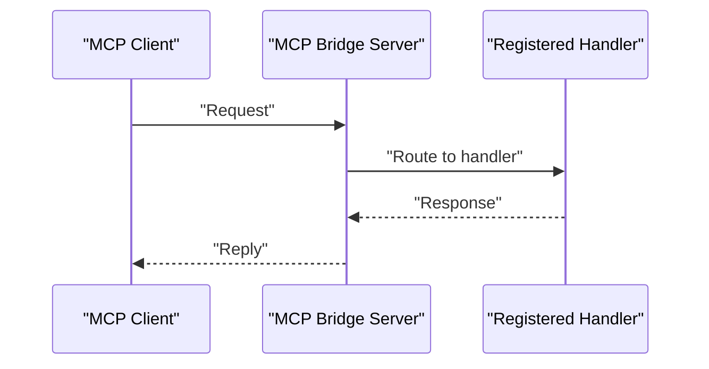

**Diagram sources**
- [core/mcp_bridge/server.py](file://core/mcp_bridge/server.py)
- [core/mcp_bridge/client.py](file://core/mcp_bridge/client.py)
- [core/mcp_bridge/config.py](file://core/mcp_bridge/config.py)
- [mcp_servers/synth_logs.py](file://mcp_servers/synth_logs.py)
- [config/synth_mcp.json](file://config/synth_mcp.json)

**Section sources**
- [core/mcp_bridge/server.py](file://core/mcp_bridge/server.py)
- [core/mcp_bridge/client.py](file://core/mcp_bridge/client.py)
- [core/mcp_bridge/config.py](file://core/mcp_bridge/config.py)
- [mcp_servers/synth_logs.py](file://mcp_servers/synth_logs.py)
- [config/synth_mcp.json](file://config/synth_mcp.json)

## Dependency Analysis
Key dependencies and their roles:
- Core modules depend on logging, config, and DB backends
- Agent core depends on message queue, transport, and plugins
- Web UI depends on core initializer and MCP bridge
- MCP bridge depends on server, client, and config

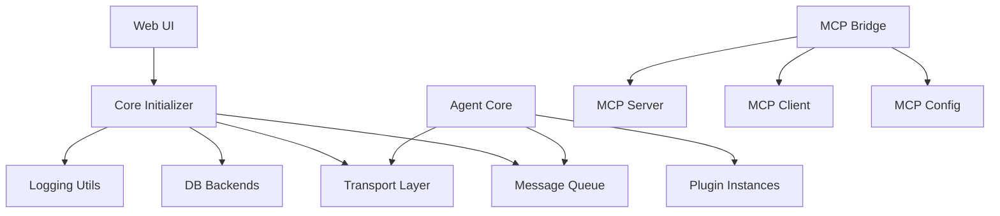

**Diagram sources**
- [core/core_initializer.py](file://core/core_initializer.py)
- [core/logging_utils.py](file://core/logging_utils.py)
- [core/db_backends.py](file://core/db_backends.py)
- [core/transport_layer.py](file://core/transport_layer.py)
- [core/message_queue.py](file://core/message_queue.py)
- [core/agent_core.py](file://core/agent_core.py)
- [core/plugin_instance.py](file://core/plugin_instance.py)
- [core/webui.py](file://core/webui.py)
- [core/mcp_bridge/server.py](file://core/mcp_bridge/server.py)
- [core/mcp_bridge/client.py](file://core/mcp_bridge/client.py)
- [core/mcp_bridge/config.py](file://core/mcp_bridge/config.py)

**Section sources**
- [core/core_initializer.py](file://core/core_initializer.py)
- [core/agent_core.py](file://core/agent_core.py)
- [core/webui.py](file://core/webui.py)
- [core/mcp_bridge/server.py](file://core/mcp_bridge/server.py)

## Performance Considerations
- Use structured logging to avoid excessive IO overhead
- Tune message queue workers based on workload patterns
- Monitor database connection pools and query latency
- Enable sampling for high-volume API logs
- Profile agent core hot paths and tool execution times
- Leverage observability metrics for bottleneck identification

[No sources needed since this section provides general guidance]

## Troubleshooting Guide

### Common Issues and Resolutions

#### Connection Issues
Symptoms:
- Intermittent disconnects or timeouts
- Failed handshakes with remote services
- Stale sessions not cleaned up

Diagnostic steps:
- Verify transport layer health and reconnection logs
- Check presence manager heartbeats and session cleanup
- Inspect network policies and firewall rules
- Review MCP bridge client connectivity and configuration

Resolution procedures:
- Adjust backoff and retry settings in transport layer
- Restart transports and clear stale sessions
- Validate MCP configuration and endpoint reachability
- Use MCP clients to test connectivity

**Section sources**
- [core/transport_layer.py](file://core/transport_layer.py)
- [core/presence_manager.py](file://core/presence_manager.py)
- [core/mcp_bridge/client.py](file://core/mcp_bridge/client.py)
- [core/mcp_bridge/config.py](file://core/mcp_bridge/config.py)

#### Plugin Failures
Symptoms:
- Plugin load errors or initialization failures
- Runtime exceptions during plugin operations
- Graceful degradation or fallback behavior

Diagnostic steps:
- Inspect plugin instance lifecycle logs
- Validate plugin configuration and dependencies
- Check error isolation and recovery mechanisms

Resolution procedures:
- Reload or restart failing plugins
- Update plugin versions and resolve dependency conflicts
- Enable verbose logging for plugin initialization
- Use MCP endpoints to inspect plugin status

**Section sources**
- [core/plugin_instance.py](file://core/plugin_instance.py)

#### Memory Problems
Symptoms:
- High memory usage or leaks
- Garbage collection pressure
- Slow response times due to memory pressure

Diagnostic steps:
- Monitor process memory metrics via observability
- Analyze log archives for memory-related warnings
- Check message queue backlog and worker saturation

Resolution procedures:
- Tune worker counts and queue sizes
- Implement memory limits and restart policies
- Profile hot paths and optimize data structures
- Use container resource limits and health checks

**Section sources**
- [core/message_queue.py](file://core/message_queue.py)
- [core/soul/observability.py](file://core/soul/observability.py)

#### Performance Bottlenecks
Symptoms:
- Increased latency in agent responses
- Database query slowdowns
- API call delays

Diagnostic steps:
- Review structured logs for timing information
- Examine database backend stats and slow queries
- Analyze API logger outputs for latency spikes

Resolution procedures:
- Optimize database indexes and connection pools
- Cache frequently accessed data where appropriate
- Scale workers and adjust concurrency settings
- Enable sampling for high-volume logs

**Section sources**
- [core/db_backends.py](file://core/db_backends.py)
- [core/cortex_api_logger.py](file://core/cortex_api_logger.py)
- [core/live_api_logger.py](file://core/live_api_logger.py)

### Diagnostic Tools and Commands

#### Logging Mechanisms
- Centralized logging with rotation and archival
- Structured log emission across subsystems
- Log filtering and sampling options

Usage:
- Access logs via file system or MCP endpoints
- Filter by level, module, and time range
- Export logs for analysis

**Section sources**
- [core/logging_utils.py](file://core/logging_utils.py)
- [core/log_archive.py](file://core/log_archive.py)
- [mcp_servers/synth_logs.py](file://mcp_servers/synth_logs.py)

#### Debug Modes
- Verbose logging for critical subsystems
- Toggle debug flags via configuration
- Enable detailed traces for specific operations

Usage:
- Set environment variables or config keys
- Restart services to apply changes
- Monitor logs for debug output

**Section sources**
- [core/config_manager.py](file://core/config_manager.py)

#### Monitoring Tools
- Health check endpoints for service status
- Metrics emission via observability hooks
- Alerts based on thresholds and anomalies

Usage:
- Query health endpoints periodically
- Collect metrics for dashboards
- Configure alerts for critical conditions

**Section sources**
- [core/soul/observability.py](file://core/soul/observability.py)
- [core/webui.py](file://core/webui.py)

#### Health Check Endpoints
- Readiness and liveness probes
- Dependency health verification
- Status aggregation across subsystems

Usage:
- Integrate with orchestrators for auto-healing
- Monitor uptime and availability
- Trigger alerts on failures

**Section sources**
- [core/core_initializer.py](file://core/core_initializer.py)

#### Alerting Strategies
- Threshold-based alerts for key metrics
- Anomaly detection for unusual patterns
- Escalation procedures for critical failures

Usage:
- Define alert rules in monitoring systems
- Notify operators via channels
- Automate remediation where possible

**Section sources**
- [core/soul/observability.py](file://core/soul/observability.py)

### Step-by-Step Diagnosis Workflows

#### Diagnosing Connection Issues
1. Check transport layer logs for errors and retries
2. Verify presence manager heartbeats and session states
3. Test MCP client connectivity to endpoints
4. Validate network policies and firewall rules
5. Restart transports and clear stale sessions if needed

**Section sources**
- [core/transport_layer.py](file://core/transport_layer.py)
- [core/presence_manager.py](file://core/presence_manager.py)
- [core/mcp_bridge/client.py](file://core/mcp_bridge/client.py)

#### Diagnosing Plugin Failures
1. Inspect plugin instance lifecycle logs
2. Validate plugin configuration and dependencies
3. Check error isolation and recovery mechanisms
4. Reload or restart failing plugins
5. Use MCP endpoints to inspect plugin status

**Section sources**
- [core/plugin_instance.py](file://core/plugin_instance.py)

#### Diagnosing Memory Problems
1. Monitor process memory metrics via observability
2. Analyze log archives for memory-related warnings
3. Check message queue backlog and worker saturation
4. Tune worker counts and queue sizes
5. Implement memory limits and restart policies

**Section sources**
- [core/message_queue.py](file://core/message_queue.py)
- [core/soul/observability.py](file://core/soul/observability.py)

#### Diagnosing Performance Bottlenecks
1. Review structured logs for timing information
2. Examine database backend stats and slow queries
3. Analyze API logger outputs for latency spikes
4. Optimize database indexes and connection pools
5. Scale workers and adjust concurrency settings

**Section sources**
- [core/db_backends.py](file://core/db_backends.py)
- [core/cortex_api_logger.py](file://core/cortex_api_logger.py)
- [core/live_api_logger.py](file://core/live_api_logger.py)

### Error Message Interpretation and Log Analysis

#### Interpreting Error Messages
- Categorize errors by subsystem (transport, DB, plugins, APIs)
- Look for retry and backoff indicators
- Identify root causes from stack traces and context

#### Log Analysis Techniques
- Filter logs by level, module, and time range
- Search for keywords like error, exception, timeout
- Correlate events across subsystems using IDs

#### Debugging Workflows
- Enable verbose logging for targeted components
- Use MCP endpoints to query live state
- Export logs for offline analysis and pattern recognition

**Section sources**
- [core/logging_utils.py](file://core/logging_utils.py)
- [core/log_archive.py](file://core/log_archive.py)
- [mcp_servers/synth_logs.py](file://mcp_servers/synth_logs.py)

### Platform-Specific Issues and Configuration Errors

#### Docker and Containerization
- Ensure correct image builds and dependencies
- Validate environment variables and volumes
- Monitor container health and resource usage

#### Windows Setup
- Use provided scripts for installation and startup
- Verify path configurations and permissions
- Handle platform-specific dependencies

#### Configuration Errors
- Validate config files and JSON schemas
- Check required fields and default values
- Use config manager to detect and fix issues

**Section sources**
- [docker-compose.yml](file://docker-compose.yml)
- [automation_tools/container_synth.sh](file://automation_tools/container_synth.sh)
- [scripts/run_webui.py](file://scripts/run_webui.py)
- [core/config_manager.py](file://core/config_manager.py)

### Escalation Procedures and Community Support

#### Escalation Procedures
- Document symptoms and steps taken
- Gather logs and metrics for analysis
- Engage maintainers with detailed reports

#### Community Support Resources
- Refer to documentation and guides
- Participate in discussions and issue trackers
- Contribute fixes and improvements

[No sources needed since this section summarizes without analyzing specific files]

## Conclusion
This guide provides a comprehensive approach to troubleshooting Synthetic Heart, covering logging, debugging, diagnostics, and resolution procedures. By following the outlined workflows and leveraging the available tools, users can effectively diagnose and resolve common issues, ensuring stable and performant operation.

## Appendices

### Quick Reference: Key Files and Roles
- main.py: Application entry point
- core/logging_utils.py: Centralized logging
- core/log_archive.py: Log archival and rotation
- core/webui.py: Web UI server and endpoints
- core/config_manager.py: Configuration management
- core/llm_failure_log.py: LLM failure tracking
- core/cortex_api_logger.py: Cortex API logging
- core/live_api_logger.py: Live API logging
- core/message_queue.py: Async message handling
- core/plugin_instance.py: Plugin lifecycle
- core/agent_core.py: Agent orchestration
- core/core_initializer.py: Startup and readiness
- core/db_backends.py: Database connectivity
- core/transport_layer.py: Network transport
- core/presence_manager.py: Session presence
- core/chat_archives_db.py: Chat history persistence
- core/soul/observability.py: Metrics and tracing
- core/mcp_bridge/server.py: MCP server
- core/mcp_bridge/client.py: MCP client
- core/mcp_bridge/config.py: MCP configuration
- mcp_servers/synth_logs.py: MCP log endpoint
- tools/synth_log_mcp.py: Log MCP utility
- scripts/run_webui.py: Web UI launcher
- docker-compose.yml: Container orchestration
- config/synth_mcp.json: MCP configuration file
- automation_tools/container_synth.sh: Container script

**Section sources**
- [main.py](file://main.py)
- [core/logging_utils.py](file://core/logging_utils.py)
- [core/log_archive.py](file://core/log_archive.py)
- [core/webui.py](file://core/webui.py)
- [core/config_manager.py](file://core/config_manager.py)
- [core/llm_failure_log.py](file://core/llm_failure_log.py)
- [core/cortex_api_logger.py](file://core/cortex_api_logger.py)
- [core/live_api_logger.py](file://core/live_api_logger.py)
- [core/message_queue.py](file://core/message_queue.py)
- [core/plugin_instance.py](file://core/plugin_instance.py)
- [core/agent_core.py](file://core/agent_core.py)
- [core/core_initializer.py](file://core/core_initializer.py)
- [core/db_backends.py](file://core/db_backends.py)
- [core/transport_layer.py](file://core/transport_layer.py)
- [core/presence_manager.py](file://core/presence_manager.py)
- [core/chat_archives_db.py](file://core/chat_archives_db.py)
- [core/soul/observability.py](file://core/soul/observability.py)
- [core/mcp_bridge/server.py](file://core/mcp_bridge/server.py)
- [core/mcp_bridge/client.py](file://core/mcp_bridge/client.py)
- [core/mcp_bridge/config.py](file://core/mcp_bridge/config.py)
- [mcp_servers/synth_logs.py](file://mcp_servers/synth_logs.py)
- [tools/synth_log_mcp.py](file://tools/synth_log_mcp.py)
- [scripts/run_webui.py](file://scripts/run_webui.py)
- [docker-compose.yml](file://docker-compose.yml)
- [config/synth_mcp.json](file://config/synth_mcp.json)
- [automation_tools/container_synth.sh](file://automation_tools/container_synth.sh)