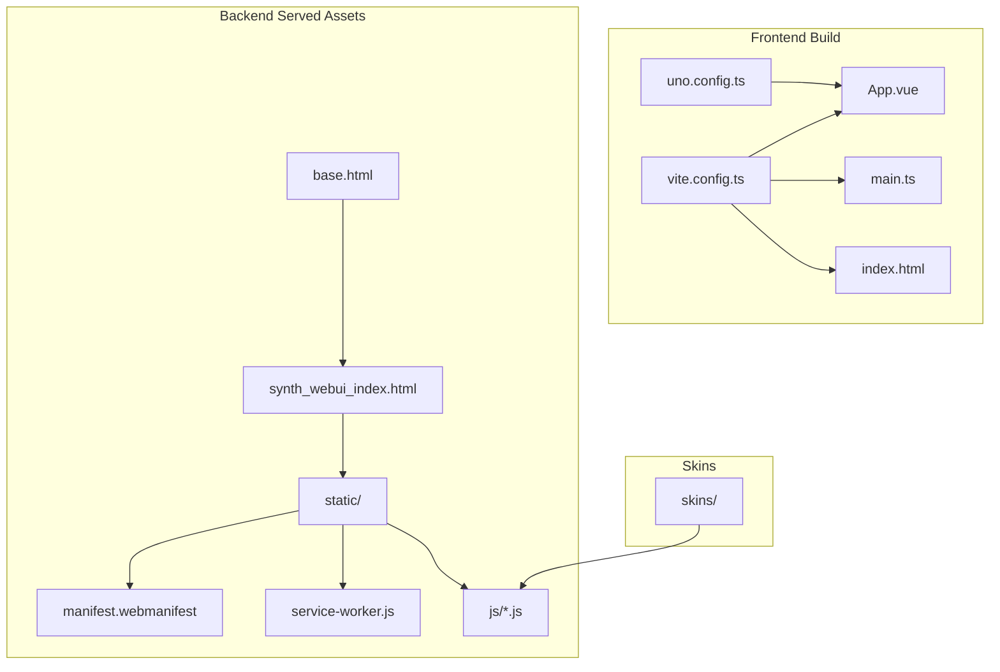
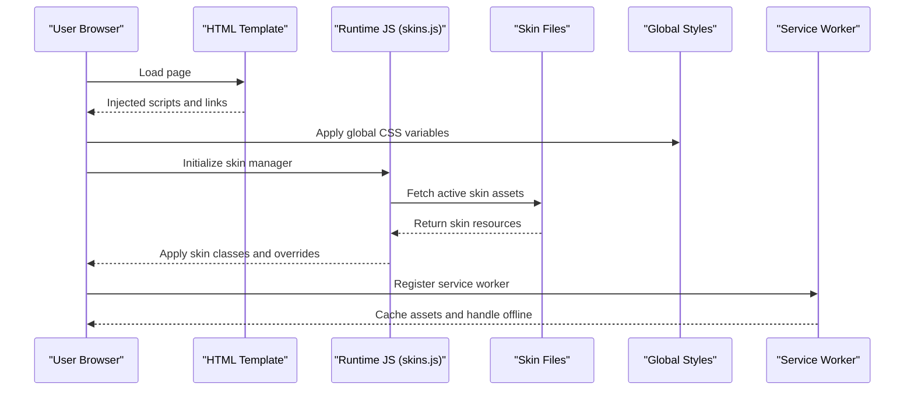
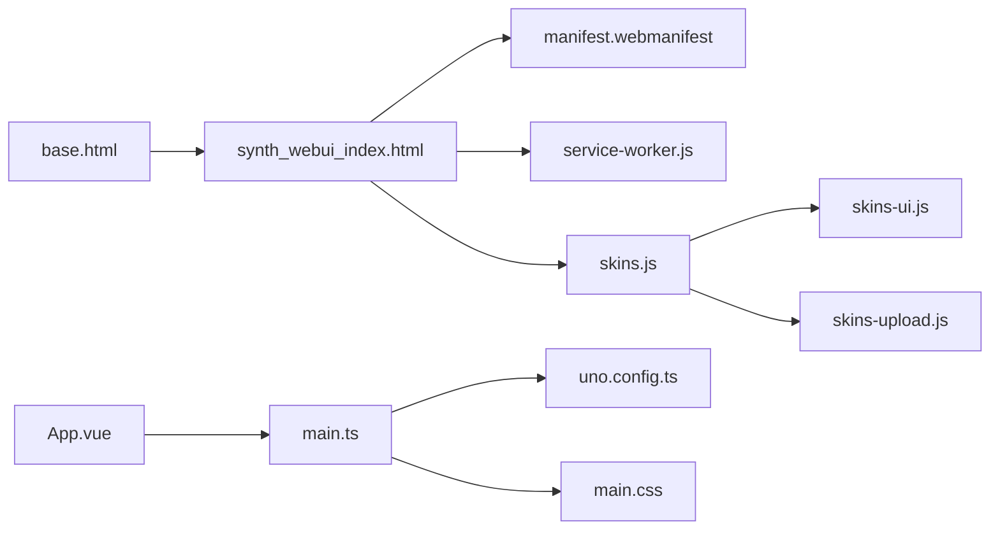

# Customization & Theming

<cite>
**Referenced Files in This Document**
- [frontend/src/styles/main.css](file://frontend/src/styles/main.css)
- [frontend/uno.config.ts](file://frontend/uno.config.ts)
- [frontend/vite.config.ts](file://frontend/vite.config.ts)
- [res/synth_webui/static/manifest.webmanifest](file://res/synth_webui/static/manifest.webmanifest)
- [res/synth_webui/static/service-worker.js](file://res/synth_webui/static/service-worker.js)
- [core/webui_templates/base.html](file://core/webui_templates/base.html)
- [core/webui_templates/synth_webui_index.html](file://core/webui_templates/synth_webui_index.html)
- [res/synth_webui/js/skins.js](file://res/synth_webui/js/skins.js)
- [res/synth_webui/js/skins-ui.js](file://res/synth_webui/js/skins-ui.js)
- [res/synth_webui/js/skins-upload.js](file://res/synth_webui/js/skins-upload.js)
- [skins/README.md](file://skins/README.md)
- [frontend/src/App.vue](file://frontend/src/App.vue)
- [frontend/src/main.ts](file://frontend/src/main.ts)
- [frontend/index.html](file://frontend/index.html)
</cite>

## Table of Contents
1. [Introduction](#introduction)
2. [Project Structure](#project-structure)
3. [Core Components](#core-components)
4. [Architecture Overview](#architecture-overview)
5. [Detailed Component Analysis](#detailed-component-analysis)
6. [Dependency Analysis](#dependency-analysis)
7. [Performance Considerations](#performance-considerations)
8. [Troubleshooting Guide](#troubleshooting-guide)
9. [Conclusion](#conclusion)
10. [Appendices](#appendices)

## Introduction
This document explains how to customize and theme Synthetic Heart’s web interface. It covers the CSS architecture, style variables, responsive design patterns, the skin system for avatar appearance, theme configuration options, branding customization, PWA manifest and service worker configuration, offline support, and guidance for creating custom skins, modifying themes, adding custom styles, and extending the UI with custom components. It also addresses cross-browser compatibility, mobile responsiveness, and accessibility compliance.

## Project Structure
The web interface is composed of:
- A Vue-based frontend build pipeline (Vite + UnoCSS)
- Static assets served by the Python backend (templates, JS, static files)
- Skin definitions under a dedicated directory
- PWA assets (manifest and service worker)

**Diagram sources**
- [frontend/vite.config.ts](file://frontend/vite.config.ts)
- [frontend/uno.config.ts](file://frontend/uno.config.ts)
- [frontend/src/App.vue](file://frontend/src/App.vue)
- [frontend/src/main.ts](file://frontend/src/main.ts)
- [frontend/index.html](file://frontend/index.html)
- [core/webui_templates/base.html](file://core/webui_templates/base.html)
- [core/webui_templates/synth_webui_index.html](file://core/webui_templates/synth_webui_index.html)
- [res/synth_webui/static/manifest.webmanifest](file://res/synth_webui/static/manifest.webmanifest)
- [res/synth_webui/static/service-worker.js](file://res/synth_webui/static/service-worker.js)
- [res/synth_webui/js/skins.js](file://res/synth_webui/js/skins.js)
- [res/synth_webui/js/skins-ui.js](file://res/synth_webui/js/skins-ui.js)
- [res/synth_webui/js/skins-upload.js](file://res/synth_webui/js/skins-upload.js)
- [skins/README.md](file://skins/README.md)

**Section sources**
- [frontend/vite.config.ts](file://frontend/vite.config.ts)
- [frontend/uno.config.ts](file://frontend/uno.config.ts)
- [frontend/src/App.vue](file://frontend/src/App.vue)
- [frontend/src/main.ts](file://frontend/src/main.ts)
- [frontend/index.html](file://frontend/index.html)
- [core/webui_templates/base.html](file://core/webui_templates/base.html)
- [core/webui_templates/synth_webui_index.html](file://core/webui_templates/synth_webui_index.html)
- [res/synth_webui/static/manifest.webmanifest](file://res/synth_webui/static/manifest.webmanifest)
- [res/synth_webui/static/service-worker.js](file://res/synth_webui/static/service-worker.js)
- [res/synth_webui/js/skins.js](file://res/synth_webui/js/skins.js)
- [res/synth_webui/js/skins-ui.js](file://res/synth_webui/js/skins-ui.js)
- [res/synth_webui/js/skins-upload.js](file://res/synth_webui/js/skins-upload.js)
- [skins/README.md](file://skins/README.md)

## Core Components
- CSS Architecture and Variables
  - Global styles are defined in the main stylesheet. Theme tokens and color variables live here to ensure consistent theming across components.
  - Responsive breakpoints and layout utilities are applied via the CSS framework configured in the frontend build.
- Style Framework Configuration
  - The utility-first CSS engine is configured through its config file, enabling or disabling features like dark mode, typography scales, and spacing.
- PWA Support
  - The web app manifest defines metadata for installability and display behavior.
  - The service worker provides caching strategies and offline fallbacks for core assets.
- Skin System
  - JavaScript modules manage loading, previewing, and applying skins.
  - Upload helpers enable dynamic skin installation from user-provided archives.
- Templates and Entry Points
  - HTML templates wire up the runtime scripts and static assets.
  - The Vue application entry initializes the UI and integrates with backend services.

**Section sources**
- [frontend/src/styles/main.css](file://frontend/src/styles/main.css)
- [frontend/uno.config.ts](file://frontend/uno.config.ts)
- [res/synth_webui/static/manifest.webmanifest](file://res/synth_webui/static/manifest.webmanifest)
- [res/synth_webui/static/service-worker.js](file://res/synth_webui/static/service-worker.js)
- [res/synth_webui/js/skins.js](file://res/synth_webui/js/skins.js)
- [res/synth_webui/js/skins-ui.js](file://res/synth_webui/js/skins-ui.js)
- [res/synth_webui/js/skins-upload.js](file://res/synth_webui/js/skins-upload.js)
- [core/webui_templates/base.html](file://core/webui_templates/base.html)
- [core/webui_templates/synth_webui_index.html](file://core/webui_templates/synth_webui_index.html)
- [frontend/src/App.vue](file://frontend/src/App.vue)
- [frontend/src/main.ts](file://frontend/src/main.ts)
- [frontend/index.html](file://frontend/index.html)

## Architecture Overview
The styling and theming flow spans both the build-time frontend and runtime backend-served assets:

**Diagram sources**
- [core/webui_templates/base.html](file://core/webui_templates/base.html)
- [core/webui_templates/synth_webui_index.html](file://core/webui_templates/synth_webui_index.html)
- [res/synth_webui/js/skins.js](file://res/synth_webui/js/skins.js)
- [res/synth_webui/static/service-worker.js](file://res/synth_webui/static/service-worker.js)
- [frontend/src/styles/main.css](file://frontend/src/styles/main.css)

## Detailed Component Analysis

### CSS Architecture and Style Variables
- Global stylesheet centralizes theme tokens such as colors, typography, spacing, and component-specific variables.
- Use semantic variable names to make overrides predictable and maintainable.
- Prefer layering custom styles after the base stylesheet to leverage cascade rules.

Responsive Design Patterns
- Breakpoints are managed by the utility-first CSS engine; use its utilities for spacing, grid, and visibility toggles.
- Ensure touch targets and font sizes meet mobile usability guidelines.

Accessibility
- Maintain sufficient color contrast for text and interactive elements.
- Provide focus indicators and keyboard navigation support.
- Use semantic HTML and ARIA attributes where needed.

**Section sources**
- [frontend/src/styles/main.css](file://frontend/src/styles/main.css)
- [frontend/uno.config.ts](file://frontend/uno.config.ts)

### Style Framework Configuration (UnoCSS)
- The configuration enables/disables features like dark mode, preflight, and plugins.
- Customize theme tokens (colors, fonts, spacing) at the framework level for consistent application-wide changes.
- Keep configuration minimal and explicit to avoid unexpected side effects.

**Section sources**
- [frontend/uno.config.ts](file://frontend/uno.config.ts)

### PWA Manifest and Service Worker
- The manifest defines app name, icons, start URL, display mode, and theme colors.
- The service worker implements caching strategies for core assets and provides offline fallbacks.
- Update both files when changing branding or asset paths to keep installability intact.

Offline Support
- Pre-cache critical resources during install.
- Handle network failures gracefully with cached responses.
- Invalidate caches on updates to prevent stale content.

**Section sources**
- [res/synth_webui/static/manifest.webmanifest](file://res/synth_webui/static/manifest.webmanifest)
- [res/synth_webui/static/service-worker.js](file://res/synth_webui/static/service-worker.js)

### Skin System for Avatar Appearance
- The skin manager loads and applies skin assets dynamically.
- The UI module exposes controls for selecting and previewing skins.
- Upload helpers allow users to install new skins without server restarts.

Creating Custom Skins
- Follow the documented structure and naming conventions.
- Include required assets and metadata as specified by the skin format.
- Test skins locally before deployment.

Applying Skins
- Use the provided UI to select an active skin.
- Verify that all assets load correctly and no console errors appear.

**Section sources**
- [res/synth_webui/js/skins.js](file://res/synth_webui/js/skins.js)
- [res/synth_webui/js/skins-ui.js](file://res/synth_webui/js/skins-ui.js)
- [res/synth_webui/js/skins-upload.js](file://res/synth_webui/js/skins-upload.js)
- [skins/README.md](file://skins/README.md)

### Theme Configuration Options and Branding Customization
- Modify theme tokens in the global stylesheet to adjust colors, typography, and spacing.
- Adjust framework configuration to enable/disable features like dark mode.
- Update the manifest for branding elements such as app name and theme color.

Extending the UI with Custom Components
- Add Vue components and integrate them into the application entry.
- Ensure styles are scoped or namespaced to avoid conflicts.
- Wire up event handlers and state management consistently.

**Section sources**
- [frontend/src/styles/main.css](file://frontend/src/styles/main.css)
- [frontend/uno.config.ts](file://frontend/uno.config.ts)
- [res/synth_webui/static/manifest.webmanifest](file://res/synth_webui/static/manifest.webmanifest)
- [frontend/src/App.vue](file://frontend/src/App.vue)
- [frontend/src/main.ts](file://frontend/src/main.ts)

### Adding Custom Styles
- Place custom styles in the main stylesheet or import additional style modules.
- Use CSS variables for easy overrides and maintain consistency.
- Validate styles across devices and browsers.

**Section sources**
- [frontend/src/styles/main.css](file://frontend/src/styles/main.css)
- [frontend/uno.config.ts](file://frontend/uno.config.ts)

### Cross-Browser Compatibility
- Test on major browsers and versions.
- Avoid experimental features or provide fallbacks.
- Normalize styles using the framework’s preflight settings.

**Section sources**
- [frontend/uno.config.ts](file://frontend/uno.config.ts)

### Mobile Responsiveness
- Use responsive utilities to adapt layouts for small screens.
- Ensure touch-friendly interactions and readable text.
- Optimize images and assets for mobile bandwidth.

**Section sources**
- [frontend/uno.config.ts](file://frontend/uno.config.ts)

### Accessibility Compliance
- Maintain semantic markup and ARIA roles.
- Provide keyboard navigation and visible focus states.
- Ensure color contrast meets WCAG guidelines.

**Section sources**
- [frontend/src/styles/main.css](file://frontend/src/styles/main.css)

## Dependency Analysis
The following diagram shows key dependencies among the customization and theming components:

**Diagram sources**
- [core/webui_templates/base.html](file://core/webui_templates/base.html)
- [core/webui_templates/synth_webui_index.html](file://core/webui_templates/synth_webui_index.html)
- [res/synth_webui/static/manifest.webmanifest](file://res/synth_webui/static/manifest.webmanifest)
- [res/synth_webui/static/service-worker.js](file://res/synth_webui/static/service-worker.js)
- [res/synth_webui/js/skins.js](file://res/synth_webui/js/skins.js)
- [res/synth_webui/js/skins-ui.js](file://res/synth_webui/js/skins-ui.js)
- [res/synth_webui/js/skins-upload.js](file://res/synth_webui/js/skins-upload.js)
- [frontend/src/App.vue](file://frontend/src/App.vue)
- [frontend/src/main.ts](file://frontend/src/main.ts)
- [frontend/uno.config.ts](file://frontend/uno.config.ts)
- [frontend/src/styles/main.css](file://frontend/src/styles/main.css)

**Section sources**
- [core/webui_templates/base.html](file://core/webui_templates/base.html)
- [core/webui_templates/synth_webui_index.html](file://core/webui_templates/synth_webui_index.html)
- [res/synth_webui/static/manifest.webmanifest](file://res/synth_webui/static/manifest.webmanifest)
- [res/synth_webui/static/service-worker.js](file://res/synth_webui/static/service-worker.js)
- [res/synth_webui/js/skins.js](file://res/synth_webui/js/skins.js)
- [res/synth_webui/js/skins-ui.js](file://res/synth_webui/js/skins-ui.js)
- [res/synth_webui/js/skins-upload.js](file://res/synth_webui/js/skins-upload.js)
- [frontend/src/App.vue](file://frontend/src/App.vue)
- [frontend/src/main.ts](file://frontend/src/main.ts)
- [frontend/uno.config.ts](file://frontend/uno.config.ts)
- [frontend/src/styles/main.css](file://frontend/src/styles/main.css)

## Performance Considerations
- Minimize CSS size by leveraging the utility framework efficiently and avoiding redundant rules.
- Defer non-critical scripts and preload essential assets.
- Use efficient caching strategies in the service worker to reduce network requests.
- Optimize images and media within skins for faster loading.

[No sources needed since this section provides general guidance]

## Troubleshooting Guide
Common issues and resolutions:
- Styles not applying
  - Verify the order of stylesheet imports and CSS variable usage.
  - Check browser dev tools for overridden rules.
- Skins failing to load
  - Confirm asset paths and permissions.
  - Inspect network requests and console errors.
- PWA not installing
  - Validate manifest syntax and HTTPS requirements.
  - Ensure service worker registration succeeds.
- Offline mode broken
  - Review cache keys and update strategies.
  - Clear caches and re-register the service worker.

**Section sources**
- [res/synth_webui/static/manifest.webmanifest](file://res/synth_webui/static/manifest.webmanifest)
- [res/synth_webui/static/service-worker.js](file://res/synth_webui/static/service-worker.js)
- [res/synth_webui/js/skins.js](file://res/synth_webui/js/skins.js)
- [res/synth_webui/js/skins-ui.js](file://res/synth_webui/js/skins-ui.js)
- [res/synth_webui/js/skins-upload.js](file://res/synth_webui/js/skins-upload.js)

## Conclusion
Synthetic Heart’s web interface offers a robust theming and customization system built on a modern frontend stack and flexible runtime skin management. By following the documented patterns for CSS variables, framework configuration, PWA setup, and skin development, you can tailor the look and feel while maintaining performance, accessibility, and cross-browser compatibility.

[No sources needed since this section summarizes without analyzing specific files]

## Appendices

### Creating a Custom Skin
- Prepare the skin folder with required assets and metadata.
- Place it under the skins directory.
- Select and apply via the UI.

**Section sources**
- [skins/README.md](file://skins/README.md)
- [res/synth_webui/js/skins.js](file://res/synth_webui/js/skins.js)
- [res/synth_webui/js/skins-ui.js](file://res/synth_webui/js/skins-ui.js)
- [res/synth_webui/js/skins-upload.js](file://res/synth_webui/js/skins-upload.js)

### Modifying Themes
- Edit theme tokens in the global stylesheet.
- Adjust framework configuration for feature toggles.
- Update branding in the manifest.

**Section sources**
- [frontend/src/styles/main.css](file://frontend/src/styles/main.css)
- [frontend/uno.config.ts](file://frontend/uno.config.ts)
- [res/synth_webui/static/manifest.webmanifest](file://res/synth_webui/static/manifest.webmanifest)

### Extending the UI with Custom Components
- Add Vue components and integrate them in the application entry.
- Ensure proper scoping and event wiring.
- Test across devices and browsers.

**Section sources**
- [frontend/src/App.vue](file://frontend/src/App.vue)
- [frontend/src/main.ts](file://frontend/src/main.ts)