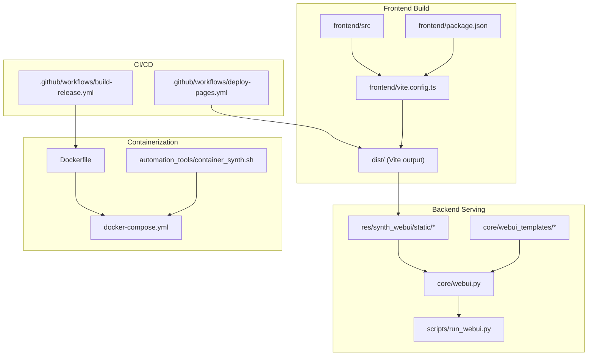
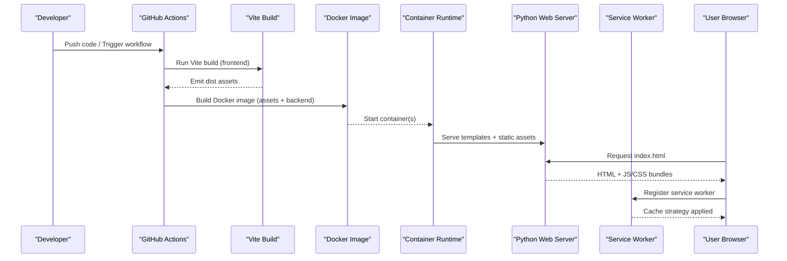
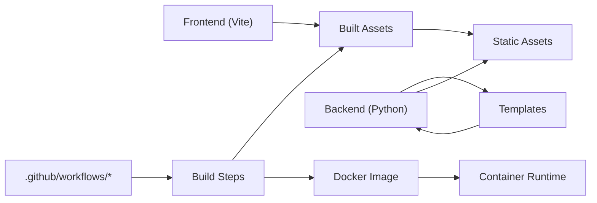

# Deployment & Optimization

<cite>
**Referenced Files in This Document**
- [Dockerfile](file://Dockerfile)
- [docker-compose.yml](file://docker-compose.yml)
- [.github/workflows/build-release.yml](file://.github/workflows/build-release.yml)
- [.github/workflows/deploy-pages.yml](file://.github/workflows/deploy-pages.yml)
- [frontend/vite.config.ts](file://frontend/vite.config.ts)
- [frontend/package.json](file://frontend/package.json)
- [scripts/run_webui.py](file://scripts/run_webui.py)
- [core/webui.py](file://core/webui.py)
- [res/synth_webui/static/service-worker.js](file://res/synth_webui/static/service-worker.js)
- [automation_tools/container_synth.sh](file://automation_tools/container_synth.sh)
</cite>

## Table of Contents
1. [Introduction](#introduction)
2. [Project Structure](#project-structure)
3. [Core Components](#core-components)
4. [Architecture Overview](#architecture-overview)
5. [Detailed Component Analysis](#detailed-component-analysis)
6. [Dependency Analysis](#dependency-analysis)
7. [Performance Considerations](#performance-considerations)
8. [Troubleshooting Guide](#troubleshooting-guide)
9. [Conclusion](#conclusion)
10. [Appendices](#appendices)

## Introduction
This document provides a comprehensive guide to deploying and optimizing Synthetic Heart’s web interface for production. It covers Docker containerization, build pipelines with Vite, asset optimization, caching strategies, deployment targets (static hosting, containers, cloud), environment configuration, SSL setup, monitoring, performance tuning, bundle size reduction, lazy loading, CDN integration, troubleshooting, and maintenance procedures.

## Project Structure
The project includes:
- A frontend built with Vite under the frontend directory
- A Python backend serving templates and static assets
- Docker artifacts for containerized deployments
- GitHub Actions workflows for building releases and deploying to pages
- Automation scripts for container management

**Diagram sources**
- [frontend/vite.config.ts](file://frontend/vite.config.ts)
- [frontend/package.json](file://frontend/package.json)
- [core/webui.py](file://core/webui.py)
- [scripts/run_webui.py](file://scripts/run_webui.py)
- [res/synth_webui/static/service-worker.js](file://res/synth_webui/static/service-worker.js)
- [Dockerfile](file://Dockerfile)
- [docker-compose.yml](file://docker-compose.yml)
- [.github/workflows/build-release.yml](file://.github/workflows/build-release.yml)
- [.github/workflows/deploy-pages.yml](file://.github/workflows/deploy-pages.yml)
- [automation_tools/container_synth.sh](file://automation_tools/container_synth.sh)

**Section sources**
- [frontend/vite.config.ts](file://frontend/vite.config.ts)
- [frontend/package.json](file://frontend/package.json)
- [core/webui.py](file://core/webui.py)
- [scripts/run_webui.py](file://scripts/run_webui.py)
- [Dockerfile](file://Dockerfile)
- [docker-compose.yml](file://docker-compose.yml)
- [.github/workflows/build-release.yml](file://.github/workflows/build-release.yml)
- [.github/workflows/deploy-pages.yml](file://.github/workflows/deploy-pages.yml)
- [automation_tools/container_synth.sh](file://automation_tools/container_synth.sh)

## Core Components
- Frontend build system: Vite configuration and package scripts define how assets are compiled, optimized, and emitted.
- Backend web server: Python module serves templates and static files, integrating with the built frontend assets.
- Container runtime: Dockerfile and compose file orchestrate image creation and service composition.
- CI/CD pipelines: GitHub Actions automate builds and deployments to release artifacts or static hosting platforms.
- Service worker: Provides offline caching and network strategies for improved performance.

Key responsibilities:
- Asset pipeline: TypeScript/Vue compilation, CSS processing, minification, and code splitting via Vite.
- Static asset distribution: The backend serves prebuilt assets and templates; service worker enhances caching.
- Containerization: Multi-stage or single-stage Docker images encapsulate dependencies and runtime.
- Automation: Scripts streamline container lifecycle and environment setup.

**Section sources**
- [frontend/vite.config.ts](file://frontend/vite.config.ts)
- [frontend/package.json](file://frontend/package.json)
- [core/webui.py](file://core/webui.py)
- [scripts/run_webui.py](file://scripts/run_webui.py)
- [res/synth_webui/static/service-worker.js](file://res/synth_webui/static/service-worker.js)
- [Dockerfile](file://Dockerfile)
- [docker-compose.yml](file://docker-compose.yml)
- [.github/workflows/build-release.yml](file://.github/workflows/build-release.yml)
- [.github/workflows/deploy-pages.yml](file://.github/workflows/deploy-pages.yml)
- [automation_tools/container_synth.sh](file://automation_tools/container_synth.sh)

## Architecture Overview
The web interface follows a classic separation between a static frontend build and a Python backend that serves templates and static resources. Containers encapsulate both components for consistent deployments across environments. CI/CD automates building the frontend and packaging the application.

**Diagram sources**
- [.github/workflows/build-release.yml](file://.github/workflows/build-release.yml)
- [.github/workflows/deploy-pages.yml](file://.github/workflows/deploy-pages.yml)
- [frontend/vite.config.ts](file://frontend/vite.config.ts)
- [Dockerfile](file://Dockerfile)
- [docker-compose.yml](file://docker-compose.yml)
- [core/webui.py](file://core/webui.py)
- [res/synth_webui/static/service-worker.js](file://res/synth_webui/static/service-worker.js)

## Detailed Component Analysis

### Vite Build Pipeline
- Entry points and configuration are defined in the frontend configuration and package scripts.
- The build process compiles TypeScript/Vue, processes styles, and outputs optimized bundles.
- Code splitting and chunking reduce initial load time; assets are hashed for cache busting.

Optimization levers:
- Enable minification and tree-shaking through Vite defaults.
- Configure chunk sizes and split vendor libraries into separate chunks.
- Use environment variables to toggle debug features in production builds.

Operational notes:
- Ensure Node.js version matches the project’s requirements.
- Lock dependency versions using the lockfile to avoid drift.

**Section sources**
- [frontend/vite.config.ts](file://frontend/vite.config.ts)
- [frontend/package.json](file://frontend/package.json)

### Backend Web Server Integration
- The Python backend serves templates and static assets, integrating the Vite-built frontend.
- Templates render the entry HTML and reference bundled assets.
- Static directories include the service worker and other client-side resources.

Deployment considerations:
- Serve static assets with appropriate cache headers.
- Ensure correct paths for assets and templates in production.
- Validate that the backend can locate the built assets directory.

**Section sources**
- [core/webui.py](file://core/webui.py)
- [scripts/run_webui.py](file://scripts/run_webui.py)

### Docker Containerization
- The Dockerfile defines the runtime environment, installs dependencies, copies source and built assets, and sets the entrypoint.
- docker-compose orchestrates services, networking, volumes, and environment variables.
- Automation scripts manage container lifecycle and environment setup.

Best practices:
- Use multi-stage builds to minimize image size.
- Pin base images and dependency versions.
- Separate build-time and runtime dependencies.
- Mount only necessary volumes for persistence.

**Section sources**
- [Dockerfile](file://Dockerfile)
- [docker-compose.yml](file://docker-compose.yml)
- [automation_tools/container_synth.sh](file://automation_tools/container_synth.sh)

### CI/CD Pipelines
- Build-release workflow constructs the frontend, packages the application, and produces artifacts.
- Deploy-pages workflow publishes static assets to a hosting platform.

Workflow highlights:
- Install Node.js and dependencies.
- Run Vite build.
- Build Docker image or upload static assets.
- Publish artifacts or deploy to target platform.

**Section sources**
- [.github/workflows/build-release.yml](file://.github/workflows/build-release.yml)
- [.github/workflows/deploy-pages.yml](file://.github/workflows/deploy-pages.yml)

### Service Worker and Caching Strategy
- The service worker implements caching policies for assets and API responses.
- Strategies include cache-first for static assets and network-first for dynamic data.
- Versioned asset filenames ensure cache invalidation on updates.

Implementation tips:
- Pre-cache critical assets during install.
- Implement background updates for non-critical resources.
- Provide fallbacks when network is unavailable.

**Section sources**
- [res/synth_webui/static/service-worker.js](file://res/synth_webui/static/service-worker.js)

### Environment Configuration
- Environment variables control backend behavior, logging levels, feature toggles, and external integrations.
- Compose files and CI pipelines inject secrets and settings at runtime.
- For static hosting, configure base path and asset URLs accordingly.

Recommended approach:
- Centralize configuration in environment files.
- Validate required variables at startup.
- Avoid committing secrets; use secret managers or CI vaults.

**Section sources**
- [docker-compose.yml](file://docker-compose.yml)
- [.github/workflows/build-release.yml](file://.github/workflows/build-release.yml)
- [.github/workflows/deploy-pages.yml](file://.github/workflows/deploy-pages.yml)

### SSL Setup
- Terminate TLS at the reverse proxy or edge layer (e.g., Nginx, Cloudflare).
- Ensure the backend trusts upstream proxies for secure headers.
- Configure HSTS and secure cookies where applicable.

Operational checklist:
- Verify certificate validity and auto-renewal.
- Enforce HTTPS-only redirects.
- Test mixed content and CORS configurations.

[No sources needed since this section provides general guidance]

### Monitoring and Observability
- Expose health endpoints and metrics from the backend.
- Integrate logs with centralized logging systems.
- Monitor container resource usage and alert on anomalies.

Practical steps:
- Add readiness/liveness probes in container orchestration.
- Export structured logs with correlation IDs.
- Use dashboards to track latency, error rates, and throughput.

[No sources needed since this section provides general guidance]

## Dependency Analysis
The frontend depends on Vite and related tooling; the backend depends on Python modules and serves static assets. Containers unify these layers. CI/CD coordinates build and deployment tasks.

**Diagram sources**
- [frontend/vite.config.ts](file://frontend/vite.config.ts)
- [core/webui.py](file://core/webui.py)
- [Dockerfile](file://Dockerfile)
- [.github/workflows/build-release.yml](file://.github/workflows/build-release.yml)
- [.github/workflows/deploy-pages.yml](file://.github/workflows/deploy-pages.yml)

**Section sources**
- [frontend/vite.config.ts](file://frontend/vite.config.ts)
- [core/webui.py](file://core/webui.py)
- [Dockerfile](file://Dockerfile)
- [.github/workflows/build-release.yml](file://.github/workflows/build-release.yml)
- [.github/workflows/deploy-pages.yml](file://.github/workflows/deploy-pages.yml)

## Performance Considerations
- Bundle size reduction:
  - Split large libraries into separate chunks.
  - Remove unused code via tree-shaking.
  - Prefer lightweight alternatives for heavy dependencies.
- Lazy loading:
  - Defer non-critical routes and components.
  - Load media and animations on demand.
- Caching strategies:
  - Use long-lived cache headers for immutable assets.
  - Implement service worker caching policies.
- CDN integration:
  - Offload static assets to a CDN for global delivery.
  - Configure cache keys based on asset hashes.
- Network optimizations:
  - Enable compression (gzip/brotli) at the proxy.
  - Minimize payload sizes and request counts.
- Rendering performance:
  - Optimize images and animations.
  - Reduce main-thread work; offload heavy tasks to workers.

[No sources needed since this section provides general guidance]

## Troubleshooting Guide
Common issues and resolutions:
- Build failures:
  - Verify Node.js version and dependency locks.
  - Check Vite configuration for environment-specific flags.
- Asset not found errors:
  - Confirm static paths and base URL configuration.
  - Ensure the backend serves the correct built assets directory.
- Service worker not updating:
  - Clear browser cache or force reload.
  - Update cache version and invalidate old caches.
- Container startup problems:
  - Inspect logs for missing environment variables.
  - Validate port mappings and volume mounts.
- SSL/TLS errors:
  - Check certificate chain and proxy headers.
  - Ensure HTTPS-only mode and secure cookie flags.

Diagnostic steps:
- Review CI logs for build and deployment stages.
- Use container exec to inspect runtime state.
- Validate network connectivity and DNS resolution.

**Section sources**
- [frontend/vite.config.ts](file://frontend/vite.config.ts)
- [core/webui.py](file://core/webui.py)
- [res/synth_webui/static/service-worker.js](file://res/synth_webui/static/service-worker.js)
- [Dockerfile](file://Dockerfile)
- [docker-compose.yml](file://docker-compose.yml)

## Conclusion
Synthetic Heart’s web interface is designed for robust, scalable deployments through a clear separation of concerns: a Vite-driven frontend build, a Python backend serving templates and static assets, and containerized packaging with automated CI/CD. By applying asset optimization, caching strategies, and CDN integration, you can achieve fast, reliable user experiences. Follow the outlined best practices for environment configuration, SSL setup, monitoring, and troubleshooting to maintain high availability and performance in production.

[No sources needed since this section summarizes without analyzing specific files]

## Appendices

### Deployment Targets
- Static hosting:
  - Publish Vite-built assets to platforms like GitHub Pages or Netlify.
  - Configure base path and asset URLs appropriately.
- Container orchestration:
  - Use docker-compose for local and staging environments.
  - Scale horizontally behind a reverse proxy.
- Cloud services:
  - Deploy to managed container platforms or serverless functions.
  - Integrate with cloud CDNs and secret managers.

[No sources needed since this section provides general guidance]

### Maintenance Procedures
- Regularly update dependencies and security patches.
- Rotate secrets and certificates automatically.
- Monitor resource usage and set alerts for anomalies.
- Perform periodic backups of persistent data.

[No sources needed since this section provides general guidance]