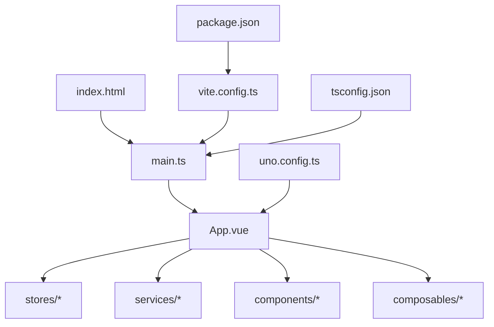
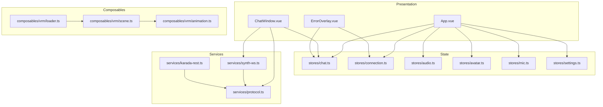
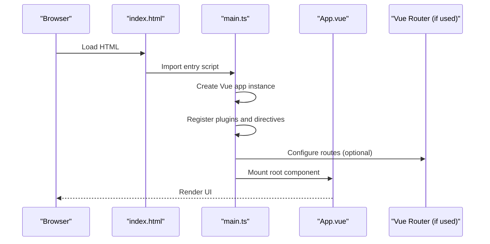
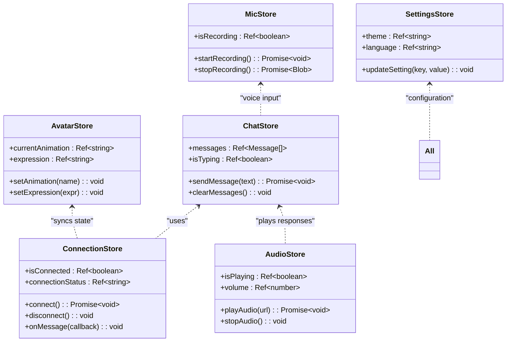
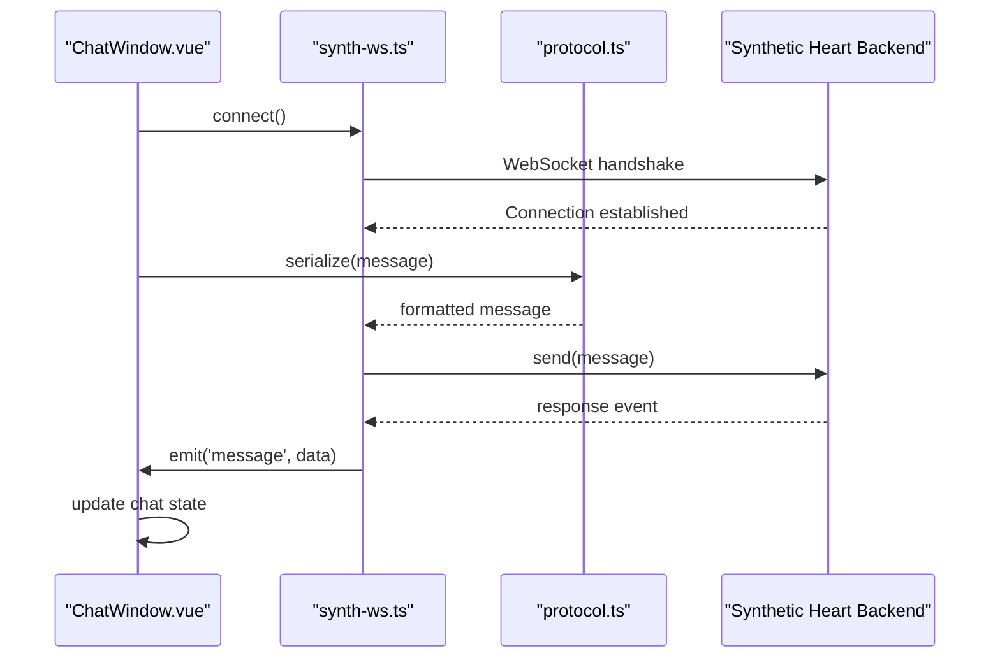
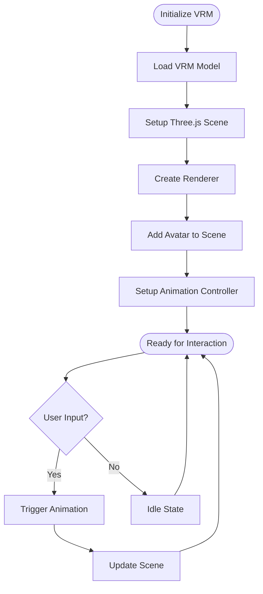
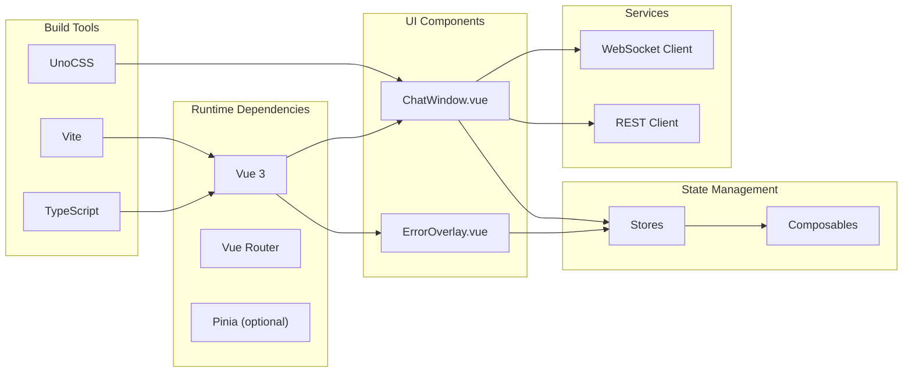

# Frontend Architecture

<cite>
**Referenced Files in This Document**
- [frontend/index.html](file://frontend/index.html)
- [frontend/main.ts](file://frontend/src/main.ts)
- [frontend/App.vue](file://frontend/src/App.vue)
- [frontend/vite.config.ts](file://frontend/vite.config.ts)
- [frontend/tsconfig.json](file://frontend/tsconfig.json)
- [frontend/uno.config.ts](file://frontend/uno.config.ts)
- [frontend/package.json](file://frontend/package.json)
- [frontend/src/stores/chat.ts](file://frontend/src/stores/chat.ts)
- [frontend/src/stores/connection.ts](file://frontend/src/stores/connection.ts)
- [frontend/src/stores/audio.ts](file://frontend/src/stores/audio.ts)
- [frontend/src/stores/avatar.ts](file://frontend/src/stores/avatar.ts)
- [frontend/src/stores/mic.ts](file://frontend/src/stores/mic.ts)
- [frontend/src/stores/settings.ts](file://frontend/src/stores/settings.ts)
- [frontend/src/services/synth-ws.ts](file://frontend/src/services/synth-ws.ts)
- [frontend/src/services/protocol.ts](file://frontend/src/services/protocol.ts)
- [frontend/src/services/karada-rest.ts](file://frontend/src/services/karada-rest.ts)
- [frontend/src/composables/vrm/loader.ts](file://frontend/src/composables/vrm/loader.ts)
- [frontend/src/composables/vrm/scene.ts](file://frontend/src/composables/vrm/scene.ts)
- [frontend/src/composables/vrm/animation.ts](file://frontend/src/composables/vrm/animation.ts)
- [frontend/src/components/chat/ChatWindow.vue](file://frontend/src/components/chat/ChatWindow.vue)
- [frontend/src/components/system/ErrorOverlay.vue](file://frontend/src/components/system/ErrorOverlay.vue)
</cite>

## Table of Contents
1. [Introduction](#introduction)
2. [Project Structure](#project-structure)
3. [Core Components](#core-components)
4. [Architecture Overview](#architecture-overview)
5. [Detailed Component Analysis](#detailed-component-analysis)
6. [Dependency Analysis](#dependency-analysis)
7. [Performance Considerations](#performance-considerations)
8. [Troubleshooting Guide](troubleshooting-guide)
9. [Conclusion](#conclusion)
10. [Appendices](#appendices)

## Introduction
This document explains the Synthetic Heart Vue.js frontend architecture, focusing on project structure, component hierarchy, state management with Vue 3 Composition API and TypeScript, build configuration with Vite, module organization, dependency management, application initialization, routing setup, plugin architecture, and development workflow. It also provides guidance for creating new components, managing global state, integrating with backend services, hot reloading, and debugging techniques.

## Project Structure
The frontend is a modern Vue 3 + TypeScript application built with Vite and styled using UnoCSS. The key directories are:
- src/: Application source code (components, stores, services, composables, styles)
- scripts/: Utility scripts for testing and checks
- index.html: Entry HTML template
- vite.config.ts: Vite build configuration
- tsconfig.json: TypeScript configuration
- uno.config.ts: UnoCSS configuration
- package.json: Dependencies and scripts

**Diagram sources**
- [frontend/index.html](file://frontend/index.html)
- [frontend/src/main.ts](file://frontend/src/main.ts)
- [frontend/src/App.vue](file://frontend/src/App.vue)
- [frontend/vite.config.ts](file://frontend/vite.config.ts)
- [frontend/tsconfig.json](file://frontend/tsconfig.json)
- [frontend/uno.config.ts](file://frontend/uno.config.ts)
- [frontend/package.json](file://frontend/package.json)

**Section sources**
- [frontend/index.html](file://frontend/index.html)
- [frontend/src/main.ts](file://frontend/src/main.ts)
- [frontend/src/App.vue](file://frontend/src/App.vue)
- [frontend/vite.config.ts](file://frontend/vite.config.ts)
- [frontend/tsconfig.json](file://frontend/tsconfig.json)
- [frontend/uno.config.ts](file://frontend/uno.config.ts)
- [frontend/package.json](file://frontend/package.json)

## Core Components
- App.vue: Root component that mounts the application shell, integrates stores, services, and top-level UI elements.
- ChatWindow.vue: Chat interface component handling message display and input interactions.
- ErrorOverlay.vue: Global error overlay component to surface runtime errors and connection issues.

These components leverage composition functions from composables and consume reactive state from stores. Services encapsulate network communication (WebSocket and REST). Stores manage global state using Vue 3 Composition API patterns.

**Section sources**
- [frontend/src/App.vue](file://frontend/src/App.vue)
- [frontend/src/components/chat/ChatWindow.vue](file://frontend/src/components/chat/ChatWindow.vue)
- [frontend/src/components/system/ErrorOverlay.vue](file://frontend/src/components/system/ErrorOverlay.vue)

## Architecture Overview
The frontend follows a layered architecture:
- Presentation Layer: Vue components (App, ChatWindow, ErrorOverlay)
- State Layer: Stores (chat, connection, audio, avatar, mic, settings)
- Service Layer: Network clients (synth-ws for WebSocket, karada-rest for REST)
- Composables: Reusable logic (VRM loader, scene, animation)
- Build System: Vite with TypeScript and UnoCSS

**Diagram sources**
- [frontend/src/App.vue](file://frontend/src/App.vue)
- [frontend/src/components/chat/ChatWindow.vue](file://frontend/src/components/chat/ChatWindow.vue)
- [frontend/src/components/system/ErrorOverlay.vue](file://frontend/src/components/system/ErrorOverlay.vue)
- [frontend/src/stores/chat.ts](file://frontend/src/stores/chat.ts)
- [frontend/src/stores/connection.ts](file://frontend/src/stores/connection.ts)
- [frontend/src/stores/audio.ts](file://frontend/src/stores/audio.ts)
- [frontend/src/stores/avatar.ts](file://frontend/src/stores/avatar.ts)
- [frontend/src/stores/mic.ts](file://frontend/src/stores/mic.ts)
- [frontend/src/stores/settings.ts](file://frontend/src/stores/settings.ts)
- [frontend/src/services/synth-ws.ts](file://frontend/src/services/synth-ws.ts)
- [frontend/src/services/protocol.ts](file://frontend/src/services/protocol.ts)
- [frontend/src/services/karada-rest.ts](file://frontend/src/services/karada-rest.ts)
- [frontend/src/composables/vrm/loader.ts](file://frontend/src/composables/vrm/loader.ts)
- [frontend/src/composables/vrm/scene.ts](file://frontend/src/composables/vrm/scene.ts)
- [frontend/src/composables/vrm/animation.ts](file://frontend/src/composables/vrm/animation.ts)

## Detailed Component Analysis

### Application Initialization and Routing
Application bootstrap occurs in main.ts, which creates the Vue app instance, registers plugins, and mounts App.vue. Routing is typically configured through Vue Router if present; otherwise, the app may use conditional rendering within App.vue or child components.

**Diagram sources**
- [frontend/index.html](file://frontend/index.html)
- [frontend/src/main.ts](file://frontend/src/main.ts)
- [frontend/src/App.vue](file://frontend/src/App.vue)

**Section sources**
- [frontend/src/main.ts](file://frontend/src/main.ts)
- [frontend/src/App.vue](file://frontend/src/App.vue)

### State Management with Stores
Stores implement reactive state using Vue 3 Composition API patterns. Key stores include:
- chat.ts: Manages chat messages, conversation state, and user interactions
- connection.ts: Handles WebSocket connection lifecycle and status
- audio.ts: Controls audio playback, streaming, and volume
- avatar.ts: Manages VRM avatar state and animations
- mic.ts: Controls microphone access and recording
- settings.ts: Persists user preferences and configuration

**Diagram sources**
- [frontend/src/stores/chat.ts](file://frontend/src/stores/chat.ts)
- [frontend/src/stores/connection.ts](file://frontend/src/stores/connection.ts)
- [frontend/src/stores/audio.ts](file://frontend/src/stores/audio.ts)
- [frontend/src/stores/avatar.ts](file://frontend/src/stores/avatar.ts)
- [frontend/src/stores/mic.ts](file://frontend/src/stores/mic.ts)
- [frontend/src/stores/settings.ts](file://frontend/src/stores/settings.ts)

**Section sources**
- [frontend/src/stores/chat.ts](file://frontend/src/stores/chat.ts)
- [frontend/src/stores/connection.ts](file://frontend/src/stores/connection.ts)
- [frontend/src/stores/audio.ts](file://frontend/src/stores/audio.ts)
- [frontend/src/stores/avatar.ts](file://frontend/src/stores/avatar.ts)
- [frontend/src/stores/mic.ts](file://frontend/src/stores/mic.ts)
- [frontend/src/stores/settings.ts](file://frontend/src/stores/settings.ts)

### Service Layer and Backend Integration
Services handle all external communication:
- synth-ws.ts: WebSocket client for real-time communication with the backend
- protocol.ts: Message protocol definitions and serialization
- karada-rest.ts: REST API client for Karada service integration

**Diagram sources**
- [frontend/src/components/chat/ChatWindow.vue](file://frontend/src/components/chat/ChatWindow.vue)
- [frontend/src/services/synth-ws.ts](file://frontend/src/services/synth-ws.ts)
- [frontend/src/services/protocol.ts](file://frontend/src/services/protocol.ts)

**Section sources**
- [frontend/src/services/synth-ws.ts](file://frontend/src/services/synth-ws.ts)
- [frontend/src/services/protocol.ts](file://frontend/src/services/protocol.ts)
- [frontend/src/services/karada-rest.ts](file://frontend/src/services/karada-rest.ts)

### VRM Composables and 3D Avatar System
The VRM system uses composables to manage 3D avatar loading, scene management, and animations:
- loader.ts: Handles VRM model loading and initialization
- scene.ts: Manages Three.js scene, camera, and renderer
- animation.ts: Controls avatar animations and expressions

**Diagram sources**
- [frontend/src/composables/vrm/loader.ts](file://frontend/src/composables/vrm/loader.ts)
- [frontend/src/composables/vrm/scene.ts](file://frontend/src/composables/vrm/scene.ts)
- [frontend/src/composables/vrm/animation.ts](file://frontend/src/composables/vrm/animation.ts)

**Section sources**
- [frontend/src/composables/vrm/loader.ts](file://frontend/src/composables/vrm/loader.ts)
- [frontend/src/composables/vrm/scene.ts](file://frontend/src/composables/vrm/scene.ts)
- [frontend/src/composables/vrm/animation.ts](file://frontend/src/composables/vrm/animation.ts)

## Dependency Analysis
The frontend uses a well-structured dependency graph with clear separation of concerns:

**Diagram sources**
- [frontend/vite.config.ts](file://frontend/vite.config.ts)
- [frontend/tsconfig.json](file://frontend/tsconfig.json)
- [frontend/uno.config.ts](file://frontend/uno.config.ts)
- [frontend/package.json](file://frontend/package.json)

**Section sources**
- [frontend/package.json](file://frontend/package.json)
- [frontend/vite.config.ts](file://frontend/vite.config.ts)
- [frontend/tsconfig.json](file://frontend/tsconfig.json)
- [frontend/uno.config.ts](file://frontend/uno.config.ts)

## Performance Considerations
- Lazy Loading: Components and routes should be lazy-loaded to reduce initial bundle size
- Code Splitting: Vite automatically splits code by dynamic imports
- Memory Management: Proper cleanup of WebSocket connections and Three.js resources
- Reactive Optimization: Use computed properties and watchers efficiently
- Asset Optimization: Optimize images and 3D models for web delivery
- Caching: Implement proper caching strategies for API responses

[No sources needed since this section provides general guidance]

## Troubleshooting Guide
Common issues and debugging techniques:
- WebSocket Connection Problems: Check network tab and connection store logs
- VRM Loading Failures: Verify model paths and browser compatibility
- State Synchronization Issues: Use Vue DevTools to inspect reactive state
- Performance Bottlenecks: Monitor memory usage and component re-renders
- Build Errors: Review TypeScript configuration and import paths

**Section sources**
- [frontend/src/stores/connection.ts](file://frontend/src/stores/connection.ts)
- [frontend/src/components/system/ErrorOverlay.vue](file://frontend/src/components/system/ErrorOverlay.vue)

## Conclusion
The Synthetic Heart frontend implements a modern, scalable Vue 3 architecture with clear separation of concerns, robust state management, and efficient build configuration. The modular design enables easy extension and maintenance while providing excellent developer experience through hot reloading and comprehensive debugging tools.

[No sources needed since this section summarizes without analyzing specific files]

## Appendices

### Creating New Components
1. Create component file in appropriate directory under src/components/
2. Use Vue 3 Composition API with TypeScript
3. Import necessary stores and services
4. Register component in parent component or globally if needed
5. Follow naming conventions and folder structure

### Managing Global State
1. Create new store in src/stores/
2. Define reactive state with ref() or reactive()
3. Implement actions as functions
4. Export store for use in components
5. Use store in components via composition functions

### Integrating with Backend Services
1. Create service file in src/services/
2. Implement HTTP/WebSocket client methods
3. Handle errors and loading states
4. Integrate with stores for state updates
5. Add proper TypeScript interfaces for API responses

### Development Workflow
- Use pnpm for package management
- Run development server with hot reloading
- Use Vue DevTools for debugging
- Implement proper error boundaries
- Write unit tests for critical functionality

[No sources needed since this section provides general guidance]