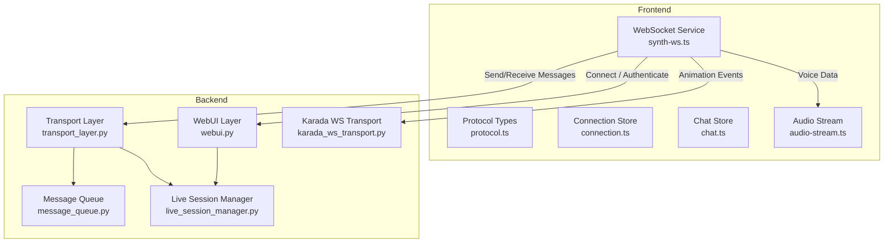
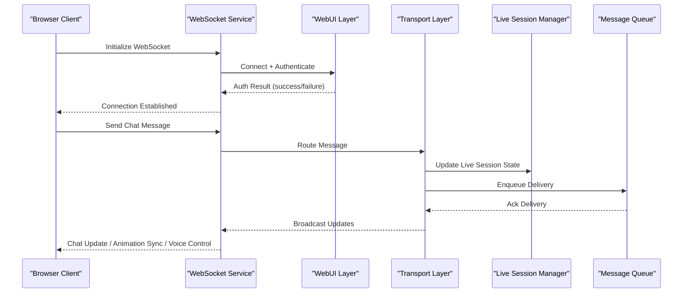
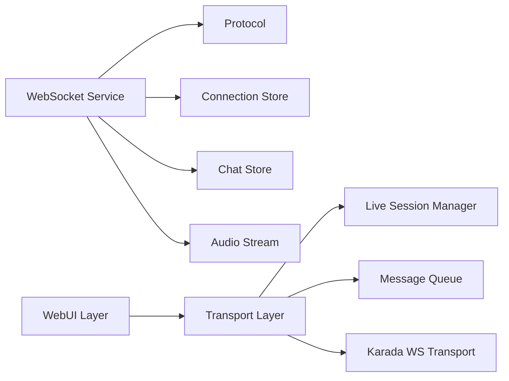

# Real-Time Communication

<cite>
**Referenced Files in This Document**
- [main.py](file://main.py)
- [synth_ws.ts](file://frontend/src/services/synth-ws.ts)
- [protocol.ts](file://frontend/src/services/protocol.ts)
- [connection.ts](file://frontend/src/stores/connection.ts)
- [chat.ts](file://frontend/src/stores/chat.ts)
- [audio-stream.ts](file://frontend/src/services/audio-stream.ts)
- [karada_ws_transport.py](file://core/karada_ws_transport.py)
- [transport_layer.py](file://core/transport_layer.py)
- [message_queue.py](file://core/message_queue.py)
- [live_session_manager.py](file://core/live_session_manager.py)
- [webui.py](file://core/webui.py)
</cite>

## Table of Contents
1. [Introduction](#introduction)
2. [Project Structure](#project-structure)
3. [Core Components](#core-components)
4. [Architecture Overview](#architecture-overview)
5. [Detailed Component Analysis](#detailed-component-analysis)
6. [Dependency Analysis](#dependency-analysis)
7. [Performance Considerations](#performance-considerations)
8. [Troubleshooting Guide](#troubleshooting-guide)
9. [Conclusion](#conclusion)
10. [Appendices](#appendices)

## Introduction
This document explains Synthetic Heart’s real-time WebSocket communication system, focusing on connection management, message protocol, event handling patterns, and the client-server flow for live chat updates, animation synchronization, and voice session management. It also covers authentication mechanisms, error recovery strategies, reconnection logic, performance optimization, and browser compatibility considerations. The goal is to help developers implement custom WebSocket handlers, manage connection states, and build robust real-time features.

## Project Structure
The real-time system spans both the Python backend and the TypeScript frontend:
- Backend:
  - WebSocket transport and routing are implemented in core modules that expose endpoints and handle events.
  - Live session management coordinates multi-modal sessions (voice, video, animations).
  - Message queues ensure reliable delivery and ordering.
- Frontend:
  - A dedicated WebSocket service manages connections, reconnection, and message dispatching.
  - Protocol definitions define message types and payloads.
  - Stores encapsulate state for connection, chat, audio, and UI.

**Diagram sources**
- [synth_ws.ts](file://frontend/src/services/synth-ws.ts)
- [protocol.ts](file://frontend/src/services/protocol.ts)
- [connection.ts](file://frontend/src/stores/connection.ts)
- [chat.ts](file://frontend/src/stores/chat.ts)
- [audio-stream.ts](file://frontend/src/services/audio-stream.ts)
- [webui.py](file://core/webui.py)
- [transport_layer.py](file://core/transport_layer.py)
- [karada_ws_transport.py](file://core/karada_ws_transport.py)
- [message_queue.py](file://core/message_queue.py)
- [live_session_manager.py](file://core/live_session_manager.py)

**Section sources**
- [main.py](file://main.py)
- [synth_ws.ts](file://frontend/src/services/synth-ws.ts)
- [protocol.ts](file://frontend/src/services/protocol.ts)
- [connection.ts](file://frontend/src/stores/connection.ts)
- [chat.ts](file://frontend/src/stores/chat.ts)
- [audio-stream.ts](file://frontend/src/services/audio-stream.ts)
- [karada_ws_transport.py](file://core/karada_ws_transport.py)
- [transport_layer.py](file://core/transport_layer.py)
- [message_queue.py](file://core/message_queue.py)
- [live_session_manager.py](file://core/live_session_manager.py)
- [webui.py](file://core/webui.py)

## Core Components
- WebSocket Service (Frontend): Manages lifecycle, reconnection, ping/pong, and message routing.
- Protocol Definitions (Frontend): Enumerates message types, payloads, and expected fields.
- Connection Store (Frontend): Tracks connection state, errors, and metadata.
- Chat Store (Frontend): Handles incoming chat messages and UI updates.
- Audio Stream (Frontend): Streams voice data over WebSocket or related transports.
- Transport Layer (Backend): Routes messages to appropriate handlers and services.
- Karada WS Transport (Backend): Bridges WebSocket events to karada subsystem for animation and facial expressions.
- Message Queue (Backend): Ensures ordered, reliable delivery and backpressure handling.
- Live Session Manager (Backend): Coordinates multi-modal sessions and resource allocation.
- WebUI Layer (Backend): Exposes WebSocket endpoints and integrates with authentication.

Key responsibilities:
- Connection lifecycle: connect, authenticate, reconnect, disconnect.
- Message routing: type-based dispatch, payload validation, error responses.
- Event handling: chat updates, animation sync, voice session control.
- Error recovery: retries, exponential backoff, fallback channels.

**Section sources**
- [synth_ws.ts](file://frontend/src/services/synth-ws.ts)
- [protocol.ts](file://frontend/src/services/protocol.ts)
- [connection.ts](file://frontend/src/stores/connection.ts)
- [chat.ts](file://frontend/src/stores/chat.ts)
- [audio-stream.ts](file://frontend/src/services/audio-stream.ts)
- [transport_layer.py](file://core/transport_layer.py)
- [karada_ws_transport.py](file://core/karada_ws_transport.py)
- [message_queue.py](file://core/message_queue.py)
- [live_session_manager.py](file://core/live_session_manager.py)
- [webui.py](file://core/webui.py)

## Architecture Overview
The architecture separates concerns between frontend and backend while maintaining a clear message contract:
- Frontend initiates WebSocket connections and authenticates via tokens or session cookies.
- Backend validates credentials, establishes sessions, and routes messages through the transport layer.
- Live sessions coordinate voice, video, and animation streams.
- Message queue ensures reliability and ordering under load.

**Diagram sources**
- [synth_ws.ts](file://frontend/src/services/synth-ws.ts)
- [webui.py](file://core/webui.py)
- [transport_layer.py](file://core/transport_layer.py)
- [live_session_manager.py](file://core/live_session_manager.py)
- [message_queue.py](file://core/message_queue.py)

## Detailed Component Analysis

### WebSocket Service (Frontend)
Responsibilities:
- Establishes WebSocket connections with configurable endpoints.
- Implements reconnection with exponential backoff and jitter.
- Handles ping/pong keep-alive and heartbeat timeouts.
- Dispatches incoming messages based on protocol types.
- Queues outgoing messages when disconnected and flushes on reconnect.

Reconnection strategy:
- Detects network failures and server disconnects.
- Retries with increasing delays up to a maximum cap.
- Resets state and re-authenticates upon successful reconnect.

Error handling:
- Catches serialization/deserialization errors.
- Emits typed events for connection status changes.
- Provides diagnostics for debugging connectivity issues.

**Section sources**
- [synth_ws.ts](file://frontend/src/services/synth-ws.ts)
- [protocol.ts](file://frontend/src/services/protocol.ts)
- [connection.ts](file://frontend/src/stores/connection.ts)

### Protocol Definitions (Frontend)
Defines:
- Message types for chat, animation, voice, and system events.
- Payload schemas with required and optional fields.
- Versioning and compatibility checks.

Usage:
- Centralizes message contracts to avoid drift between client and server.
- Enables static analysis and runtime validation.

**Section sources**
- [protocol.ts](file://frontend/src/services/protocol.ts)

### Connection Store (Frontend)
Tracks:
- Connection state (disconnected, connecting, connected, error).
- Last error reason and timestamp.
- Reconnection attempts and backoff schedule.

Integration:
- Subscribed by UI components to reflect status.
- Used by WebSocket service to decide retry behavior.

**Section sources**
- [connection.ts](file://frontend/src/stores/connection.ts)

### Chat Store (Frontend)
Manages:
- Incoming chat messages and their order.
- Typing indicators and read receipts.
- Local caching and persistence.

Real-time updates:
- Listens for chat events from WebSocket service.
- Applies optimistic updates and rollbacks on errors.

**Section sources**
- [chat.ts](file://frontend/src/stores/chat.ts)

### Audio Stream (Frontend)
Handles:
- Microphone capture and chunked audio streaming.
- Codec selection and bitrate adaptation.
- Synchronization with playback and latency compensation.

WebSocket integration:
- Sends voice frames over dedicated channels.
- Receives server-side TTS chunks for playback.

**Section sources**
- [audio-stream.ts](file://frontend/src/services/audio-stream.ts)

### Transport Layer (Backend)
Functions:
- Validates and routes incoming WebSocket messages.
- Invokes appropriate handlers based on message type.
- Publishes events to subscribers and queues.

Error propagation:
- Wraps exceptions into standardized error responses.
- Logs diagnostic information for troubleshooting.

**Section sources**
- [transport_layer.py](file://core/transport_layer.py)

### Karada WS Transport (Backend)
Bridges:
- WebSocket events to karada subsystem for animation and facial expressions.
- Translates high-level commands into low-level pose updates.

Synchronization:
- Ensures consistent state across clients.
- Handles frame drops and interpolation.

**Section sources**
- [karada_ws_transport.py](file://core/karada_ws_transport.py)

### Message Queue (Backend)
Features:
- Ordered delivery with acknowledgment.
- Backpressure handling and rate limiting.
- Retry policies and dead-letter queues.

Reliability:
- Persists messages during outages.
- Supports idempotent processing.

**Section sources**
- [message_queue.py](file://core/message_queue.py)

### Live Session Manager (Backend)
Coordinates:
- Multi-modal sessions (voice, video, animations).
- Resource allocation and cleanup.
- Cross-client synchronization.

Lifecycle:
- Creates sessions on first interaction.
- Tears down idle sessions after timeout.

**Section sources**
- [live_session_manager.py](file://core/live_session_manager.py)

### WebUI Layer (Backend)
Exposes:
- WebSocket endpoints for client connections.
- Authentication middleware for token/session validation.
- Integration points for plugins and external services.

Security:
- Enforces rate limits and access controls.
- Sanitizes inputs and validates payloads.

**Section sources**
- [webui.py](file://core/webui.py)

## Dependency Analysis
The real-time system exhibits clear separation between frontend and backend with well-defined interfaces:
- Frontend depends on protocol definitions and stores for state management.
- Backend relies on transport layer, session manager, and message queue for orchestration.
- External integrations (e.g., karada, TTS) are abstracted behind adapters.

**Diagram sources**
- [synth_ws.ts](file://frontend/src/services/synth-ws.ts)
- [protocol.ts](file://frontend/src/services/protocol.ts)
- [connection.ts](file://frontend/src/stores/connection.ts)
- [chat.ts](file://frontend/src/stores/chat.ts)
- [audio-stream.ts](file://frontend/src/services/audio-stream.ts)
- [webui.py](file://core/webui.py)
- [transport_layer.py](file://core/transport_layer.py)
- [live_session_manager.py](file://core/live_session_manager.py)
- [message_queue.py](file://core/message_queue.py)
- [karada_ws_transport.py](file://core/karada_ws_transport.py)

**Section sources**
- [synth_ws.ts](file://frontend/src/services/synth-ws.ts)
- [protocol.ts](file://frontend/src/services/protocol.ts)
- [connection.ts](file://frontend/src/stores/connection.ts)
- [chat.ts](file://frontend/src/stores/chat.ts)
- [audio-stream.ts](file://frontend/src/services/audio-stream.ts)
- [webui.py](file://core/webui.py)
- [transport_layer.py](file://core/transport_layer.py)
- [live_session_manager.py](file://core/live_session_manager.py)
- [message_queue.py](file://core/message_queue.py)
- [karada_ws_transport.py](file://core/karada_ws_transport.py)

## Performance Considerations
- Minimize payload size by using binary formats for audio and compressed JSON for text.
- Implement batching for frequent updates (e.g., animation frames).
- Use connection pooling and async I/O on the backend.
- Apply backpressure in message queues to prevent memory spikes.
- Enable compression at the WebSocket level where supported.
- Cache frequently accessed data on the client side.

[No sources needed since this section provides general guidance]

## Troubleshooting Guide
Common issues and resolutions:
- Connection failures: Check network availability, firewall rules, and CORS settings.
- Authentication errors: Verify token validity and expiration handling.
- Message loss: Inspect queue depth and consumer lag; enable retries.
- Audio glitches: Adjust buffer sizes and codec settings; monitor latency.
- Animation desync: Ensure frame timestamps are monotonic and interpolate missing frames.

Debugging tips:
- Enable verbose logging on both client and server.
- Use browser dev tools to inspect WebSocket frames.
- Monitor backend metrics for throughput and error rates.

**Section sources**
- [synth_ws.ts](file://frontend/src/services/synth-ws.ts)
- [transport_layer.py](file://core/transport_layer.py)
- [message_queue.py](file://core/message_queue.py)

## Conclusion
Synthetic Heart’s real-time communication system combines a robust frontend WebSocket service with a scalable backend transport layer. By adhering to well-defined protocols and leveraging message queues and session managers, it supports live chat, animation synchronization, and voice sessions with high reliability. Developers can extend functionality through custom handlers and integrations while maintaining performance and compatibility across browsers.

[No sources needed since this section summarizes without analyzing specific files]

## Appendices

### Implementing Custom WebSocket Handlers
Steps:
- Define new message types in protocol definitions.
- Register handlers in the transport layer.
- Validate payloads and emit events to subscribers.
- Test with automated scripts and manual verification.

Best practices:
- Use versioned APIs for backward compatibility.
- Handle errors gracefully and log diagnostics.
- Avoid blocking operations in handlers.

**Section sources**
- [protocol.ts](file://frontend/src/services/protocol.ts)
- [transport_layer.py](file://core/transport_layer.py)

### Handling Connection States
Patterns:
- Emit typed events for state transitions.
- Persist state across page reloads if necessary.
- Provide user feedback for connectivity issues.

State machine:
- Disconnected → Connecting → Connected → Error → Reconnecting → Connected

**Section sources**
- [connection.ts](file://frontend/src/stores/connection.ts)
- [synth_ws.ts](file://frontend/src/services/synth-ws.ts)

### Managing Message Queues
Strategies:
- Prioritize critical messages (e.g., voice control).
- Implement acknowledgments and retries.
- Monitor queue health and alert on anomalies.

Queue design:
- In-memory for low-latency needs.
- Persistent storage for durability.

**Section sources**
- [message_queue.py](file://core/message_queue.py)

### Reconnection Logic
Algorithm:
- Detect disconnections via ping/pong timeouts.
- Retry with exponential backoff and jitter.
- Reset state and re-authenticate on reconnect.

Configuration:
- Max retries and delay caps.
- Fallback endpoints for redundancy.

**Section sources**
- [synth_ws.ts](file://frontend/src/services/synth-ws.ts)

### Browser Compatibility Considerations
Support matrix:
- Modern browsers with full WebSocket support.
- Fallbacks for older environments (e.g., polling).
- Polyfills for missing APIs (e.g., MediaStream).

Testing:
- Cross-browser validation using automation tools.
- Performance profiling on target devices.

[No sources needed since this section provides general guidance]