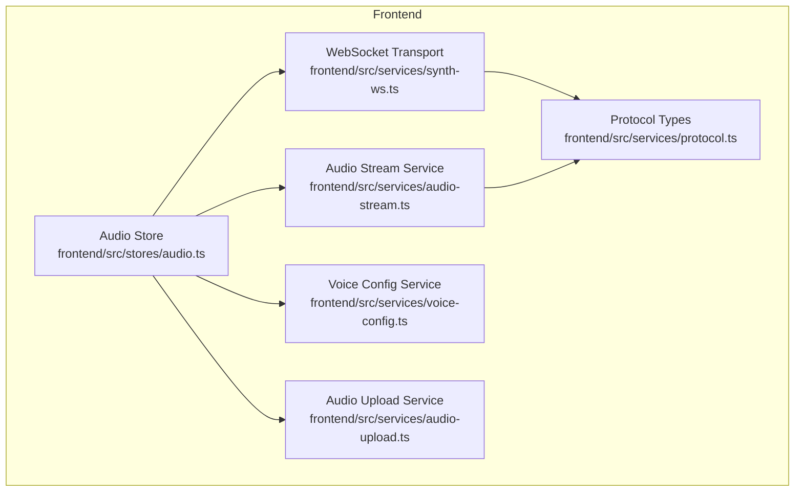
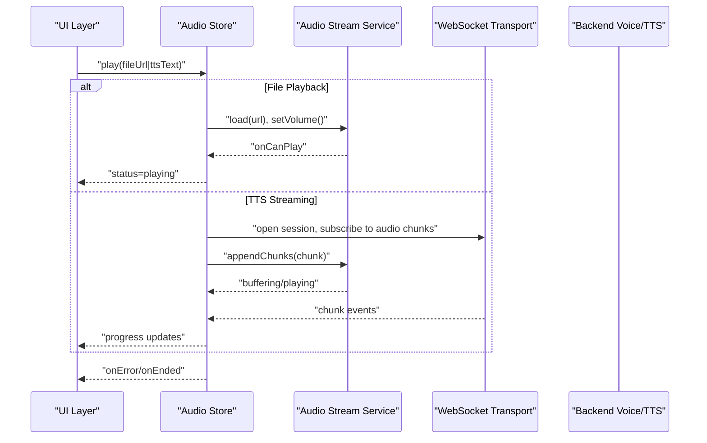
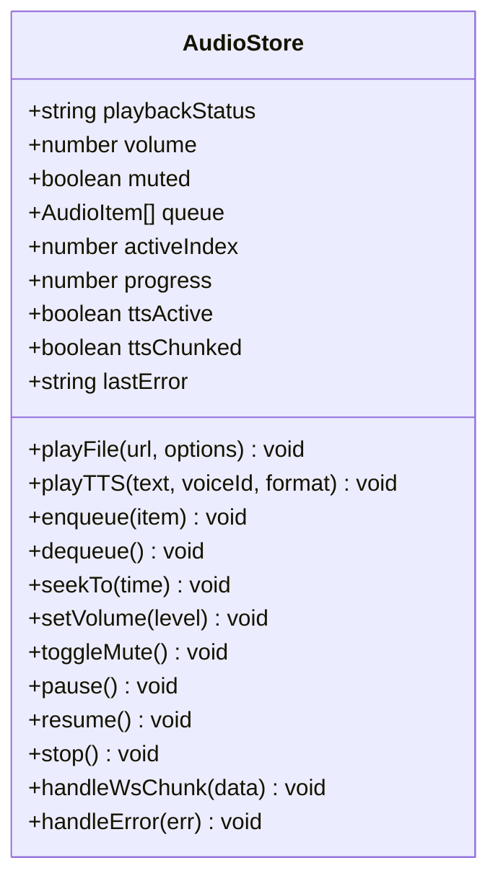
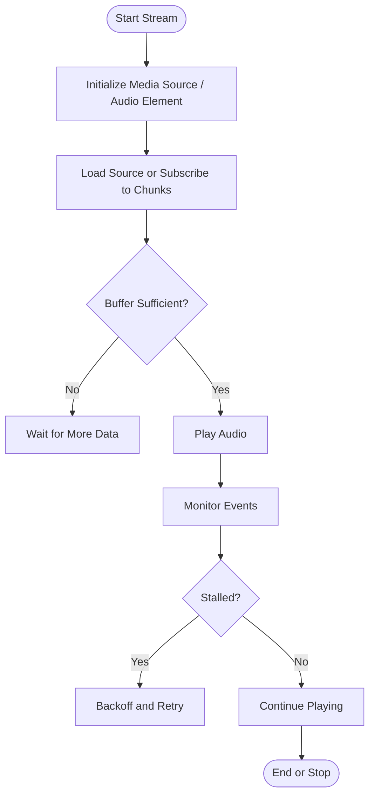
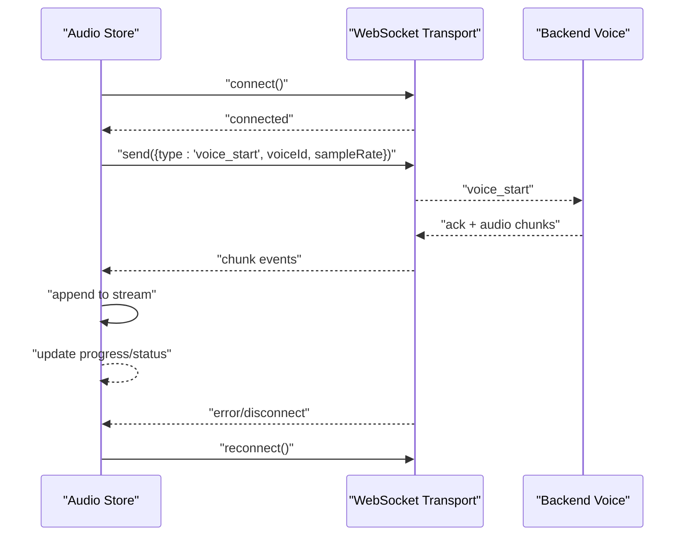
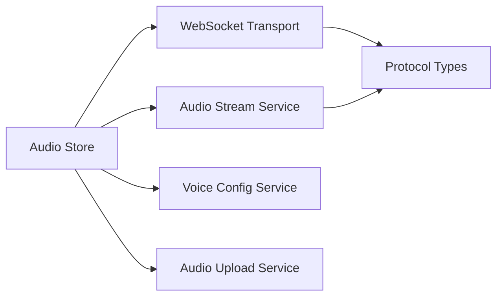

# Audio Store

<cite>
**Referenced Files in This Document**
- [audio.ts](file://frontend/src/stores/audio.ts)
- [audio-stream.ts](file://frontend/src/services/audio-stream.ts)
- [synth-ws.ts](file://frontend/src/services/synth-ws.ts)
- [voice-config.ts](file://frontend/src/services/voice-config.ts)
- [audio-upload.ts](file://frontend/src/services/audio-upload.ts)
- [protocol.ts](file://frontend/src/services/protocol.ts)
</cite>

## Table of Contents
1. [Introduction](#introduction)
2. [Project Structure](#project-structure)
3. [Core Components](#core-components)
4. [Architecture Overview](#architecture-overview)
5. [Detailed Component Analysis](#detailed-component-analysis)
6. [Dependency Analysis](#dependency-analysis)
7. [Performance Considerations](#performance-considerations)
8. [Troubleshooting Guide](#troubleshooting-guide)
9. [Conclusion](#conclusion)

## Introduction
This document explains the Audio Store component that powers text-to-speech playback, voice processing, and audio stream handling in Synthetic Heart’s frontend state management. It covers reactive state properties for playback status, volume control, and queue management; demonstrates how to play files and streams; details error handling; and shows coordination with the WebSocket connection for real-time voice communication. It also summarizes supported audio formats, buffering strategies, and performance optimizations for smooth playback.

## Project Structure
The Audio Store is implemented as a frontend store that coordinates with dedicated services for streaming, WebSocket transport, voice configuration, and file uploads. The relevant modules are:
- Store: central reactive state and actions for audio playback
- Services: audio streaming, WebSocket transport, voice configuration, and upload utilities
- Protocol: shared message types used by the WebSocket layer

**Diagram sources**
- [audio.ts](file://frontend/src/stores/audio.ts)
- [audio-stream.ts](file://frontend/src/services/audio-stream.ts)
- [synth-ws.ts](file://frontend/src/services/synth-ws.ts)
- [voice-config.ts](file://frontend/src/services/voice-config.ts)
- [audio-upload.ts](file://frontend/src/services/audio-upload.ts)
- [protocol.ts](file://frontend/src/services/protocol.ts)

**Section sources**
- [audio.ts](file://frontend/src/stores/audio.ts)
- [audio-stream.ts](file://frontend/src/services/audio-stream.ts)
- [synth-ws.ts](file://frontend/src/services/synth-ws.ts)
- [voice-config.ts](file://frontend/src/services/voice-config.ts)
- [audio-upload.ts](file://frontend/src/services/audio-upload.ts)
- [protocol.ts](file://frontend/src/services/protocol.ts)

## Core Components
- Audio Store (reactive state and actions):
  - Playback status: playing, paused, ended, buffering, error
  - Volume control: current volume, mute toggle
  - Queue management: items queued, active item, progress
  - TTS-specific flags: ttsActive, ttsChunked
  - Stream controls: start/stop, resume/pause, seek
  - Error handling: lastError, retry logic hooks
- Audio Stream Service:
  - Manages MediaSource or native <audio> lifecycle
  - Handles chunked audio ingestion and buffering
  - Exposes events for readyState changes and errors
- WebSocket Transport:
  - Connects to backend for real-time voice payloads
  - Sends/receives voice commands and audio chunks
  - Reconnects on failure and emits connection events
- Voice Config Service:
  - Reads/writes user preferences for voice engine, sample rate, codec
  - Validates and normalizes settings before use
- Audio Upload Service:
  - Uploads local audio assets for playback or TTS reference
  - Returns URLs or IDs for subsequent playback

**Section sources**
- [audio.ts](file://frontend/src/stores/audio.ts)
- [audio-stream.ts](file://frontend/src/services/audio-stream.ts)
- [synth-ws.ts](file://frontend/src/services/synth-ws.ts)
- [voice-config.ts](file://frontend/src/services/voice-config.ts)
- [audio-upload.ts](file://frontend/src/services/audio-upload.ts)

## Architecture Overview
The Audio Store orchestrates playback by delegating to specialized services while maintaining reactive UI state. For TTS, it can either play pre-encoded files or consume streamed chunks over WebSocket. For live voice, it integrates with the WebSocket service to send microphone data and receive server-generated audio.

**Diagram sources**
- [audio.ts](file://frontend/src/stores/audio.ts)
- [audio-stream.ts](file://frontend/src/services/audio-stream.ts)
- [synth-ws.ts](file://frontend/src/services/synth-ws.ts)

## Detailed Component Analysis

### Audio Store (Reactive State and Actions)
Responsibilities:
- Maintain playback state: playing, paused, ended, buffering, error
- Manage volume and mute
- Control audio queue: enqueue/dequeue, reorder, clear
- Coordinate TTS sessions: start, pause, resume, stop
- Handle streaming: append chunks, manage buffer health
- Emit events for UI binding and logging

Key reactive properties:
- playbackStatus: idle | loading | buffering | playing | paused | ended | error
- volume: number (0–1)
- muted: boolean
- queue: Array<AudioItem>
- activeIndex: number
- progress: number (seconds or percentage)
- ttsActive: boolean
- ttsChunked: boolean
- lastError: string|null

Common actions:
- playFile(url, options)
- playTTS(text, voiceId, format)
- enqueue(item)
- dequeue()
- seekTo(time)
- setVolume(level)
- toggleMute()
- pause()/resume()
- stop()
- handleWsChunk(data)
- handleError(err)

**Diagram sources**
- [audio.ts](file://frontend/src/stores/audio.ts)

**Section sources**
- [audio.ts](file://frontend/src/stores/audio.ts)

### Audio Stream Service
Responsibilities:
- Wrap HTMLMediaElement or MediaSource pipeline
- Append incoming chunks into buffer
- Manage readyState transitions and backpressure
- Expose events: canplay, waiting, playing, stalled, ended, error

Buffering strategy:
- Maintain a circular buffer of recent chunks
- Enforce minimum buffer duration to avoid stalls
- Drop old chunks when memory pressure is detected

**Diagram sources**
- [audio-stream.ts](file://frontend/src/services/audio-stream.ts)

**Section sources**
- [audio-stream.ts](file://frontend/src/services/audio-stream.ts)

### WebSocket Transport for Real-Time Voice
Responsibilities:
- Establish and maintain WebSocket connection
- Send voice commands (start, stop, config)
- Receive audio chunks and metadata
- Handle reconnection and error propagation

Message flow:
- Client sends voice session setup with voiceId, sampleRate, codec
- Server acknowledges and begins streaming audio chunks
- Client appends chunks to the audio stream service
- On disconnect, client attempts reconnect with exponential backoff

**Diagram sources**
- [synth-ws.ts](file://frontend/src/services/synth-ws.ts)
- [protocol.ts](file://frontend/src/services/protocol.ts)

**Section sources**
- [synth-ws.ts](file://frontend/src/services/synth-ws.ts)
- [protocol.ts](file://frontend/src/services/protocol.ts)

### Voice Configuration Service
Responsibilities:
- Provide default and user-selected voice settings
- Validate sample rate, codec, and language codes
- Persist preferences across sessions

Typical properties:
- selectedVoiceId
- preferredCodec
- sampleRate
- language
- ttsEngine

**Section sources**
- [voice-config.ts](file://frontend/src/services/voice-config.ts)

### Audio Upload Service
Responsibilities:
- Upload local audio files to server storage
- Return accessible URLs or identifiers
- Support progress tracking and error reporting

Use cases:
- Preload assets for quick playback
- Provide reference audio for TTS voice cloning

**Section sources**
- [audio-upload.ts](file://frontend/src/services/audio-upload.ts)

## Dependency Analysis
The Audio Store depends on:
- Audio Stream Service for media lifecycle and buffering
- WebSocket Transport for real-time voice and TTS streaming
- Voice Config Service for runtime settings
- Audio Upload Service for asset management
- Protocol definitions for consistent messaging

**Diagram sources**
- [audio.ts](file://frontend/src/stores/audio.ts)
- [audio-stream.ts](file://frontend/src/services/audio-stream.ts)
- [synth-ws.ts](file://frontend/src/services/synth-ws.ts)
- [voice-config.ts](file://frontend/src/services/voice-config.ts)
- [audio-upload.ts](file://frontend/src/services/audio-upload.ts)
- [protocol.ts](file://frontend/src/services/protocol.ts)

**Section sources**
- [audio.ts](file://frontend/src/stores/audio.ts)
- [audio-stream.ts](file://frontend/src/services/audio-stream.ts)
- [synth-ws.ts](file://frontend/src/services/synth-ws.ts)
- [voice-config.ts](file://frontend/src/services/voice-config.ts)
- [audio-upload.ts](file://frontend/src/services/audio-upload.ts)
- [protocol.ts](file://frontend/src/services/protocol.ts)

## Performance Considerations
- Buffering:
  - Maintain a minimum buffer duration to prevent stalls
  - Use adaptive buffering based on network conditions
- Codec selection:
  - Prefer low-latency codecs (e.g., Opus) for real-time voice
  - Fall back to AAC/MP3 for compatibility
- Memory management:
  - Limit buffer size and drop oldest chunks under memory pressure
  - Release resources on stop/end
- Throttling:
  - Debounce rapid volume changes and seek operations
- Concurrency:
  - Serialize chunk appends to avoid race conditions
- Network resilience:
  - Implement exponential backoff and jitter for reconnections
- UI responsiveness:
  - Update progress via requestAnimationFrame or throttled intervals

[No sources needed since this section provides general guidance]

## Troubleshooting Guide
Common issues and resolutions:
- Playback stalls:
  - Check buffer health and increase minimum buffer duration
  - Verify network stability and reduce chunk size
- No sound after TTS start:
  - Ensure audio context is unlocked by user gesture
  - Confirm correct codec and sample rate settings
- WebSocket disconnects:
  - Inspect reconnection logs and server availability
  - Validate token/auth if required
- Volume not applied:
  - Verify muted state and element volume property
- Errors during upload:
  - Check server endpoints and CORS policies
  - Validate file size and MIME type

**Section sources**
- [audio.ts](file://frontend/src/stores/audio.ts)
- [audio-stream.ts](file://frontend/src/services/audio-stream.ts)
- [synth-ws.ts](file://frontend/src/services/synth-ws.ts)
- [voice-config.ts](file://frontend/src/services/voice-config.ts)
- [audio-upload.ts](file://frontend/src/services/audio-upload.ts)

## Conclusion
The Audio Store provides a robust, reactive foundation for TTS playback, voice processing, and audio stream handling. By coordinating with specialized services for streaming, WebSocket transport, configuration, and uploads, it delivers smooth playback, resilient connections, and a clean API for both file-based and real-time audio scenarios. Proper buffering, codec selection, and error handling ensure high-quality audio experiences across devices and networks.

[No sources needed since this section summarizes without analyzing specific files]