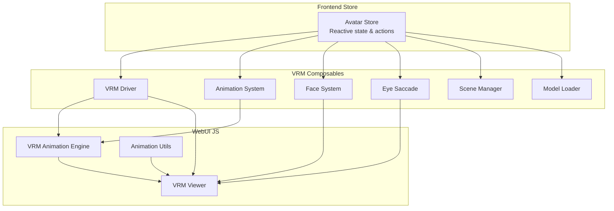
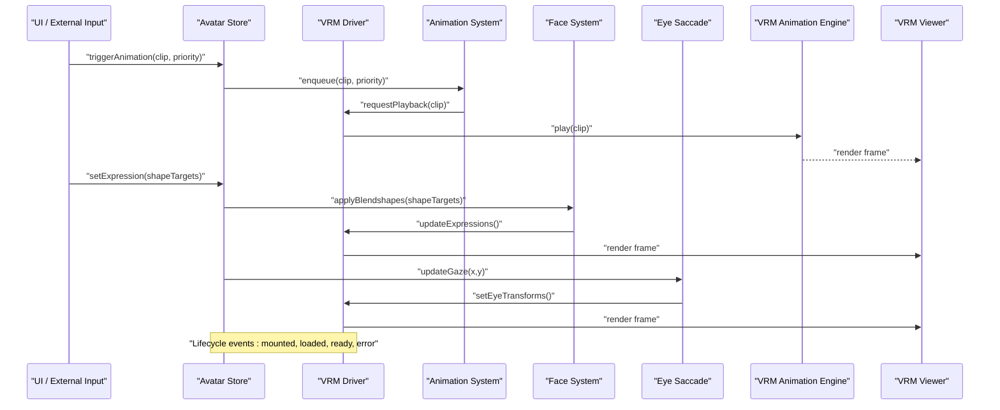
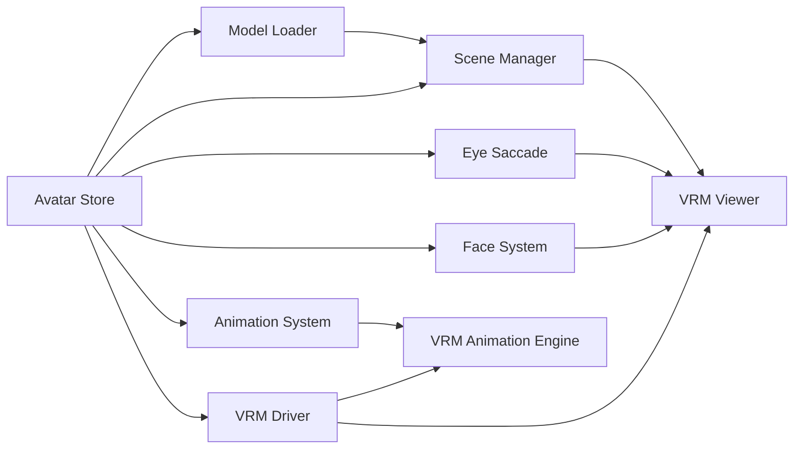

# Avatar Store

<cite>
**Referenced Files in This Document**
- [avatar.ts](file://frontend/src/stores/avatar.ts)
- [avatar-driver.ts](file://frontend/src/composables/vrm/avatar-driver.ts)
- [animation.ts](file://frontend/src/composables/vrm/animation.ts)
- [face.ts](file://frontend/src/composables/vrm/face.ts)
- [eye-saccade.ts](file://frontend/src/composables/vrm/eye-saccade.ts)
- [loader.ts](file://frontend/src/composables/vrm/loader.ts)
- [scene.ts](file://frontend/src/composables/vrm/scene.ts)
- [vrm-animation-engine.mjs](file://res/synth_webui/js/vrm-animation-engine.mjs)
- [vrm-viewer.mjs](file://res/synth_webui/js/vrm-viewer.mjs)
- [AnimationUtils.js](file://res/synth_webui/js/AnimationUtils.js)
- [lip-sync pipeline](file://frontend/src/lib/lipsync)
</cite>

## Table of Contents
1. [Introduction](#introduction)
2. [Project Structure](#project-structure)
3. [Core Components](#core-components)
4. [Architecture Overview](#architecture-overview)
5. [Detailed Component Analysis](#detailed-component-analysis)
6. [Dependency Analysis](#dependency-analysis)
7. [Performance Considerations](#performance-considerations)
8. [Troubleshooting Guide](#troubleshooting-guide)
9. [Conclusion](#conclusion)
10. [Appendices](#appendices)

## Introduction
This document explains the Avatar Store and its integration with the VRM driver to manage avatar state, animations, expressions, eye tracking, and lip-sync data. It covers reactive properties for loading states, animation queues, expression states, and eye tracking; how the store coordinates with the VRM driver to apply animations and facial expressions; and how gesture sequences are handled. It also includes examples for triggering animations, updating expressions, synchronizing lip-sync data, and handling lifecycle events, along with notes on priority systems, fallback mechanisms, and performance considerations.

## Project Structure
The Avatar Store is implemented as a frontend store that exposes reactive state and actions for avatar management. It integrates with:
- The VRM driver for low-level avatar control
- Animation utilities and engine for playback and blending
- Face and eye subsystems for expressions and saccades
- Scene and loader modules for asset management

**Diagram sources**
- [avatar.ts](file://frontend/src/stores/avatar.ts)
- [avatar-driver.ts](file://frontend/src/composables/vrm/avatar-driver.ts)
- [animation.ts](file://frontend/src/composables/vrm/animation.ts)
- [face.ts](file://frontend/src/composables/vrm/face.ts)
- [eye-saccade.ts](file://frontend/src/composables/vrm/eye-saccade.ts)
- [scene.ts](file://frontend/src/composables/vrm/scene.ts)
- [loader.ts](file://frontend/src/composables/vrm/loader.ts)
- [vrm-animation-engine.mjs](file://res/synth_webui/js/vrm-animation-engine.mjs)
- [vrm-viewer.mjs](file://res/synth_webui/js/vrm-viewer.mjs)
- [AnimationUtils.js](file://res/synth_webui/js/AnimationUtils.js)

**Section sources**
- [avatar.ts](file://frontend/src/stores/avatar.ts)
- [avatar-driver.ts](file://frontend/src/composables/vrm/avatar-driver.ts)
- [animation.ts](file://frontend/src/composables/vrm/animation.ts)
- [face.ts](file://frontend/src/composables/vrm/face.ts)
- [eye-saccade.ts](file://frontend/src/composables/vrm/eye-saccade.ts)
- [scene.ts](file://frontend/src/composables/vrm/scene.ts)
- [loader.ts](file://frontend/src/composables/vrm/loader.ts)
- [vrm-animation-engine.mjs](file://res/synth_webui/js/vrm-animation-engine.mjs)
- [vrm-viewer.mjs](file://res/synth_webui/js/vrm-viewer.mjs)
- [AnimationUtils.js](file://res/synth_webui/js/AnimationUtils.js)

## Core Components
- Avatar Store: Central reactive state and actions for avatar lifecycle, animation queue, expressions, and eye tracking.
- VRM Driver: Low-level interface to the VRM model instance, applying animations, expressions, and transforms.
- Animation System: Manages animation clips, queues, priorities, transitions, and blending.
- Face System: Controls blendshapes and facial expressions (e.g., mouth, eyes, brows).
- Eye Saccade: Handles micro eye movements and gaze direction updates.
- Scene and Loader: Manage scene graph and asset loading (VRM models, textures, animations).
- WebUI Animation Engine and Viewer: Bridge between store/driver and rendering pipeline.

Key responsibilities:
- Expose reactive flags for loading, ready, error, and active avatar state
- Maintain an animation queue with priority and transition rules
- Track current expressions and blendshape targets
- Sync lip-sync phoneme data to mouth shapes
- Emit lifecycle events for mount, load, ready, error, and unmount

**Section sources**
- [avatar.ts](file://frontend/src/stores/avatar.ts)
- [avatar-driver.ts](file://frontend/src/composables/vrm/avatar-driver.ts)
- [animation.ts](file://frontend/src/composables/vrm/animation.ts)
- [face.ts](file://frontend/src/composables/vrm/face.ts)
- [eye-saccade.ts](file://frontend/src/composables/vrm/eye-saccade.ts)
- [scene.ts](file://frontend/src/composables/vrm/scene.ts)
- [loader.ts](file://frontend/src/composables/vrm/loader.ts)
- [vrm-animation-engine.mjs](file://res/synth_webui/js/vrm-animation-engine.mjs)
- [vrm-viewer.mjs](file://res/synth_webui/js/vrm-viewer.mjs)

## Architecture Overview
The Avatar Store orchestrates avatar behavior by coordinating with the VRM driver and related composables. It reacts to user input or external signals (e.g., TTS lipsync), updates internal state, and delegates to the appropriate subsystems.

**Diagram sources**
- [avatar.ts](file://frontend/src/stores/avatar.ts)
- [avatar-driver.ts](file://frontend/src/composables/vrm/avatar-driver.ts)
- [animation.ts](file://frontend/src/composables/vrm/animation.ts)
- [face.ts](file://frontend/src/composables/vrm/face.ts)
- [eye-saccade.ts](file://frontend/src/composables/vrm/eye-saccade.ts)
- [vrm-animation-engine.mjs](file://res/synth_webui/js/vrm-animation-engine.mjs)
- [vrm-viewer.mjs](file://res/synth_webui/js/vrm-viewer.mjs)

## Detailed Component Analysis

### Avatar Store
Responsibilities:
- Reactive properties:
  - Loading state: indicates whether the avatar model is being loaded
  - Ready state: indicates whether the avatar is fully initialized and ready to receive commands
  - Error state: captures last error during load or runtime
  - Active avatar: reference to the current VRM instance
  - Animation queue: ordered list of pending animations with metadata (priority, duration, loop, transition)
  - Current expression: map of expression keys to normalized values
  - Eye tracking: gaze vectors and blink state
- Actions:
  - Load avatar from URL or asset path
  - Trigger animation with priority and optional transition parameters
  - Update expressions via shape targets or named expressions
  - Sync lip-sync phonemes to mouth shapes
  - Handle lifecycle events (mounted, loaded, ready, error, unmount)

Coordination with VRM driver:
- Delegates animation playback to the animation system and driver
- Applies expressions through the face system
- Updates eye transforms via the eye saccade module
- Emits events for UI and other consumers

Priority and fallback:
- Higher-priority animations preempt lower-priority ones
- Fallback animations can be specified per clip or globally
- Transition blending ensures smooth crossfades

Lip-sync synchronization:
- Receives phoneme streams and maps them to mouth blendshapes
- Maintains smoothing and timing alignment with audio

Examples:
- Triggering an animation: call the store action with clip identifier and priority
- Updating expressions: provide a map of expression keys to target values
- Synchronizing lip-sync: feed phoneme sequence to the store’s lip-sync method
- Lifecycle handling: subscribe to mounted/ready/error events to update UI

**Section sources**
- [avatar.ts](file://frontend/src/stores/avatar.ts)
- [avatar-driver.ts](file://frontend/src/composables/vrm/avatar-driver.ts)
- [animation.ts](file://frontend/src/composables/vrm/animation.ts)
- [face.ts](file://frontend/src/composables/vrm/face.ts)
- [eye-saccade.ts](file://frontend/src/composables/vrm/eye-saccade.ts)
- [vrm-animation-engine.mjs](file://res/synth_webui/js/vrm-animation-engine.mjs)
- [vrm-viewer.mjs](file://res/synth_webui/js/vrm-viewer.mjs)

### VRM Driver
Responsibilities:
- Wraps the VRM model instance and provides methods to:
  - Apply animations and control playback state
  - Set blendshapes for facial expressions
  - Update eye transforms and gaze direction
  - Manage skeleton and bone transforms if needed
- Integrates with the animation engine and viewer for rendering

Integration points:
- Called by the Avatar Store to execute high-level commands
- Communicates with the animation engine for clip playback
- Updates the viewer’s render pipeline when state changes

Error handling:
- Validates inputs and returns errors for invalid operations
- Provides recovery hooks for failed loads or corrupted assets

**Section sources**
- [avatar-driver.ts](file://frontend/src/composables/vrm/avatar-driver.ts)
- [vrm-animation-engine.mjs](file://res/synth_webui/js/vrm-animation-engine.mjs)
- [vrm-viewer.mjs](file://res/synth_webui/js/vrm-viewer.mjs)

### Animation System
Responsibilities:
- Manages animation clips, queues, and playback
- Implements priority-based scheduling and transitions
- Supports looping, blending, and crossfade durations
- Provides fallback clips when primary clips fail

Data structures:
- Animation entry: clip ID, priority, duration, loop flag, transition settings
- Queue: ordered list sorted by priority and enqueue time

Processing logic:
- Enqueue new animations and evaluate preemption rules
- Start playback on the driver and track completion
- Apply transitions to avoid abrupt changes

Performance considerations:
- Debounce rapid enqueue calls
- Limit concurrent active animations
- Reuse clip instances where possible

**Section sources**
- [animation.ts](file://frontend/src/composables/vrm/animation.ts)
- [AnimationUtils.js](file://res/synth_webui/js/AnimationUtils.js)
- [vrm-animation-engine.mjs](file://res/synth_webui/js/vrm-animation-engine.mjs)

### Face System
Responsibilities:
- Maps expression keys to blendshape targets
- Normalizes values to valid ranges
- Applies expressions to the VRM model via the driver

Expression states:
- Tracks current expression values
- Supports named expressions and raw shape targets
- Blends multiple expressions with weights

Synchronization:
- Coordinates with lip-sync to prioritize mouth shapes
- Prevents conflicts between gestures and expressions

**Section sources**
- [face.ts](file://frontend/src/composables/vrm/face.ts)
- [avatar-driver.ts](file://frontend/src/composables/vrm/avatar-driver.ts)

### Eye Saccade
Responsibilities:
- Generates natural eye movements (saccades) and blinks
- Updates gaze direction based on input or tracking data
- Smoothly interpolates eye transforms

Integration:
- Receives gaze vectors from the store or external trackers
- Applies transforms through the driver

**Section sources**
- [eye-saccade.ts](file://frontend/src/composables/vrm/eye-saccade.ts)
- [avatar-driver.ts](file://frontend/src/composables/vrm/avatar-driver.ts)

### Scene and Loader
Responsibilities:
- Scene manager maintains the 3D scene graph and camera setup
- Loader handles VRM model, textures, and animation assets
- Ensures proper cleanup on unmount

Lifecycle:
- Mount: initialize scene and loader
- Load: fetch and parse VRM model
- Ready: expose avatar instance to the store
- Unmount: release resources and reset state

**Section sources**
- [scene.ts](file://frontend/src/composables/vrm/scene.ts)
- [loader.ts](file://frontend/src/composables/vrm/loader.ts)
- [vrm-viewer.mjs](file://res/synth_webui/js/vrm-viewer.mjs)

### WebUI Animation Engine and Viewer
Responsibilities:
- Animation engine bridges store/driver commands to WebGL rendering
- Viewer manages the canvas, camera, and rendering loop
- Utilities assist with animation parsing and mapping

Integration:
- Consumed by the driver to play animations and update visuals
- Exposes events for completion and errors

**Section sources**
- [vrm-animation-engine.mjs](file://res/synth_webui/js/vrm-animation-engine.mjs)
- [vrm-viewer.mjs](file://res/synth_webui/js/vrm-viewer.mjs)
- [AnimationUtils.js](file://res/synth_webui/js/AnimationUtils.js)

## Dependency Analysis
The Avatar Store depends on several composables and WebUI modules. The diagram below shows direct dependencies and interactions.

**Diagram sources**
- [avatar.ts](file://frontend/src/stores/avatar.ts)
- [avatar-driver.ts](file://frontend/src/composables/vrm/avatar-driver.ts)
- [animation.ts](file://frontend/src/composables/vrm/animation.ts)
- [face.ts](file://frontend/src/composables/vrm/face.ts)
- [eye-saccade.ts](file://frontend/src/composables/vrm/eye-saccade.ts)
- [scene.ts](file://frontend/src/composables/vrm/scene.ts)
- [loader.ts](file://frontend/src/composables/vrm/loader.ts)
- [vrm-animation-engine.mjs](file://res/synth_webui/js/vrm-animation-engine.mjs)
- [vrm-viewer.mjs](file://res/synth_webui/js/vrm-viewer.mjs)

**Section sources**
- [avatar.ts](file://frontend/src/stores/avatar.ts)
- [avatar-driver.ts](file://frontend/src/composables/vrm/avatar-driver.ts)
- [animation.ts](file://frontend/src/composables/vrm/animation.ts)
- [face.ts](file://frontend/src/composables/vrm/face.ts)
- [eye-saccade.ts](file://frontend/src/composables/vrm/eye-saccade.ts)
- [scene.ts](file://frontend/src/composables/vrm/scene.ts)
- [loader.ts](file://frontend/src/composables/vrm/loader.ts)
- [vrm-animation-engine.mjs](file://res/synth_webui/js/vrm-animation-engine.mjs)
- [vrm-viewer.mjs](file://res/synth_webui/js/vrm-viewer.mjs)

## Performance Considerations
- Animation batching: group multiple animation requests to reduce driver calls
- Transition blending: use short crossfade durations to avoid stutter
- Resource reuse: cache loaded VRM models and animation clips
- Throttling: limit eye movement updates and expression updates per frame
- Memory management: unload unused assets and clear references on unmount
- Rendering optimization: ensure the viewer runs at stable frame rates and avoids heavy per-frame computations

[No sources needed since this section provides general guidance]

## Troubleshooting Guide
Common issues and resolutions:
- Model fails to load:
  - Check network connectivity and CORS settings
  - Validate VRM file integrity and version compatibility
  - Inspect loader logs for parsing errors
- Animations not playing:
  - Verify clip IDs and availability
  - Ensure priority rules do not preempt desired animations
  - Confirm the driver is ready and the scene is initialized
- Expressions appear incorrect:
  - Normalize shape target values to valid ranges
  - Check for conflicting expressions and override priorities
  - Validate blendshape mappings for the specific VRM model
- Lip-sync out of sync:
  - Align phoneme timing with audio chunks
  - Smooth phoneme transitions to avoid jitter
  - Monitor buffer sizes and latency
- Eye movements look unnatural:
  - Adjust saccade amplitude and frequency parameters
  - Ensure gaze updates are smoothed and clamped
- Memory leaks:
  - Ensure proper cleanup on unmount
  - Release texture and animation resources
  - Avoid retaining large objects in reactive state

**Section sources**
- [loader.ts](file://frontend/src/composables/vrm/loader.ts)
- [animation.ts](file://frontend/src/composables/vrm/animation.ts)
- [face.ts](file://frontend/src/composables/vrm/face.ts)
- [eye-saccade.ts](file://frontend/src/composables/vrm/eye-saccade.ts)
- [vrm-animation-engine.mjs](file://res/synth_webui/js/vrm-animation-engine.mjs)
- [vrm-viewer.mjs](file://res/synth_webui/js/vrm-viewer.mjs)

## Conclusion
The Avatar Store provides a robust, reactive foundation for managing VRM avatars in real-time applications. By coordinating with the VRM driver, animation system, face system, and eye saccade module, it enables smooth animation playback, expressive facial control, and lifelike eye behavior. Proper attention to priority systems, fallback mechanisms, and performance optimizations ensures responsive and visually pleasing results.

[No sources needed since this section summarizes without analyzing specific files]

## Appendices

### Examples

- Triggering animations:
  - Use the store’s animation trigger action with a clip identifier and priority value
  - Optionally specify transition duration and loop behavior
  - Observe queue status and completion events

- Updating avatar expressions:
  - Provide a map of expression keys to normalized values
  - Combine named expressions with raw shape targets as needed
  - Monitor current expression state to avoid conflicts

- Synchronizing lip-sync data:
  - Feed phoneme sequences into the store’s lip-sync method
  - Map phonemes to mouth blendshapes supported by the VRM model
  - Smooth transitions and align timing with audio output

- Handling lifecycle events:
  - Subscribe to mounted, loaded, ready, error, and unmount events
  - Update UI indicators for loading and error states
  - Clean up resources on unmount to prevent leaks

[No sources needed since this section provides general guidance]