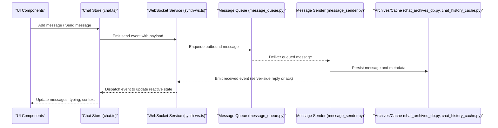
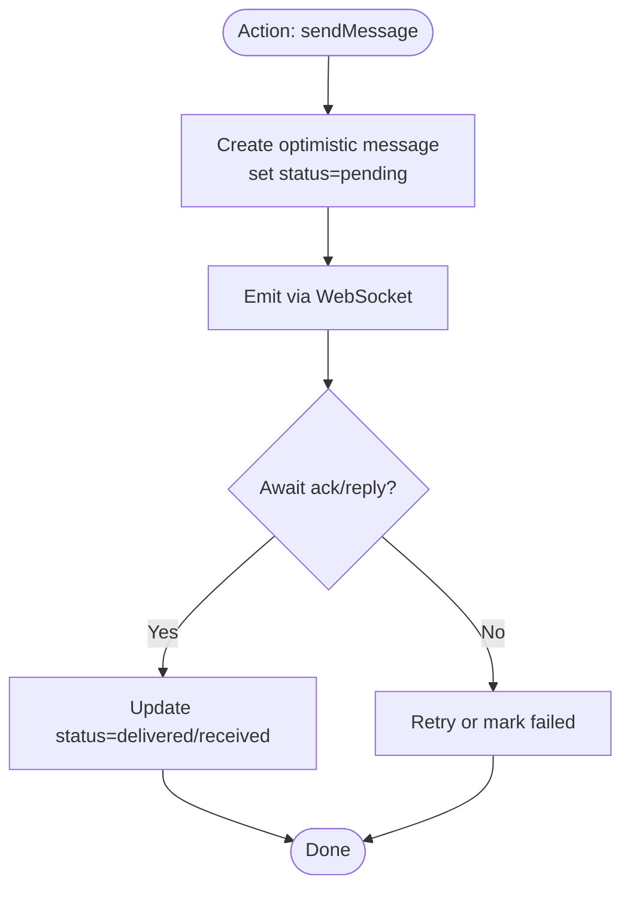
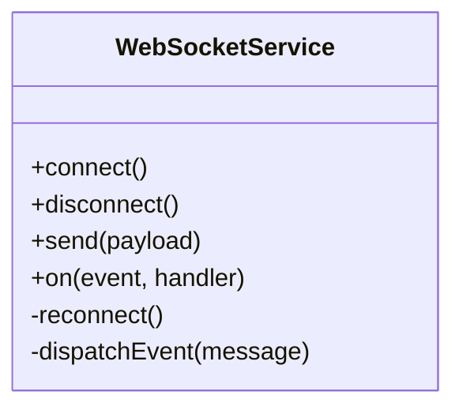
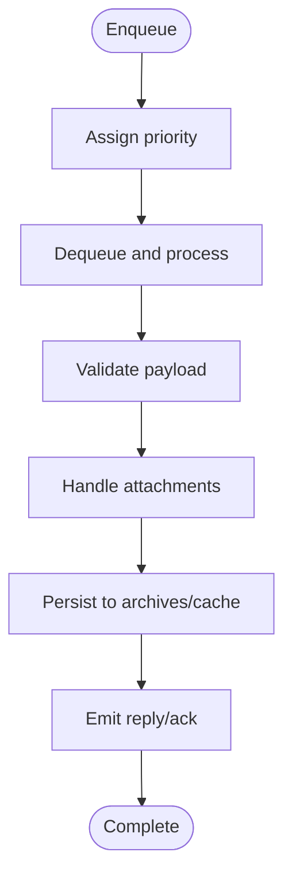
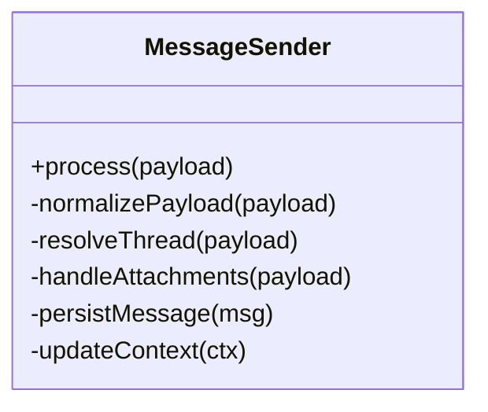
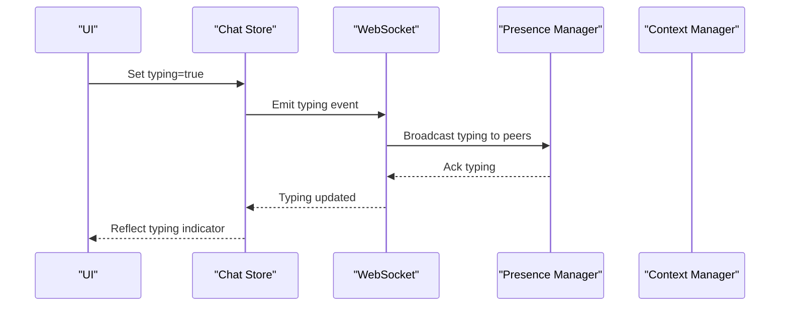
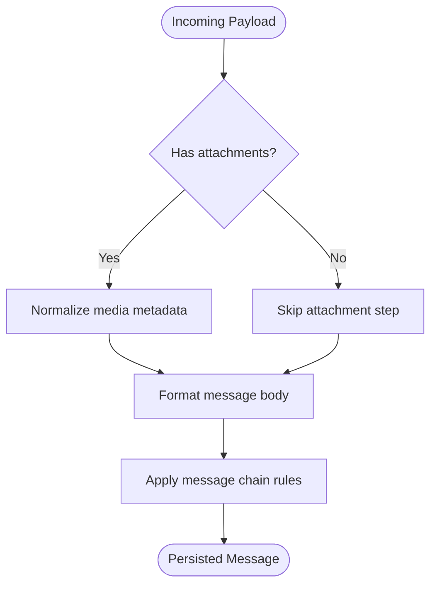
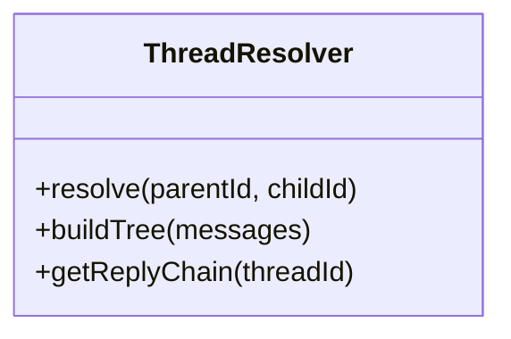
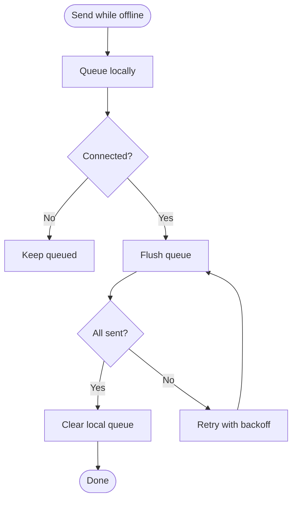
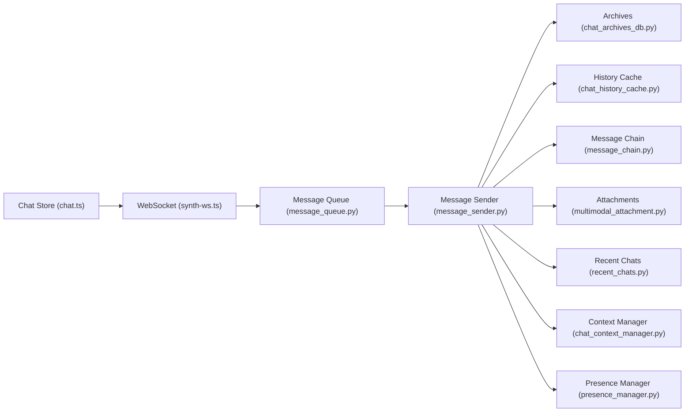

# Chat Store

<cite>
**Referenced Files in This Document**
- [chat.ts](file://frontend/src/stores/chat.ts)
- [synth-ws.ts](file://frontend/src/services/synth-ws.ts)
- [protocol.ts](file://frontend/src/services/protocol.ts)
- [message_queue.ts](file://core/message_queue.py)
- [message_sender.py](file://core/message_sender.py)
- [chat_archives_db.py](file://core/chat_archives_db.py)
- [chat_history_cache.py](file://core/chat_history_cache.py)
- [message_chain.py](file://core/message_chain.py)
- [multimodal_attachment.py](file://core/multimodal_attachment.py)
- [recent_chats.py](file://core/recent_chats.py)
- [chat_context_manager.py](file://core/chat_context_manager.py)
- [presence_manager.py](file://core/presence_manager.py)
</cite>

## Table of Contents
1. [Introduction](#introduction)
2. [Project Structure](#project-structure)
3. [Core Components](#core-components)
4. [Architecture Overview](#architecture-overview)
5. [Detailed Component Analysis](#detailed-component-analysis)
6. [Dependency Analysis](#dependency-analysis)
7. [Performance Considerations](#performance-considerations)
8. [Troubleshooting Guide](#troubleshooting-guide)
9. [Conclusion](#conclusion)
10. [Appendices](#appendices)

## Introduction
This document explains the Chat Store that manages conversation history and message flow across the frontend and backend. It covers reactive state for chat messages, conversation context, typing indicators, and message metadata; how sending and receiving work over WebSocket connections; persistence strategies; real-time updates; message formatting and attachments; conversation threading; and offline queuing.

## Project Structure
The Chat Store spans both frontend (TypeScript/Vue stores and services) and backend (Python modules). The frontend store holds reactive UI state and coordinates with a WebSocket service to send and receive messages. The backend provides message queuing, persistence, archival, and context management.

```mermaid
graph TB
subgraph "Frontend"
A["stores/chat.ts"]
B["services/synth-ws.ts"]
C["services/protocol.ts"]
end
subgraph "Backend"
D["core/message_queue.py"]
E["core/message_sender.py"]
F["core/chat_archives_db.py"]
G["core/chat_history_cache.py"]
H["core/message_chain.py"]
I["core/multimodal_attachment.py"]
J["core/recent_chats.py"]
K["core/chat_context_manager.py"]
L["core/presence_manager.py"]
end
A --> B
B --> C
B < --> D
D --> E
E --> F
E --> G
E --> H
E --> I
E --> J
E --> K
E --> L
```

**Diagram sources**
- [chat.ts](file://frontend/src/stores/chat.ts)
- [synth-ws.ts](file://frontend/src/services/synth-ws.ts)
- [protocol.ts](file://frontend/src/services/protocol.ts)
- [message_queue.py](file://core/message_queue.py)
- [message_sender.py](file://core/message_sender.py)
- [chat_archives_db.py](file://core/chat_archives_db.py)
- [chat_history_cache.py](file://core/chat_history_cache.py)
- [message_chain.py](file://core/message_chain.py)
- [multimodal_attachment.py](file://core/multimodal_attachment.py)
- [recent_chats.py](file://core/recent_chats.py)
- [chat_context_manager.py](file://core/chat_context_manager.py)
- [presence_manager.py](file://core/presence_manager.py)

**Section sources**
- [chat.ts](file://frontend/src/stores/chat.ts)
- [synth-ws.ts](file://frontend/src/services/synth-ws.ts)
- [protocol.ts](file://frontend/src/services/protocol.ts)
- [message_queue.py](file://core/message_queue.py)
- [message_sender.py](file://core/message_sender.py)
- [chat_archives_db.py](file://core/chat_archives_db.py)
- [chat_history_cache.py](file://core/chat_history_cache.py)
- [message_chain.py](file://core/message_chain.py)
- [multimodal_attachment.py](file://core/multimodal_attachment.py)
- [recent_chats.py](file://core/recent_chats.py)
- [chat_context_manager.py](file://core/chat_context_manager.py)
- [presence_manager.py](file://core/presence_manager.py)

## Core Components
- Frontend Chat Store: Reactive state for messages, conversations, typing indicators, and metadata; actions to add, update, filter, search, and subscribe to real-time events.
- WebSocket Service: Manages connection lifecycle, sends outbound messages, and dispatches inbound events to the store.
- Backend Message Queue: Buffers and prioritizes outgoing messages, handles retries, and ensures delivery.
- Message Sender: Orchestrates processing, attachment handling, threading, context injection, and persistence.
- Persistence Layer: Archives messages to storage and maintains caches for fast retrieval.
- Context and Presence: Maintains conversation context and user presence/typing indicators.

**Section sources**
- [chat.ts](file://frontend/src/stores/chat.ts)
- [synth-ws.ts](file://frontend/src/services/synth-ws.ts)
- [message_queue.py](file://core/message_queue.py)
- [message_sender.py](file://core/message_sender.py)
- [chat_archives_db.py](file://core/chat_archives_db.py)
- [chat_history_cache.py](file://core/chat_history_cache.py)
- [chat_context_manager.py](file://core/chat_context_manager.py)
- [presence_manager.py](file://core/presence_manager.py)

## Architecture Overview
The Chat Store integrates frontend reactivity with backend reliability:



**Diagram sources**
- [chat.ts](file://frontend/src/stores/chat.ts)
- [synth-ws.ts](file://frontend/src/services/synth-ws.ts)
- [message_queue.py](file://core/message_queue.py)
- [message_sender.py](file://core/message_sender.py)
- [chat_archives_db.py](file://core/chat_archives_db.py)
- [chat_history_cache.py](file://core/chat_history_cache.py)

## Detailed Component Analysis

### Frontend Chat Store (Reactive State and Actions)
Responsibilities:
- Maintain reactive arrays/maps for messages per conversation.
- Track conversation context, typing indicators, and message metadata (status, timestamps, IDs).
- Provide actions to add messages, mark typing, update status, filter conversations, and search history.
- Subscribe to WebSocket events to keep UI in sync.

Typical operations:
- Add message: create a local optimistic entry, set pending status, then update on server acknowledgment.
- Filter conversations: by tags, date ranges, or search terms.
- Search message history: full-text or field-based queries against cached or persisted data.
- Real-time updates: handle incoming events to append messages, update typing, and refresh context.



**Diagram sources**
- [chat.ts](file://frontend/src/stores/chat.ts)
- [synth-ws.ts](file://frontend/src/services/synth-ws.ts)

**Section sources**
- [chat.ts](file://frontend/src/stores/chat.ts)
- [synth-ws.ts](file://frontend/src/services/synth-ws.ts)

### WebSocket Service (Connection and Event Dispatch)
Responsibilities:
- Manage connection lifecycle (connect, reconnect, heartbeat).
- Serialize/deserialize protocol messages.
- Forward outbound messages to the backend queue.
- Dispatch inbound events to the Chat Store (messages, typing, presence, errors).

Key behaviors:
- Reconnection with exponential backoff.
- Event routing based on message type.
- Error propagation to UI (e.g., failed sends).



**Diagram sources**
- [synth-ws.ts](file://frontend/src/services/synth-ws.ts)
- [protocol.ts](file://frontend/src/services/protocol.ts)

**Section sources**
- [synth-ws.ts](file://frontend/src/services/synth-ws.ts)
- [protocol.ts](file://frontend/src/services/protocol.ts)

### Backend Message Queue (Outbound Orchestration)
Responsibilities:
- Buffer and prioritize messages.
- Ensure at-least-once delivery with retries.
- Coordinate with sender to process payloads.



**Diagram sources**
- [message_queue.py](file://core/message_queue.py)
- [message_sender.py](file://core/message_sender.py)

**Section sources**
- [message_queue.py](file://core/message_queue.py)
- [message_sender.py](file://core/message_sender.py)

### Message Sender (Processing, Threading, Persistence)
Responsibilities:
- Normalize payloads, resolve threading, and inject context.
- Handle multimodal attachments and formatting.
- Persist messages and metadata; update recent chats and presence.



**Diagram sources**
- [message_sender.py](file://core/message_sender.py)
- [message_chain.py](file://core/message_chain.py)
- [multimodal_attachment.py](file://core/multimodal_attachment.py)
- [chat_archives_db.py](file://core/chat_archives_db.py)
- [chat_history_cache.py](file://core/chat_history_cache.py)
- [recent_chats.py](file://core/recent_chats.py)
- [chat_context_manager.py](file://core/chat_context_manager.py)
- [presence_manager.py](file://core/presence_manager.py)

**Section sources**
- [message_sender.py](file://core/message_sender.py)
- [message_chain.py](file://core/message_chain.py)
- [multimodal_attachment.py](file://core/multimodal_attachment.py)
- [chat_archives_db.py](file://core/chat_archives_db.py)
- [chat_history_cache.py](file://core/chat_history_cache.py)
- [recent_chats.py](file://core/recent_chats.py)
- [chat_context_manager.py](file://core/chat_context_manager.py)
- [presence_manager.py](file://core/presence_manager.py)

### Conversation Context and Typing Indicators
- Context manager tracks per-conversation state, memory, and instructions.
- Presence manager emits typing and online/offline states, synchronized via WebSocket events to the store.



**Diagram sources**
- [chat.ts](file://frontend/src/stores/chat.ts)
- [synth-ws.ts](file://frontend/src/services/synth-ws.ts)
- [presence_manager.py](file://core/presence_manager.py)
- [chat_context_manager.py](file://core/chat_context_manager.py)

**Section sources**
- [chat.ts](file://frontend/src/stores/chat.ts)
- [synth-ws.ts](file://frontend/src/services/synth-ws.ts)
- [presence_manager.py](file://core/presence_manager.py)
- [chat_context_manager.py](file://core/chat_context_manager.py)

### Message Formatting and Attachment Handling
- Multimodal attachment module normalizes media types, sizes, and URLs.
- Message chain formats text and structured content consistently before persistence and display.



**Diagram sources**
- [multimodal_attachment.py](file://core/multimodal_attachment.py)
- [message_chain.py](file://core/message_chain.py)

**Section sources**
- [multimodal_attachment.py](file://core/multimodal_attachment.py)
- [message_chain.py](file://core/message_chain.py)

### Conversation Threading
- Threads are resolved by parent-child relationships and thread IDs.
- The sender ensures replies attach to correct threads and preserve ordering.



**Diagram sources**
- [message_sender.py](file://core/message_sender.py)
- [message_chain.py](file://core/message_chain.py)

**Section sources**
- [message_sender.py](file://core/message_sender.py)
- [message_chain.py](file://core/message_chain.py)

### Offline Message Queuing Strategy
- When disconnected, the store queues messages locally and persists them until connectivity is restored.
- On reconnect, the queue flushes in order, marking duplicates and handling failures.



**Diagram sources**
- [chat.ts](file://frontend/src/stores/chat.ts)
- [synth-ws.ts](file://frontend/src/services/synth-ws.ts)
- [message_queue.py](file://core/message_queue.py)

**Section sources**
- [chat.ts](file://frontend/src/stores/chat.ts)
- [synth-ws.ts](file://frontend/src/services/synth-ws.ts)
- [message_queue.py](file://core/message_queue.py)

## Dependency Analysis
The Chat Store depends on WebSocket transport, message queue, sender, persistence, and context modules.



**Diagram sources**
- [chat.ts](file://frontend/src/stores/chat.ts)
- [synth-ws.ts](file://frontend/src/services/synth-ws.ts)
- [message_queue.py](file://core/message_queue.py)
- [message_sender.py](file://core/message_sender.py)
- [chat_archives_db.py](file://core/chat_archives_db.py)
- [chat_history_cache.py](file://core/chat_history_cache.py)
- [message_chain.py](file://core/message_chain.py)
- [multimodal_attachment.py](file://core/multimodal_attachment.py)
- [recent_chats.py](file://core/recent_chats.py)
- [chat_context_manager.py](file://core/chat_context_manager.py)
- [presence_manager.py](file://core/presence_manager.py)

**Section sources**
- [chat.ts](file://frontend/src/stores/chat.ts)
- [synth-ws.ts](file://frontend/src/services/synth-ws.ts)
- [message_queue.py](file://core/message_queue.py)
- [message_sender.py](file://core/message_sender.py)
- [chat_archives_db.py](file://core/chat_archives_db.py)
- [chat_history_cache.py](file://core/chat_history_cache.py)
- [message_chain.py](file://core/message_chain.py)
- [multimodal_attachment.py](file://core/multimodal_attachment.py)
- [recent_chats.py](file://core/recent_chats.py)
- [chat_context_manager.py](file://core/chat_context_manager.py)
- [presence_manager.py](file://core/presence_manager.py)

## Performance Considerations
- Use optimistic updates in the store to minimize perceived latency.
- Paginate and cache message histories to reduce network and storage overhead.
- Batch typing and presence updates to avoid excessive events.
- Employ efficient indexing on message fields for search and filtering.
- Limit attachment sizes and pre-process media on the client where possible.

[No sources needed since this section provides general guidance]

## Troubleshooting Guide
Common issues and resolutions:
- Messages not appearing: verify WebSocket connection and event dispatch; check store subscriptions and optimistic state transitions.
- Duplicate messages: ensure idempotency keys and deduplication logic in sender and store.
- Stuck typing indicators: confirm presence broadcasts and clear handlers on disconnect.
- Attachment failures: validate media normalization and size limits; inspect error logs from attachment handler.
- Offline queue not flushing: check reconnection logic and queue retry policies.

**Section sources**
- [chat.ts](file://frontend/src/stores/chat.ts)
- [synth-ws.ts](file://frontend/src/services/synth-ws.ts)
- [message_queue.py](file://core/message_queue.py)
- [message_sender.py](file://core/message_sender.py)
- [multimodal_attachment.py](file://core/multimodal_attachment.py)

## Conclusion
The Chat Store provides a robust, reactive foundation for conversation management, integrating real-time messaging, persistence, context, and presence. By combining optimistic UI updates, reliable queuing, and modular backend processing, it delivers a responsive and resilient chat experience.

[No sources needed since this section summarizes without analyzing specific files]

## Appendices

### Examples of Usage Patterns
- Adding a message:
  - Create an optimistic entry in the store, emit via WebSocket, and update status upon acknowledgment.
- Filtering conversations:
  - Apply filters by tags, dates, or keywords using store methods.
- Searching message history:
  - Query cached or persisted messages with full-text or field-based searches.
- Handling real-time updates:
  - Subscribe to WebSocket events to append messages, update typing, and refresh context.

[No sources needed since this section provides conceptual examples]