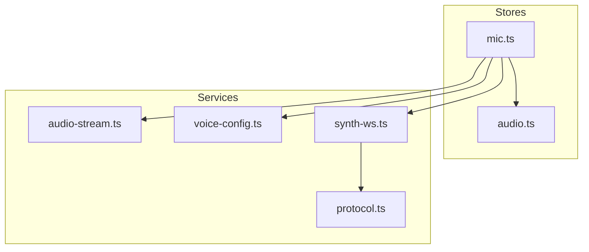
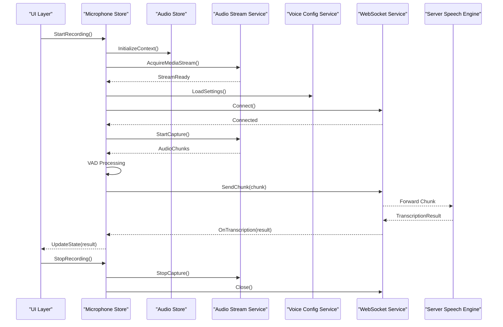
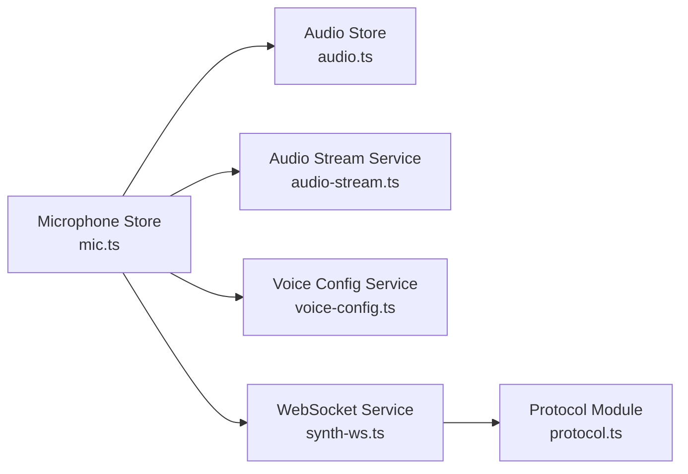

# Microphone Store

<cite>
**Referenced Files in This Document**
- [mic.ts](file://frontend/src/stores/mic.ts)
- [audio.ts](file://frontend/src/stores/audio.ts)
- [audio-stream.ts](file://frontend/src/services/audio-stream.ts)
- [voice-config.ts](file://frontend/src/services/voice-config.ts)
- [synth-ws.ts](file://frontend/src/services/synth-ws.ts)
- [protocol.ts](file://frontend/src/services/protocol.ts)
</cite>

## Table of Contents
1. Introduction
2. Project Structure
3. Core Components
4. Architecture Overview
5. Detailed Component Analysis
6. Dependency Analysis
7. Performance Considerations
8. Troubleshooting Guide
9. Conclusion

## Introduction
This document explains the Microphone Store and its role in handling voice input and speech recognition within the application. It covers reactive state for microphone permissions, recording status, audio levels, and speech-to-text results. It also documents how the store coordinates Web Audio API interactions, manages audio capture, processes voice activity detection (VAD), integrates with speech recognition services, and handles errors and privacy considerations. Practical examples are provided for starting/stopping recording, managing permissions, processing audio chunks, and configuring audio quality and background noise handling.

## Project Structure
The microphone functionality is implemented primarily in the frontend stores and services:
- Stores manage reactive state and orchestrate high-level flows.
- Services encapsulate browser APIs, streaming, and protocol communication.

**Diagram sources**
- [mic.ts](file://frontend/src/stores/mic.ts)
- [audio.ts](file://frontend/src/stores/audio.ts)
- [audio-stream.ts](file://frontend/src/services/audio-stream.ts)
- [voice-config.ts](file://frontend/src/services/voice-config.ts)
- [synth-ws.ts](file://frontend/src/services/synth-ws.ts)
- [protocol.ts](file://frontend/src/services/protocol.ts)

**Section sources**
- [mic.ts](file://frontend/src/stores/mic.ts)
- [audio.ts](file://frontend/src/stores/audio.ts)
- [audio-stream.ts](file://frontend/src/services/audio-stream.ts)
- [voice-config.ts](file://frontend/src/services/voice-config.ts)
- [synth-ws.ts](file://frontend/src/services/synth-ws.ts)
- [protocol.ts](file://frontend/src/services/protocol.ts)

## Core Components
- Microphone Store: Centralizes permission checks, recording lifecycle, VAD-driven chunking, and transcription events. Exposes reactive state for UI binding.
- Audio Store: Manages Web Audio context, analyzers, and real-time audio level monitoring.
- Audio Stream Service: Wraps MediaStream and MediaRecorder or raw PCM routing to the backend.
- Voice Config Service: Holds user preferences for sample rate, channels, bitrate, VAD thresholds, and language settings.
- WebSocket Service: Handles transport to the server for live transcription or batch upload.
- Protocol Module: Defines message schemas for start/stop recording, audio chunks, and transcription results.

Key responsibilities:
- Permission management via browser prompts and error handling.
- Recording lifecycle control with safe cleanup on navigation or tab close.
- Real-time audio level visualization and VAD-based segmentation.
- Integration with speech recognition endpoints through a consistent protocol.

**Section sources**
- [mic.ts](file://frontend/src/stores/mic.ts)
- [audio.ts](file://frontend/src/stores/audio.ts)
- [audio-stream.ts](file://frontend/src/services/audio-stream.ts)
- [voice-config.ts](file://frontend/src/services/voice-config.ts)
- [synth-ws.ts](file://frontend/src/services/synth-ws.ts)
- [protocol.ts](file://frontend/src/services/protocol.ts)

## Architecture Overview
The Microphone Store orchestrates the full voice pipeline from capture to transcription:

**Diagram sources**
- [mic.ts](file://frontend/src/stores/mic.ts)
- [audio.ts](file://frontend/src/stores/audio.ts)
- [audio-stream.ts](file://frontend/src/services/audio-stream.ts)
- [voice-config.ts](file://frontend/src/services/voice-config.ts)
- [synth-ws.ts](file://frontend/src/services/synth-ws.ts)
- [protocol.ts](file://frontend/src/services/protocol.ts)

## Detailed Component Analysis

### Microphone Store
Responsibilities:
- Reactive state: permissions, recording status, audio levels, VAD state, transcription results, and errors.
- Lifecycle: request permission, create media stream, start/stop recording, handle interruptions, and ensure cleanup.
- VAD integration: threshold configuration, silence detection, and chunk boundaries.
- Transcription integration: send chunks, receive partial/final results, and update UI state.

Typical flow:
- StartRecording: check permissions, initialize audio context, acquire stream, connect WebSocket, start capture.
- ProcessAudio: analyze levels, apply VAD, emit chunks when voice activity detected.
- HandleTranscription: update final/partial text, handle errors, and reset state if needed.
- StopRecording: stop capture, close WebSocket, release resources.

Examples:
- Starting recording: call the store’s start method; it will prompt for permission and initialize components.
- Stopping recording: call the stop method; it ensures all streams and connections are closed safely.
- Handling errors: catch permission denied, network failures, and unsupported features; expose messages to UI.

**Section sources**
- [mic.ts](file://frontend/src/stores/mic.ts)

### Audio Store
Responsibilities:
- Manage Web Audio Context and AnalyserNode for real-time amplitude analysis.
- Provide normalized audio levels for VAD and UI meters.
- Ensure single context per session and proper cleanup.

Key behaviors:
- Create context once per recording session.
- Attach analyser to source stream.
- Compute RMS or peak levels at intervals.
- Emit level updates to subscribers.

**Section sources**
- [audio.ts](file://frontend/src/stores/audio.ts)

### Audio Stream Service
Responsibilities:
- Wrap MediaStream acquisition and MediaRecorder usage or raw PCM routing.
- Configure sample rate, channels, and MIME type based on capabilities.
- Emit audio chunks to the Microphone Store for VAD and transmission.

Key behaviors:
- Request getUserMedia with constraints derived from Voice Config.
- Handle stream errors and fallback strategies.
- Buffer and chunk audio data efficiently.

**Section sources**
- [audio-stream.ts](file://frontend/src/services/audio-stream.ts)

### Voice Config Service
Responsibilities:
- Persist and provide audio settings: sample rate, channels, bitrate, codec, VAD thresholds, language.
- Validate constraints against browser capabilities.
- Offer presets for common scenarios (e.g., low latency, high fidelity).

Key behaviors:
- Merge defaults with user preferences.
- Normalize values for compatibility.
- Notify changes to dependent components.

**Section sources**
- [voice-config.ts](file://frontend/src/services/voice-config.ts)

### WebSocket Service
Responsibilities:
- Maintain connection to the server’s speech endpoint.
- Send audio chunks and receive transcription results using the protocol schema.
- Handle reconnection logic and backoff.

Key behaviors:
- Open/close sessions aligned with recording lifecycle.
- Serialize/deserialize messages according to protocol definitions.
- Emit events for connection state and errors.

**Section sources**
- [synth-ws.ts](file://frontend/src/services/synth-ws.ts)
- [protocol.ts](file://frontend/src/services/protocol.ts)

### Protocol Module
Responsibilities:
- Define message types for start/stop recording, audio payloads, and transcription responses.
- Ensure consistent serialization across client and server.

Key behaviors:
- Enforce required fields and types.
- Provide helpers for building and parsing messages.

**Section sources**
- [protocol.ts](file://frontend/src/services/protocol.ts)

## Dependency Analysis
The Microphone Store depends on multiple modules to deliver end-to-end voice functionality:

**Diagram sources**
- [mic.ts](file://frontend/src/stores/mic.ts)
- [audio.ts](file://frontend/src/stores/audio.ts)
- [audio-stream.ts](file://frontend/src/services/audio-stream.ts)
- [voice-config.ts](file://frontend/src/services/voice-config.ts)
- [synth-ws.ts](file://frontend/src/services/synth-ws.ts)
- [protocol.ts](file://frontend/src/services/protocol.ts)

**Section sources**
- [mic.ts](file://frontend/src/stores/mic.ts)
- [audio.ts](file://frontend/src/stores/audio.ts)
- [audio-stream.ts](file://frontend/src/services/audio-stream.ts)
- [voice-config.ts](file://frontend/src/services/voice-config.ts)
- [synth-ws.ts](file://frontend/src/services/synth-ws.ts)
- [protocol.ts](file://frontend/src/services/protocol.ts)

## Performance Considerations
- Use appropriate sample rates and bitrates to balance quality and bandwidth.
- Minimize chunk size to reduce latency while avoiding excessive overhead.
- Apply VAD thresholds tuned to environment noise to prevent unnecessary transmissions.
- Reuse Web Audio contexts and avoid frequent reinitialization.
- Implement efficient buffering and avoid blocking the main thread during audio processing.
- Prefer binary payloads for audio chunks where supported by the server.

[No sources needed since this section provides general guidance]

## Troubleshooting Guide
Common issues and resolutions:
- Permission denied: Prompt users to allow microphone access; verify site permissions and HTTPS requirements.
- No audio captured: Check MediaStream constraints and browser support; validate that getUserMedia succeeds.
- High latency: Reduce chunk size, optimize VAD thresholds, and ensure WebSocket connectivity.
- Background noise: Adjust VAD sensitivity and consider noise suppression options if available.
- Transcription errors: Inspect server logs, validate payload format, and confirm language settings.
- Memory leaks: Ensure all streams, recorders, and WebSocket connections are closed on stop or navigation.

Error handling patterns:
- Catch and surface meaningful messages to the UI.
- Retry transient network failures with exponential backoff.
- Gracefully degrade when features are unsupported.

**Section sources**
- [mic.ts](file://frontend/src/stores/mic.ts)
- [audio-stream.ts](file://frontend/src/services/audio-stream.ts)
- [synth-ws.ts](file://frontend/src/services/synth-ws.ts)
- [protocol.ts](file://frontend/src/services/protocol.ts)

## Conclusion
The Microphone Store provides a robust, reactive foundation for voice input and speech recognition. By coordinating Web Audio API usage, audio capture, VAD processing, and transcription integration, it delivers a seamless user experience. Proper configuration, error handling, and performance tuning ensure reliable operation across diverse environments and devices.

[No sources needed since this section summarizes without analyzing specific files]