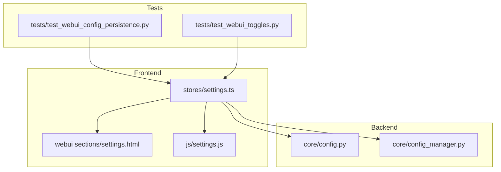
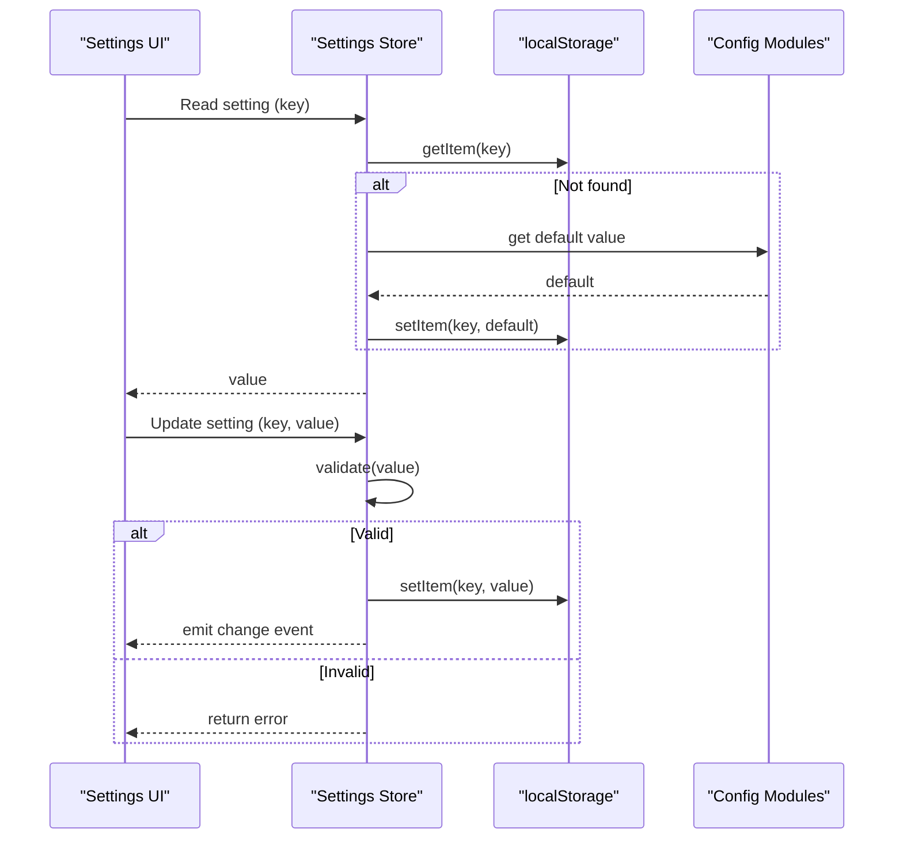
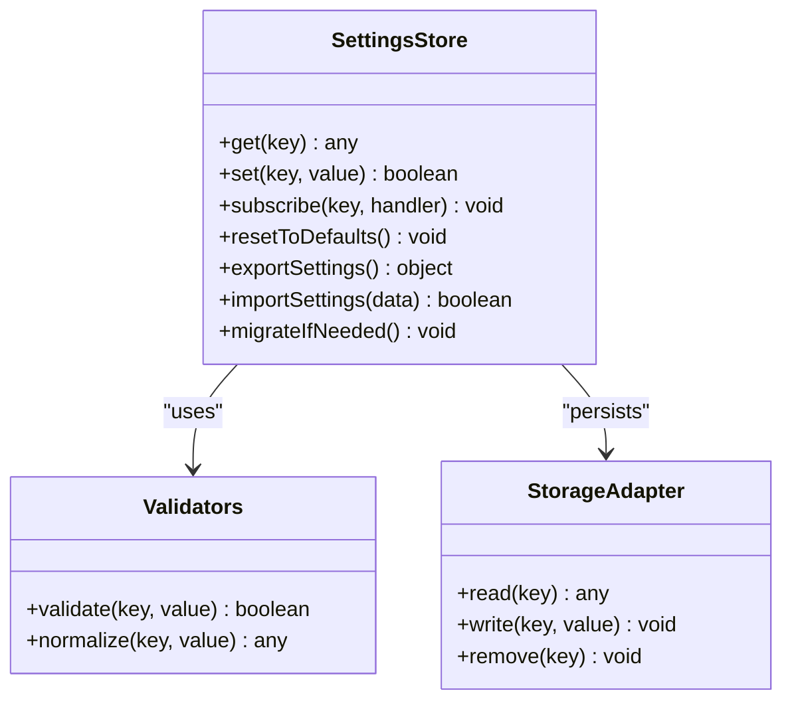
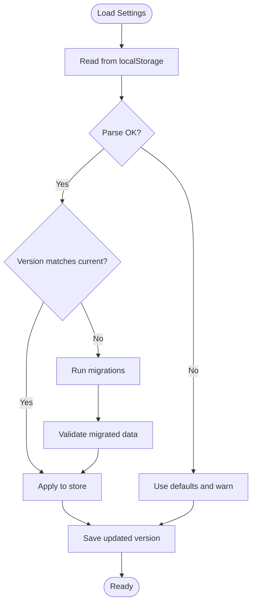
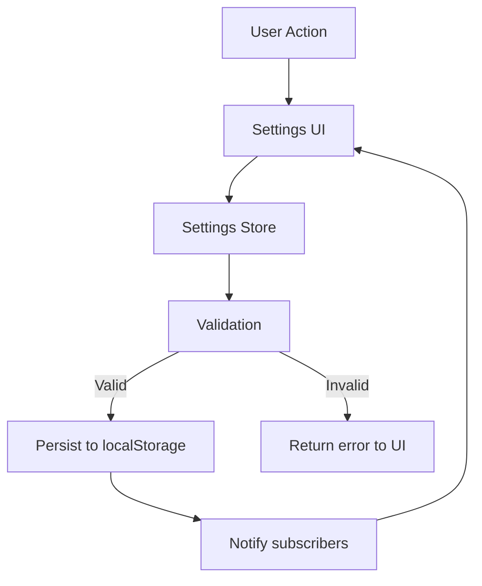
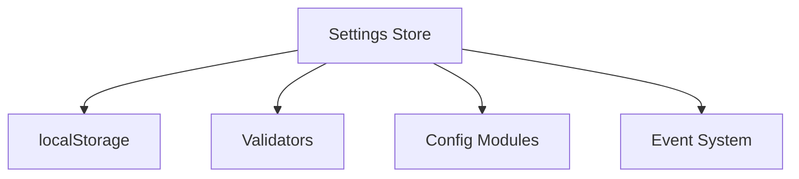

# Settings Store

<cite>
**Referenced Files in This Document**
- [settings.ts](file://frontend/src/stores/settings.ts)
- [settings.html](file://core/webui_templates/sections/settings.html)
- [settings.js](file://res/synth_webui/js/settings.js)
- [config.py](file://core/config.py)
- [config_manager.py](file://core/config_manager.py)
- [test_webui_config_persistence.py](file://tests/test_webui_config_persistence.py)
- [test_webui_toggles.py](file://tests/test_webui_toggles.py)
</cite>

## Table of Contents
1. [Introduction](#introduction)
2. [Project Structure](#project-structure)
3. [Core Components](#core-components)
4. [Architecture Overview](#architecture-overview)
5. [Detailed Component Analysis](#detailed-component-analysis)
6. [Dependency Analysis](#dependency-analysis)
7. [Performance Considerations](#performance-considerations)
8. [Troubleshooting Guide](#troubleshooting-guide)
9. [Conclusion](#conclusion)
10. [Appendices](#appendices)

## Introduction
This document explains the Settings Store that manages user preferences and application configuration for the Web UI. It covers reactive state for UI settings, theme preferences, language options, and feature toggles; persistent storage via localStorage; validation rules; default settings; reading/writing patterns; handling configuration changes; migration across versions; backup/restore; and synchronization across browser sessions.

## Project Structure
The Settings Store is implemented primarily in the frontend store module and supported by the Web UI templates and JavaScript helpers. Backend configuration modules provide defaults and server-side validation where applicable. Tests validate persistence, toggles, and behavior.

**Diagram sources**
- [settings.ts](file://frontend/src/stores/settings.ts)
- [settings.html](file://core/webui_templates/sections/settings.html)
- [settings.js](file://res/synth_webui/js/settings.js)
- [config.py](file://core/config.py)
- [config_manager.py](file://core/config_manager.py)
- [test_webui_config_persistence.py](file://tests/test_webui_config_persistence.py)
- [test_webui_toggles.py](file://tests/test_webui_toggles.py)

**Section sources**
- [settings.ts](file://frontend/src/stores/settings.ts)
- [settings.html](file://core/webui_templates/sections/settings.html)
- [settings.js](file://res/synth_webui/js/settings.js)
- [config.py](file://core/config.py)
- [config_manager.py](file://core/config_manager.py)
- [test_webui_config_persistence.py](file://tests/test_webui_config_persistence.py)
- [test_webui_toggles.py](file://tests/test_webui_toggles.py)

## Core Components
- Reactive Settings Store: Centralized state for UI settings, theme, language, and feature toggles with reactivity to drive UI updates.
- Persistence Layer: Reads from and writes to localStorage with versioning and safe fallbacks.
- Validation Engine: Validates inputs against defined schemas and constraints before applying changes.
- Migration System: Applies incremental migrations when stored settings schema version changes.
- Backup/Restore: Exports and imports settings as JSON payloads for portability and recovery.
- Sync Across Sessions: Ensures consistent state across tabs/windows using storage events.

Key responsibilities:
- Provide getters/setters for all settings categories.
- Emit change events for subscribers (UI components).
- Persist changes atomically and safely.
- Validate new values and reject invalid ones.
- Migrate legacy keys or structures to current schema.
- Support import/export for backup/restore workflows.

**Section sources**
- [settings.ts](file://frontend/src/stores/settings.ts)
- [settings.js](file://res/synth_webui/js/settings.js)
- [config.py](file://core/config.py)
- [config_manager.py](file://core/config_manager.py)

## Architecture Overview
The Settings Store integrates with the Web UI through a reactive interface and persists data to localStorage. Backend configuration modules supply defaults and additional validation rules.

**Diagram sources**
- [settings.ts](file://frontend/src/stores/settings.ts)
- [settings.js](file://res/synth_webui/js/settings.js)
- [config.py](file://core/config.py)
- [config_manager.py](file://core/config_manager.py)

## Detailed Component Analysis

### Reactive State Model
The store defines typed settings categories:
- UI settings: layout, visibility flags, window positions, panel states.
- Theme preferences: color scheme, accent colors, font sizes.
- Language options: locale codes, translation bundles selection.
- Feature toggles: experimental features, beta flags, performance switches.

Reactivity ensures that any change triggers UI updates without manual refreshes. Subscribers can listen to specific keys or wildcard change events.

**Diagram sources**
- [settings.ts](file://frontend/src/stores/settings.ts)
- [settings.js](file://res/synth_webui/js/settings.js)

**Section sources**
- [settings.ts](file://frontend/src/stores/settings.ts)
- [settings.js](file://res/synth_webui/js/settings.js)

### Persistent Storage and Versioning
- Storage key: A single JSON object stores all settings under a dedicated key.
- Version field: A version number tracks schema evolution.
- Atomic writes: Writes are wrapped to avoid partial updates.
- Safe fallbacks: On parse errors, the store falls back to defaults and logs warnings.

Migration flow:

**Diagram sources**
- [settings.ts](file://frontend/src/stores/settings.ts)
- [settings.js](file://res/synth_webui/js/settings.js)

**Section sources**
- [settings.ts](file://frontend/src/stores/settings.ts)
- [settings.js](file://res/synth_webui/js/settings.js)

### Validation Rules
Validation enforces:
- Type checks (string, number, boolean, enum).
- Range constraints (min/max, length limits).
- Allowed values (enums, whitelists).
- Cross-field dependencies (e.g., enabling a feature requires another setting).

When validation fails, the store returns an error and does not persist the change. UI components should display appropriate feedback.

**Section sources**
- [settings.ts](file://frontend/src/stores/settings.ts)
- [settings.js](file://res/synth_webui/js/settings.js)

### Default Settings
Defaults are provided by backend configuration modules and mirrored in the frontend store initialization. Defaults ensure consistent behavior on first run and after clearing storage.

Examples of default categories:
- UI: default layout mode, initial panel visibility.
- Theme: default color scheme and base font size.
- Language: default locale based on browser detection.
- Toggles: conservative defaults for experimental features.

**Section sources**
- [config.py](file://core/config.py)
- [config_manager.py](file://core/config_manager.py)
- [settings.ts](file://frontend/src/stores/settings.ts)

### Reading/Writing Settings
Reading:
- Use getter methods to retrieve values with automatic fallback to defaults if missing.
- Subscribe to changes for reactive updates.

Writing:
- Use setter methods to update values.
- Setters perform validation and persist changes.
- Errors are returned to callers for handling.

Best practices:
- Batch updates when possible to reduce storage writes.
- Always handle validation errors gracefully in the UI.

**Section sources**
- [settings.ts](file://frontend/src/stores/settings.ts)
- [settings.js](file://res/synth_webui/js/settings.js)

### Handling Configuration Changes
Change events:
- Fine-grained: subscribe to specific keys.
- Broad: subscribe to all changes.
- Debounced updates: prevent excessive UI re-renders during rapid changes.

Cross-tab sync:
- Listen to storage events to synchronize settings across tabs/windows.
- Merge strategies: last-write-wins or conflict resolution policies.

**Section sources**
- [settings.ts](file://frontend/src/stores/settings.ts)
- [settings.js](file://res/synth_webui/js/settings.js)

### Backup/Restore Functionality
Export:
- Serialize current settings to JSON.
- Include metadata like version and timestamp.

Import:
- Validate incoming JSON structure.
- Apply migrations if needed.
- Replace current settings or merge selectively.

Use cases:
- User-initiated export/import.
- Automated backups before major upgrades.
- Sharing configurations between environments.

**Section sources**
- [settings.ts](file://frontend/src/stores/settings.ts)
- [settings.js](file://res/synth_webui/js/settings.js)

### Synchronization Across Browser Sessions
- Storage events propagate changes to other tabs/windows.
- Conflict resolution: prefer newer timestamps or explicit merge rules.
- Offline resilience: local changes persist until sync occurs.

**Section sources**
- [settings.ts](file://frontend/src/stores/settings.ts)
- [settings.js](file://res/synth_webui/js/settings.js)

### Conceptual Overview
The Settings Store acts as the single source of truth for user preferences. It bridges UI interactions with persistent storage while ensuring data integrity through validation and migration.

[No sources needed since this diagram shows conceptual workflow, not actual code structure]

## Dependency Analysis
The Settings Store depends on:
- LocalStorage API for persistence.
- Validation utilities for input checking.
- Backend configuration modules for defaults and additional rules.
- Event system for reactivity and cross-tab sync.

**Diagram sources**
- [settings.ts](file://frontend/src/stores/settings.ts)
- [settings.js](file://res/synth_webui/js/settings.js)
- [config.py](file://core/config.py)
- [config_manager.py](file://core/config_manager.py)

**Section sources**
- [settings.ts](file://frontend/src/stores/settings.ts)
- [settings.js](file://res/synth_webui/js/settings.js)
- [config.py](file://core/config.py)
- [config_manager.py](file://core/config_manager.py)

## Performance Considerations
- Debounce frequent writes to minimize localStorage operations.
- Batch multiple setting updates into a single transaction.
- Avoid heavy computations in change handlers; offload to background tasks if necessary.
- Cache frequently accessed settings in memory to reduce reads.

[No sources needed since this section provides general guidance]

## Troubleshooting Guide
Common issues:
- Corrupted localStorage: The store falls back to defaults and warns; use backup/restore to recover.
- Validation failures: Check input types and allowed values; inspect error messages from setters.
- Sync conflicts: Review merge strategies and timestamps; consider explicit user prompts for conflicts.
- Migration errors: Ensure migration functions are idempotent and handle edge cases.

Debugging steps:
- Inspect localStorage contents for the settings key.
- Verify version field matches expected schema.
- Test import/export round-trips with sample data.
- Monitor change events to trace propagation.

**Section sources**
- [settings.ts](file://frontend/src/stores/settings.ts)
- [settings.js](file://res/synth_webui/js/settings.js)

## Conclusion
The Settings Store provides a robust, reactive, and persistent foundation for managing user preferences and application configuration. With comprehensive validation, migration, backup/restore, and cross-session synchronization, it ensures a reliable user experience across diverse environments and usage patterns.

[No sources needed since this section summarizes without analyzing specific files]

## Appendices

### Example Usage Patterns
- Reading a setting:
  - Call getter with the desired key; handle undefined by relying on defaults.
- Writing a setting:
  - Call setter with validated value; handle errors and update UI accordingly.
- Subscribing to changes:
  - Register handlers for specific keys or all changes; debounce if needed.
- Migrating settings:
  - Trigger migration on load; verify version and apply incremental updates.
- Backup/restore:
  - Export settings to JSON; import validated JSON to restore state.

[No sources needed since this section provides general guidance]