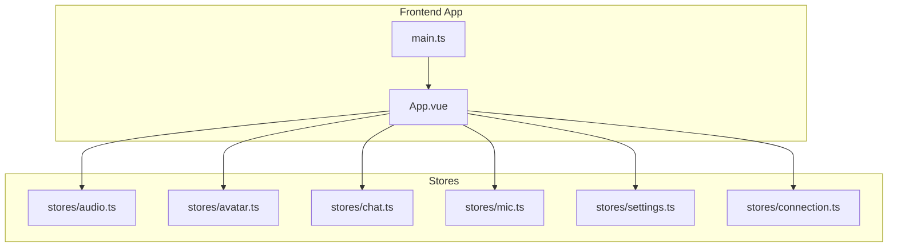
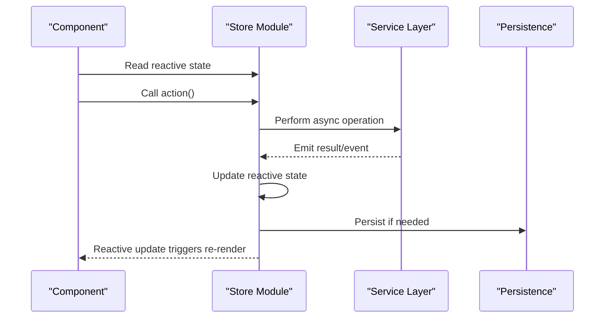
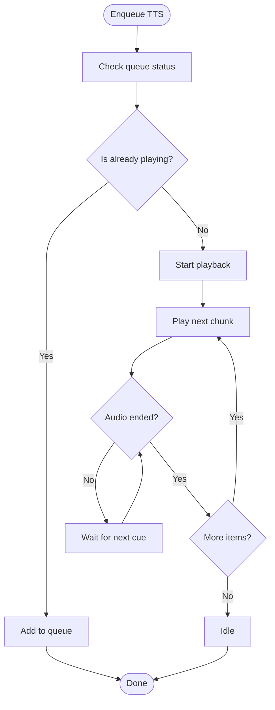
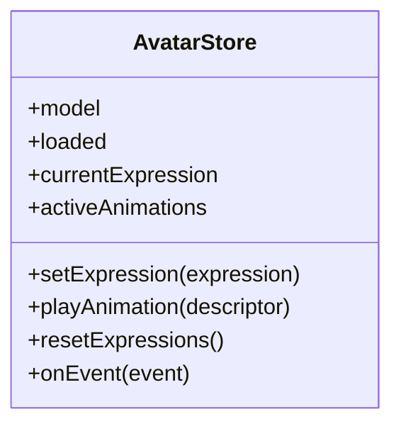
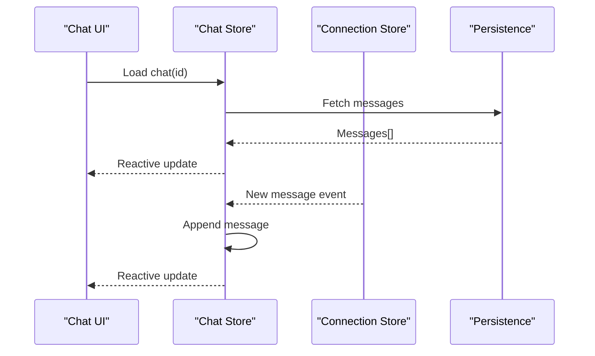
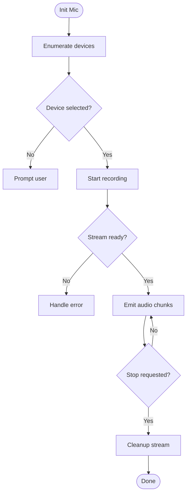
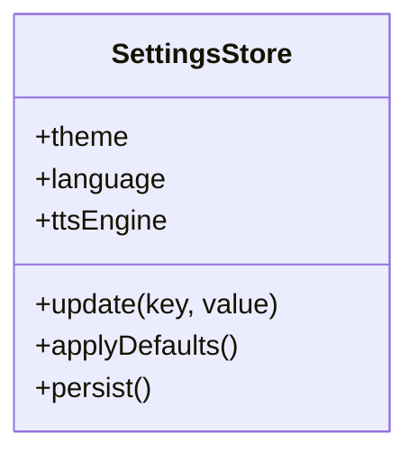
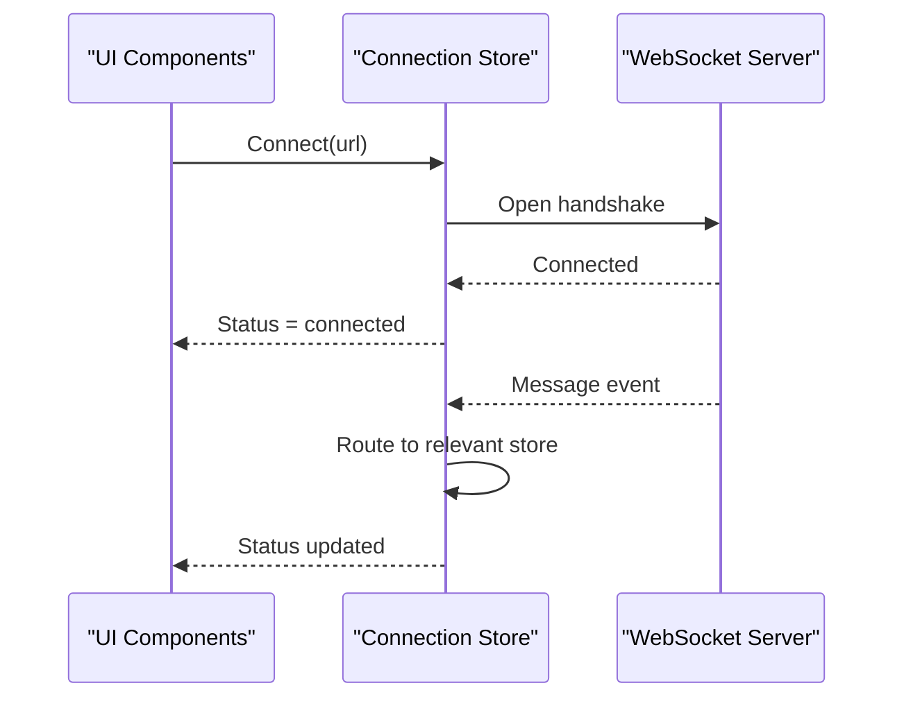
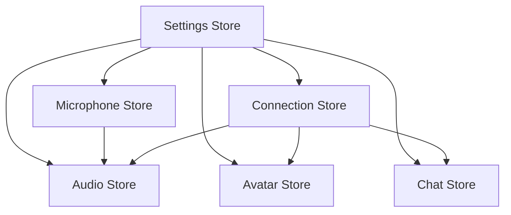

# State Management

<cite>
**Referenced Files in This Document**
- [audio.ts](file://frontend/src/stores/audio.ts)
- [avatar.ts](file://frontend/src/stores/avatar.ts)
- [chat.ts](file://frontend/src/stores/chat.ts)
- [mic.ts](file://frontend/src/stores/mic.ts)
- [settings.ts](file://frontend/src/stores/settings.ts)
- [connection.ts](file://frontend/src/stores/connection.ts)
- [App.vue](file://frontend/src/App.vue)
- [main.ts](file://frontend/src/main.ts)
</cite>

## Table of Contents
1. [Introduction](#introduction)
2. [Project Structure](#project-structure)
3. [Core Components](#core-components)
4. [Architecture Overview](#architecture-overview)
5. [Detailed Component Analysis](#detailed-component-analysis)
6. [Dependency Analysis](#dependency-analysis)
7. [Performance Considerations](#performance-considerations)
8. [Troubleshooting Guide](#troubleshooting-guide)
9. [Conclusion](#conclusion)

## Introduction
This document explains Synthetic Heart’s Vue.js state management system built with the Vue 3 Composition API and reactive patterns. It focuses on the store architecture and how each domain-specific store manages its state, side effects, and persistence:
- Audio store for text-to-speech (TTS) playback and voice processing
- Avatar store for VRM animation control
- Chat store for conversation history and message flow
- Microphone store for voice input capture and streaming
- Settings store for user preferences and configuration
- Connection store for WebSocket lifecycle and event routing

The guide includes examples of accessing and modifying state, handling asynchronous operations, maintaining data consistency, and applying caching and performance optimization techniques.

## Project Structure
The frontend application organizes state into dedicated stores under a single directory. Each store encapsulates a specific domain and exposes reactive state and actions. The application bootstraps these stores in the main entry points and composes them within components.

**Diagram sources**
- [App.vue](file://frontend/src/App.vue)
- [main.ts](file://frontend/src/main.ts)
- [audio.ts](file://frontend/src/stores/audio.ts)
- [avatar.ts](file://frontend/src/stores/avatar.ts)
- [chat.ts](file://frontend/src/stores/chat.ts)
- [mic.ts](file://frontend/src/stores/mic.ts)
- [settings.ts](file://frontend/src/stores/settings.ts)
- [connection.ts](file://frontend/src/stores/connection.ts)

**Section sources**
- [App.vue](file://frontend/src/App.vue)
- [main.ts](file://frontend/src/main.ts)
- [audio.ts](file://frontend/src/stores/audio.ts)
- [avatar.ts](file://frontend/src/stores/avatar.ts)
- [chat.ts](file://frontend/src/stores/chat.ts)
- [mic.ts](file://frontend/src/stores/mic.ts)
- [settings.ts](file://frontend/src/stores/settings.ts)
- [connection.ts](file://frontend/src/stores/connection.ts)

## Core Components
Each store is implemented as a module that exports reactive state and actions using the Vue 3 Composition API. Stores are designed to be:
- Single source of truth for their domain
- Reactive to UI updates via refs or computed values
- Encapsulated with actions that mutate state safely
- Asynchronous-aware for network and media operations
- Optional persistence layer for settings and chat history

Key responsibilities:
- Audio store: TTS queueing, playback control, audio stream management, and volume/mute state
- Avatar store: VRM model loading, expression/animation state, and synchronization with events
- Chat store: message list, current chat context, and conversation metadata
- Microphone store: device enumeration, recording lifecycle, and audio chunk emission
- Settings store: user preferences, theme, engine selection, and persistence to storage
- Connection store: WebSocket connection, reconnection logic, and event dispatching

**Section sources**
- [audio.ts](file://frontend/src/stores/audio.ts)
- [avatar.ts](file://frontend/src/stores/avatar.ts)
- [chat.ts](file://frontend/src/stores/chat.ts)
- [mic.ts](file://frontend/src/stores/mic.ts)
- [settings.ts](file://frontend/src/stores/settings.ts)
- [connection.ts](file://frontend/src/stores/connection.ts)

## Architecture Overview
The state management architecture follows a unidirectional data flow pattern:
- Components read from stores via reactive state
- Components call store actions to mutate state
- Actions may trigger asynchronous operations (network, media)
- Events from services update store state
- Persistence layers keep critical data consistent across sessions

[No sources needed since this diagram shows conceptual workflow, not actual code structure]

## Detailed Component Analysis

### Audio Store
Responsibilities:
- Manage TTS playback queue and current audio instance
- Control play/pause/stop and volume/mute
- Handle audio stream events and errors
- Integrate with microphone and connection stores for live voice workflows

State and behavior:
- Reactive flags for playing, paused, muted, and queue length
- Methods to enqueue TTS chunks, start playback, and manage buffer
- Event listeners for audio element lifecycle and error handling
- Integration points for real-time voice pipelines

Usage example:
- Access current playback state in templates via reactive bindings
- Enqueue new speech by calling an action with text payload
- Pause/resume playback through dedicated methods

Asynchronous handling:
- Queue-based scheduling ensures sequential playback
- Error boundaries catch network or codec failures
- Debounced updates prevent excessive re-renders during streaming

Persistence and caching:
- Cache recent TTS responses locally when appropriate
- Avoid redundant requests for identical payloads

**Section sources**
- [audio.ts](file://frontend/src/stores/audio.ts)

### Avatar Store
Responsibilities:
- Load and manage VRM model instances
- Control expressions, animations, and eye behaviors
- Sync avatar state with incoming events from connection store
- Maintain animation priority and transitions

State and behavior:
- Model reference and loaded flag
- Current expression and active animation tracks
- Priority map to resolve conflicting animations
- Methods to set expressions, trigger animations, and reset states

Usage example:
- Bind avatar expressions to reactive state in templates
- Trigger animations via actions with descriptor payloads
- Reset expressions after animation completion

Asynchronous handling:
- Async model loading with progress tracking
- Animation queues to avoid overlapping conflicts
- Error handling for missing assets or unsupported formats

**Diagram sources**
- [avatar.ts](file://frontend/src/stores/avatar.ts)

**Section sources**
- [avatar.ts](file://frontend/src/stores/avatar.ts)

### Chat Store
Responsibilities:
- Maintain conversation messages and metadata
- Manage current chat session and navigation
- Append incoming messages and handle edits/deletes
- Persist chat history across sessions

State and behavior:
- Message list with roles, timestamps, and content
- Current chat ID and active session context
- Methods to append messages, clear history, and switch chats

Usage example:
- Render message list bound to reactive array
- Append new messages via action with role and content
- Switch between chats by updating current chat ID

Asynchronous handling:
- Fetch historical messages on chat load
- Stream incremental updates for live conversations
- Retry mechanisms for failed network requests

Persistence and caching:
- Local storage or IndexedDB for offline access
- Lazy loading of older messages to reduce memory usage

**Diagram sources**
- [chat.ts](file://frontend/src/stores/chat.ts)
- [connection.ts](file://frontend/src/stores/connection.ts)

**Section sources**
- [chat.ts](file://frontend/src/stores/chat.ts)
- [connection.ts](file://frontend/src/stores/connection.ts)

### Microphone Store
Responsibilities:
- Enumerate audio input devices
- Start/stop recording and manage MediaStream
- Emit audio chunks for VAD or streaming TTS
- Handle permissions and errors gracefully

State and behavior:
- Device list and selected device ID
- Recording state and stream reference
- Methods to request permission, start recording, and stop
- Event emitter for audio chunk data

Usage example:
- Display device list and allow user selection
- Start recording on button press and show waveform
- Stop recording and process chunks for transcription

Asynchronous handling:
- Promise-based device enumeration
- Stream lifecycle management with cleanup
- Error handling for denied permissions or unavailable devices

**Section sources**
- [mic.ts](file://frontend/src/stores/mic.ts)

### Settings Store
Responsibilities:
- Manage user preferences such as theme, language, and engine selections
- Persist settings to local storage or backend
- Provide defaults and validation for configuration values

State and behavior:
- Reactive settings object with typed fields
- Methods to update individual settings and bulk apply
- Watchers to persist changes automatically

Usage example:
- Bind UI controls to reactive settings
- Update settings via actions with validation
- Apply theme changes reactively across components

Persistence and caching:
- Debounced writes to avoid frequent disk I/O
- Fallback to defaults on corrupted or missing data

**Diagram sources**
- [settings.ts](file://frontend/src/stores/settings.ts)

**Section sources**
- [settings.ts](file://frontend/src/stores/settings.ts)

### Connection Store
Responsibilities:
- Manage WebSocket connection lifecycle
- Handle reconnection strategies and backoff
- Route incoming events to relevant stores
- Track connection status and last error

State and behavior:
- Connection status and URL
- Reconnection attempts and delay timers
- Methods to connect, disconnect, and send messages
- Event bus to distribute messages to other stores

Usage example:
- Subscribe to connection events in components
- Send commands via actions with payload validation
- Observe status changes to update UI indicators

Asynchronous handling:
- Exponential backoff for reconnection
- Timeout handling for unresponsive servers
- Graceful degradation when offline

**Diagram sources**
- [connection.ts](file://frontend/src/stores/connection.ts)

**Section sources**
- [connection.ts](file://frontend/src/stores/connection.ts)

## Dependency Analysis
Stores interact through well-defined interfaces:
- Audio store depends on connection store for real-time voice events
- Avatar store listens to connection store for animation triggers
- Chat store receives messages from connection store and persists to storage
- Microphone store emits chunks consumed by audio or transcription services
- Settings store provides configuration used by all stores
- Connection store acts as the central event hub

**Diagram sources**
- [audio.ts](file://frontend/src/stores/audio.ts)
- [avatar.ts](file://frontend/src/stores/avatar.ts)
- [chat.ts](file://frontend/src/stores/chat.ts)
- [mic.ts](file://frontend/src/stores/mic.ts)
- [settings.ts](file://frontend/src/stores/settings.ts)
- [connection.ts](file://frontend/src/stores/connection.ts)

**Section sources**
- [audio.ts](file://frontend/src/stores/audio.ts)
- [avatar.ts](file://frontend/src/stores/avatar.ts)
- [chat.ts](file://frontend/src/stores/chat.ts)
- [mic.ts](file://frontend/src/stores/mic.ts)
- [settings.ts](file://frontend/src/stores/settings.ts)
- [connection.ts](file://frontend/src/stores/connection.ts)

## Performance Considerations
- Use computed properties for derived state to avoid unnecessary recalculations
- Debounce frequent updates (e.g., typing, streaming audio) to limit re-renders
- Implement virtual scrolling for large chat histories
- Cache expensive operations like model loading and asset fetching
- Minimize store size by lazy-loading heavy modules
- Use efficient serialization for persistence (e.g., JSON vs binary)
- Monitor memory leaks in long-running streams and animations

[No sources needed since this section provides general guidance]

## Troubleshooting Guide
Common issues and resolutions:
- WebSocket disconnections: Check connection store logs and implement retry logic
- TTS playback failures: Validate audio format and fallback codecs
- VRM model loading errors: Verify asset paths and browser compatibility
- Microphone permission denied: Prompt users to grant access and handle gracefully
- Settings corruption: Restore defaults and migrate schema changes
- Memory leaks: Ensure proper cleanup of event listeners and streams

**Section sources**
- [connection.ts](file://frontend/src/stores/connection.ts)
- [audio.ts](file://frontend/src/stores/audio.ts)
- [avatar.ts](file://frontend/src/stores/avatar.ts)
- [mic.ts](file://frontend/src/stores/mic.ts)
- [settings.ts](file://frontend/src/stores/settings.ts)

## Conclusion
Synthetic Heart’s state management system leverages Vue 3 Composition API to create modular, reactive stores for each domain. The architecture promotes separation of concerns, predictable data flow, and maintainable code. By following best practices for asynchronous operations, persistence, and performance optimization, the system delivers a responsive and reliable user experience across audio, avatar, chat, microphone, and settings domains.

[No sources needed since this section summarizes without analyzing specific files]