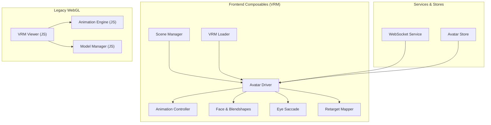
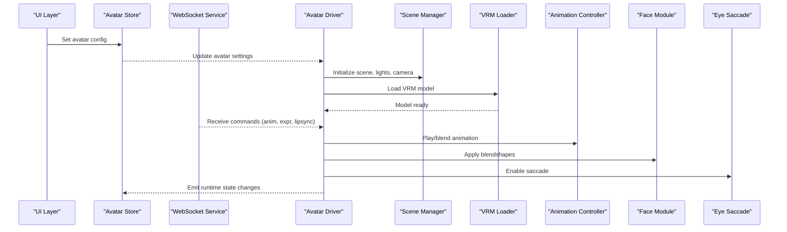
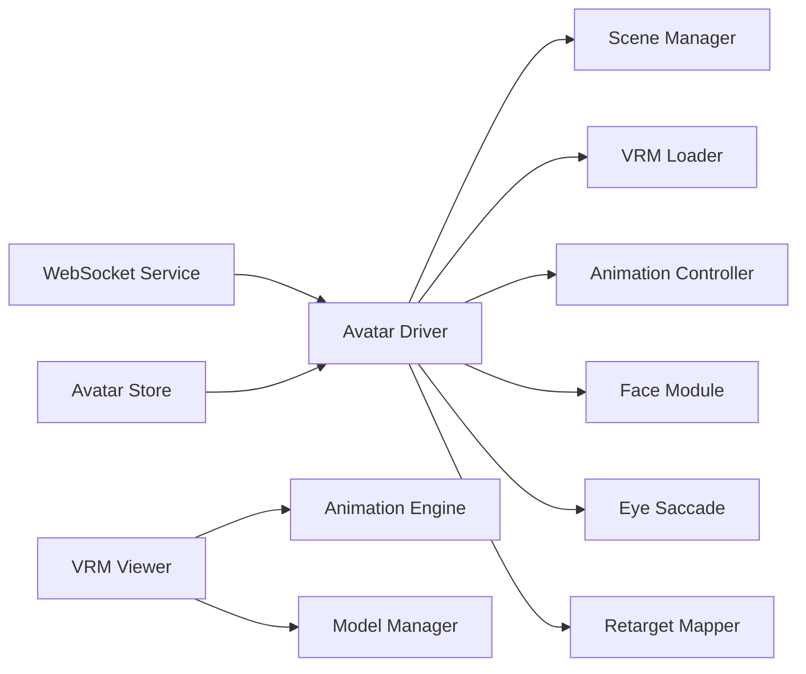

# Avatar Stage Component

<cite>
**Referenced Files in This Document**
- [frontend/src/composables/vrm/avatar-driver.ts](file://frontend/src/composables/vrm/avatar-driver.ts)
- [frontend/src/composables/vrm/scene.ts](file://frontend/src/composables/vrm/scene.ts)
- [frontend/src/composables/vrm/loader.ts](file://frontend/src/composables/vrm/loader.ts)
- [frontend/src/composables/vrm/animation.ts](file://frontend/src/composables/vrm/animation.ts)
- [frontend/src/composables/vrm/face.ts](file://frontend/src/composables/vrm/face.ts)
- [frontend/src/composables/vrm/eye-saccade.ts](file://frontend/src/composables/vrm/eye-saccade.ts)
- [frontend/src/composables/vrm/retarget/index.ts](file://frontend/src/composables/vrm/retarget/index.ts)
- [frontend/src/composables/vrm/retarget/mapper.ts](file://frontend/src/composables/vrm/retarget/mapper.ts)
- [frontend/src/stores/avatar.ts](file://frontend/src/stores/avatar.ts)
- [frontend/src/services/synth-ws.ts](file://frontend/src/services/synth-ws.ts)
- [frontend/src/lib/lipsync/index.ts](file://frontend/src/lib/lipsync/index.ts)
- [res/synth_webui/js/vrm-viewer.mjs](file://res/synth_webui/js/vrm-viewer.mjs)
- [res/synth_webui/js/vrm-animation-engine.mjs](file://res/synth_webui/js/vrm-animation-engine.mjs)
- [res/synth_webui/js/model-manager.mjs](file://res/synth_webui/js/model-manager.mjs)
- [docs/vrm_animations.rst](file://docs/vrm_animations.rst)
- [docs/synth_stage_frontend.rst](file://docs/synth_stage_frontend.rst)
</cite>

## Table of Contents
1. [Introduction](#introduction)
2. [Project Structure](#project-structure)
3. [Core Components](#core-components)
4. [Architecture Overview](#architecture-overview)
5. [Detailed Component Analysis](#detailed-component-analysis)
6. [Dependency Analysis](#dependency-analysis)
7. [Performance Considerations](#performance-considerations)
8. [Troubleshooting Guide](#troubleshooting-guide)
9. [Conclusion](#conclusion)
10. [Appendices](#appendices)

## Introduction
This document explains the Avatar Stage component and its VRM integration for rendering 3D avatars, managing scenes, handling animations, and synchronizing lip movements with audio. It covers the avatar driver that controls VRM models, expressions, gestures, scene management, lighting setup, camera controls, animation playback, real-time interaction via WebSocket, and WebGL rendering considerations. It also includes examples for customization, animation sequences, performance optimization, memory management, and cross-browser compatibility.

## Project Structure
The Avatar Stage is implemented primarily in the frontend composable layer under src/composables/vrm, with supporting services and stores:
- Scene and renderer initialization are handled by a dedicated scene module.
- The loader manages VRM model loading and resource preparation.
- The avatar driver orchestrates model control, expressions, gestures, and lifecycle events.
- Animation and face modules handle animation playback and facial blendshapes.
- Eye saccade provides natural eye movement behavior.
- Retarget utilities map external motion data to VRM skeletons.
- Stores expose reactive state for UI and logic layers.
- WebSocket service integrates with backend to receive real-time commands.
- Legacy JS modules provide WebGL viewer and animation engine integrations.

**Diagram sources**
- [frontend/src/composables/vrm/scene.ts](file://frontend/src/composables/vrm/scene.ts)
- [frontend/src/composables/vrm/loader.ts](file://frontend/src/composables/vrm/loader.ts)
- [frontend/src/composables/vrm/avatar-driver.ts](file://frontend/src/composables/vrm/avatar-driver.ts)
- [frontend/src/composables/vrm/animation.ts](file://frontend/src/composables/vrm/animation.ts)
- [frontend/src/composables/vrm/face.ts](file://frontend/src/composables/vrm/face.ts)
- [frontend/src/composables/vrm/eye-saccade.ts](file://frontend/src/composables/vrm/eye-saccade.ts)
- [frontend/src/composables/vrm/retarget/index.ts](file://frontend/src/composables/vrm/retarget/index.ts)
- [frontend/src/services/synth-ws.ts](file://frontend/src/services/synth-ws.ts)
- [frontend/src/stores/avatar.ts](file://frontend/src/stores/avatar.ts)
- [res/synth_webui/js/vrm-viewer.mjs](file://res/synth_webui/js/vrm-viewer.mjs)
- [res/synth_webui/js/vrm-animation-engine.mjs](file://res/synth_webui/js/vrm-animation-engine.mjs)
- [res/synth_webui/js/model-manager.mjs](file://res/synth_webui/js/model-manager.mjs)

**Section sources**
- [docs/synth_stage_frontend.rst](file://docs/synth_stage_frontend.rst)
- [docs/vrm_animations.rst](file://docs/vrm_animations.rst)

## Core Components
- Scene Manager: Initializes WebGL context, sets up Three.js scene, lighting, and camera; handles resize and render loop.
- VRM Loader: Loads VRM assets, parses materials and skeleton, prepares textures and meshes, and exposes model instance.
- Avatar Driver: Central controller for VRM model lifecycle, expression updates, gesture playback, and event dispatching.
- Animation Controller: Manages animation clips, blending, looping, and priority-based scheduling.
- Face Module: Applies blendshape targets for expressions and mouth shapes; supports phoneme-driven updates.
- Eye Saccade: Adds subtle eye movement patterns to enhance realism.
- Retarget Mapper: Translates external motion data into VRM-compatible bone transformations.
- WebSocket Service: Receives real-time commands (animations, expressions, lipsync cues) from backend.
- Avatar Store: Reactive state container for avatar configuration, current animations, and runtime flags.

**Section sources**
- [frontend/src/composables/vrm/scene.ts](file://frontend/src/composables/vrm/scene.ts)
- [frontend/src/composables/vrm/loader.ts](file://frontend/src/composables/vrm/loader.ts)
- [frontend/src/composables/vrm/avatar-driver.ts](file://frontend/src/composables/vrm/avatar-driver.ts)
- [frontend/src/composables/vrm/animation.ts](file://frontend/src/composables/vrm/animation.ts)
- [frontend/src/composables/vrm/face.ts](file://frontend/src/composables/vrm/face.ts)
- [frontend/src/composables/vrm/eye-saccade.ts](file://frontend/src/composables/vrm/eye-saccade.ts)
- [frontend/src/composables/vrm/retarget/index.ts](file://frontend/src/composables/vrm/retarget/index.ts)
- [frontend/src/services/synth-ws.ts](file://frontend/src/services/synth-ws.ts)
- [frontend/src/stores/avatar.ts](file://frontend/src/stores/avatar.ts)

## Architecture Overview
The Avatar Stage architecture separates concerns across scene management, asset loading, avatar control, animation, facial expressions, and real-time communication. The avatar driver coordinates these subsystems, while stores and WebSocket bridge connect UI and backend signals to runtime actions.

**Diagram sources**
- [frontend/src/composables/vrm/avatar-driver.ts](file://frontend/src/composables/vrm/avatar-driver.ts)
- [frontend/src/composables/vrm/scene.ts](file://frontend/src/composables/vrm/scene.ts)
- [frontend/src/composables/vrm/loader.ts](file://frontend/src/composables/vrm/loader.ts)
- [frontend/src/composables/vrm/animation.ts](file://frontend/src/composables/vrm/animation.ts)
- [frontend/src/composables/vrm/face.ts](file://frontend/src/composables/vrm/face.ts)
- [frontend/src/composables/vrm/eye-saccade.ts](file://frontend/src/composables/vrm/eye-saccade.ts)
- [frontend/src/services/synth-ws.ts](file://frontend/src/services/synth-ws.ts)
- [frontend/src/stores/avatar.ts](file://frontend/src/stores/avatar.ts)

## Detailed Component Analysis

### Scene Manager
Responsibilities:
- Create WebGL context and configure renderer options.
- Set up scene graph, background, fog, and environment.
- Configure lighting (ambient, directional, point) and shadows.
- Manage camera (perspective/orthographic), FOV, near/far planes.
- Handle window resize and maintain aspect ratio.
- Provide render loop hooks for animation frames.

Optimization tips:
- Use shadow maps judiciously; prefer baked lighting where possible.
- Limit draw calls by batching materials and using texture atlases.
- Adjust pixel ratio based on device capabilities.

**Section sources**
- [frontend/src/composables/vrm/scene.ts](file://frontend/src/composables/vrm/scene.ts)

### VRM Loader
Responsibilities:
- Fetch and parse VRM files.
- Extract skeleton hierarchy, materials, textures, and morph targets.
- Prepare mesh instances and attach to scene.
- Validate model structure and report errors.

Memory management:
- Dispose unused textures and geometries after use.
- Cache loaded models to avoid repeated network requests.

**Section sources**
- [frontend/src/composables/vrm/loader.ts](file://frontend/src/composables/vrm/loader.ts)

### Avatar Driver
Responsibilities:
- Orchestrate lifecycle: init, load, update, dispose.
- Apply expressions and blendshapes through the face module.
- Control animation playback via the animation controller.
- Integrate eye saccade for realistic gaze behavior.
- Dispatch events for UI and store synchronization.

Interaction flow:
- Receives commands from WebSocket or UI.
- Validates inputs and applies transformations safely.
- Emits state updates to store for reactive UI.

**Section sources**
- [frontend/src/composables/vrm/avatar-driver.ts](file://frontend/src/composables/vrm/avatar-driver.ts)

### Animation Controller
Responsibilities:
- Load animation clips and manage clip states.
- Support blending between multiple animations.
- Implement priority system to resolve conflicts.
- Handle looping, timing, and easing.

Complexity:
- Time complexity depends on number of active clips and bones updated per frame.
- Space complexity scales with clip storage and interpolation buffers.

**Section sources**
- [frontend/src/composables/vrm/animation.ts](file://frontend/src/composables/vrm/animation.ts)

### Face Module
Responsibilities:
- Map phonemes or expression keys to blendshape targets.
- Smooth transitions between facial states.
- Support custom expression mappings per persona.

Lip-sync integration:
- Accepts audio-derived phoneme streams.
- Updates mouth shapes in sync with TTS output.

**Section sources**
- [frontend/src/composables/vrm/face.ts](file://frontend/src/composables/vrm/face.ts)
- [frontend/src/lib/lipsync/index.ts](file://frontend/src/lib/lipsync/index.ts)

### Eye Saccade
Responsibilities:
- Generate natural micro-movements for eyes.
- Avoid excessive motion to prevent distraction.
- Toggle behavior based on user preferences.

**Section sources**
- [frontend/src/composables/vrm/eye-saccade.ts](file://frontend/src/composables/vrm/eye-saccade.ts)

### Retarget Mapper
Responsibilities:
- Translate external motion data (e.g., from sensors or other rigs) into VRM bone transforms.
- Maintain mapping tables for consistent skeletal alignment.

Use cases:
- Import animations from non-VRM sources.
- Support dynamic retargeting for different avatar skeletons.

**Section sources**
- [frontend/src/composables/vrm/retarget/index.ts](file://frontend/src/composables/vrm/retarget/index.ts)
- [frontend/src/composables/vrm/retarget/mapper.ts](file://frontend/src/composables/vrm/retarget/mapper.ts)

### WebSocket Service
Responsibilities:
- Connect to backend server for real-time commands.
- Parse incoming messages for animations, expressions, and lipsync cues.
- Reconnect on failure and handle backpressure.

Integration points:
- Drives avatar driver updates.
- Syncs with store for UI state consistency.

**Section sources**
- [frontend/src/services/synth-ws.ts](file://frontend/src/services/synth-ws.ts)

### Avatar Store
Responsibilities:
- Hold reactive state for avatar configuration, current animations, and runtime flags.
- Expose methods to update settings and query status.
- Emit events for UI components.

**Section sources**
- [frontend/src/stores/avatar.ts](file://frontend/src/stores/avatar.ts)

### Legacy WebGL Modules
- VRM Viewer: Provides WebGL rendering pipeline and scene composition.
- Animation Engine: Handles animation playback and blending at low level.
- Model Manager: Manages model lifecycle and resource disposal.

These modules integrate with the modern composable layer for backward compatibility and performance-critical paths.

**Section sources**
- [res/synth_webui/js/vrm-viewer.mjs](file://res/synth_webui/js/vrm-viewer.mjs)
- [res/synth_webui/js/vrm-animation-engine.mjs](file://res/synth_webui/js/vrm-animation-engine.mjs)
- [res/synth_webui/js/model-manager.mjs](file://res/synth_webui/js/model-manager.mjs)

## Dependency Analysis
The Avatar Stage has clear separation between high-level orchestration (driver, store, WS) and low-level rendering (scene, loader, legacy modules). Dependencies are mostly unidirectional, reducing coupling risks.

**Diagram sources**
- [frontend/src/services/synth-ws.ts](file://frontend/src/services/synth-ws.ts)
- [frontend/src/stores/avatar.ts](file://frontend/src/stores/avatar.ts)
- [frontend/src/composables/vrm/avatar-driver.ts](file://frontend/src/composables/vrm/avatar-driver.ts)
- [frontend/src/composables/vrm/scene.ts](file://frontend/src/composables/vrm/scene.ts)
- [frontend/src/composables/vrm/loader.ts](file://frontend/src/composables/vrm/loader.ts)
- [frontend/src/composables/vrm/animation.ts](file://frontend/src/composables/vrm/animation.ts)
- [frontend/src/composables/vrm/face.ts](file://frontend/src/composables/vrm/face.ts)
- [frontend/src/composables/vrm/eye-saccade.ts](file://frontend/src/composables/vrm/eye-saccade.ts)
- [frontend/src/composables/vrm/retarget/index.ts](file://frontend/src/composables/vrm/retarget/index.ts)
- [res/synth_webui/js/vrm-viewer.mjs](file://res/synth_webui/js/vrm-viewer.mjs)
- [res/synth_webui/js/vrm-animation-engine.mjs](file://res/synth_webui/js/vrm-animation-engine.mjs)
- [res/synth_webui/js/model-manager.mjs](file://res/synth_webui/js/model-manager.mjs)

**Section sources**
- [docs/vrm_animations.rst](file://docs/vrm_animations.rst)

## Performance Considerations
- WebGL Rendering:
  - Prefer instanced rendering for repeated geometry.
  - Use efficient shaders and minimize overdraw.
  - Enable GPU profiling tools to identify bottlenecks.
- Memory Management:
  - Dispose textures, geometries, and animations when no longer needed.
  - Implement object pooling for frequently created/destroyed objects.
  - Monitor memory usage in long sessions to prevent leaks.
- Cross-Browser Compatibility:
  - Test on Chrome, Firefox, Safari, and Edge.
  - Fallback gracefully if WebXR or advanced features are unavailable.
  - Normalize input events and pointer behaviors across browsers.
- Animation Optimization:
  - Limit concurrent animations to reduce CPU/GPU load.
  - Use compression for large animation clips.
  - Pre-bake certain effects where possible.

[No sources needed since this section provides general guidance]

## Troubleshooting Guide
Common issues and resolutions:
- VRM Loading Failures:
  - Verify file format and integrity.
  - Check CORS policies for remote assets.
  - Inspect console logs for parsing errors.
- Expression Not Applying:
  - Ensure blendshape names match VRM model definitions.
  - Validate target values and smoothing parameters.
- Lip-Sync Desynchronization:
  - Tune audio buffer sizes and update intervals.
  - Align phoneme timing with TTS chunk boundaries.
- Performance Drops:
  - Reduce polygon count and texture resolution.
  - Disable unnecessary effects like shadows or post-processing.
- WebSocket Connectivity:
  - Confirm endpoint URL and authentication tokens.
  - Handle reconnection logic and message queuing.

**Section sources**
- [frontend/src/services/synth-ws.ts](file://frontend/src/services/synth-ws.ts)
- [frontend/src/composables/vrm/loader.ts](file://frontend/src/composables/vrm/loader.ts)
- [frontend/src/composables/vrm/face.ts](file://frontend/src/composables/vrm/face.ts)
- [frontend/src/lib/lipsync/index.ts](file://frontend/src/lib/lipsync/index.ts)

## Conclusion
The Avatar Stage component provides a robust framework for rendering and controlling VRM avatars in the browser. Its modular design enables flexible customization, real-time interaction, and optimized performance. By following best practices for WebGL rendering, memory management, and cross-browser compatibility, developers can create engaging and responsive 3D experiences.

[No sources needed since this section summarizes without analyzing specific files]

## Appendices

### Example: Avatar Customization
- Modify persona.json to adjust default expressions and blendshape mappings.
- Update avatar store configuration to change initial pose or material properties.
- Use retarget mapper to import custom animations from external sources.

**Section sources**
- [docs/vrm_animations.rst](file://docs/vrm_animations.rst)
- [frontend/src/stores/avatar.ts](file://frontend/src/stores/avatar.ts)

### Example: Animation Sequences
- Define animation descriptors with priorities and blending rules.
- Trigger sequences via WebSocket commands or UI interactions.
- Chain animations with transitions and conditional logic.

**Section sources**
- [frontend/src/composables/vrm/animation.ts](file://frontend/src/composables/vrm/animation.ts)
- [docs/vrm_animations.rst](file://docs/vrm_animations.rst)

### Example: Lip-Sync Synchronization
- Configure lipsync module with phoneme-to-blendshape mappings.
- Stream audio chunks and update mouth shapes in real time.
- Adjust timing offsets to align with voice output.

**Section sources**
- [frontend/src/lib/lipsync/index.ts](file://frontend/src/lib/lipsync/index.ts)
- [frontend/src/composables/vrm/face.ts](file://frontend/src/composables/vrm/face.ts)

### Example: Scene Management and Lighting
- Set up ambient and directional lights for consistent illumination.
- Add point lights for dynamic highlights and shadows.
- Adjust camera FOV and position for optimal framing.

**Section sources**
- [frontend/src/composables/vrm/scene.ts](file://frontend/src/composables/vrm/scene.ts)

### Example: Camera Controls
- Implement orbit controls for interactive exploration.
- Restrict rotation angles to prevent disorientation.
- Smooth transitions between preset viewpoints.

**Section sources**
- [frontend/src/composables/vrm/scene.ts](file://frontend/src/composables/vrm/scene.ts)