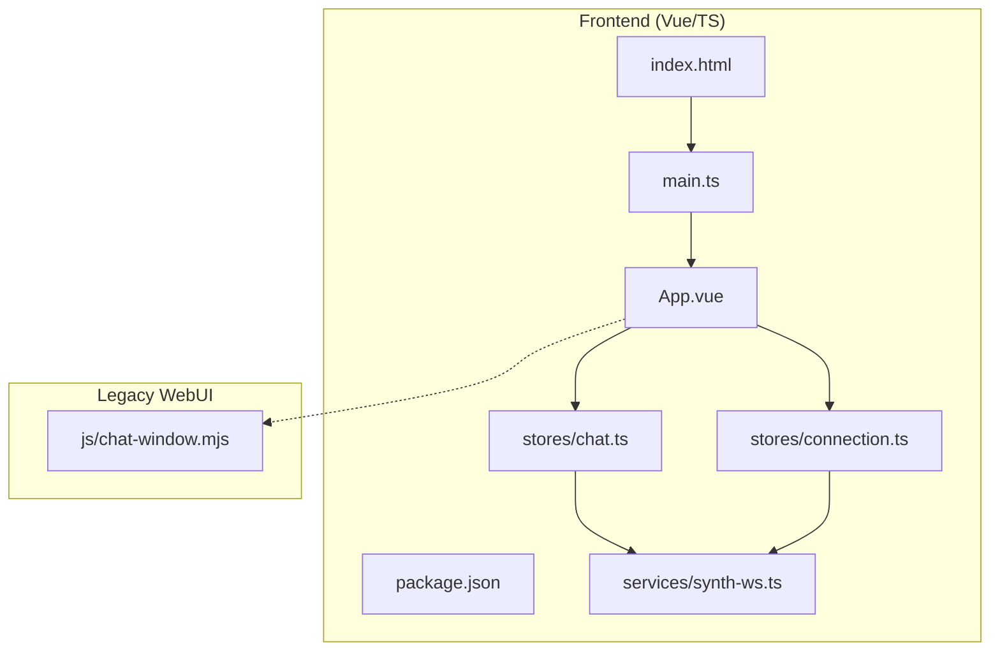
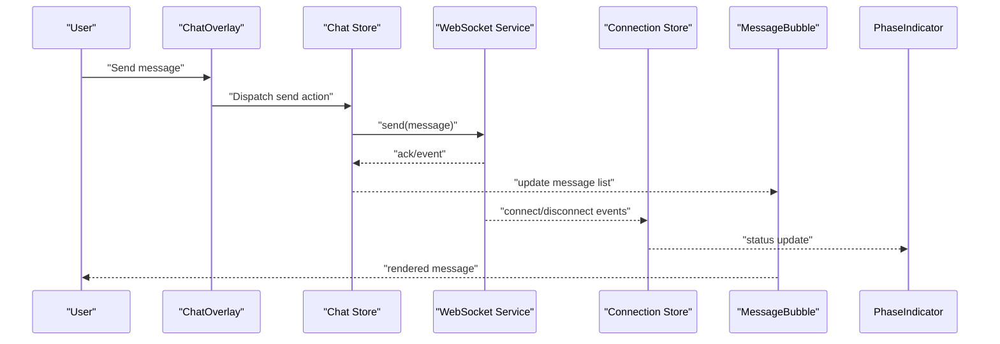
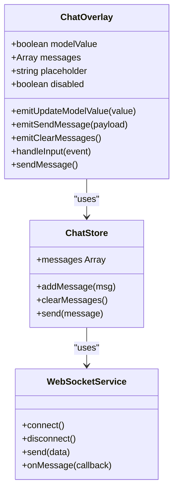
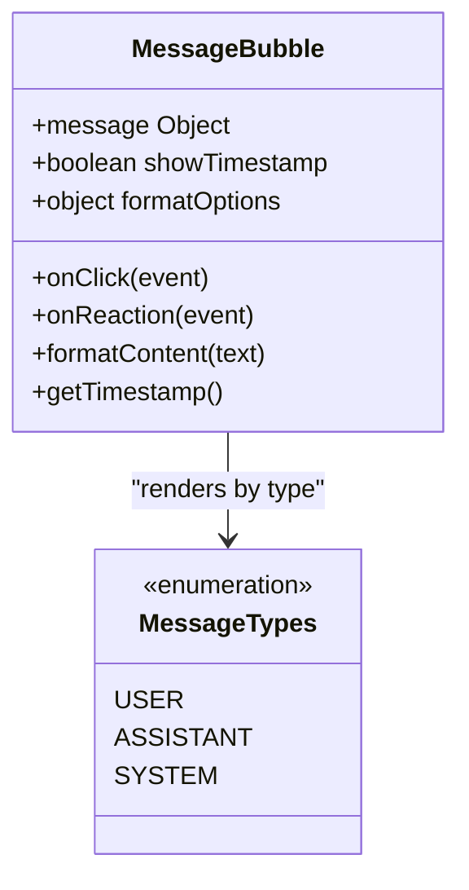
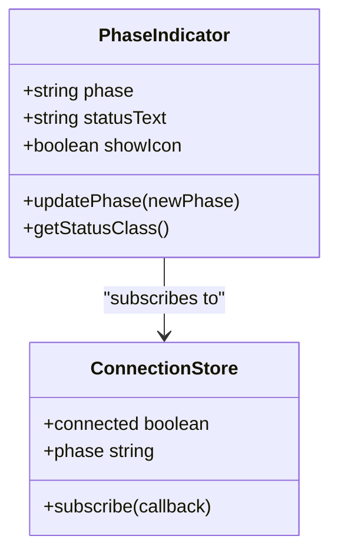
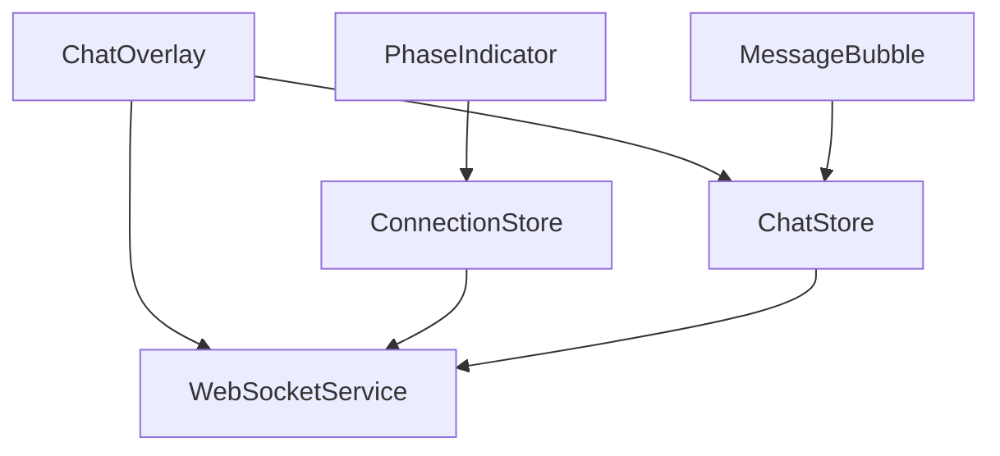

# Chat Interface Components

<cite>
**Referenced Files in This Document**
- [chat-window.mjs](file://res/synth_webui/js/chat-window.mjs)
- [synth-ws.ts](file://frontend/src/services/synth-ws.ts)
- [chat.ts](file://frontend/src/stores/chat.ts)
- [connection.ts](file://frontend/src/stores/connection.ts)
- [App.vue](file://frontend/src/App.vue)
- [main.ts](file://frontend/src/main.ts)
- [index.html](file://frontend/index.html)
- [package.json](file://frontend/package.json)
</cite>

## Table of Contents
1. [Introduction](#introduction)
2. [Project Structure](#project-structure)
3. [Core Components](#core-components)
4. [Architecture Overview](#architecture-overview)
5. [Detailed Component Analysis](#detailed-component-analysis)
6. [Dependency Analysis](#dependency-analysis)
7. [Performance Considerations](#performance-considerations)
8. [Troubleshooting Guide](#troubleshooting-guide)
9. [Conclusion](#conclusion)
10. [Appendices](#appendices)

## Introduction
This document provides comprehensive documentation for Synthetic Heart’s chat interface components, focusing on the ChatOverlay component that manages chat window state, message display, and user interactions; the MessageBubble component responsible for rendering individual messages with support for different types, timestamps, and formatting; and the PhaseIndicator component for showing conversation phases and status. It also covers props, events, slots, styling customization options, examples of message handling and real-time updates, accessibility features, and integration patterns with WebSocket communication and state management.

## Project Structure
The chat interface is implemented across both legacy JavaScript UI modules and modern TypeScript/Vue components:
- Legacy JS module for chat window logic resides under res/synth_webui/js.
- Modern frontend source code uses Vue 3 with TypeScript, including services for WebSocket communication and stores for state management.
- The application entry points are defined in the frontend directory.

**Diagram sources**
- [App.vue](file://frontend/src/App.vue)
- [main.ts](file://frontend/src/main.ts)
- [index.html](file://frontend/index.html)
- [package.json](file://frontend/package.json)
- [chat.ts](file://frontend/src/stores/chat.ts)
- [connection.ts](file://frontend/src/stores/connection.ts)
- [synth-ws.ts](file://frontend/src/services/synth-ws.ts)
- [chat-window.mjs](file://res/synth_webui/js/chat-window.mjs)

**Section sources**
- [App.vue](file://frontend/src/App.vue)
- [main.ts](file://frontend/src/main.ts)
- [index.html](file://frontend/index.html)
- [package.json](file://frontend/package.json)
- [chat-window.mjs](file://res/synth_webui/js/chat-window.mjs)
- [synth-ws.ts](file://frontend/src/services/synth-ws.ts)
- [chat.ts](file://frontend/src/stores/chat.ts)
- [connection.ts](file://frontend/src/stores/connection.ts)

## Core Components
- ChatOverlay: Manages chat window visibility, message list rendering, input handling, and event dispatching. Integrates with stores to update state and communicate via WebSocket.
- MessageBubble: Renders a single message with type-aware formatting, timestamps, and accessibility attributes. Supports text, system notifications, and rich content where applicable.
- PhaseIndicator: Displays current conversation phase/status (e.g., idle, typing, connected, error), updating reactively based on store state and WebSocket events.

These components collaborate through Vue reactivity and centralized stores, ensuring consistent state across the UI.

**Section sources**
- [chat-window.mjs](file://res/synth_webui/js/chat-window.mjs)
- [synth-ws.ts](file://frontend/src/services/synth-ws.ts)
- [chat.ts](file://frontend/src/stores/chat.ts)
- [connection.ts](file://frontend/src/stores/connection.ts)
- [App.vue](file://frontend/src/App.vue)

## Architecture Overview
The chat architecture follows a unidirectional data flow:
- User interactions trigger actions in ChatOverlay.
- Actions update the chat store, which may emit events or call WebSocket methods.
- WebSocket service handles connection lifecycle and message routing.
- Connection store tracks connectivity and status, influencing PhaseIndicator.
- MessageBubble renders messages from the store’s reactive state.

**Diagram sources**
- [chat-window.mjs](file://res/synth_webui/js/chat-window.mjs)
- [synth-ws.ts](file://frontend/src/services/synth-ws.ts)
- [chat.ts](file://frontend/src/stores/chat.ts)
- [connection.ts](file://frontend/src/stores/connection.ts)

## Detailed Component Analysis

### ChatOverlay Component
Responsibilities:
- Manage chat window open/close state.
- Render message list and input area.
- Handle user input, validation, and sending.
- Emit events for external integrations.
- Integrate with stores for state synchronization.

Props:
- modelValue: boolean controlling visibility.
- messages: array of message objects.
- placeholder: string for input hint.
- disabled: boolean to disable input.

Events:
- update:modelValue: toggles visibility.
- sendMessage: payload includes message text and metadata.
- clearMessages: clears message history.

Slots:
- header: custom header content.
- footer: custom footer content.
- message-item: override default message rendering.

Styling:
- CSS classes for container, message list, input area.
- Theme variables for colors and spacing.

Accessibility:
- aria-live regions for dynamic updates.
- keyboard navigation support.
- focus management on open/close.

Integration:
- Binds to chat store for messages and actions.
- Subscribes to WebSocket events for real-time updates.

**Section sources**
- [chat-window.mjs](file://res/synth_webui/js/chat-window.mjs)
- [chat.ts](file://frontend/src/stores/chat.ts)
- [synth-ws.ts](file://frontend/src/services/synth-ws.ts)

#### Class Diagram

**Diagram sources**
- [chat-window.mjs](file://res/synth_webui/js/chat-window.mjs)
- [chat.ts](file://frontend/src/stores/chat.ts)
- [synth-ws.ts](file://frontend/src/services/synth-ws.ts)

### MessageBubble Component
Responsibilities:
- Render individual messages with appropriate styling.
- Support multiple message types (user, assistant, system).
- Display timestamps and formatting.
- Provide accessibility labels and roles.

Props:
- message: object containing text, type, timestamp, metadata.
- showTimestamp: boolean to toggle timestamp visibility.
- formatOptions: object for markdown or rich text processing.

Events:
- click: emitted when message is clicked (for actions like copy).
- reaction: emitted for user reactions if enabled.

Slots:
- content: custom message content rendering.
- actions: custom action buttons per message.

Styling:
- Type-based classes (user, assistant, system).
- Timestamp positioning and formatting.
- Responsive layout for mobile.

Accessibility:
- role="article" for semantic structure.
- aria-label for screen readers.
- Keyboard focusable for interactive elements.

**Section sources**
- [chat-window.mjs](file://res/synth_webui/js/chat-window.mjs)
- [chat.ts](file://frontend/src/stores/chat.ts)

#### Class Diagram

**Diagram sources**
- [chat-window.mjs](file://res/synth_webui/js/chat-window.mjs)
- [chat.ts](file://frontend/src/stores/chat.ts)

### PhaseIndicator Component
Responsibilities:
- Display current conversation phase (idle, typing, connected, error).
- Update reactively based on connection and chat state.
- Provide visual feedback for status changes.

Props:
- phase: string indicating current phase.
- statusText: optional custom status message.
- showIcon: boolean to toggle icon display.

Events:
- none (purely presentational).

Slots:
- none.

Styling:
- Phase-specific colors and animations.
- Icon and text alignment.
- Accessibility: aria-live polite for announcements.

Integration:
- Subscribes to connection store for status updates.
- Reflects chat store typing indicators.

**Section sources**
- [connection.ts](file://frontend/src/stores/connection.ts)
- [chat.ts](file://frontend/src/stores/chat.ts)

#### Class Diagram

**Diagram sources**
- [connection.ts](file://frontend/src/stores/connection.ts)
- [chat.ts](file://frontend/src/stores/chat.ts)

## Dependency Analysis
The chat interface components depend on stores and services for state and communication:
- ChatOverlay depends on ChatStore for message state and actions.
- MessageBubble depends on message data structures and formatting utilities.
- PhaseIndicator depends on ConnectionStore for status updates.
- All components integrate with WebSocketService for real-time communication.

**Diagram sources**
- [chat-window.mjs](file://res/synth_webui/js/chat-window.mjs)
- [chat.ts](file://frontend/src/stores/chat.ts)
- [connection.ts](file://frontend/src/stores/connection.ts)
- [synth-ws.ts](file://frontend/src/services/synth-ws.ts)

**Section sources**
- [chat-window.mjs](file://res/synth_webui/js/chat-window.mjs)
- [chat.ts](file://frontend/src/stores/chat.ts)
- [connection.ts](file://frontend/src/stores/connection.ts)
- [synth-ws.ts](file://frontend/src/services/synth-ws.ts)

## Performance Considerations
- Virtualize message lists for large conversations to improve rendering performance.
- Debounce input handling to reduce unnecessary store updates.
- Use memoization for message formatting to avoid recomputation.
- Implement efficient WebSocket message batching to minimize network overhead.
- Optimize reactivity by selecting only necessary store fields for component subscriptions.

[No sources needed since this section provides general guidance]

## Troubleshooting Guide
Common issues and solutions:
- WebSocket connection failures: Check network connectivity and server availability. Verify authentication tokens if required.
- Messages not displaying: Ensure store state is updated correctly and components are subscribed to reactive changes.
- Real-time updates not working: Validate WebSocket event handlers and message parsing logic.
- Accessibility problems: Test with screen readers and ensure proper ARIA attributes are set.

**Section sources**
- [synth-ws.ts](file://frontend/src/services/synth-ws.ts)
- [chat.ts](file://frontend/src/stores/chat.ts)
- [connection.ts](file://frontend/src/stores/connection.ts)

## Conclusion
The Synthetic Heart chat interface components provide a robust foundation for real-time messaging with strong separation of concerns between UI, state, and communication layers. By following the documented patterns for props, events, slots, and styling, developers can extend and customize the chat experience while maintaining accessibility and performance best practices.

[No sources needed since this section summarizes without analyzing specific files]

## Appendices

### Example Usage Patterns
- Basic ChatOverlay usage with default props and event handling.
- Custom MessageBubble implementation with rich content support.
- PhaseIndicator integration with connection status monitoring.

[No sources needed since this section provides conceptual examples]

### Integration with WebSocket Communication
- Establish connection and handle reconnection logic.
- Parse incoming messages and update store state.
- Emit outgoing messages with proper formatting and metadata.

**Section sources**
- [synth-ws.ts](file://frontend/src/services/synth-ws.ts)

### State Management Patterns
- Centralized store for chat messages and connection status.
- Reactive updates using Vue’s composition API.
- Event-driven architecture for decoupled component communication.

**Section sources**
- [chat.ts](file://frontend/src/stores/chat.ts)
- [connection.ts](file://frontend/src/stores/connection.ts)