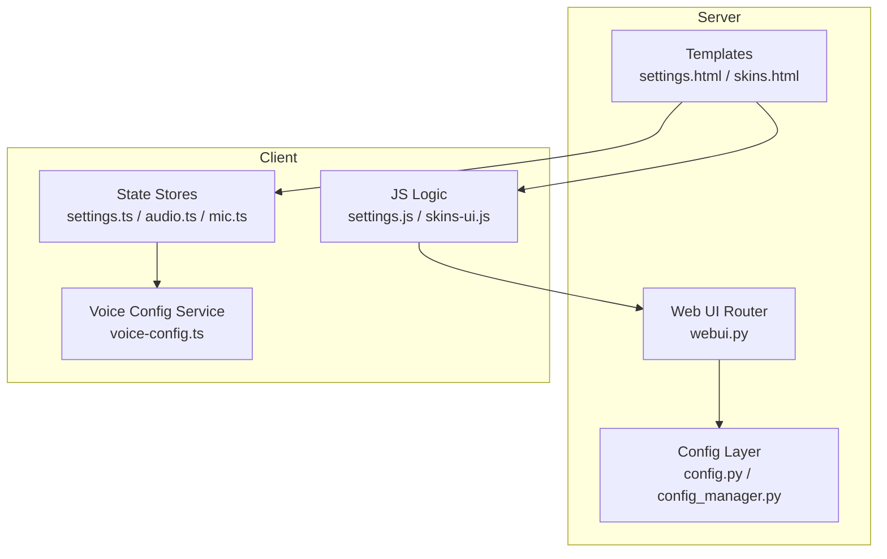
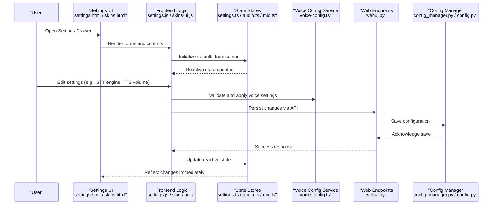
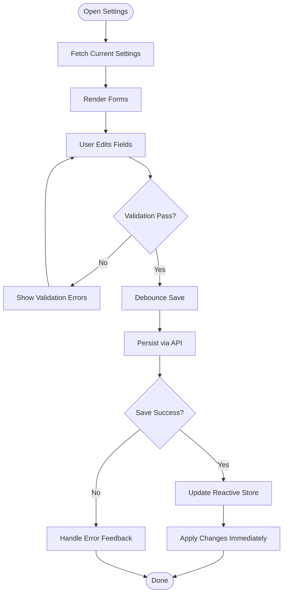
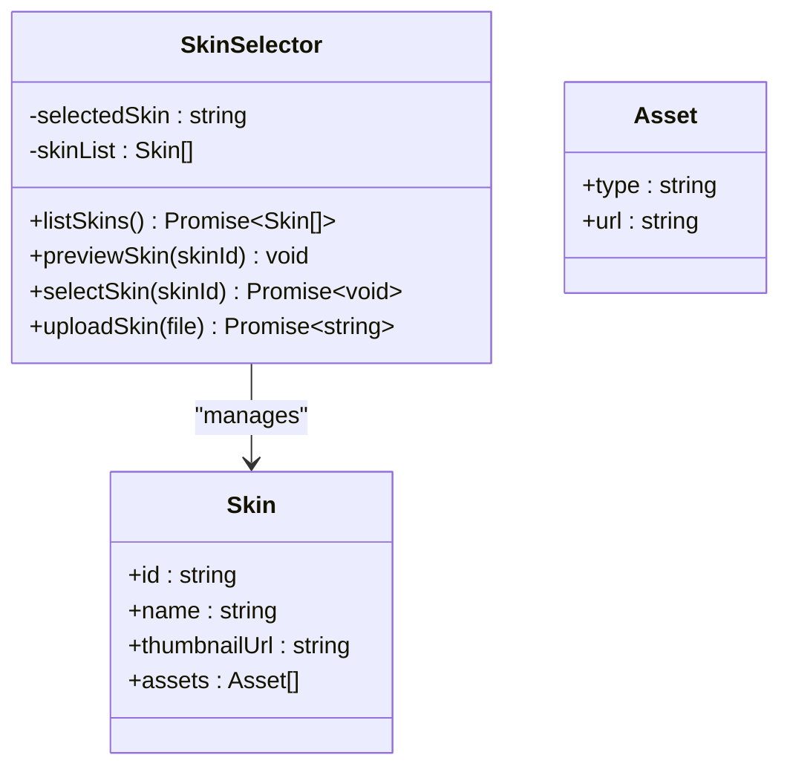
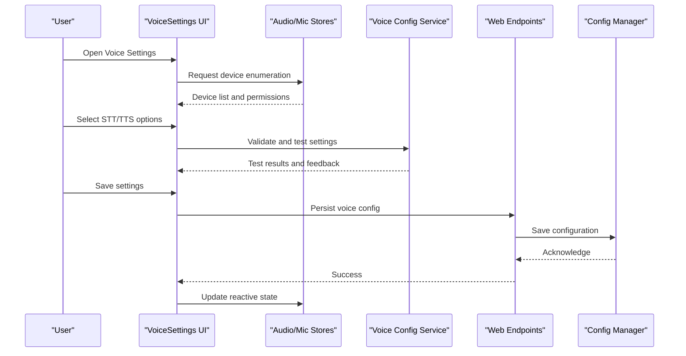
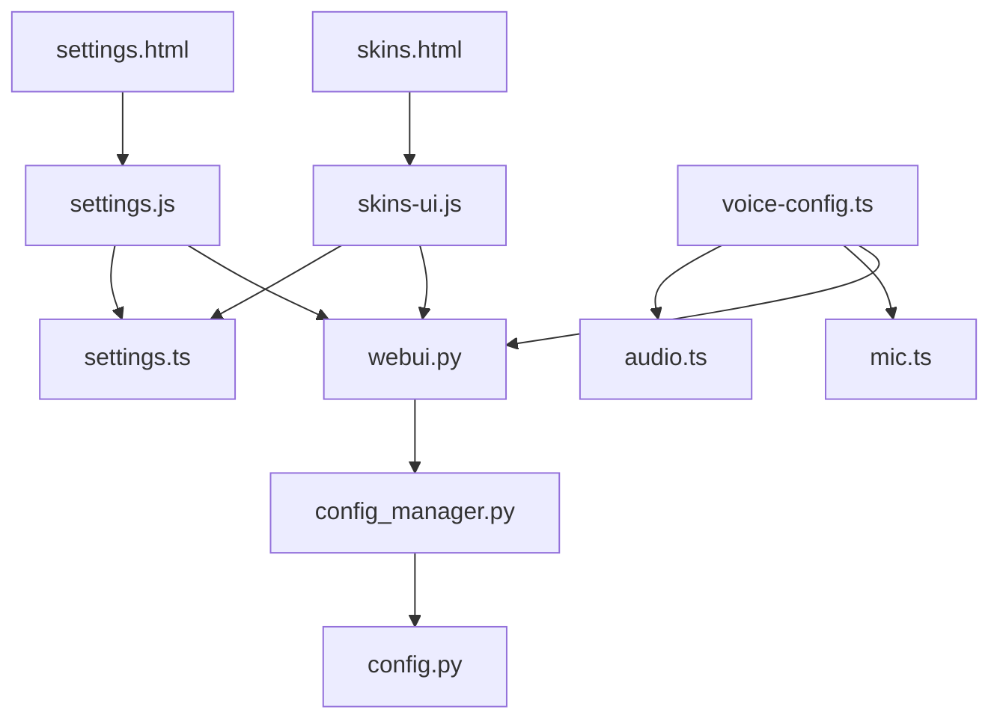

# Settings & Configuration Components

<cite>
**Referenced Files in This Document**
- [settings.html](file://core/webui_templates/sections/settings.html)
- [skins.html](file://core/webui_templates/sections/skins.html)
- [settings.js](file://res/synth_webui/js/settings.js)
- [skins-ui.js](file://res/synth_webui/js/skins-ui.js)
- [voice-config.ts](file://frontend/src/services/voice-config.ts)
- [audio.ts](file://frontend/src/stores/audio.ts)
- [mic.ts](file://frontend/src/stores/mic.ts)
- [settings.ts](file://frontend/src/stores/settings.ts)
- [config.py](file://core/config.py)
- [config_manager.py](file://core/config_manager.py)
- [webui.py](file://core/webui.py)
</cite>

## Table of Contents
1. [Introduction](#introduction)
2. [Project Structure](#project-structure)
3. [Core Components](#core-components)
4. [Architecture Overview](#architecture-overview)
5. [Detailed Component Analysis](#detailed-component-analysis)
6. [Dependency Analysis](#dependency-analysis)
7. [Performance Considerations](#performance-considerations)
8. [Troubleshooting Guide](#troubleshooting-guide)
9. [Conclusion](#conclusion)
10. [Appendices](#appendices)

## Introduction
This document explains the settings and configuration subsystem of Synthetic Heart with a focus on:
- SettingsDrawer for managing application preferences and user settings
- SkinSelector for choosing avatar appearances and themes
- VoiceSettings for configuring voice recognition, TTS settings, and audio preferences
It covers component APIs, form validation, data binding, persistence mechanisms, synchronization patterns, default value handling, responsive design considerations, and mobile-friendly interfaces.

## Project Structure
The settings UI spans both server-side templates and client-side scripts/stores:
- Server-side templates render the settings panels and expose endpoints to load/save configuration.
- Client-side JavaScript handles form interactions, validation, and persistence via API calls.
- TypeScript stores encapsulate runtime state for audio, microphone, and general settings.

**Diagram sources**
- [settings.html](file://core/webui_templates/sections/settings.html)
- [skins.html](file://core/webui_templates/sections/skins.html)
- [settings.js](file://res/synth_webui/js/settings.js)
- [skins-ui.js](file://res/synth_webui/js/skins-ui.js)
- [settings.ts](file://frontend/src/stores/settings.ts)
- [audio.ts](file://frontend/src/stores/audio.ts)
- [mic.ts](file://frontend/src/stores/mic.ts)
- [voice-config.ts](file://frontend/src/services/voice-config.ts)
- [config.py](file://core/config.py)
- [config_manager.py](file://core/config_manager.py)
- [webui.py](file://core/webui.py)

**Section sources**
- [settings.html](file://core/webui_templates/sections/settings.html)
- [skins.html](file://core/webui_templates/sections/skins.html)
- [settings.js](file://res/synth_webui/js/settings.js)
- [skins-ui.js](file://res/synth_webui/js/skins-ui.js)
- [settings.ts](file://frontend/src/stores/settings.ts)
- [audio.ts](file://frontend/src/stores/audio.ts)
- [mic.ts](file://frontend/src/stores/mic.ts)
- [voice-config.ts](file://frontend/src/services/voice-config.ts)
- [config.py](file://core/config.py)
- [config_manager.py](file://core/config_manager.py)
- [webui.py](file://core/webui.py)

## Core Components
- SettingsDrawer: The main panel for editing global and per-session preferences. It renders forms, validates inputs, and persists changes through backend endpoints.
- SkinSelector: A gallery-style selector for avatar skins/themes, including preview and upload flows.
- VoiceSettings: Controls for speech-to-text (STT), text-to-speech (TTS), and audio device selection, volume, and latency tuning.

Key responsibilities:
- Form rendering and validation
- Data binding to store objects
- Persistence to server configuration or local storage
- Real-time synchronization across tabs/devices where applicable

**Section sources**
- [settings.html](file://core/webui_templates/sections/settings.html)
- [skins.html](file://core/webui_templates/sections/skins.html)
- [settings.js](file://res/synth_webui/js/settings.js)
- [skins-ui.js](file://res/synth_webui/js/skins-ui.js)
- [voice-config.ts](file://frontend/src/services/voice-config.ts)
- [audio.ts](file://frontend/src/stores/audio.ts)
- [mic.ts](file://frontend/src/stores/mic.ts)
- [settings.ts](file://frontend/src/stores/settings.ts)

## Architecture Overview
The settings system follows a layered architecture:
- Presentation layer: HTML templates and UI components
- Interaction layer: JavaScript modules and TypeScript stores
- Service layer: Voice configuration service and audio/mic stores
- Persistence layer: Backend configuration manager and web endpoints

**Diagram sources**
- [settings.html](file://core/webui_templates/sections/settings.html)
- [skins.html](file://core/webui_templates/sections/skins.html)
- [settings.js](file://res/synth_webui/js/settings.js)
- [skins-ui.js](file://res/synth_webui/js/skins-ui.js)
- [settings.ts](file://frontend/src/stores/settings.ts)
- [audio.ts](file://frontend/src/stores/audio.ts)
- [mic.ts](file://frontend/src/stores/mic.ts)
- [voice-config.ts](file://frontend/src/services/voice-config.ts)
- [webui.py](file://core/webui.py)
- [config_manager.py](file://core/config_manager.py)
- [config.py](file://core/config.py)

## Detailed Component Analysis

### SettingsDrawer
Responsibilities:
- Renders preference forms for general app settings
- Validates inputs (required fields, ranges, formats)
- Binds to settings store for reactive updates
- Persists changes via backend endpoints

API surface:
- Load settings: fetches current configuration from server
- Save settings: submits validated form payload
- Reset defaults: restores built-in defaults and re-syncs

Data binding:
- Two-way binding between form fields and store properties
- Debounced saves to reduce network overhead
- Error feedback on validation failures

Persistence:
- Server-backed configuration via config_manager
- Local fallback for transient values when offline

Responsive design:
- Collapsible sections for mobile screens
- Touch-friendly input sizes and spacing

**Diagram sources**
- [settings.html](file://core/webui_templates/sections/settings.html)
- [settings.js](file://res/synth_webui/js/settings.js)
- [settings.ts](file://frontend/src/stores/settings.ts)
- [webui.py](file://core/webui.py)
- [config_manager.py](file://core/config_manager.py)
- [config.py](file://core/config.py)

**Section sources**
- [settings.html](file://core/webui_templates/sections/settings.html)
- [settings.js](file://res/synth_webui/js/settings.js)
- [settings.ts](file://frontend/src/stores/settings.ts)
- [webui.py](file://core/webui.py)
- [config_manager.py](file://core/config_manager.py)
- [config.py](file://core/config.py)

### SkinSelector
Responsibilities:
- Displays available skins/themes for avatars
- Provides preview and selection actions
- Supports uploading custom skins
- Persists selected skin to configuration

API surface:
- List skins: retrieves available skins from server
- Preview skin: loads preview assets
- Select skin: applies and persists selection
- Upload skin: uploads new skin assets and registers them

Data binding:
- Reactive selection state in store
- Immediate UI update upon selection change

Persistence:
- Server-side skin registry and metadata
- Fallback to local cache for previews

Responsive design:
- Grid layout adapts to screen size
- Swipe gestures on mobile for browsing skins

**Diagram sources**
- [skins.html](file://core/webui_templates/sections/skins.html)
- [skins-ui.js](file://res/synth_webui/js/skins-ui.js)
- [webui.py](file://core/webui.py)
- [config_manager.py](file://core/config_manager.py)

**Section sources**
- [skins.html](file://core/webui_templates/sections/skins.html)
- [skins-ui.js](file://res/synth_webui/js/skins-ui.js)
- [webui.py](file://core/webui.py)
- [config_manager.py](file://core/config_manager.py)

### VoiceSettings
Responsibilities:
- Configures STT engines, languages, and thresholds
- Manages TTS providers, voices, and playback parameters
- Handles audio device selection and permissions
- Applies real-time adjustments to audio pipeline

API surface:
- Get devices: enumerates available audio devices
- Test STT/TTS: performs live tests with feedback
- Apply settings: validates and persists voice configuration
- Toggle features: enables/disables features like barge-in

Data binding:
- Reactive store for audio and mic states
- Immediate UI reflection of device availability and permissions

Persistence:
- Server-side voice configuration
- Local overrides for temporary testing

Responsive design:
- Compact controls for small screens
- Clear error messages for permission denials

**Diagram sources**
- [voice-config.ts](file://frontend/src/services/voice-config.ts)
- [audio.ts](file://frontend/src/stores/audio.ts)
- [mic.ts](file://frontend/src/stores/mic.ts)
- [webui.py](file://core/webui.py)
- [config_manager.py](file://core/config_manager.py)

**Section sources**
- [voice-config.ts](file://frontend/src/services/voice-config.ts)
- [audio.ts](file://frontend/src/stores/audio.ts)
- [mic.ts](file://frontend/src/stores/mic.ts)
- [webui.py](file://core/webui.py)
- [config_manager.py](file://core/config_manager.py)

## Dependency Analysis
The settings components depend on:
- Templates for rendering UI elements
- JavaScript modules for interaction logic
- TypeScript stores for reactive state management
- Web endpoints for persistence
- Configuration manager for schema validation and defaults

**Diagram sources**
- [settings.html](file://core/webui_templates/sections/settings.html)
- [skins.html](file://core/webui_templates/sections/skins.html)
- [settings.js](file://res/synth_webui/js/settings.js)
- [skins-ui.js](file://res/synth_webui/js/skins-ui.js)
- [settings.ts](file://frontend/src/stores/settings.ts)
- [audio.ts](file://frontend/src/stores/audio.ts)
- [mic.ts](file://frontend/src/stores/mic.ts)
- [voice-config.ts](file://frontend/src/services/voice-config.ts)
- [webui.py](file://core/webui.py)
- [config_manager.py](file://core/config_manager.py)
- [config.py](file://core/config.py)

**Section sources**
- [settings.html](file://core/webui_templates/sections/settings.html)
- [skins.html](file://core/webui_templates/sections/skins.html)
- [settings.js](file://res/synth_webui/js/settings.js)
- [skins-ui.js](file://res/synth_webui/js/skins-ui.js)
- [settings.ts](file://frontend/src/stores/settings.ts)
- [audio.ts](file://frontend/src/stores/audio.ts)
- [mic.ts](file://frontend/src/stores/mic.ts)
- [voice-config.ts](file://frontend/src/services/voice-config.ts)
- [webui.py](file://core/webui.py)
- [config_manager.py](file://core/config_manager.py)
- [config.py](file://core/config.py)

## Performance Considerations
- Debounced saves to minimize network requests during rapid edits
- Lazy loading of skin previews to reduce initial page weight
- Efficient device enumeration with caching to avoid repeated prompts
- Optimized form validation to prevent unnecessary re-renders
- Responsive layouts that adapt to different screen sizes without heavy DOM manipulation

[No sources needed since this section provides general guidance]

## Troubleshooting Guide
Common issues and resolutions:
- Permission denied for microphone: Ensure browser permissions are granted; check device enumeration results
- Invalid configuration values: Review validation errors and correct input formats
- Skin upload failures: Verify file format and size limits; check server logs for upload errors
- Settings not persisting: Confirm network connectivity and server endpoint availability
- Audio device not detected: Re-enumerate devices and verify driver compatibility

**Section sources**
- [settings.js](file://res/synth_webui/js/settings.js)
- [skins-ui.js](file://res/synth_webui/js/skins-ui.js)
- [voice-config.ts](file://frontend/src/services/voice-config.ts)
- [audio.ts](file://frontend/src/stores/audio.ts)
- [mic.ts](file://frontend/src/stores/mic.ts)
- [webui.py](file://core/webui.py)

## Conclusion
The settings and configuration components of Synthetic Heart provide a robust, responsive interface for managing application preferences, avatar skins, and voice settings. Through clear separation of concerns, reactive state management, and reliable persistence mechanisms, users can customize their experience effectively while maintaining system stability and performance.

[No sources needed since this section summarizes without analyzing specific files]

## Appendices
- Default value handling: Built-in defaults are applied when no user configuration exists
- Synchronization patterns: Real-time updates ensure consistency across UI components
- Mobile-friendly design: Touch-optimized controls and adaptive layouts enhance usability on smaller screens

[No sources needed since this section provides general guidance]