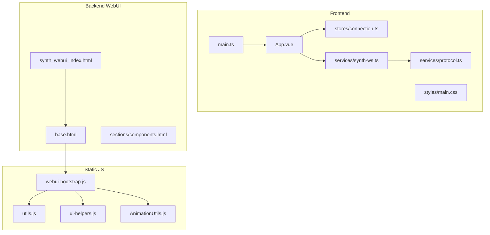
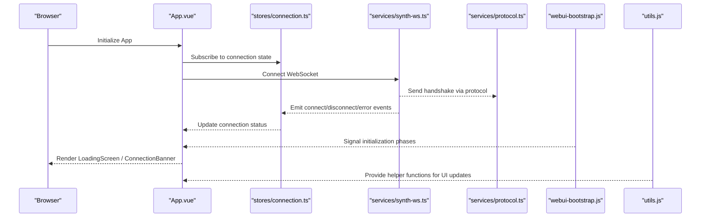
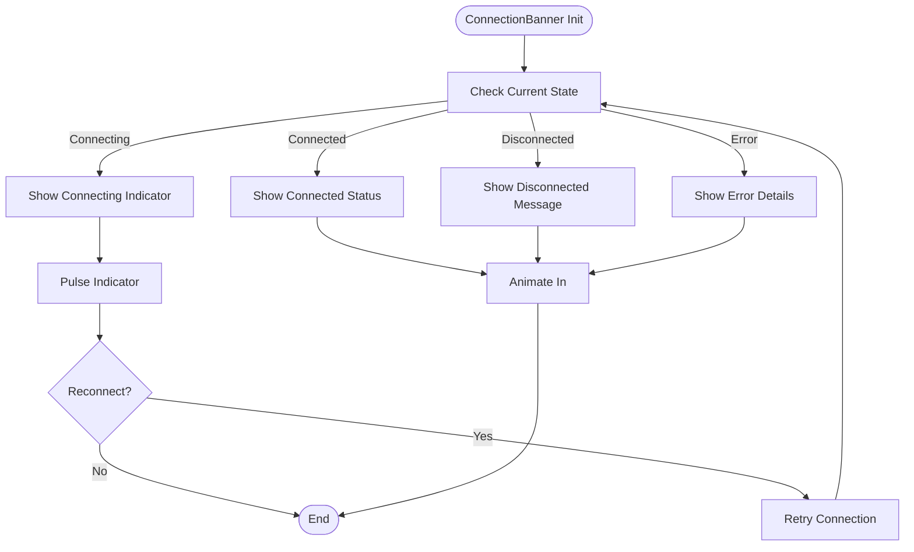
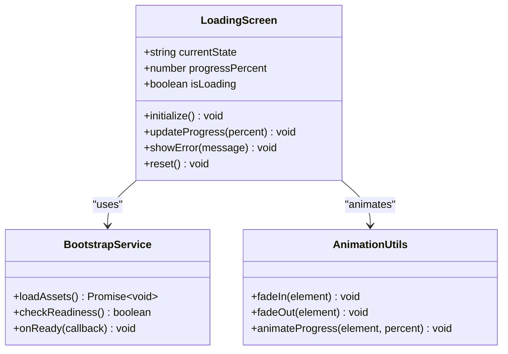
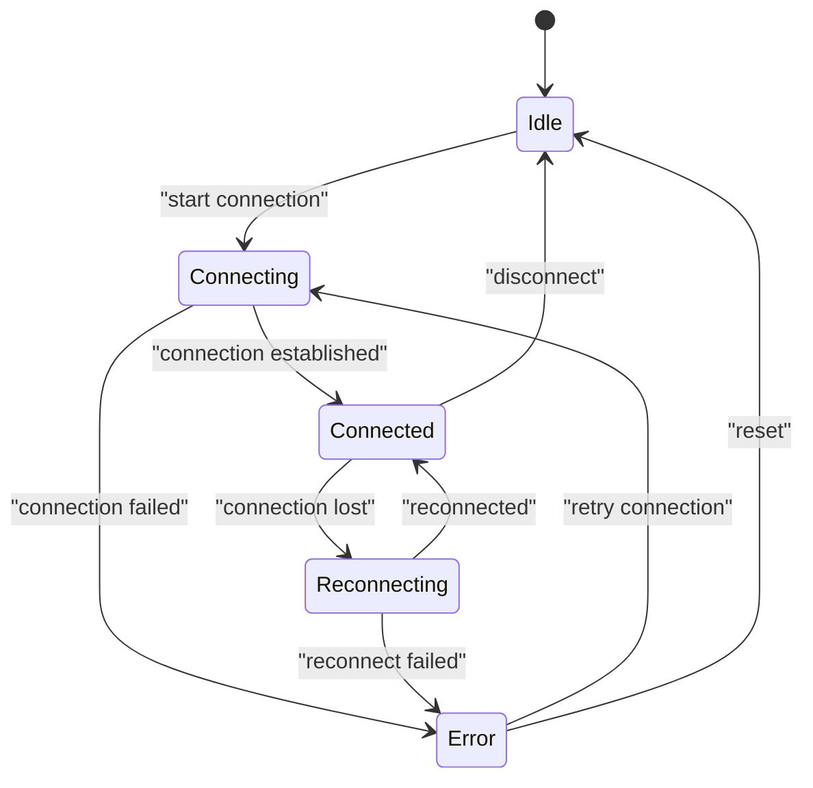
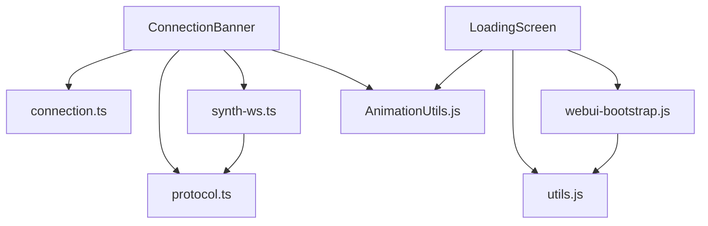

# System & Utility Components

<cite>
**Referenced Files in This Document**
- [App.vue](file://frontend/src/App.vue)
- [main.ts](file://frontend/src/main.ts)
- [connection.ts](file://frontend/src/stores/connection.ts)
- [synth-ws.ts](file://frontend/src/services/synth-ws.ts)
- [protocol.ts](file://frontend/src/services/protocol.ts)
- [components.html](file://core/webui_templates/sections/components.html)
- [base.html](file://core/webui_templates/base.html)
- [synth_webui_index.html](file://core/webui_templates/synth_webui_index.html)
- [AnimationUtils.js](file://res/synth_webui/js/vendor/AnimationUtils.js)
- [webui-bootstrap.js](file://res/synth_webui/js/vendor/webui-bootstrap.js)
- [ui-helpers.js](file://res/synth_webui/js/vendor/ui-helpers.js)
- [utils.js](file://res/synth_webui/js/vendor/utils.js)
- [main.css](file://frontend/src/styles/main.css)
</cite>

## Table of Contents
1. [Introduction](#introduction)
2. [Project Structure](#project-structure)
3. [Core Components](#core-components)
4. [Architecture Overview](#architecture-overview)
5. [Detailed Component Analysis](#detailed-component-analysis)
6. [Dependency Analysis](#dependency-analysis)
7. [Performance Considerations](#performance-considerations)
8. [Troubleshooting Guide](#troubleshooting-guide)
9. [Conclusion](#conclusion)
10. [Appendices](#appendices)

## Introduction
This document provides comprehensive documentation for Synthetic Heart’s system and utility components, focusing on the ConnectionBanner and LoadingScreen components. It explains their responsibilities, states, event handling, animation transitions, accessibility features, internationalization support, and responsive behavior across screen sizes. It also includes examples of status monitoring, error recovery patterns, and user feedback mechanisms to help developers integrate and extend these components effectively.

## Project Structure
The frontend is implemented with Vue 3 and TypeScript, organized into components, services, stores, and styles. The backend serves HTML templates and static assets that complement the frontend UI. Key areas relevant to system utilities include:
- Frontend components under frontend/src/components/system
- Stores managing connection state
- Services for WebSocket communication and protocol handling
- Backend web UI templates and static JavaScript utilities

**Diagram sources**
- [App.vue](file://frontend/src/App.vue)
- [main.ts](file://frontend/src/main.ts)
- [connection.ts](file://frontend/src/stores/connection.ts)
- [synth-ws.ts](file://frontend/src/services/synth-ws.ts)
- [protocol.ts](file://frontend/src/services/protocol.ts)
- [synth_webui_index.html](file://core/webui_templates/synth_webui_index.html)
- [base.html](file://core/webui_templates/base.html)
- [components.html](file://core/webui_templates/sections/components.html)
- [webui-bootstrap.js](file://res/synth_webui/js/vendor/webui-bootstrap.js)
- [utils.js](file://res/synth_webui/js/vendor/utils.js)
- [ui-helpers.js](file://res/synth_webui/js/vendor/ui-helpers.js)
- [AnimationUtils.js](file://res/synth_webui/js/vendor/AnimationUtils.js)

**Section sources**
- [App.vue](file://frontend/src/App.vue)
- [main.ts](file://frontend/src/main.ts)
- [connection.ts](file://frontend/src/stores/connection.ts)
- [synth-ws.ts](file://frontend/src/services/synth-ws.ts)
- [protocol.ts](file://frontend/src/services/protocol.ts)
- [synth_webui_index.html](file://core/webui_templates/synth_webui_index.html)
- [base.html](file://core/webui_templates/base.html)
- [components.html](file://core/webui_templates/sections/components.html)
- [webui-bootstrap.js](file://res/synth_webui/js/vendor/webui-bootstrap.js)
- [utils.js](file://res/synth_webui/js/vendor/utils.js)
- [ui-helpers.js](file://res/synth_webui/js/vendor/ui-helpers.js)
- [AnimationUtils.js](file://res/synth_webui/js/vendor/AnimationUtils.js)

## Core Components
- ConnectionBanner: Displays connection status, error messages, and system notifications. It reacts to WebSocket lifecycle events and store updates to reflect real-time connectivity and health.
- LoadingScreen: Shows loading states, progress indicators, and initialization feedback during app startup or long-running operations. It coordinates with bootstrap scripts and component readiness signals.

Key responsibilities:
- State synchronization with connection store and WebSocket service
- User-facing messaging with accessible labels and ARIA attributes
- Animation transitions for smooth state changes
- Internationalization hooks for localized strings
- Responsive layout adjustments for different screen sizes

**Section sources**
- [connection.ts](file://frontend/src/stores/connection.ts)
- [synth-ws.ts](file://frontend/src/services/synth-ws.ts)
- [protocol.ts](file://frontend/src/services/protocol.ts)
- [webui-bootstrap.js](file://res/synth_webui/js/vendor/webui-bootstrap.js)
- [utils.js](file://res/synth_webui/js/vendor/utils.js)
- [ui-helpers.js](file://res/synth_webui/js/vendor/ui-helpers.js)
- [AnimationUtils.js](file://res/synth_webui/js/vendor/AnimationUtils.js)

## Architecture Overview
The system integrates frontend components with backend templates and static utilities. The ConnectionBanner listens to connection events from the WebSocket service and updates its display accordingly. The LoadingScreen monitors initialization phases and renders progress feedback until the application is ready.

**Diagram sources**
- [App.vue](file://frontend/src/App.vue)
- [connection.ts](file://frontend/src/stores/connection.ts)
- [synth-ws.ts](file://frontend/src/services/synth-ws.ts)
- [protocol.ts](file://frontend/src/services/protocol.ts)
- [webui-bootstrap.js](file://res/synth_webui/js/vendor/webui-bootstrap.js)
- [utils.js](file://res/synth_webui/js/vendor/utils.js)

## Detailed Component Analysis

### ConnectionBanner Component
Responsibilities:
- Display current connection status (connected, connecting, disconnected)
- Show error messages and system notifications
- React to WebSocket lifecycle events and store updates
- Provide accessible labels and ARIA attributes for assistive technologies
- Support internationalization through localized string keys
- Adapt layout for mobile, tablet, and desktop screens

Component states:
- Idle: Initial state before connection attempts
- Connecting: Establishing WebSocket link
- Connected: Stable connection established
- Error: Connection failure or protocol error
- Reconnecting: Attempting to reconnect after failure
- Notification: Showing transient system messages

Event handling:
- Listen to WebSocket connect/disconnect/error events
- Handle reconnection attempts with exponential backoff
- Update banner content based on store state changes
- Trigger animations for state transitions

Animation transitions:
- Fade-in/out for message appearance
- Pulse indicator for connecting/reconnecting states
- Smooth color transitions for status changes

Accessibility features:
- ARIA live regions for dynamic updates
- Semantic HTML elements for screen readers
- Keyboard navigable controls if interactive

Internationalization support:
- Localized string keys for messages
- Fallback to default language when translations are missing
- Dynamic locale switching without reload

Responsive behavior:
- Compact layout on small screens
- Expanded details on larger screens
- Touch-friendly interactions for mobile devices

Status monitoring:
- Real-time updates from WebSocket service
- Debounced updates to prevent excessive re-renders
- Aggregated error messages with actionable hints

Error recovery patterns:
- Automatic reconnection with backoff
- Graceful degradation when backend unavailable
- Clear user guidance for manual intervention

User feedback mechanisms:
- Visual indicators for connection quality
- Toast-like notifications for transient issues
- Persistent banners for critical errors

**Diagram sources**
- [connection.ts](file://frontend/src/stores/connection.ts)
- [synth-ws.ts](file://frontend/src/services/synth-ws.ts)
- [protocol.ts](file://frontend/src/services/protocol.ts)
- [AnimationUtils.js](file://res/synth_webui/js/vendor/AnimationUtils.js)

**Section sources**
- [connection.ts](file://frontend/src/stores/connection.ts)
- [synth-ws.ts](file://frontend/src/services/synth-ws.ts)
- [protocol.ts](file://frontend/src/services/protocol.ts)
- [AnimationUtils.js](file://res/synth_webui/js/vendor/AnimationUtils.js)

### LoadingScreen Component
Responsibilities:
- Display loading states during application initialization
- Show progress indicators for long-running operations
- Provide feedback about system readiness and component availability
- Coordinate with bootstrap scripts and utility functions
- Support internationalization for loading messages
- Adapt to different screen sizes and orientations

Component states:
- Initializing: Application startup phase
- Loading Assets: Fetching resources and dependencies
- Ready: All components initialized and available
- Error: Initialization failure with recovery options

Progress indicators:
- Circular progress spinner
- Linear progress bar with percentage
- Step-by-step progress with labeled stages

Initialization feedback:
- Real-time updates on loading phases
- Estimated time remaining calculations
- Network status integration for offline detection

Animation transitions:
- Smooth fade transitions between phases
- Staggered animations for multiple loading steps
- Performance-optimized animations using CSS transforms

Accessibility features:
- ARIA roles and labels for progress indication
- Screen reader announcements for state changes
- Focus management for keyboard navigation

Internationalization support:
- Localized loading messages and stage descriptions
- RTL layout support for right-to-left languages
- Dynamic text scaling for accessibility

Responsive behavior:
- Centered layout on all screen sizes
- Adaptive font sizes and spacing
- Touch-friendly progress indicators

**Diagram sources**
- [webui-bootstrap.js](file://res/synth_webui/js/vendor/webui-bootstrap.js)
- [utils.js](file://res/synth_webui/js/vendor/utils.js)
- [AnimationUtils.js](file://res/synth_webui/js/vendor/AnimationUtils.js)

**Section sources**
- [webui-bootstrap.js](file://res/synth_webui/js/vendor/webui-bootstrap.js)
- [utils.js](file://res/synth_webui/js/vendor/utils.js)
- [AnimationUtils.js](file://res/synth_webui/js/vendor/AnimationUtils.js)

### Conceptual Overview
The ConnectionBanner and LoadingScreen work together to provide a cohesive user experience during connection establishment and application initialization. They follow consistent patterns for state management, animation, and accessibility while maintaining responsive design principles.

[No sources needed since this diagram shows conceptual workflow, not actual code structure]

## Dependency Analysis
The components depend on several core services and utilities:
- Connection store for state management
- WebSocket service for real-time communication
- Protocol service for message formatting
- Bootstrap scripts for initialization
- Animation utilities for visual effects
- UI helpers for common operations

**Diagram sources**
- [connection.ts](file://frontend/src/stores/connection.ts)
- [synth-ws.ts](file://frontend/src/services/synth-ws.ts)
- [protocol.ts](file://frontend/src/services/protocol.ts)
- [webui-bootstrap.js](file://res/synth_webui/js/vendor/webui-bootstrap.js)
- [utils.js](file://res/synth_webui/js/vendor/utils.js)
- [AnimationUtils.js](file://res/synth_webui/js/vendor/AnimationUtils.js)

**Section sources**
- [connection.ts](file://frontend/src/stores/connection.ts)
- [synth-ws.ts](file://frontend/src/services/synth-ws.ts)
- [protocol.ts](file://frontend/src/services/protocol.ts)
- [webui-bootstrap.js](file://res/synth_webui/js/vendor/webui-bootstrap.js)
- [utils.js](file://res/synth_webui/js/vendor/utils.js)
- [AnimationUtils.js](file://res/synth_webui/js/vendor/AnimationUtils.js)

## Performance Considerations
- Minimize re-renders by using reactive state updates efficiently
- Implement debouncing for frequent WebSocket events
- Use CSS animations instead of JavaScript animations where possible
- Lazy load non-critical assets and components
- Optimize bundle size by tree-shaking unused code
- Monitor memory usage during long-running operations
- Implement proper cleanup of event listeners and timers

## Troubleshooting Guide
Common issues and solutions:
- Connection failures: Check network connectivity and server availability
- WebSocket errors: Verify protocol compatibility and authentication
- Animation glitches: Ensure proper DOM element references and cleanup
- Memory leaks: Monitor component lifecycle and remove event listeners
- Performance issues: Profile rendering and optimize heavy operations

Debugging techniques:
- Enable verbose logging for connection events
- Use browser developer tools to inspect network requests
- Monitor component state changes with Vue DevTools
- Test responsive behavior across different screen sizes
- Validate accessibility features with screen readers

**Section sources**
- [synth-ws.ts](file://frontend/src/services/synth-ws.ts)
- [protocol.ts](file://frontend/src/services/protocol.ts)
- [connection.ts](file://frontend/src/stores/connection.ts)

## Conclusion
The ConnectionBanner and LoadingScreen components provide essential system-level functionality for Synthetic Heart's user interface. They implement robust state management, error handling, and user feedback mechanisms while maintaining accessibility and responsive design standards. By following the patterns and guidelines outlined in this document, developers can create consistent and reliable user experiences across different platforms and devices.

## Appendices

### Accessibility Guidelines
- Use semantic HTML elements for better screen reader support
- Implement ARIA attributes for dynamic content updates
- Ensure keyboard navigation works for all interactive elements
- Provide sufficient color contrast for visibility
- Test with various assistive technologies

### Internationalization Best Practices
- Extract all user-facing strings to translation files
- Use pluralization rules for different languages
- Handle RTL layouts for right-to-left languages
- Provide fallback translations for missing keys
- Test with different locales and character sets

### Responsive Design Patterns
- Use flexible grid systems for layout adaptation
- Implement touch-friendly interaction targets
- Optimize images and media for different screen densities
- Test across various devices and orientations
- Consider performance implications of responsive features