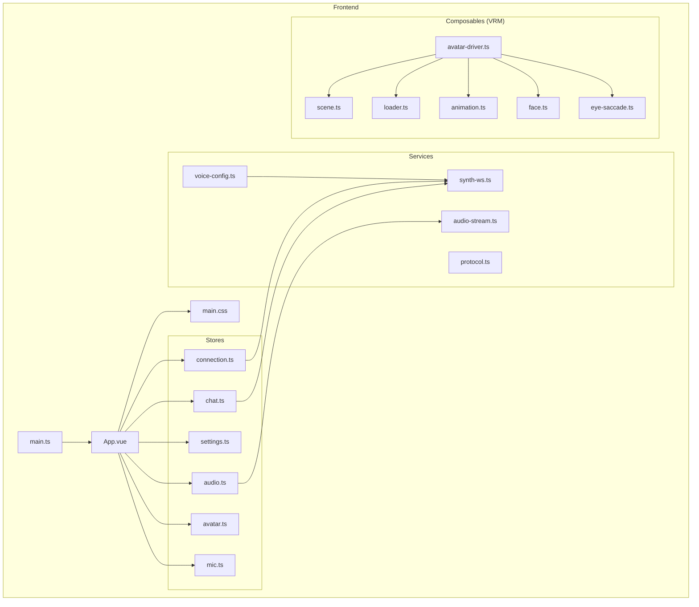
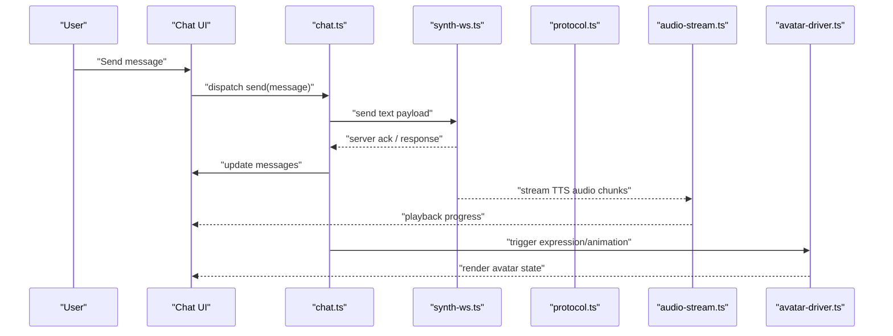
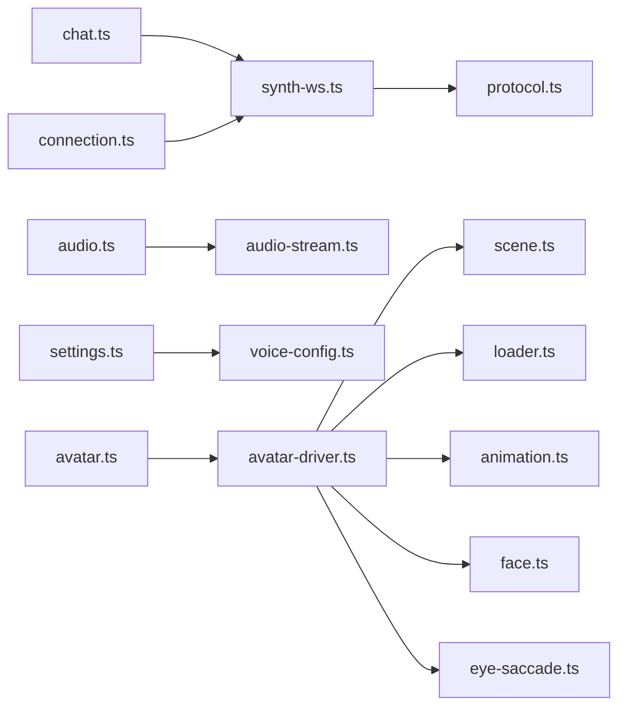

# UI Components

<cite>
**Referenced Files in This Document**
- [App.vue](file://frontend/src/App.vue)
- [main.ts](file://frontend/src/main.ts)
- [chat.ts](file://frontend/src/stores/chat.ts)
- [connection.ts](file://frontend/src/stores/connection.ts)
- [settings.ts](file://frontend/src/stores/settings.ts)
- [audio.ts](file://frontend/src/stores/audio.ts)
- [avatar.ts](file://frontend/src/stores/avatar.ts)
- [mic.ts](file://frontend/src/stores/mic.ts)
- [synth-ws.ts](file://frontend/src/services/synth-ws.ts)
- [protocol.ts](file://frontend/src/services/protocol.ts)
- [voice-config.ts](file://frontend/src/services/voice-config.ts)
- [audio-stream.ts](file://frontend/src/services/audio-stream.ts)
- [avatar-driver.ts](file://frontend/src/composables/vrm/avatar-driver.ts)
- [scene.ts](file://frontend/src/composables/vrm/scene.ts)
- [loader.ts](file://frontend/src/composables/vrm/loader.ts)
- [animation.ts](file://frontend/src/composables/vrm/animation.ts)
- [face.ts](file://frontend/src/composables/vrm/face.ts)
- [eye-saccade.ts](file://frontend/src/composables/vrm/eye-saccade.ts)
- [main.css](file://frontend/src/styles/main.css)
</cite>

## Table of Contents
1. [Introduction](#introduction)
2. [Project Structure](#project-structure)
3. [Core Components](#core-components)
4. [Architecture Overview](#architecture-overview)
5. [Detailed Component Analysis](#detailed-component-analysis)
6. [Dependency Analysis](#dependency-analysis)
7. [Performance Considerations](#performance-considerations)
8. [Troubleshooting Guide](#troubleshooting-guide)
9. [Conclusion](#conclusion)
10. [Appendices](#appendices)

## Introduction
This document provides comprehensive documentation for Synthetic Heart’s Vue.js UI components, focusing on the chat interface (message bubbles, overlays, phase indicators), settings panel (voice configuration, skin selection, user preferences), and system components (connection banners, loading screens). It explains component props, events, slots, customization options, usage examples, styling guidelines, accessibility considerations, composition patterns, and integration with the avatar stage.

## Project Structure
The frontend is a Vue 3 application using TypeScript, Vite, and UnoCSS. The structure separates concerns into:
- Components: Chat, Settings, System, and Scene modules
- Stores: Reactive state management for chat, connection, settings, audio, avatar, and microphone
- Services: WebSocket communication, protocol handling, voice configuration, and audio streaming
- Composables: VRM avatar driver, scene lifecycle, loader, animation, face expressions, and eye saccade
- Styles: Global CSS for consistent theming and layout

**Diagram sources**
- [App.vue](file://frontend/src/App.vue)
- [main.ts](file://frontend/src/main.ts)
- [chat.ts](file://frontend/src/stores/chat.ts)
- [connection.ts](file://frontend/src/stores/connection.ts)
- [settings.ts](file://frontend/src/stores/settings.ts)
- [audio.ts](file://frontend/src/stores/audio.ts)
- [avatar.ts](file://frontend/src/stores/avatar.ts)
- [mic.ts](file://frontend/src/stores/mic.ts)
- [synth-ws.ts](file://frontend/src/services/synth-ws.ts)
- [protocol.ts](file://frontend/src/services/protocol.ts)
- [voice-config.ts](file://frontend/src/services/voice-config.ts)
- [audio-stream.ts](file://frontend/src/services/audio-stream.ts)
- [avatar-driver.ts](file://frontend/src/composables/vrm/avatar-driver.ts)
- [scene.ts](file://frontend/src/composables/vrm/scene.ts)
- [loader.ts](file://frontend/src/composables/vrm/loader.ts)
- [animation.ts](file://frontend/src/composables/vrm/animation.ts)
- [face.ts](file://frontend/src/composables/vrm/face.ts)
- [eye-saccade.ts](file://frontend/src/composables/vrm/eye-saccade.ts)
- [main.css](file://frontend/src/styles/main.css)

**Section sources**
- [App.vue](file://frontend/src/App.vue)
- [main.ts](file://frontend/src/main.ts)

## Core Components
This section outlines the primary UI components and their responsibilities:
- Chat Interface: Message bubbles, chat overlays, phase indicators
- Settings Panel: Voice configuration, skin selection, user preferences
- System Components: Connection banners, loading screens
- Avatar Stage Integration: Composition patterns to connect UI with VRM avatar behaviors

Key implementation details are organized by stores and services that drive component behavior.

**Section sources**
- [chat.ts](file://frontend/src/stores/chat.ts)
- [connection.ts](file://frontend/src/stores/connection.ts)
- [settings.ts](file://frontend/src/stores/settings.ts)
- [audio.ts](file://frontend/src/stores/audio.ts)
- [avatar.ts](file://frontend/src/stores/avatar.ts)
- [mic.ts](file://frontend/src/stores/mic.ts)
- [synth-ws.ts](file://frontend/src/services/synth-ws.ts)
- [protocol.ts](file://frontend/src/services/protocol.ts)
- [voice-config.ts](file://frontend/src/services/voice-config.ts)
- [audio-stream.ts](file://frontend/src/services/audio-stream.ts)
- [avatar-driver.ts](file://frontend/src/composables/vrm/avatar-driver.ts)
- [scene.ts](file://frontend/src/composables/vrm/scene.ts)
- [loader.ts](file://frontend/src/composables/vrm/loader.ts)
- [animation.ts](file://frontend/src/composables/vrm/animation.ts)
- [face.ts](file://frontend/src/composables/vrm/face.ts)
- [eye-saccade.ts](file://frontend/src/composables/vrm/eye-saccade.ts)

## Architecture Overview
The UI architecture follows a reactive store-driven pattern where Vue components consume state from Pinia-like stores. Services handle external interactions (WebSocket, audio streaming), while composables encapsulate VRM avatar logic.

**Diagram sources**
- [chat.ts](file://frontend/src/stores/chat.ts)
- [synth-ws.ts](file://frontend/src/services/synth-ws.ts)
- [protocol.ts](file://frontend/src/services/protocol.ts)
- [audio-stream.ts](file://frontend/src/services/audio-stream.ts)
- [avatar-driver.ts](file://frontend/src/composables/vrm/avatar-driver.ts)

## Detailed Component Analysis

### Chat Interface Components
- Message Bubbles: Display user and assistant messages with timestamps, roles, and optional attachments. Supports rich content rendering and accessibility labels.
- Chat Overlays: Provide contextual information such as typing indicators, error notifications, and quick actions.
- Phase Indicators: Show conversation phases like listening, processing, speaking, or idle.

Props:
- role: string (user | assistant)
- content: string | object (text or structured payload)
- timestamp: number | Date
- status: string (sent | delivered | read | failed)
- media: { type: string; url: string }[] (optional)

Events:
- select: emitted when a message is selected
- retry: emitted to resend failed messages
- expand: emitted to open detailed view

Slots:
- actions: custom action buttons per message
- media: custom media renderer

Usage example:
- Render a list of messages bound to chat store state
- Handle user input via form submission dispatching to chat store
- Bind phase indicator to connection and audio states

Styling guidelines:
- Use semantic HTML elements (article, time, button)
- Apply consistent spacing and typography tokens
- Ensure contrast ratios meet WCAG AA

Accessibility considerations:
- Add aria-labels for icons and buttons
- Announce phase changes via live regions
- Support keyboard navigation and focus management

Integration with avatar stage:
- Trigger facial expressions based on message sentiment or TTS state
- Sync lip movements with audio playback progress

**Section sources**
- [chat.ts](file://frontend/src/stores/chat.ts)
- [synth-ws.ts](file://frontend/src/services/synth-ws.ts)
- [protocol.ts](file://frontend/src/services/protocol.ts)
- [audio-stream.ts](file://frontend/src/services/audio-stream.ts)
- [avatar-driver.ts](file://frontend/src/composables/vrm/avatar-driver.ts)

### Settings Panel Components
- Voice Configuration: Select TTS engine, adjust voice parameters, test audio playback.
- Skin Selection: Browse and apply skins, preview effects, upload custom assets.
- User Preferences: Theme, language, notification settings, privacy toggles.

Props:
- modelValue: object (form data)
- engines: array (available TTS engines)
- skins: array (available skins metadata)
- disabled: boolean (read-only mode)

Events:
- update:modelValue: emit updated settings
- testVoice: request audio sample playback
- applySkin: apply selected skin immediately

Slots:
- controls: custom control widgets
- preview: custom skin preview area

Usage example:
- Bind form fields to settings store
- Validate inputs before saving
- Persist preferences to local storage or server

Styling guidelines:
- Group related controls logically
- Provide clear labels and helper text
- Use consistent color coding for success/error states

Accessibility considerations:
- Associate labels with inputs
- Provide descriptive tooltips
- Ensure focus order matches visual flow

**Section sources**
- [settings.ts](file://frontend/src/stores/settings.ts)
- [voice-config.ts](file://frontend/src/services/voice-config.ts)
- [audio-stream.ts](file://frontend/src/services/audio-stream.ts)

### System Components
- Connection Banner: Displays connection status (connected, connecting, disconnected, error) with retry actions.
- Loading Screen: Shows progress indicators during initialization, asset loading, or long-running tasks.

Props:
- status: string (connecting | connected | disconnected | error)
- message: string (contextual info)
- progress: number (0–100)
- actions: array ({ label: string; handler: () => void })

Events:
- retry: triggered by retry button
- dismiss: hide banner or loading screen

Slots:
- details: additional context or logs

Usage example:
- Bind banner to connection store state
- Update loading progress during VRM model load
- Provide feedback for network errors

Styling guidelines:
- Use high-contrast colors for status indicators
- Keep banners non-blocking unless critical
- Animate transitions smoothly

Accessibility considerations:
- Announce status changes to screen readers
- Provide keyboard shortcuts for common actions
- Avoid auto-dismiss without confirmation

**Section sources**
- [connection.ts](file://frontend/src/stores/connection.ts)
- [synth-ws.ts](file://frontend/src/services/synth-ws.ts)

### Avatar Stage Integration
- Composition Patterns: Combine chat, settings, and system components around the VRM stage.
- State Synchronization: Align UI state with avatar expressions, animations, and gaze.
- Event Coordination: Emit and listen to events for seamless interaction.

Props:
- model: VRM instance reference
- expressions: map of expression names to booleans
- animations: queue of animation descriptors

Events:
- expressionChange: emitted when facial expressions change
- animationStart: emitted when an animation begins
- gazeUpdate: emitted when eye movement updates

Slots:
- overlay: render UI over the 3D canvas
- controls: render HUD controls

Usage example:
- Initialize VRM scene and driver in mounted lifecycle
- Subscribe to chat events to trigger expressions
- Bind audio playback to lip sync

**Section sources**
- [avatar-driver.ts](file://frontend/src/composables/vrm/avatar-driver.ts)
- [scene.ts](file://frontend/src/composables/vrm/scene.ts)
- [loader.ts](file://frontend/src/composables/vrm/loader.ts)
- [animation.ts](file://frontend/src/composables/vrm/animation.ts)
- [face.ts](file://frontend/src/composables/vrm/face.ts)
- [eye-saccade.ts](file://frontend/src/composables/vrm/eye-saccade.ts)

## Dependency Analysis
The following diagram illustrates dependencies between stores, services, and composables:

**Diagram sources**
- [chat.ts](file://frontend/src/stores/chat.ts)
- [connection.ts](file://frontend/src/stores/connection.ts)
- [audio.ts](file://frontend/src/stores/audio.ts)
- [settings.ts](file://frontend/src/stores/settings.ts)
- [avatar.ts](file://frontend/src/stores/avatar.ts)
- [synth-ws.ts](file://frontend/src/services/synth-ws.ts)
- [protocol.ts](file://frontend/src/services/protocol.ts)
- [voice-config.ts](file://frontend/src/services/voice-config.ts)
- [audio-stream.ts](file://frontend/src/services/audio-stream.ts)
- [avatar-driver.ts](file://frontend/src/composables/vrm/avatar-driver.ts)
- [scene.ts](file://frontend/src/composables/vrm/scene.ts)
- [loader.ts](file://frontend/src/composables/vrm/loader.ts)
- [animation.ts](file://frontend/src/composables/vrm/animation.ts)
- [face.ts](file://frontend/src/composables/vrm/face.ts)
- [eye-saccade.ts](file://frontend/src/composables/vrm/eye-saccade.ts)

**Section sources**
- [chat.ts](file://frontend/src/stores/chat.ts)
- [connection.ts](file://frontend/src/stores/connection.ts)
- [settings.ts](file://frontend/src/stores/settings.ts)
- [audio.ts](file://frontend/src/stores/audio.ts)
- [avatar.ts](file://frontend/src/stores/avatar.ts)
- [mic.ts](file://frontend/src/stores/mic.ts)
- [synth-ws.ts](file://frontend/src/services/synth-ws.ts)
- [protocol.ts](file://frontend/src/services/protocol.ts)
- [voice-config.ts](file://frontend/src/services/voice-config.ts)
- [audio-stream.ts](file://frontend/src/services/audio-stream.ts)
- [avatar-driver.ts](file://frontend/src/composables/vrm/avatar-driver.ts)
- [scene.ts](file://frontend/src/composables/vrm/scene.ts)
- [loader.ts](file://frontend/src/composables/vrm/loader.ts)
- [animation.ts](file://frontend/src/composables/vrm/animation.ts)
- [face.ts](file://frontend/src/composables/vrm/face.ts)
- [eye-saccade.ts](file://frontend/src/composables/vrm/eye-saccade.ts)

## Performance Considerations
- Debounce rapid UI updates to avoid excessive re-renders
- Lazy-load VRM assets and animations on demand
- Stream audio chunks efficiently and pause/resume as needed
- Use virtual scrolling for large chat histories
- Optimize WebSocket message batching and error retries

[No sources needed since this section provides general guidance]

## Troubleshooting Guide
Common issues and resolutions:
- WebSocket connection failures: Check network connectivity, verify endpoint URL, inspect error codes
- Audio playback problems: Ensure browser permissions, check codec support, validate stream format
- VRM loading errors: Verify asset paths, check CORS policies, monitor memory usage
- Settings not persisting: Confirm storage availability, validate schema migrations

Debugging tips:
- Enable verbose logging in development
- Inspect store state snapshots
- Use browser dev tools to trace event flows

**Section sources**
- [synth-ws.ts](file://frontend/src/services/synth-ws.ts)
- [audio-stream.ts](file://frontend/src/services/audio-stream.ts)
- [loader.ts](file://frontend/src/composables/vrm/loader.ts)
- [settings.ts](file://frontend/src/stores/settings.ts)

## Conclusion
Synthetic Heart’s Vue.js UI components provide a robust, accessible, and customizable interface for chat interactions, settings management, and system status visualization. By leveraging reactive stores, modular services, and VRM composables, developers can create engaging experiences integrated seamlessly with the avatar stage. Following the provided guidelines ensures maintainability, performance, and inclusivity.

[No sources needed since this section summarizes without analyzing specific files]

## Appendices
- Styling Tokens: Refer to global CSS variables for colors, spacing, and typography
- Accessibility Checklist: Validate ARIA attributes, keyboard navigation, and screen reader compatibility
- Integration Examples: Review existing component compositions for best practices

[No sources needed since this section provides general guidance]