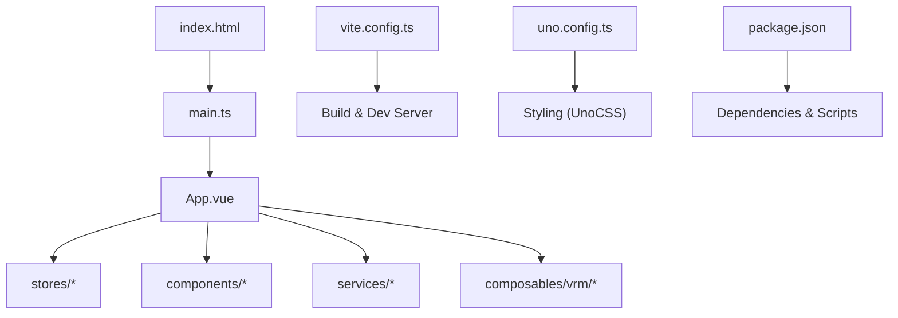
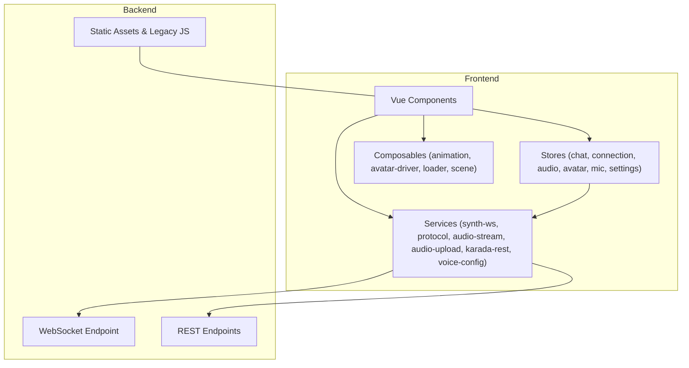
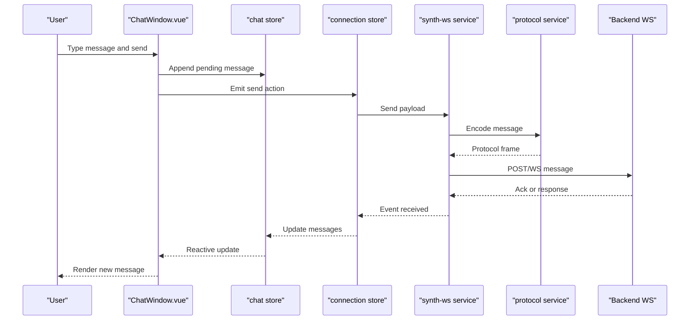
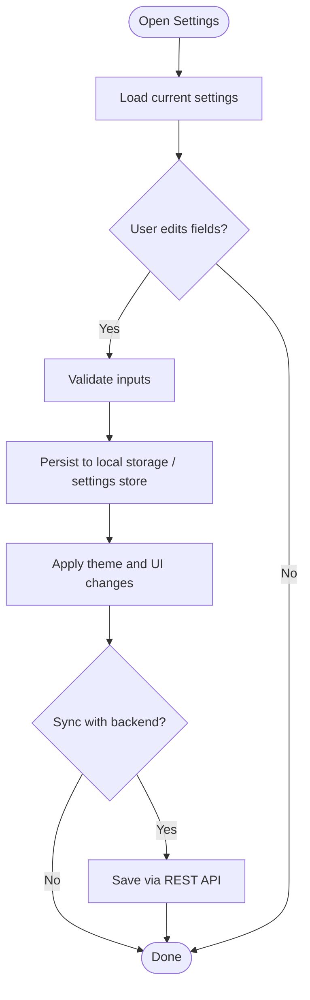
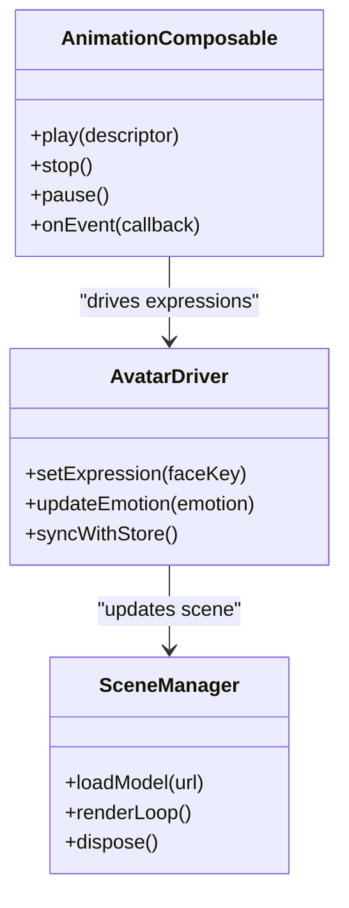
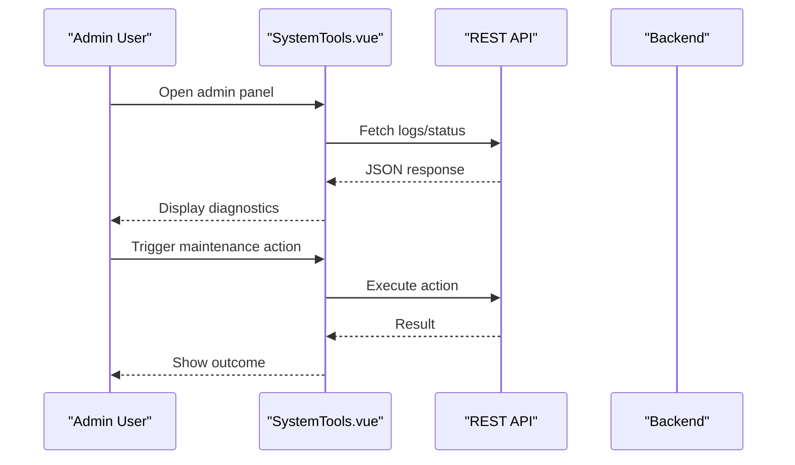
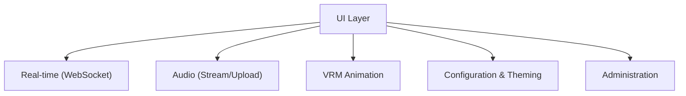
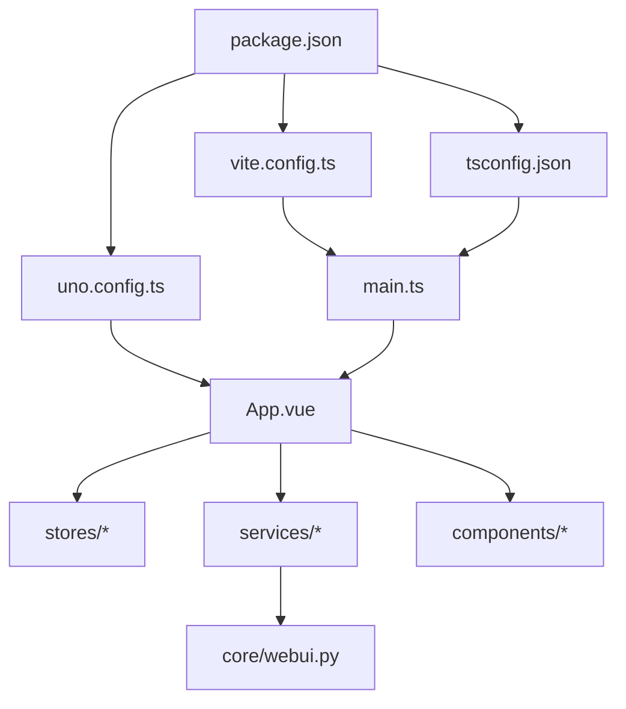

# Web Interface

<cite>
**Referenced Files in This Document**
- [frontend/src/main.ts](file://frontend/src/main.ts)
- [frontend/src/App.vue](file://frontend/src/App.vue)
- [frontend/index.html](file://frontend/index.html)
- [frontend/vite.config.ts](file://frontend/vite.config.ts)
- [frontend/uno.config.ts](file://frontend/uno.config.ts)
- [frontend/package.json](file://frontend/package.json)
- [frontend/tsconfig.json](file://frontend/tsconfig.json)
- [frontend/src/stores/chat.ts](file://frontend/src/stores/chat.ts)
- [frontend/src/stores/connection.ts](file://frontend/src/stores/connection.ts)
- [frontend/src/stores/audio.ts](file://frontend/src/stores/audio.ts)
- [frontend/src/stores/avatar.ts](file://frontend/src/stores/avatar.ts)
- [frontend/src/stores/mic.ts](file://frontend/src/stores/mic.ts)
- [frontend/src/stores/settings.ts](file://frontend/src/stores/settings.ts)
- [frontend/src/services/synth-ws.ts](file://frontend/src/services/synth-ws.ts)
- [frontend/src/services/protocol.ts](file://frontend/src/services/protocol.ts)
- [frontend/src/services/audio-stream.ts](file://frontend/src/services/audio-stream.ts)
- [frontend/src/services/audio-upload.ts](file://frontend/src/services/audio-upload.ts)
- [frontend/src/services/karada-rest.ts](file://frontend/src/services/karada-rest.ts)
- [frontend/src/services/voice-config.ts](file://frontend/src/services/voice-config.ts)
- [frontend/src/components/chat/ChatWindow.vue](file://frontend/src/components/chat/ChatWindow.vue)
- [frontend/src/components/scenes/SceneView.vue](file://frontend/src/components/scenes/SceneView.vue)
- [frontend/src/components/settings/SettingsPanel.vue](file://frontend/src/components/settings/SettingsPanel.vue)
- [frontend/src/components/system/SystemTools.vue](file://frontend/src/components/system/SystemTools.vue)
- [frontend/src/composables/vrm/animation.ts](file://frontend/src/composables/vrm/animation.ts)
- [frontend/src/composables/vrm/avatar-driver.ts](file://frontend/src/composables/vrm/avatar-driver.ts)
- [frontend/src/composables/vrm/loader.ts](file://frontend/src/composables/vrm/loader.ts)
- [frontend/src/composables/vrm/scene.ts](file://frontend/src/composables/vrm/scene.ts)
- [frontend/src/lib/api-token.ts](file://frontend/src/lib/api-token.ts)
- [res/synth_webui/js/webui-bootstrap.js](file://res/synth_webui/js/webui-bootstrap.js)
- [res/synth_webui/js/chat-window.mjs](file://res/synth_webui/js/chat-window.mjs)
- [res/synth_webui/js/settings.js](file://res/synth_webui/js/settings.js)
- [res/synth_webui/static/service-worker.js](file://res/synth_webui/static/service-worker.js)
- [core/webui.py](file://core/webui.py)
</cite>

## Table of Contents
1. [Introduction](#introduction)
2. [Project Structure](#project-structure)
3. [Core Components](#core-components)
4. [Architecture Overview](#architecture-overview)
5. [Detailed Component Analysis](#detailed-component-analysis)
6. [Dependency Analysis](#dependency-analysis)
7. [Performance Considerations](#performance-considerations)
8. [Troubleshooting Guide](#troubleshooting-guide)
9. [Conclusion](#conclusion)
10. [Appendices](#appendices)

## Introduction
This document provides comprehensive documentation for Synthetic Heart’s web interface built with Vue.js and TypeScript. It explains the frontend architecture, component structure, state management, and real-time communication via WebSocket. It also covers UI elements such as chat windows, settings panels, animation controls, and administration tools, along with customization, theming, responsive design, extension patterns, backend integration, file upload handling, browser compatibility, deployment options, caching strategies, and performance optimization.

## Project Structure
The web interface is implemented under the frontend directory using a modern Vue 3 + TypeScript stack with Vite as the build tool and UnoCSS for styling. The application entry point initializes the app, mounts the root component, and configures routing and stores. Static assets and legacy JavaScript modules are served from res/synth_webui.

**Diagram sources**
- [frontend/index.html:1-40](file://frontend/index.html#L1-L40)
- [frontend/src/main.ts:1-60](file://frontend/src/main.ts#L1-L60)
- [frontend/src/App.vue:1-120](file://frontend/src/App.vue#L1-L120)
- [frontend/vite.config.ts:1-80](file://frontend/vite.config.ts#L1-L80)
- [frontend/uno.config.ts:1-60](file://frontend/uno.config.ts#L1-L60)
- [frontend/package.json:1-60](file://frontend/package.json#L1-L60)

**Section sources**
- [frontend/index.html:1-40](file://frontend/index.html#L1-L40)
- [frontend/src/main.ts:1-60](file://frontend/src/main.ts#L1-L60)
- [frontend/src/App.vue:1-120](file://frontend/src/App.vue#L1-L120)
- [frontend/vite.config.ts:1-80](file://frontend/vite.config.ts#L1-L80)
- [frontend/uno.config.ts:1-60](file://frontend/uno.config.ts#L1-L60)
- [frontend/package.json:1-60](file://frontend/package.json#L1-L60)

## Core Components
- App shell and layout: Root component orchestrates views, navigation, and global state.
- Chat window: Real-time messaging, message history, and input controls.
- Settings panel: User preferences, theme toggles, and configuration persistence.
- Animation controls: VRM avatar driver, animation cache, and scene management.
- System tools: Administration utilities, logs, and debugging helpers.

State is managed through dedicated stores for chat, connection, audio, avatar, microphone, and settings. Services encapsulate WebSocket communication, audio streaming/upload, REST calls to Karada, and voice configuration. Composables provide reusable VRM-related logic for animations, loading, and scene control.

**Section sources**
- [frontend/src/App.vue:1-120](file://frontend/src/App.vue#L1-L120)
- [frontend/src/components/chat/ChatWindow.vue:1-120](file://frontend/src/components/chat/ChatWindow.vue#L1-L120)
- [frontend/src/components/settings/SettingsPanel.vue:1-120](file://frontend/src/components/settings/SettingsPanel.vue#L1-L120)
- [frontend/src/components/system/SystemTools.vue:1-120](file://frontend/src/components/system/SystemTools.vue#L1-L120)
- [frontend/src/stores/chat.ts:1-120](file://frontend/src/stores/chat.ts#L1-L120)
- [frontend/src/stores/connection.ts:1-120](file://frontend/src/stores/connection.ts#L1-L120)
- [frontend/src/stores/audio.ts:1-120](file://frontend/src/stores/audio.ts#L1-L120)
- [frontend/src/stores/avatar.ts:1-120](file://frontend/src/stores/avatar.ts#L1-L120)
- [frontend/src/stores/mic.ts:1-120](file://frontend/src/stores/mic.ts#L1-L120)
- [frontend/src/stores/settings.ts:1-120](file://frontend/src/stores/settings.ts#L1-L120)
- [frontend/src/services/synth-ws.ts:1-120](file://frontend/src/services/synth-ws.ts#L1-L120)
- [frontend/src/services/protocol.ts:1-120](file://frontend/src/services/protocol.ts#L1-L120)
- [frontend/src/services/audio-stream.ts:1-120](file://frontend/src/services/audio-stream.ts#L1-L120)
- [frontend/src/services/audio-upload.ts:1-120](file://frontend/src/services/audio-upload.ts#L1-L120)
- [frontend/src/services/karada-rest.ts:1-120](file://frontend/src/services/karada-rest.ts#L1-L120)
- [frontend/src/services/voice-config.ts:1-120](file://frontend/src/services/voice-config.ts#L1-L120)
- [frontend/src/composables/vrm/animation.ts:1-120](file://frontend/src/composables/vrm/animation.ts#L1-L120)
- [frontend/src/composables/vrm/avatar-driver.ts:1-120](file://frontend/src/composables/vrm/avatar-driver.ts#L1-L120)
- [frontend/src/composables/vrm/loader.ts:1-120](file://frontend/src/composables/vrm/loader.ts#L1-L120)
- [frontend/src/composables/vrm/scene.ts:1-120](file://frontend/src/composables/vrm/scene.ts#L1-L120)

## Architecture Overview
The frontend follows a layered architecture:
- Presentation layer: Vue components render UI and handle user interactions.
- State layer: Stores manage reactive data and side effects.
- Service layer: Encapsulates network operations (WebSocket, REST, audio).
- Composables: Reusable logic for VRM rendering and animation control.

Real-time updates flow via WebSocket messages defined by the protocol service. Audio streaming and uploads are handled asynchronously. The backend exposes endpoints and serves static assets; legacy JS modules remain available for backward compatibility.

**Diagram sources**
- [frontend/src/App.vue:1-120](file://frontend/src/App.vue#L1-L120)
- [frontend/src/stores/connection.ts:1-120](file://frontend/src/stores/connection.ts#L1-L120)
- [frontend/src/services/synth-ws.ts:1-120](file://frontend/src/services/synth-ws.ts#L1-L120)
- [frontend/src/services/protocol.ts:1-120](file://frontend/src/services/protocol.ts#L1-L120)
- [core/webui.py:1-120](file://core/webui.py#L1-L120)

## Detailed Component Analysis

### Chat Window Component
The chat window manages message display, input handling, and real-time synchronization. It interacts with the chat store for message state and the connection store for WebSocket events. Messages are sent via the protocol service and rendered reactively.

**Diagram sources**
- [frontend/src/components/chat/ChatWindow.vue:1-120](file://frontend/src/components/chat/ChatWindow.vue#L1-L120)
- [frontend/src/stores/chat.ts:1-120](file://frontend/src/stores/chat.ts#L1-L120)
- [frontend/src/stores/connection.ts:1-120](file://frontend/src/stores/connection.ts#L1-L120)
- [frontend/src/services/synth-ws.ts:1-120](file://frontend/src/services/synth-ws.ts#L1-L120)
- [frontend/src/services/protocol.ts:1-120](file://frontend/src/services/protocol.ts#L1-L120)

**Section sources**
- [frontend/src/components/chat/ChatWindow.vue:1-120](file://frontend/src/components/chat/ChatWindow.vue#L1-L120)
- [frontend/src/stores/chat.ts:1-120](file://frontend/src/stores/chat.ts#L1-L120)
- [frontend/src/stores/connection.ts:1-120](file://frontend/src/stores/connection.ts#L1-L120)
- [frontend/src/services/synth-ws.ts:1-120](file://frontend/src/services/synth-ws.ts#L1-L120)
- [frontend/src/services/protocol.ts:1-120](file://frontend/src/services/protocol.ts#L1-L120)

### Settings Panel Component
The settings panel allows users to modify preferences such as theme, language, and feature toggles. Changes are persisted locally and reflected across the app via the settings store. It may integrate with backend configuration endpoints when applicable.

**Diagram sources**
- [frontend/src/components/settings/SettingsPanel.vue:1-120](file://frontend/src/components/settings/SettingsPanel.vue#L1-L120)
- [frontend/src/stores/settings.ts:1-120](file://frontend/src/stores/settings.ts#L1-L120)

**Section sources**
- [frontend/src/components/settings/SettingsPanel.vue:1-120](file://frontend/src/components/settings/SettingsPanel.vue#L1-L120)
- [frontend/src/stores/settings.ts:1-120](file://frontend/src/stores/settings.ts#L1-L120)

### Animation Controls and VRM Composables
Animation controls drive VRM avatar behavior using composable functions for animation playback, lifecycle management, and scene rendering. The avatar driver coordinates between animation states and the 3D scene.

**Diagram sources**
- [frontend/src/composables/vrm/animation.ts:1-120](file://frontend/src/composables/vrm/animation.ts#L1-L120)
- [frontend/src/composables/vrm/avatar-driver.ts:1-120](file://frontend/src/composables/vrm/avatar-driver.ts#L1-L120)
- [frontend/src/composables/vrm/scene.ts:1-120](file://frontend/src/composables/vrm/scene.ts#L1-L120)

**Section sources**
- [frontend/src/composables/vrm/animation.ts:1-120](file://frontend/src/composables/vrm/animation.ts#L1-L120)
- [frontend/src/composables/vrm/avatar-driver.ts:1-120](file://frontend/src/composables/vrm/avatar-driver.ts#L1-L120)
- [frontend/src/composables/vrm/scene.ts:1-120](file://frontend/src/composables/vrm/scene.ts#L1-L120)

### System Tools and Administration
System tools provide administrative capabilities such as log viewing, debugging toggles, and maintenance actions. These components interact with backend APIs and may expose privileged endpoints.

**Diagram sources**
- [frontend/src/components/system/SystemTools.vue:1-120](file://frontend/src/components/system/SystemTools.vue#L1-L120)
- [frontend/src/services/karada-rest.ts:1-120](file://frontend/src/services/karada-rest.ts#L1-L120)

**Section sources**
- [frontend/src/components/system/SystemTools.vue:1-120](file://frontend/src/components/system/SystemTools.vue#L1-L120)
- [frontend/src/services/karada-rest.ts:1-120](file://frontend/src/services/karada-rest.ts#L1-L120)

### Conceptual Overview
The web interface integrates multiple subsystems:
- Real-time messaging via WebSocket
- Audio streaming and upload handling
- VRM avatar animation and expression control
- Settings and theming with persistent preferences
- Administrative tools for system monitoring and maintenance

[No sources needed since this diagram shows conceptual workflow, not actual code structure]

## Dependency Analysis
The frontend dependencies include Vue 3, TypeScript, Vite, and UnoCSS. Backend integration points are exposed through WebSocket and REST services. Legacy JavaScript modules are still served for compatibility.

**Diagram sources**
- [frontend/package.json:1-60](file://frontend/package.json#L1-L60)
- [frontend/vite.config.ts:1-80](file://frontend/vite.config.ts#L1-L80)
- [frontend/uno.config.ts:1-60](file://frontend/uno.config.ts#L1-L60)
- [frontend/tsconfig.json:1-60](file://frontend/tsconfig.json#L1-L60)
- [frontend/src/main.ts:1-60](file://frontend/src/main.ts#L1-L60)
- [frontend/src/App.vue:1-120](file://frontend/src/App.vue#L1-L120)
- [core/webui.py:1-120](file://core/webui.py#L1-L120)

**Section sources**
- [frontend/package.json:1-60](file://frontend/package.json#L1-L60)
- [frontend/vite.config.ts:1-80](file://frontend/vite.config.ts#L1-L80)
- [frontend/uno.config.ts:1-60](file://frontend/uno.config.ts#L1-L60)
- [frontend/tsconfig.json:1-60](file://frontend/tsconfig.json#L1-L60)
- [frontend/src/main.ts:1-60](file://frontend/src/main.ts#L1-L60)
- [frontend/src/App.vue:1-120](file://frontend/src/App.vue#L1-L120)
- [core/webui.py:1-120](file://core/webui.py#L1-L120)

## Performance Considerations
- Code splitting and lazy loading: Use dynamic imports for heavy components like VRM scenes to reduce initial bundle size.
- Asset optimization: Minify images and use efficient formats; leverage CDN caching for static assets.
- WebSocket efficiency: Batch messages where possible and implement reconnection logic with exponential backoff.
- Audio handling: Stream audio in chunks and avoid blocking the main thread; use Web Audio API efficiently.
- Caching strategies: Utilize service workers for offline support and cache busting for updated assets.
- Rendering performance: Debounce frequent UI updates and avoid unnecessary re-renders in Vue components.

[No sources needed since this section provides general guidance]

## Troubleshooting Guide
Common issues and resolutions:
- WebSocket connection failures: Check network permissions, CORS settings, and backend endpoint availability. Implement retry logic and user feedback.
- Audio playback problems: Verify browser media permissions and codec support; ensure stream URLs are accessible and properly formatted.
- VRM model loading errors: Validate model URLs, check MIME types, and handle loading timeouts gracefully.
- Settings not persisting: Confirm local storage availability and schema migrations; validate input before saving.
- Admin actions failing: Review backend logs and API responses; ensure proper authentication and authorization.

**Section sources**
- [frontend/src/services/synth-ws.ts:1-120](file://frontend/src/services/synth-ws.ts#L1-L120)
- [frontend/src/services/audio-stream.ts:1-120](file://frontend/src/services/audio-stream.ts#L1-L120)
- [frontend/src/composables/vrm/loader.ts:1-120](file://frontend/src/composables/vrm/loader.ts#L1-L120)
- [frontend/src/stores/settings.ts:1-120](file://frontend/src/stores/settings.ts#L1-L120)

## Conclusion
The Synthetic Heart web interface delivers a robust, extensible, and performant user experience through a well-structured Vue.js and TypeScript architecture. With clear separation of concerns, reactive state management, and real-time communication, it supports rich features like chat, animation control, and administration tools. Following the guidelines in this document will help developers extend the UI, integrate with backend services, and optimize performance effectively.

[No sources needed since this section summarizes without analyzing specific files]

## Appendices

### Customization and Theming
- Theme configuration: Define color palettes, typography, and layout tokens in UnoCSS configuration.
- Dynamic themes: Toggle dark/light modes at runtime and persist user preferences.
- Skin support: Load external skins via configuration files and asset paths.

**Section sources**
- [frontend/uno.config.ts:1-60](file://frontend/uno.config.ts#L1-L60)
- [frontend/src/stores/settings.ts:1-120](file://frontend/src/stores/settings.ts#L1-L120)

### Extending the UI
- Adding new components: Create Vue components under components/, define props and emits, and integrate with stores.
- Registering routes: Configure routing in the app setup to mount new views.
- Integrating with backend: Extend services to call new REST endpoints or handle additional WebSocket events.

**Section sources**
- [frontend/src/App.vue:1-120](file://frontend/src/App.vue#L1-L120)
- [frontend/src/services/karada-rest.ts:1-120](file://frontend/src/services/karada-rest.ts#L1-L120)
- [frontend/src/services/synth-ws.ts:1-120](file://frontend/src/services/synth-ws.ts#L1-L120)

### WebSocket Communication
- Connection lifecycle: Establish, maintain, and reconnect WebSocket connections with error handling.
- Message protocol: Define structured message types and handlers for different event categories.
- Real-time updates: Subscribe to channels and update UI reactively.

**Section sources**
- [frontend/src/services/synth-ws.ts:1-120](file://frontend/src/services/synth-ws.ts#L1-L120)
- [frontend/src/services/protocol.ts:1-120](file://frontend/src/services/protocol.ts#L1-L120)

### File Upload Handling
- Audio uploads: Support multipart/form-data requests and progress tracking.
- Validation: Check file types, sizes, and metadata before sending.
- Error handling: Provide user feedback for failed uploads and retries.

**Section sources**
- [frontend/src/services/audio-upload.ts:1-120](file://frontend/src/services/audio-upload.ts#L1-L120)

### Browser Compatibility
- Feature detection: Check for WebRTC, Web Audio API, and WebSocket support.
- Polyfills: Include necessary polyfills for older browsers if required.
- Graceful degradation: Fallback to non-real-time modes when features are unavailable.

[No sources needed since this section provides general guidance]

### Deployment Options
- Build process: Use Vite to generate optimized production bundles.
- Hosting: Deploy static assets to CDNs or web servers; configure reverse proxy for WebSocket endpoints.
- Environment variables: Manage API URLs and feature flags via environment configuration.

**Section sources**
- [frontend/vite.config.ts:1-80](file://frontend/vite.config.ts#L1-L80)
- [core/webui.py:1-120](file://core/webui.py#L1-L120)

### Caching Strategies
- Service worker: Implement caching for static assets and API responses.
- Cache busting: Use versioned filenames to force updates.
- Offline support: Store critical data locally and sync when online.

**Section sources**
- [res/synth_webui/static/service-worker.js:1-120](file://res/synth_webui/static/service-worker.js#L1-L120)

### Legacy JavaScript Modules
- Backward compatibility: Serve legacy modules alongside Vue components.
- Migration path: Gradually replace old functionality with new Vue components.
- Integration points: Bridge legacy scripts with modern APIs where necessary.

**Section sources**
- [res/synth_webui/js/webui-bootstrap.js:1-120](file://res/synth_webui/js/webui-bootstrap.js#L1-L120)
- [res/synth_webui/js/chat-window.mjs:1-120](file://res/synth_webui/js/chat-window.mjs#L1-L120)
- [res/synth_webui/js/settings.js:1-120](file://res/synth_webui/js/settings.js#L1-L120)